---
## Front matter
lang: ru-RU
title: Лабораторная работа № 1
subtitle: Установка ОС Linux
author:
  - Мальянц В.К.
institute:
  - Российский университет дружбы народов, Москва, Россия
date: 02 марта 2025

## i18n babel
babel-lang: russian
babel-otherlangs: english

## Formatting pdf
toc: false
toc-title: Содержание
slide_level: 2
aspectratio: 169
section-titles: true
theme: metropolis
header-includes:
 - \metroset{progressbar=frametitle,sectionpage=progressbar,numbering=fraction}
---

##  Цель работы
-Приобретение практических навыков установки операционной системы на виртуальную машину, настройки минимально необходимых для дальнейшей работы сервисов.

## Задание

- Установка Linux на Virtualbox
- Установка операционной системы
- Установка драйверов для VirtualBox
- Подключение общей папки
- Обновления
- Повышение комфорта работы
- Автоматическое обновление
- Отключение SELINUX
- Настройка раскладки клавиатуры
- Установка программного обеспечения для создания документации
- Ответы на контрольные вопросы
- Отчет о выполнении дополнительного задания 

# Выполнение лабораторной работы
## Установка Linux на Virtualbox

-Создаю новую виртуальную машину. Задаю ей имя и образ ISO (рис. 1).

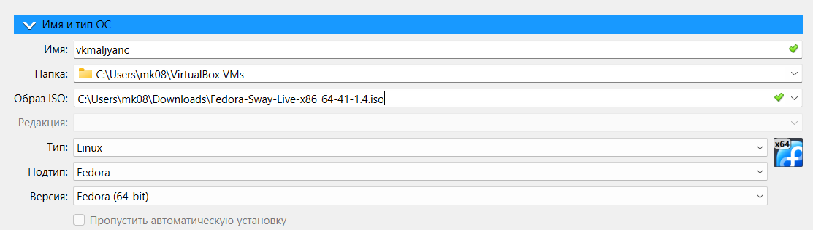{width=70%}

## Установка Linux на Virtualbox

-Выделяю оперативную память размеров 4096 мб (рис. 2).

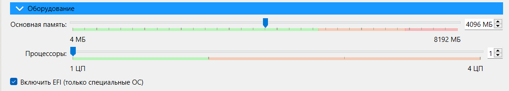{width=70%}

## Установка Linux на Virtualbox

-Создаю новый виртуальный жесткий диск размером 80 гб (рис. 3).

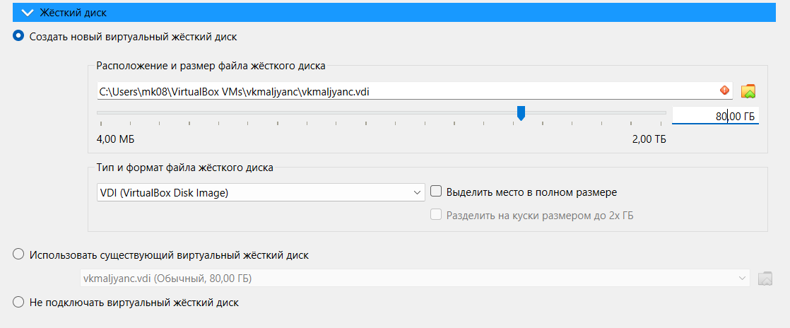{width=70%}

## Установка Linux на Virtualbox

-Запускаю виртуальную машину(рис. 4).

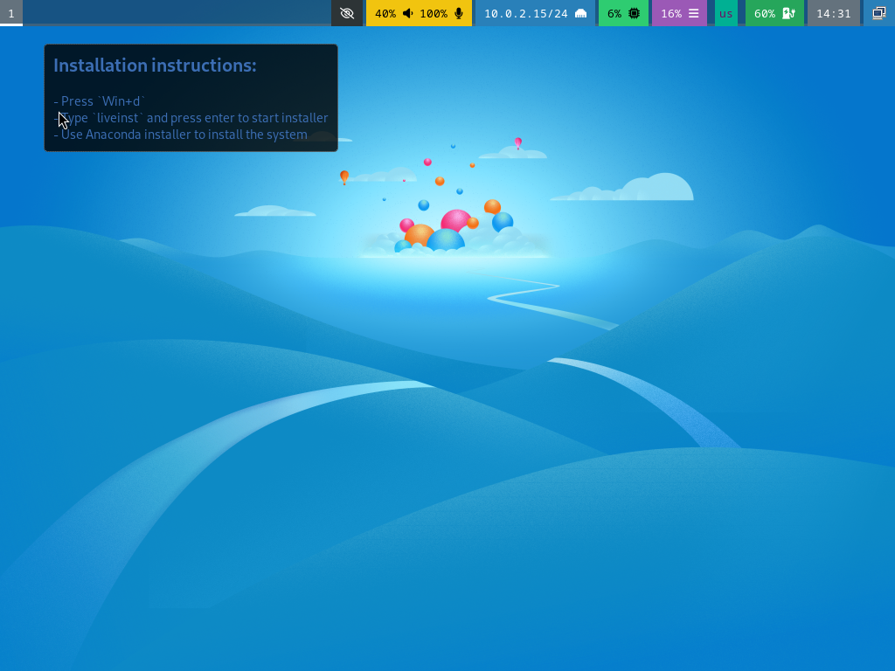{width=70%}

## Установка операционной системы

-Запускаю терминальный мультиплексор tmux (рис. 5).

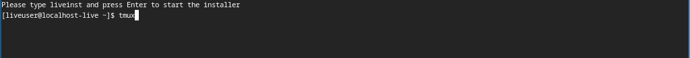{width=70%}

## Установка операционной системы

-В терминале запускаю liveinst (рис. 6).

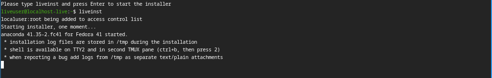{width=70%}

## Установка операционной системы

-Выбираю язык (рис. 7).

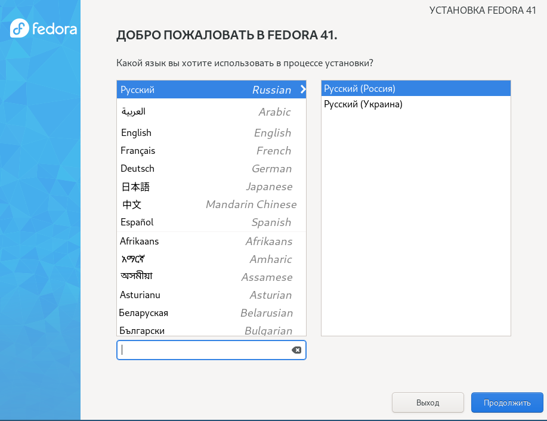{width=70%}

## Установка операционной системы

-Настраиваю раскладку клавиатуры (рис. 8).

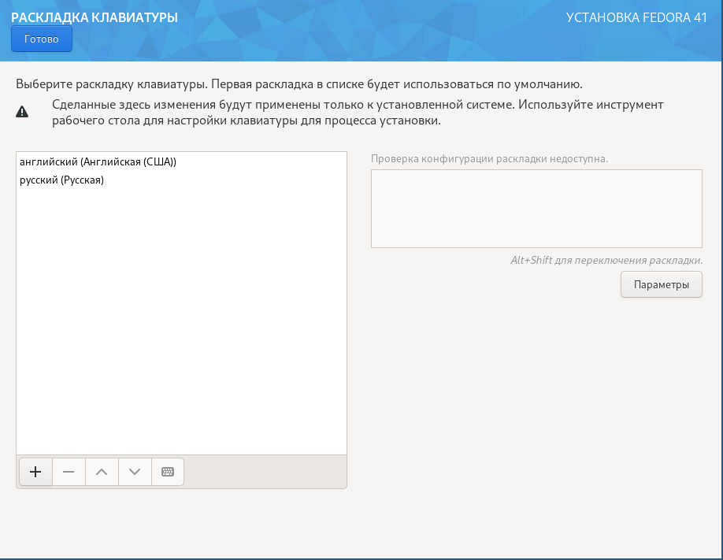{width=70%}

## Установка операционной системы

-Выбираю часовой пояс (рис. 9).

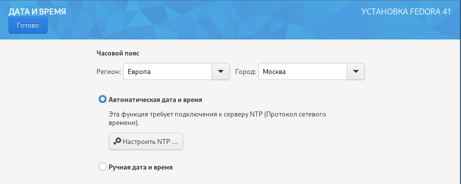{width=70%}

## Установка операционной системы

-Выбираю место установки (рис. 10).

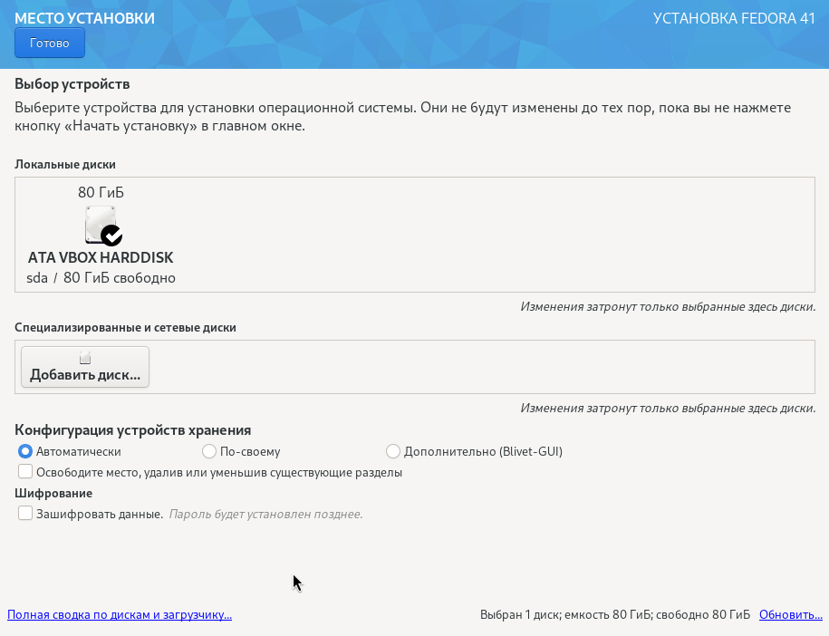{width=70%}

## Установка операционной системы

-Выбираю имя узла (рис. 11).

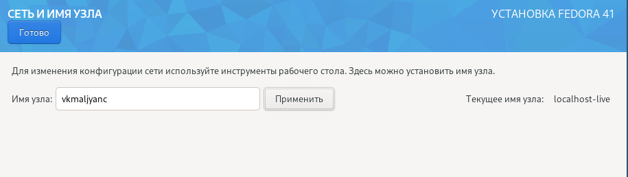{width=70%}

## Установка операционной системы

-Включаю учетную запись root (рис. 12).

{width=70%}

## Установка операционной системы

-Устанавливаю имя и пароль для пользователя (рис. 13).

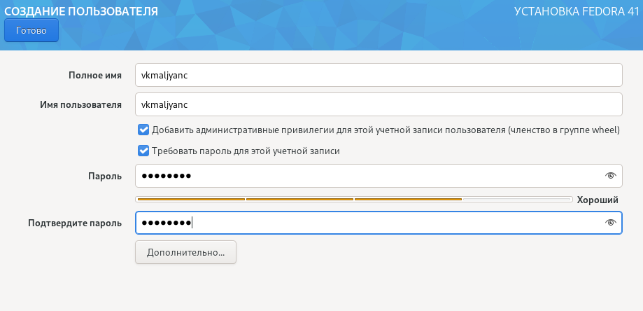{width=70%}

## Установка операционной системы

-Убеждаюсь в правильности выбора настроек (рис. 14).

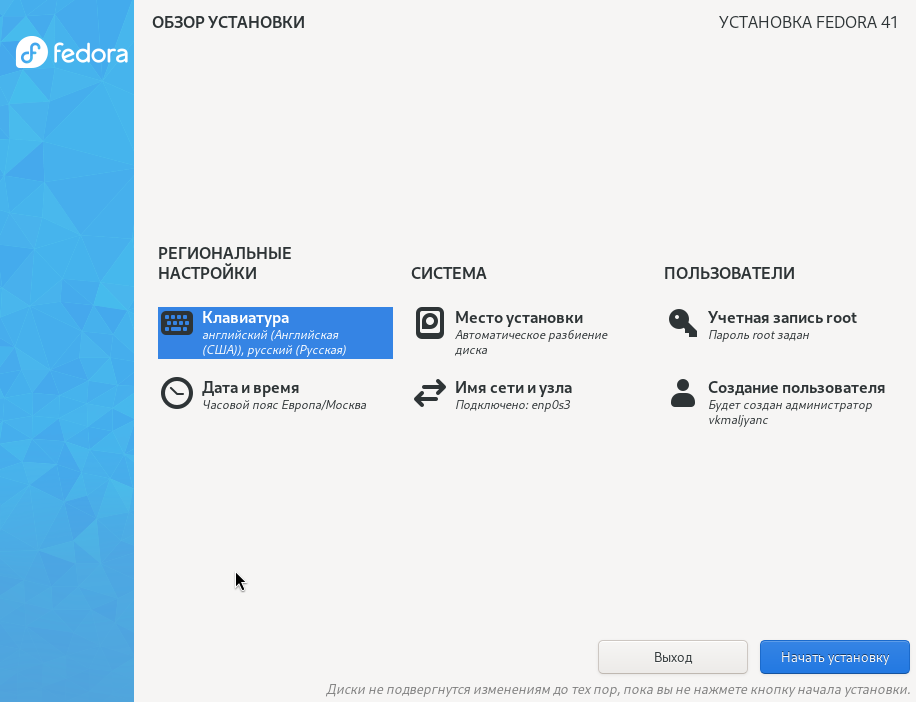{width=70%}

-Ход установки (рис. 15).

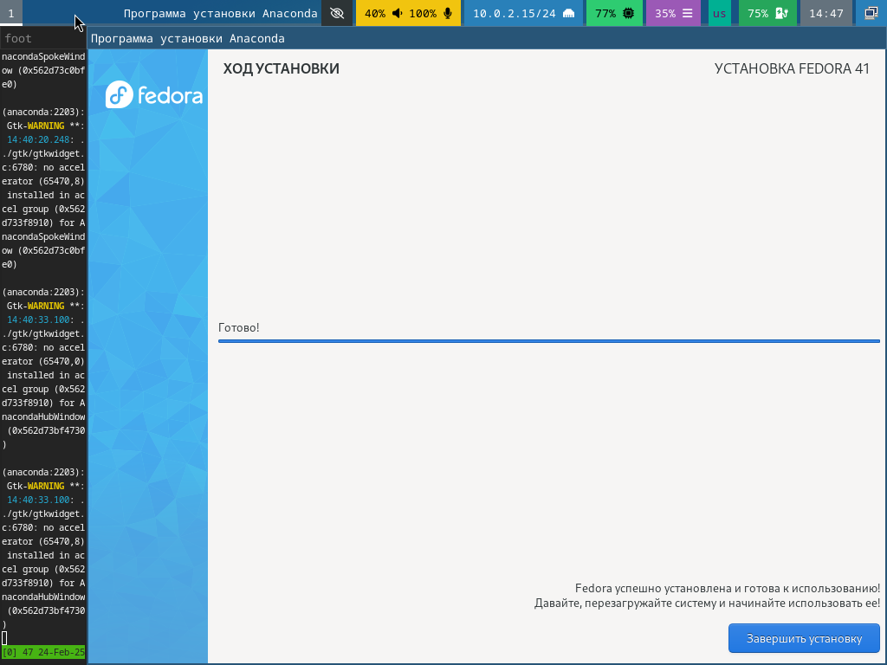{width=70%}

-Отключаю оптический диск (рис. 16).

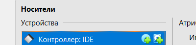{width=70%}

## Установка драйверов для VirtualBox

-Вхожу в ОС под заданной при установке учетной записью (рис. 17).

{width=70%}

## Установка операционной системы

-Переключаюсь на роль супер-пользователя с помощью sudo-i и устанавливаю средства разработки(рис. 18).

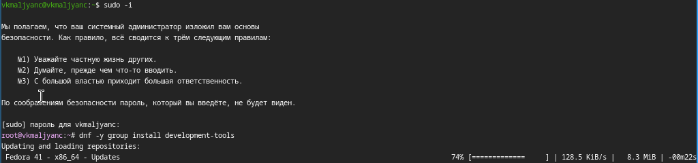{width=70%}

## Установка операционной системы

-Устанавливаю пакет DKMS (рис. 19).

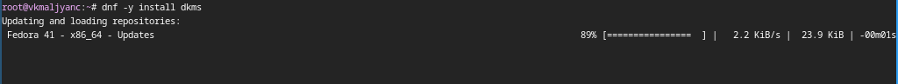{width=70%}

## Установка операционной системы

-Перезагружаю виртуальную машину с помощью reboot(рис. 20).

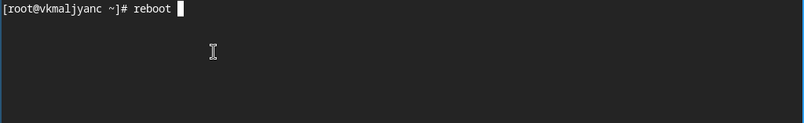{width=70%}

## Установка операционной системы

-В меню виртуальной машины подключаю образ диска дополнений гостевой ОС (рис. 21).

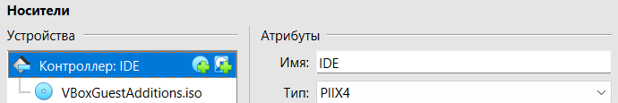{width=70%}

## Установка операционной системы

-Монтирую диск с помощью mount (рис. 22).

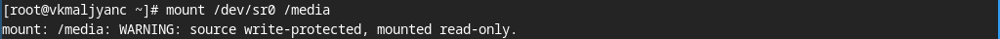{width=70%}

## Установка операционной системы

-Устанавливаю драйвера (рис. 23).

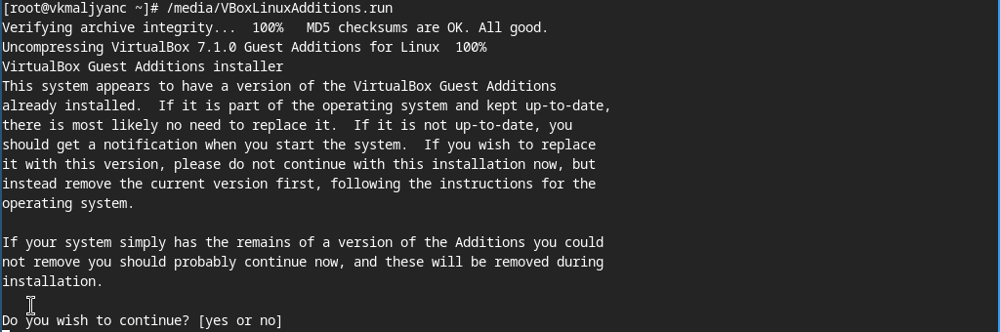{width=70%}

## Установка операционной системы

-Перезагружаю виртуальную машину (рис. 24).

{width=70%}

## Подключение общей папки

-Добавляю пользователя в группу vboxsf (рис. 25).

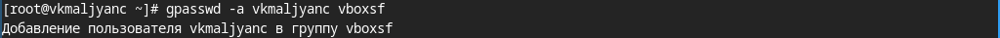{width=70%}

## Подключение общей папки

-В хостовой системе подключаю разделяемую папку (рис. 26).

{width=70%}

## Подключение общей папки

-Перезагружаю виртуальную машину (рис. 27).

{width=70%}

## Обновления

-Переключаюсь на роль супер-пользователя с помощью sudo-i (рис. 28).

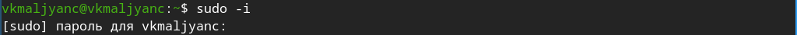{width=70%}

## Обновления

-Обновляю все пакеты (рис. 29).

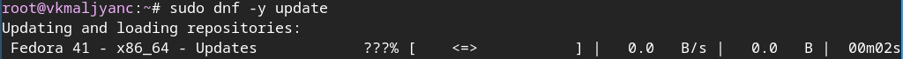{width=70%}

## Повышение комфорта работы

-Устанавливаю программу для удобства работы в консоли (рис. 30).

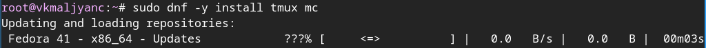{width=70%}

## Повышение комфорта работы

-Устанавлюваю другой вариант консоли (рис. 31).

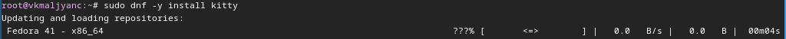{width=70%}

## Автоматическое обновление

-Устанавливаю программное обеспечение для автоматического обновления (рис. 32).

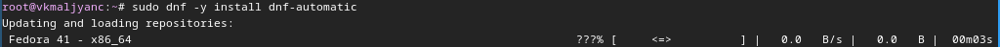{width=70%}

## Автоматическое обновление

-Запускаю таймер (рис. 33).

{width=70%}

## Отключение SELINUX

-Переключаюсь на роль супер-пользователя с помощью sudo-i и перехожу в каталог selinux (рис. 34).

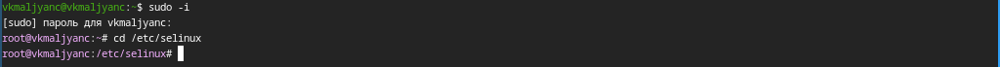{width=70%}

## Отключение SELINUX

-Открываю mc (рис. 35).

{width=70%}

## Отключение SELINUX

-Изменяю значение SELINUX c enforcing на permissive (рис. 36).

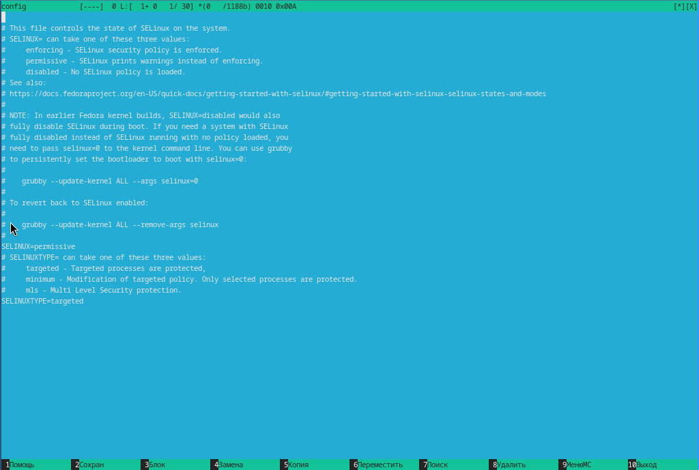{width=70%}

## Отключение SELINUX

-Перезагружаю виртуальную машину (рис. 37).

{width=70%}

## Настройка раскладки клавиатуры

-Запускаю терминальный мультиплексор tmux (рис. 38).

{width=70%}

## Настройка раскладки клавиатуры

-Создаю конфигурационный файл (рис. 39).

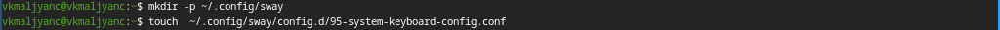{width=70%}

## Настройка раскладки клавиатуры

-Редактирую конфигурационный файл (рис. 40).

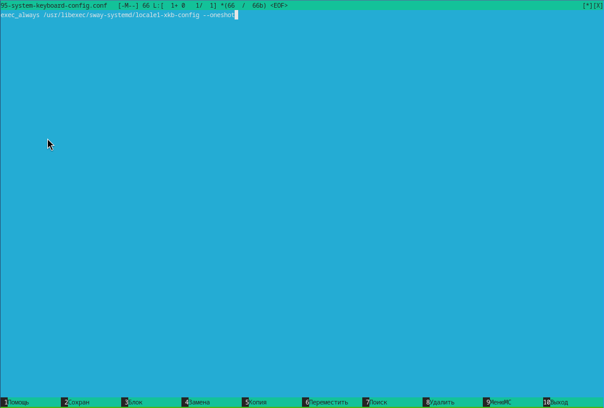{width=70%}

## Настройка раскладки клавиатуры

-Переключаюсь на роль супер-пользователя с помощью sudo-i (рис. 41).

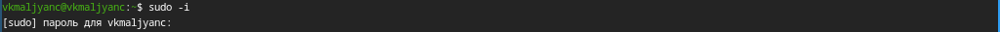{width=70%}

## Настройка раскладки клавиатуры

-Перехожу в каталог /etc/X11/xorg.conf.d и открываю mc (рис. 42).

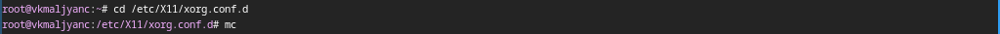{width=70%}

## Настройка раскладки клавиатуры

-Редактирую конфигурационный файл /etc/X11/xorg.conf.d/00-keyboard.conf (рис. 43).

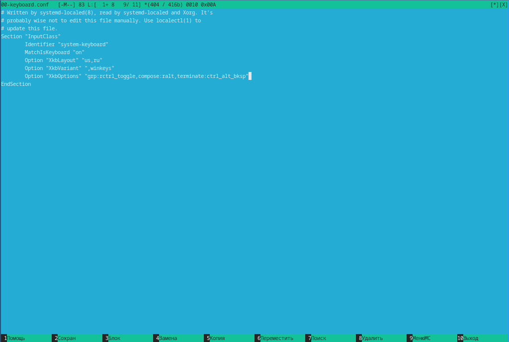{width=70%}

## Настройка раскладки клавиатуры

-Перезагружаю виртуальную машину (рис. 44).

{width=70%}

## Установка программного обеспечения для создания документации

-Запускаю терминальный мультиплексор tmux (рис. 45).

{width=70%}

## Установка программного обеспечения для создания документации

-Переключаюсь на роль супер-пользователя	с помощью sudo-i (рис. 46).

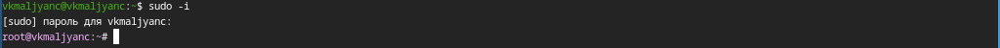{width=70%}

## Установка программного обеспечения для создания документации

-Устанавливаю pandoc с помощью менеджера пакетов (рис. 47).

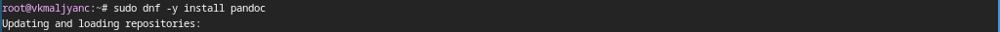{width=70%}

## Установка программного обеспечения для создания документации

-Скачиваю pandoc-crossref (рис. 48).

{width=70%}

## Установка программного обеспечения для создания документации

-Копирую pandoc-crossref в /usr/local/bin (рис. 49).

{width=70%}

## Установка программного обеспечения для создания документации

-Устанавливаю дистрибутив TeXlive (рис. 50).

{width=70%}

## Установка программного обеспечения для создания документации

-Перезагружаю виртуальную машину (рис. 51).

{width=70%}

## Установка программного обеспечения для создания документации

-Запускаю терминальный мультиплексор tmux (рис. 52).

{width=70%}

## Установка программного обеспечения для создания документации

-Переключаюсь на роль супер-пользователя с помощью sudo-i (рис. 53).

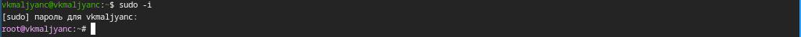{width=70%}

# Выводы

-Я приобрела практические навыки установки операционной системы на виртуальную машину, настройки минимально необходимых для дальнейшей работы сервисов.

## Ответы на контрольные вопросы

1. Учетная запись пользователя содержит: username, UID, GID, полное имя, shell, home directory, права доступа и группы, к которым принадлежит пользователь
2. Укажите команды терминала и приведите примеры:
Для получения справки по команде: man (пример: man cd)
Для перемещения по файловой системе: cd (пример: cd /usr/local/bin)
Для просмотра содержимого каталога: ls (примеп: ls /usr)
Для определения объема каталога: du -sh (пример: de -sh /usr/local)
Для создания каталогов: mkdir (пример: mkdir ~/.config/sway), для удаления каталогов: rmdir (пример: rmdir ~/.config/sway), для создания файлов touch (пример: touch ~/.config/sway/config.d/95-system-keyboard-config.conf), для удаления файлов: rm (пример: rm ~/.config/sway/config.d/95-system-keyboard-config.conf)
Для задания определенных прав на файл/каталог: chmod (пример chmod +x)
Для просмотра истории команд: history
3. Файловая система - способ организации и хранения данных на носителе информации: ex4 (высокопроизводительная система в Linux, может работать с большими объемами данных), XFS (высокопроизводительная система, может работать с большими объемами данных)
4. С помощью команды mount
5. С помощью команды kill <PID>

##Отчет о выполнении дополнительного задания

-Выполняю команду dmesg (рис. 54).

{width=70%}

##Отчет о выполнении дополнительного задания

-Выполняю команду dmesg | less (рис. 55).

{width=70%}

##Отчет о выполнении дополнительного задания

-Получаю информацию о версии ядра Linux (рис. 56).

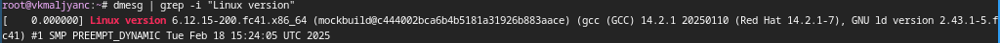{width=70%}

##Отчет о выполнении дополнительного задания

-Получаю информацию о частоте процессора (рис. 57).

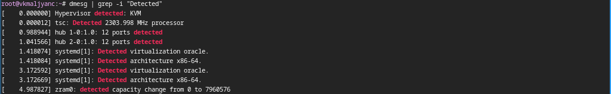{width=70%}

##Отчет о выполнении дополнительного задания

-Получаю информацию о модели процессора (рис. 58).

{width=70%}

##Отчет о выполнении дополнительного задания

-Получаю информацию об объеме доступной оперативной памяти (рис. 59).

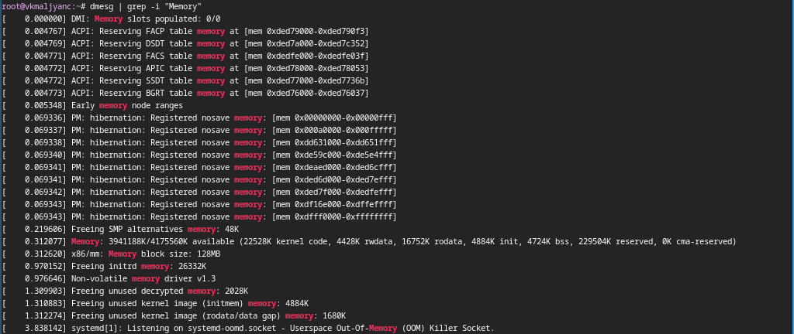{width=70%}

##Отчет о выполнении дополнительного задания

-Получаю информацию о типе обрануженного гипервизора (рис. 60).

{width=70%}

##Отчет о выполнении дополнительного задания

-Получаю информацию о типе файловой системы корневого раздела (рис. 61).

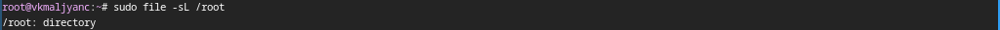{width=70%}

##Отчет о выполнении дополнительного задания

-Получаю информацию о последовательности монтирования файловых систем (рис. 62).

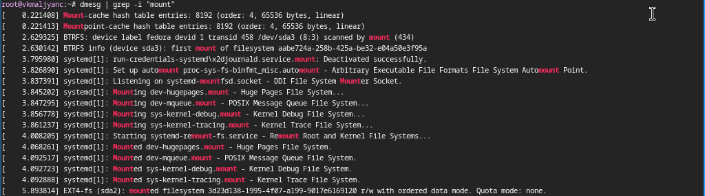{width=70%}

# Спасибо за внимание