---
## Front matter
title: "Лабораторная работа № 1"
subtitle: "Установка ОС Linux"
author: "Мальянц Виктория Кареновна"

## Generic otions
lang: ru-RU
toc-title: "Содержание"

## Bibliography
bibliography: bib/cite.bib
csl: pandoc/csl/gost-r-7-0-5-2008-numeric.csl

## Pdf output format
toc: true # Table of contents
toc-depth: 2
lof: true # List of figures
lot: true # List of tables
fontsize: 12pt
linestretch: 1.5
papersize: a4
documentclass: scrreprt
## I18n polyglossia
polyglossia-lang:
  name: russian
  options:
	- spelling=modern
	- babelshorthands=true
polyglossia-otherlangs:
  name: english
## I18n babel
babel-lang: russian
babel-otherlangs: english
## Fonts
mainfont: IBM Plex Serif
romanfont: IBM Plex Serif
sansfont: IBM Plex Sans
monofont: IBM Plex Mono
mathfont: STIX Two Math
mainfontoptions: Ligatures=Common,Ligatures=TeX,Scale=0.94
romanfontoptions: Ligatures=Common,Ligatures=TeX,Scale=0.94
sansfontoptions: Ligatures=Common,Ligatures=TeX,Scale=MatchLowercase,Scale=0.94
monofontoptions: Scale=MatchLowercase,Scale=0.94,FakeStretch=0.9
mathfontoptions:
## Biblatex
biblatex: true
biblio-style: "gost-numeric"
biblatexoptions:
  - parentracker=true
  - backend=biber
  - hyperref=auto
  - language=auto
  - autolang=other
  - citestyle=gost-numeric
## Pandoc-crossref LaTeX customization
figureTitle: "Рис."
tableTitle: "Таблица"
listingTitle: "Листинг"
lofTitle: "Список иллюстраций"
lotTitle: "Список таблиц"
lolTitle: "Листинги"
## Misc options
indent: true
header-includes:
  - \usepackage{indentfirst}
  - \usepackage{float} # keep figures where there are in the text
  - \floatplacement{figure}{H} # keep figures where there are in the text
---

# Цель работы
Приобретение практических навыков установки операционной систеьы на виртуальную машину, настройки минимально необходимых для дальнейшей работы сервисов.

# Задание

1. Установка Linux на Virtualbox
2. Установка операционной системы
3. Установка драйверов для VirtualBox
4. Подключение общей папки
5. Обновления
6. Повышение комфорта работы
7. Автоматическое обновление
8. Отключение SELINUX
9. Настройка раскладки клавиатуры
10. Установка программного обеспечения для создания документации
11. Ответы на контрольные вопросы
12. Отчет о выполнении дополнительного задания 

# Выполнение лабораторной работы
## Установка Linux на Virtualbox

Создаю новую виртуальную машину. Задаю ей имя и образ ISO (рис. [-@fig:001]).

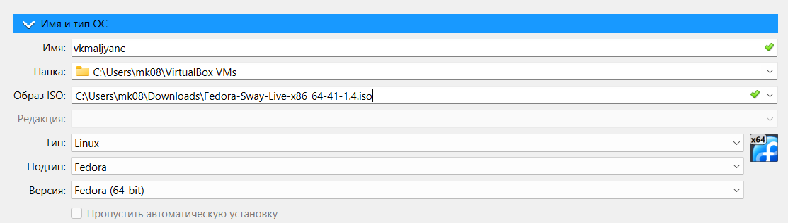{#fig:001 width=70%}

Выделяю оперативную память размеров 4096 мб (рис. [-@fig:002]).

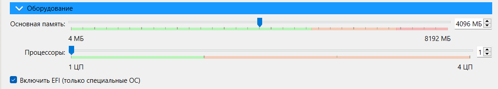{#fig:002 width=70%}

Создаю новый виртуальный жесткий диск размером 80 гб (рис. [-@fig:003]).

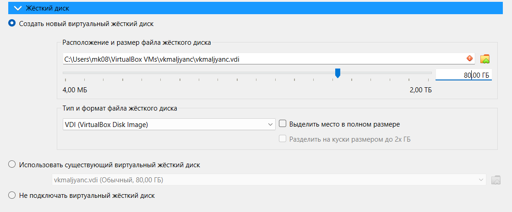{#fig:003 width=70%}

Запускаю виртуальную машину(рис. [-@fig:004]).

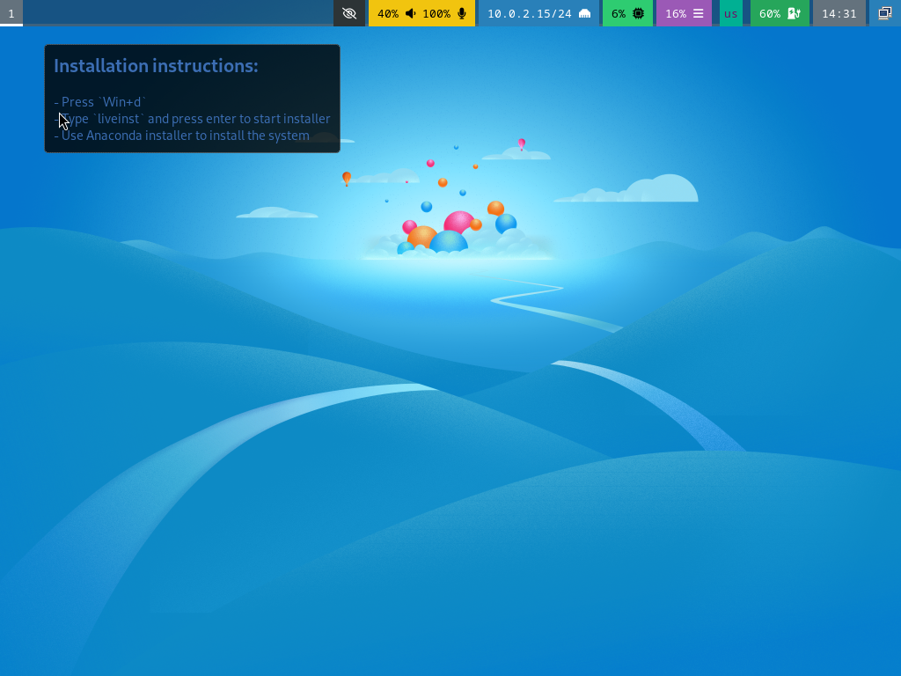{#fig:004 width=70%}

## Установка операционной системы

Запускаю терминальный мультиплексор tmux (рис. [-@fig:005]).

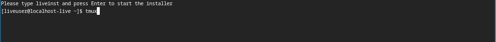{#fig:005 width=70%}

В терминале запускаю liveinst (рис. [-@fig:006]).

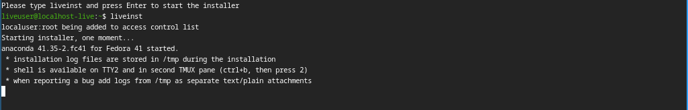{#fig:006 width=70%}

Выбираю язык (рис. [-@fig:007]).

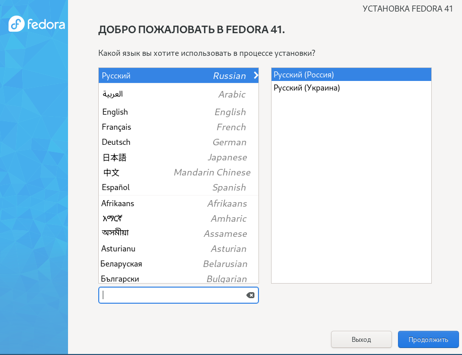{#fig:007 width=70%}

Настраиваю раскладку клавиатуры (рис. [-@fig:008]).

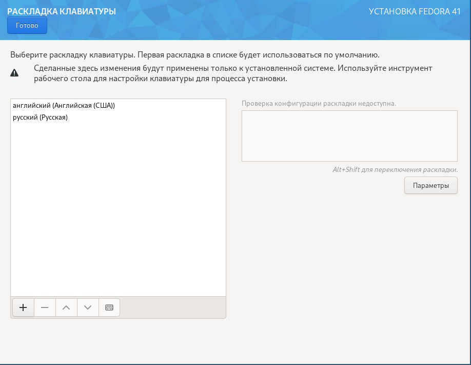{#fig:008 width=70%}

Выбираю часовой пояс (рис. [-@fig:009]).

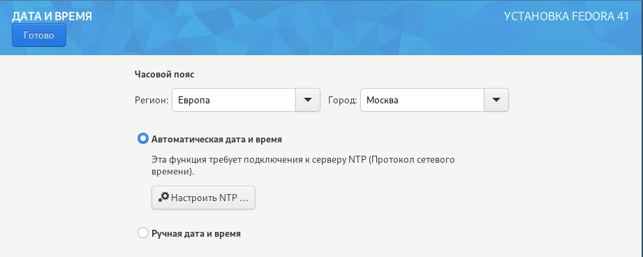{#fig:009 width=70%}

Выбираю место установки (рис. [-@fig:010]).

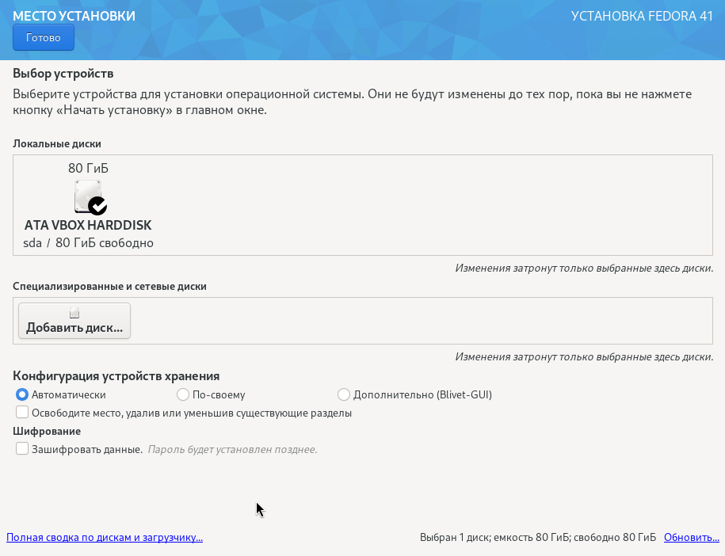{#fig:010 width=70%}

Выбираю имя узла (рис. [-@fig:011]).

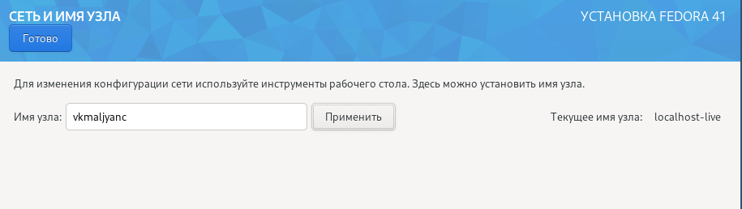{#fig:011 width=70%}

Включаю учетную запись root (рис. [-@fig:012]).

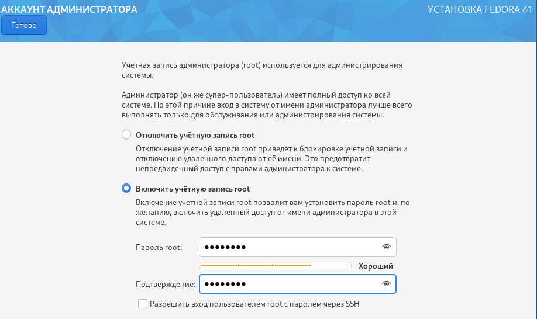{#fig:012 width=70%}

Устанавливаю имя и пароль для пользователя (рис. [-@fig:013]).

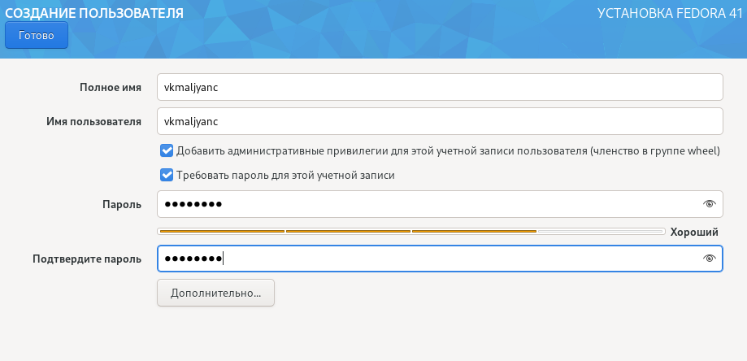{#fig:013 width=70%}

Убеждаюсь в правильности выбора настроек (рис. [-@fig:014]).

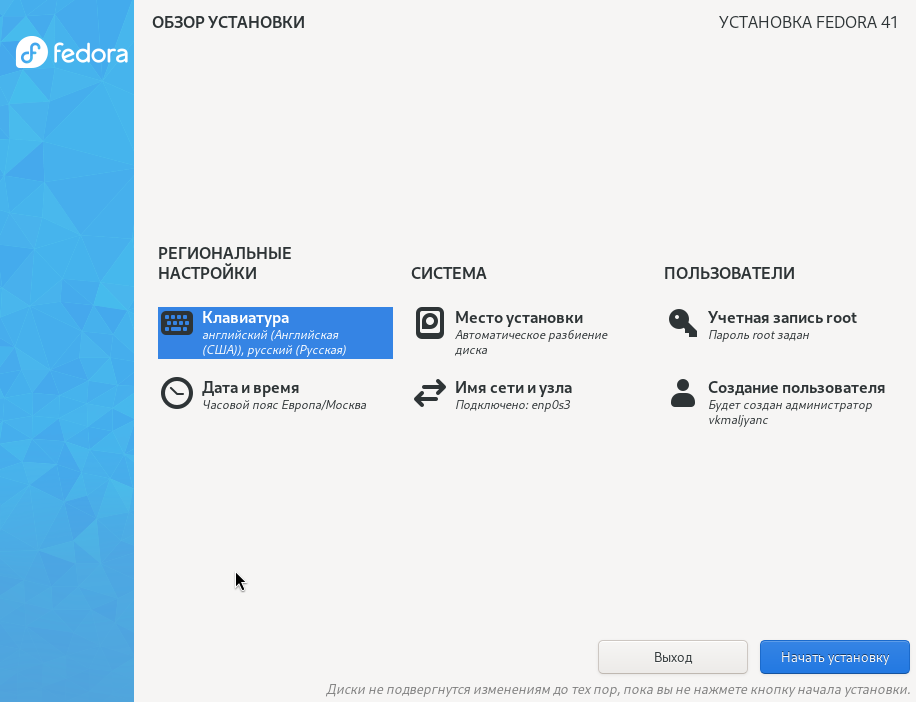{#fig:014 width=70%}

Ход установки (рис. [-@fig:015]).

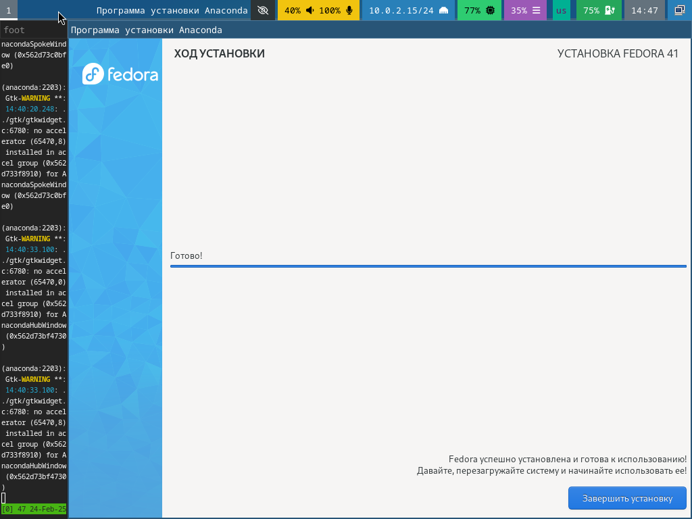{#fig:015 width=70%}

Отключаю оптический диск (рис. [-@fig:016]).

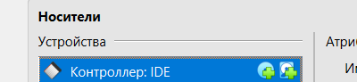{#fig:016 width=70%}

## Установка драйверов для VirtualBox

Вхожу в ОС под заданной при установке учетной записью (рис. [-@fig:017]).

{#fig:017 width=70%}

Переключаюсь на роль супер-пользователя с помощью sudo-i и устанавливаю средства разработки(рис. [-@fig:018]).

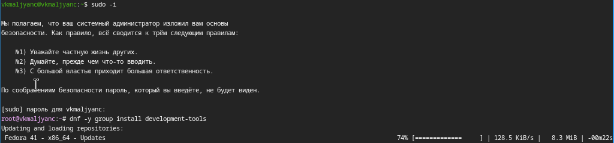{#fig:018 width=70%}

Устанавливаю пакет DKMS (рис. [-@fig:019]).

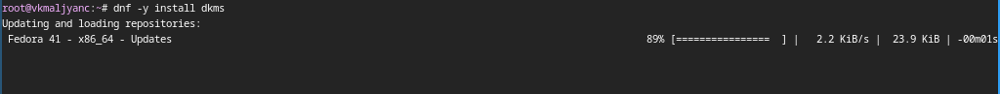{#fig:019 width=70%}

Перезагружаю виртуальную машину с помощью reboot(рис. [-@fig:020]).

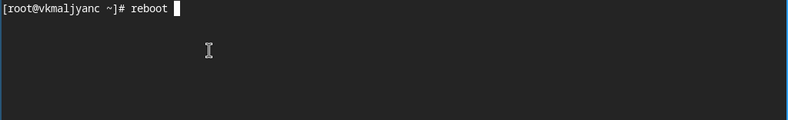{#fig:020 width=70%}

В меню виртуальной машины подключаю образ диска дополнений гостевой ОС (рис. [-@fig:021]).

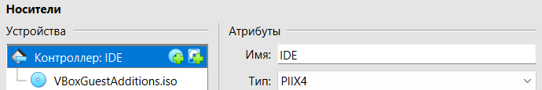{#fig:021 width=70%}

Монтирую диск с помощью mount (рис. [-@fig:022]).

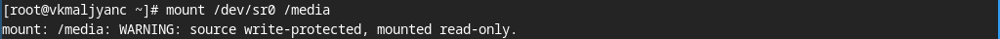{#fig:022 width=70%}

Устанавливаю драйвера (рис. [-@fig:023]).

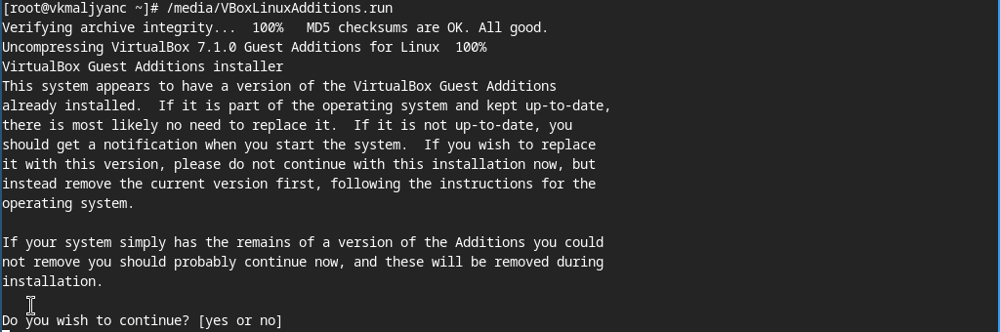{#fig:023 width=70%}

Перезагружаю виртуальную машину (рис. [-@fig:024]).

{#fig:024 width=70%}

## Подключение общей папки

Добавляю пользователя в группу vboxsf (рис. [-@fig:025]).

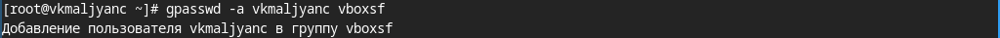{#fig:025 width=70%}

В хостовой системе подключаю разделяемую папку (рис. [-@fig:026]).

{#fig:026 width=70%}

Перезагружаю виртуальную машину (рис. [-@fig:027]).

{#fig:027 width=70%}

## Обновления

Переключаюсь на роль супер-пользователя с помощью sudo-i (рис. [-@fig:028]).

{#fig:028 width=70%}

Обновляю все пакеты (рис. [-@fig:029]).

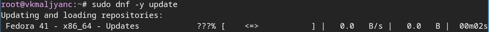{#fig:029 width=70%}

## Повышение комфорта работы

Устанавливаю программу для удобства работы в консоли (рис. [-@fig:030]).

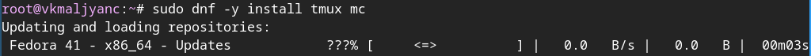{#fig:030 width=70%}

Устанавлюваю другой вариант консоли (рис. [-@fig:031]).

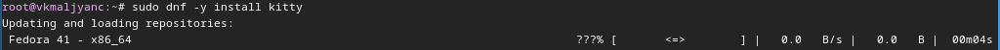{#fig:031 width=70%}

## Автоматическое обновление

Устанавливаю программное обеспечение для автоматического обновления (рис. [-@fig:032]).

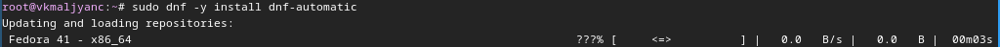{#fig:032 width=70%}

Запускаю таймер (рис. [-@fig:033]).

{#fig:033 width=70%}

## Отключение SELINUX

Переключаюсь на роль супер-пользователя с помощью sudo-i и перехожу в каталог selinux (рис. [-@fig:034]).

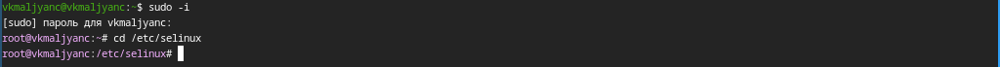{#fig:034 width=70%}

Открываю mc (рис. [-@fig:035]).

{#fig:035 width=70%}

Изменяю значение SELINUX c enforcing на permissive (рис. [-@fig:036]).

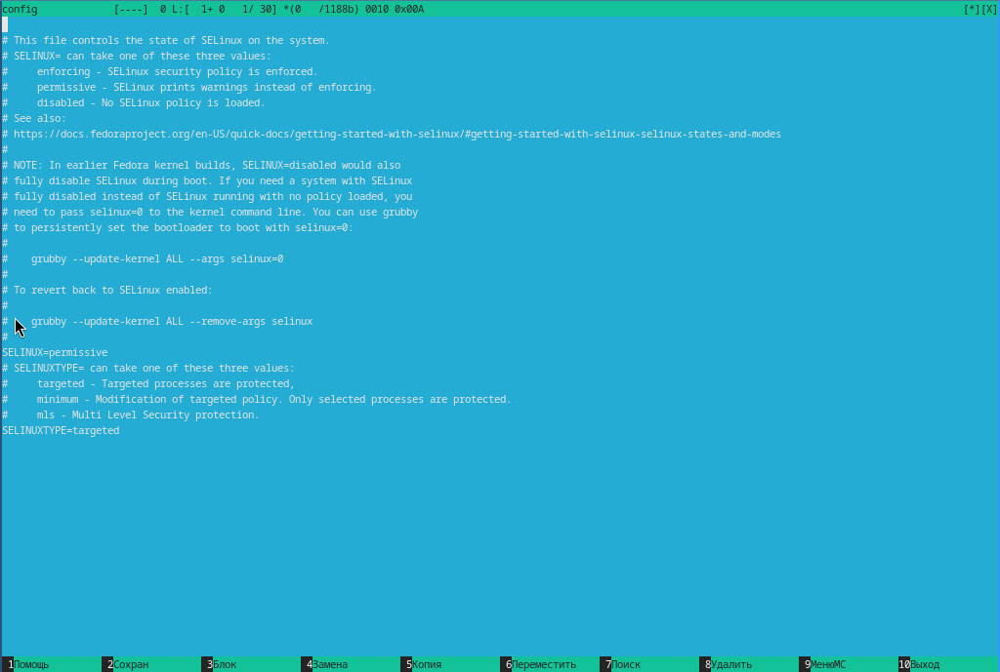{#fig:036 width=70%}

Перезагружаю виртуальную машину (рис. [-@fig:037]).

{#fig:037 width=70%}

## Настройка раскладки клавиатуры

Запускаю терминальный мультиплексор tmux (рис. [-@fig:038]).

{#fig:038 width=70%}

Создаю конфигурационный файл (рис. [-@fig:039]).

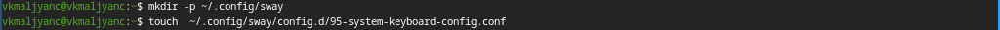{#fig:039 width=70%}

Редактирую конфигурационный файл (рис. [-@fig:040]).

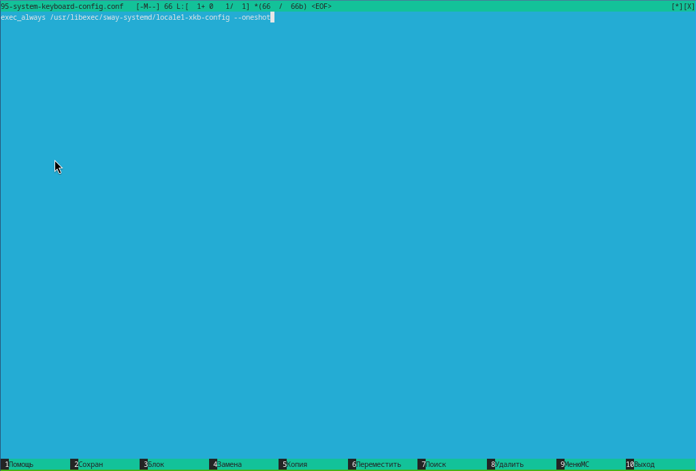{#fig:040 width=70%}

Переключаюсь на роль супер-пользователя с помощью sudo-i (рис. [-@fig:041]).

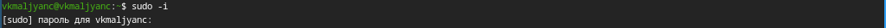{#fig:041 width=70%}

Перехожу в каталог /etc/X11/xorg.conf.d и открываю mc (рис. [-@fig:042]).

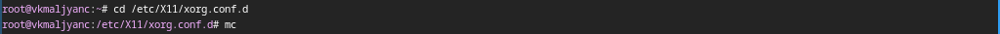{#fig:042 width=70%}

Редактирую конфигурационный файл /etc/X11/xorg.conf.d/00-keyboard.conf (рис. [-@fig:043]).

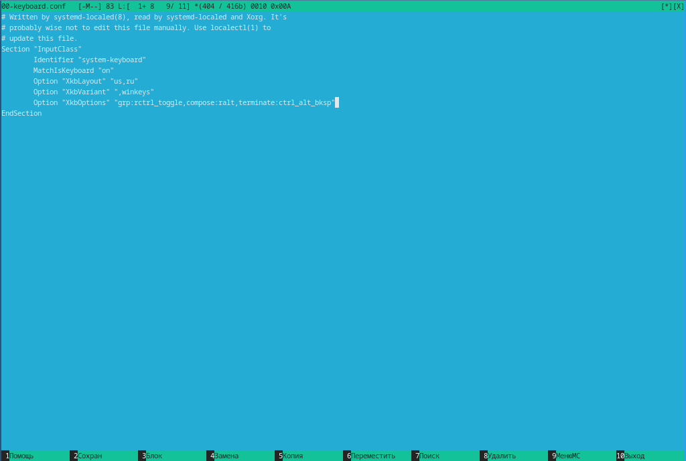{#fig:043 width=70%}

Перезагружаю виртуальную машину (рис. [-@fig:044]).

{#fig:044 width=70%}

## Установка программного обеспечения для создания документации

Запускаю терминальный мультиплексор tmux (рис. [-@fig:045]).

{#fig:045 width=70%}

Переключаюсь на роль супер-пользователя	с помощью sudo-i (рис. [-@fig:046]).

{#fig:046 width=70%}

Устанавливаю pandoc с помощью менеджера пакетов (рис. [-@fig:047]).

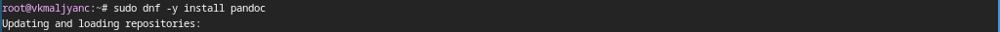{#fig:047 width=70%}

Скачиваю pandoc-crossref (рис. [-@fig:048]).

{#fig:048 width=70%}

Копирую pandoc-crossref в /usr/local/bin (рис. [-@fig:049]).

{#fig:049 width=70%}

Устанавливаю дистрибутив TeXlive (рис. [-@fig:050]).

{#fig:050 width=70%}

Перезагружаю виртуальную машину (рис. [-@fig:051]).

{#fig:051 width=70%}

Запускаю терминальный мультиплексор tmux (рис. [-@fig:052]).

{#fig:052 width=70%}

Переключаюсь на роль супер-пользователя с помощью sudo-i (рис. [-@fig:053]).

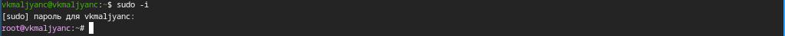{#fig:053 width=70%}

# Выводы

Я приобрела практические навыки установки операционной системы на виртуальную машину, настройки минимально необходимых для дальнейшей работы сервисов.

## Ответы на контрольные вопросы

1. Учетная запись пользователя содержит: username, UID, GID, полное имя, shell, home directory, права доступа и группы, к которым принадлежит пользователь
2. Укажите команды терминала и приведите примеры:
Для получения справки по команде: man (пример: man cd)
Для перемещения по файловой системе: cd (пример: cd /usr/local/bin)
Для просмотра содержимого каталога: ls (примеп: ls /usr)
Для определения объема каталога: du -sh (пример: de -sh /usr/local)
Для создания каталогов: mkdir (пример: mkdir ~/.config/sway), для удаления каталогов: rmdir (пример: rmdir ~/.config/sway), для создания файлов touch (пример: touch ~/.config/sway/config.d/95-system-keyboard-config.conf), для удаления файлов: rm (пример: rm ~/.config/sway/config.d/95-system-keyboard-config.conf)
Для задания определенных прав на файл/каталог: chmod (пример chmod +x)
Для просмотра истории команд: history
3. Файловая система - способ организации и хранения данных на носителе информации: ex4 (высокопроизводительная система в Linux, может работать с большими объемами данных), XFS (высокопроизводительная система, может работать с большими объемами данных)
4. С помощью команды mount
5. С помощью команды kill <PID>

##Отчет о выполнении дополнительного задания

Выполняю команду dmesg (рис. [-@fig:054]).

{#fig:054 width=70%}

Выполняю команду dmesg | less (рис. [-@fig:055]).

{#fig:055 width=70%}

Получаю информацию о версии ядра Linux (рис. [-@fig:056]).

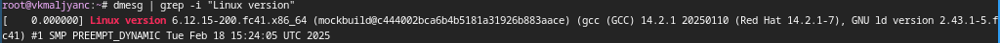{#fig:056 width=70%}

Получаю информацию о частоте процессора (рис. [-@fig:057]).

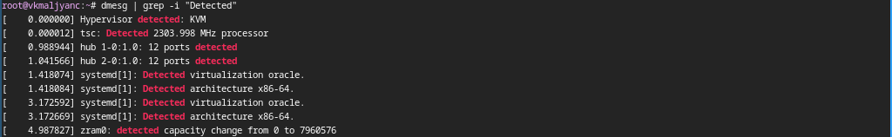{#fig:057 width=70%}

Получаю информацию о модели процессора (рис. [-@fig:058]).

{#fig:058 width=70%}

Получаю информацию об объеме доступной оперативной памяти (рис. [-@fig:059]).

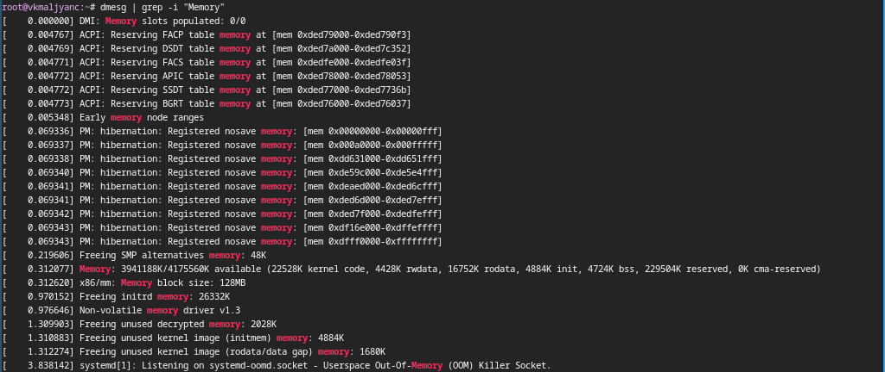{#fig:059 width=70%}

Получаю информацию о типе обрануженного гипервизора (рис. [-@fig:060]).

{#fig:060 width=70%}

Получаю информацию о типе файловой системы корневого раздела (рис. [-@fig:061]).

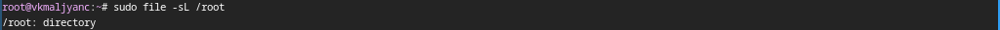{#fig:061 width=70%}

Получаю информацию о последовательности монтирования файловых систем (рис. [-@fig:062]) [@lab01].

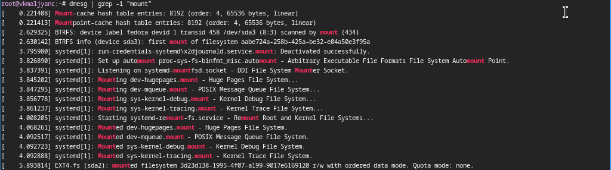{#fig:062 width=70%}

# Список литературы{.unnumbered}

::: {#refs}
:::
 
