---
## Front matter
lang: ru-RU
title: Лабораторная работа № 2
subtitle: Первоначальная настройка git
author:
  - Мальянц В. К.
institute:
  - Российский университет дружбы народов, Москва, Россия 
date: 02 марта 2025

## i18n babel
babel-lang: russian
babel-otherlangs: english

## Formatting pdf
toc: false
toc-title: Содержание
slide_level: 2
aspectratio: 169
section-titles: true
theme: metropolis
header-includes:
 - \metroset{progressbar=frametitle,sectionpage=progressbar,numbering=fraction}
---

# Цель работы

- Изучить идеологию и применение средств контроля версий git 

# Задание

- Установка программного обеспечения
- Базовая настройка git
- Создание ключа ssh
- Создание ключа pgp
- Настройка github
- Добавление pgp ключа в GitHub
- Настройка автоматичеких подписей коммитов git
-.Настройка gh
- Создание репозитория курса на основе шаблона
- Настройка каталога курса

# Выполнение лабораторной работы
## Установка программного обеспечения

- Переключаюсь на роль супер-пользователя с помощью sudo -i (рис. 1).

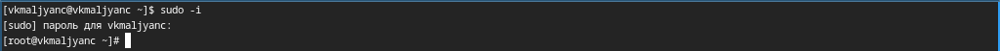{width=70%}

## Установка программного обеспечения

- Устанавливаю git (рис. 2).

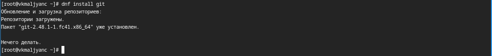{width=70%}

## Установка программного обеспечения

- Устанавливаю gh (рис. 3).

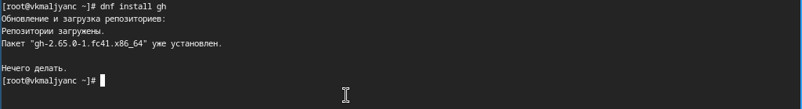{width=70%}

##  Базовая настройка git

- Задаю имя и email владельца репозитория (рис. 4).

{width=70%}

##  Базовая настройка git

- Настраиваю utf-8 в выводе сообщений git (рис. 5).

{width=70%}

##  Базовая настройка git

- Задаю имя начальной ветки (назову ее master) (рис. 6).

{width=70%}

##  Базовая настройка git

- Параметр autocrlf (рис. 7).

{width=70%}

##  Базовая настройка git

- Параметр safecrlf (рис. 8).

{width=70%}

## Создание ключа ssh

- Создание ключа ssh по алгоритму rsa с ключем размером 4096 бит (рис. 9).

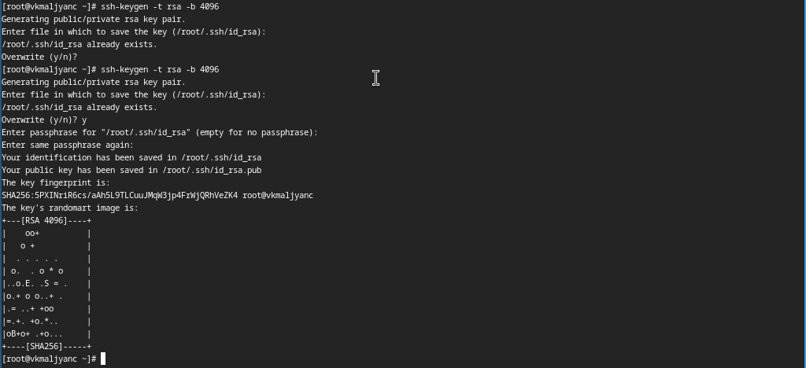{#width=70%}

## Создание ключа ssh

- Создание ключа ssh по алгоритму	ed25519 (рис. 10).

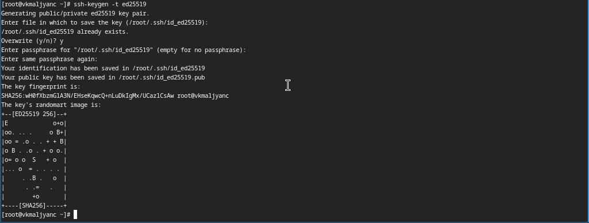{width=70%}

## Создание ключа pgp

- Генерирую ключ gpg, поэтому ввожу фразу-пароль для его защиты (рис. 11).

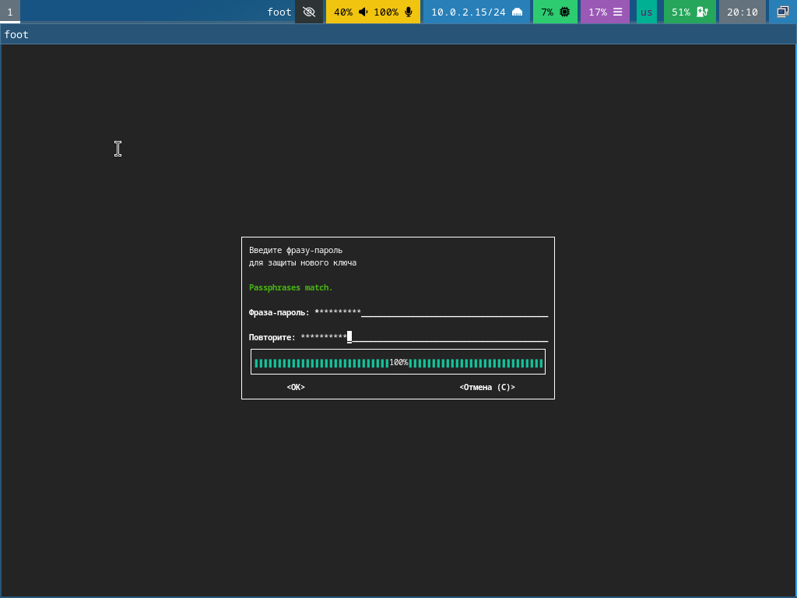{width=70%}

## Создание ключа pgp

- Генерирую ключ gpg, из предложенных опций выбираю: тип RSA and RSA, размер 4096, 0 (срок действия не истекает никогда) (рис. 12).

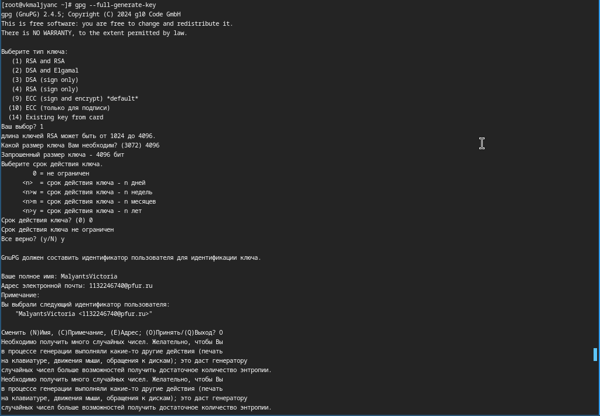{width=70%}

## Настройка github

- Профиль на GitHub был создан и настроен раннее (рис. 13).

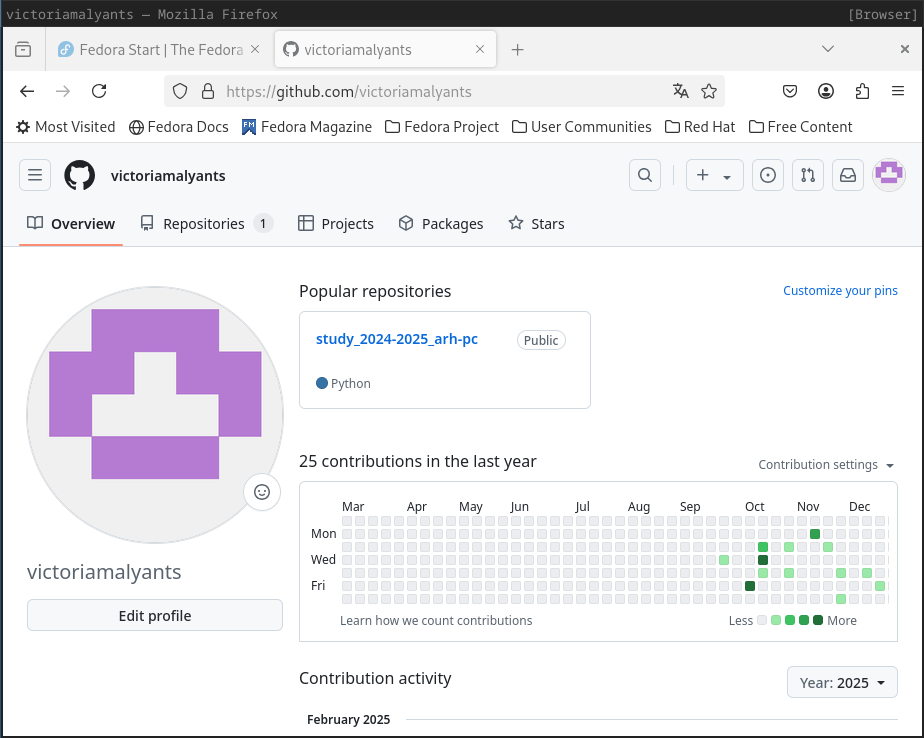{width=70%}

## Добавление pgp ключа в GitHub

- Вывожу список ключей и копирую отпечаток приватного ключа (рис. 14).

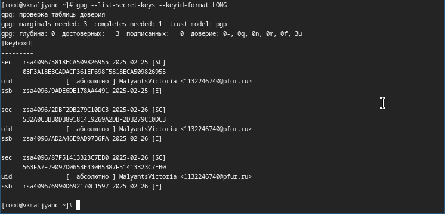{width=70%}

## Добавление pgp ключа в GitHub

- Копирую сгенерированный ключ gpg (рис. 15).

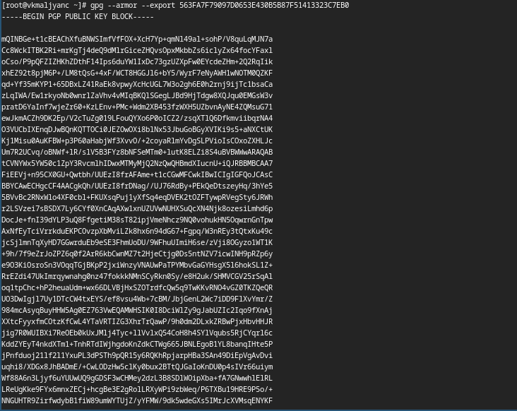{width=70%}

## Добавление pgp ключа в GitHub

- Перехожу в настройки GitHub, нажимаю кнопку New GPG key и вставляю полученный ключ в поле ввода (рис. 16).

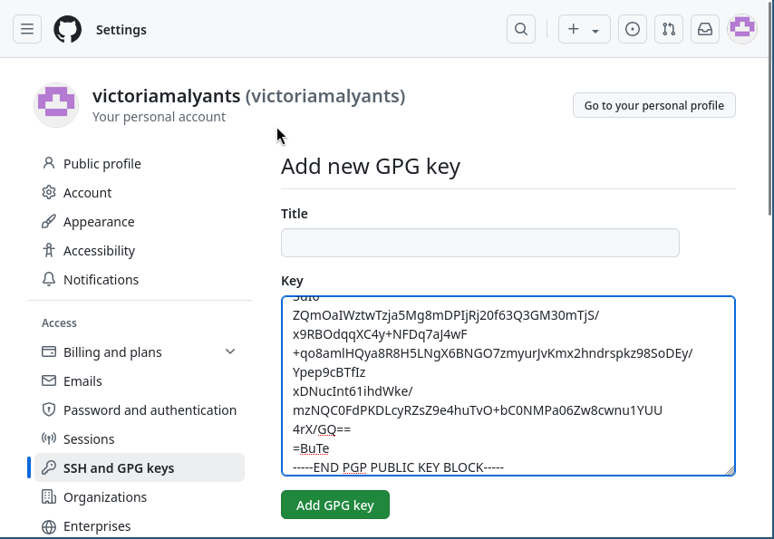{width=70%}

## Добавление pgp ключа в GitHub

- Ключ gpg создан (рис. 17).

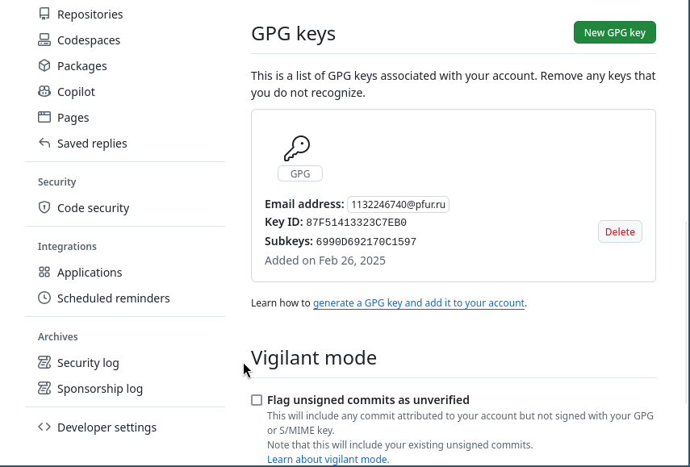{width=70%}

## Настройка автоматичеких подписей коммитов git

- Используя введенный email, указываю Git применять его при подписи коммитов (рис. 18).

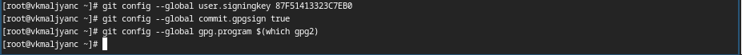{width=70%}

## Настройка gh

- Авторизуюсь в gh, отвечаю на наводящие вопросы утилиты (рис. 19).

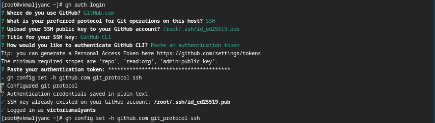{width=70%}

## Создание репозитория курса на основе шаблона

- Создаю каталог ~/work/study/2024-2025/"Операционные системы" и перемещаюсь в него (рис. 20).

{width=70%}

## Создание репозитория курса на основе шаблона

- Создаю репозиторий на основе шаблона (рис. 21).

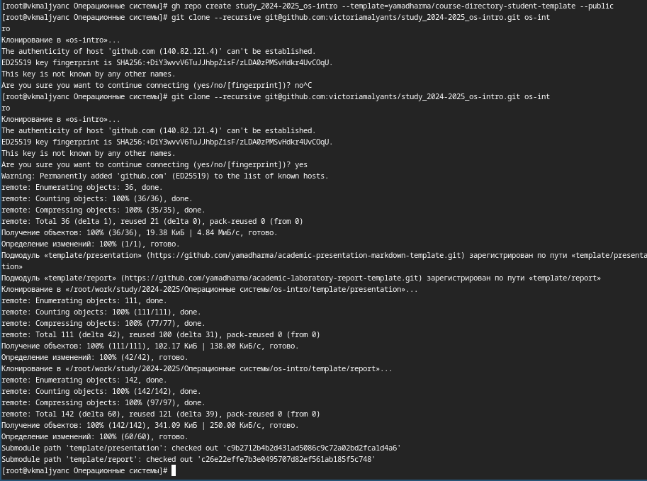{width=70%}

## Настройка каталога курса

- Перехожу в каталог курса ~/work/study/2024-2025/"Операционные системы"/os-intro (рис. 22).

{width=70%}

## Настройка каталога курса

- Удаляю лишние файлы (рис. 23).

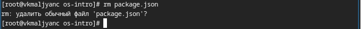{width=70%}

## Настройка каталога курса

- Создаю необходимые каталоги (рис. 24).

{width=70%}

## Настройка каталога курса

- Ввожу фразу-пароль для разблокировки ключа gpg (рис. 25).

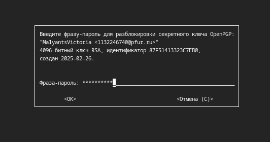{width=70%}

## Настройка каталога курса

- Создаю каталоги и отправляю файлы на сервер (рис. 26).

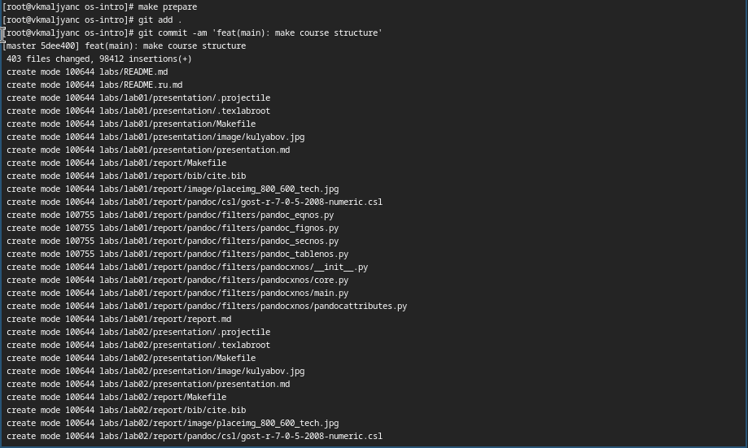{width=70%}

## Настройка каталога курса

- Отправляю файлы на сервер (рис. 27).

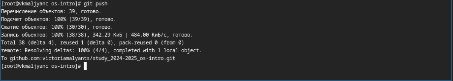{width=70%}

## Настройка каталога курса

- Каталоги и файлы создались успешно (рис. 28).

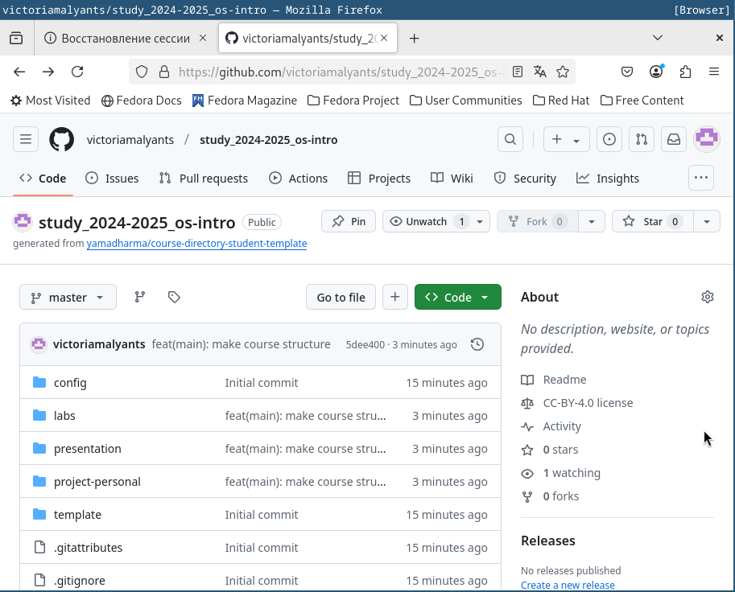{width=70%}

# Выводы

- Я изучила идеологию и применение средств контроля версий и освоила умения по работе с git.

# Спасибо за внимание
