---
## Front matter
title: "Лабораторная работа № 2"
subtitle: "Первоначальная настройка git"
author: "Мальянц Виктория Кареновна"

## Generic otions
lang: ru-RU
toc-title: "Содержание"

## Bibliography
bibliography: bib/cite.bib
csl: pandoc/csl/gost-r-7-0-5-2008-numeric.csl

## Pdf output format
toc: true # Table of contents
toc-depth: 2
lof: true # List of figures
lot: true # List of tables
fontsize: 12pt
linestretch: 1.5
papersize: a4
documentclass: scrreprt
## I18n polyglossia
polyglossia-lang:
  name: russian
  options:
	- spelling=modern
	- babelshorthands=true
polyglossia-otherlangs:
  name: english
## I18n babel
babel-lang: russian
babel-otherlangs: english
## Fonts
mainfont: IBM Plex Serif
romanfont: IBM Plex Serif
sansfont: IBM Plex Sans
monofont: IBM Plex Mono
mathfont: STIX Two Math
mainfontoptions: Ligatures=Common,Ligatures=TeX,Scale=0.94
romanfontoptions: Ligatures=Common,Ligatures=TeX,Scale=0.94
sansfontoptions: Ligatures=Common,Ligatures=TeX,Scale=MatchLowercase,Scale=0.94
monofontoptions: Scale=MatchLowercase,Scale=0.94,FakeStretch=0.9
mathfontoptions:
## Biblatex
biblatex: true
biblio-style: "gost-numeric"
biblatexoptions:
  - parentracker=true
  - backend=biber
  - hyperref=auto
  - language=auto
  - autolang=other*
  - citestyle=gost-numeric
## Pandoc-crossref LaTeX customization
figureTitle: "Рис."
tableTitle: "Таблица"
listingTitle: "Листинг"
lofTitle: "Список иллюстраций"
lotTitle: "Список таблиц"
lolTitle: "Листинги"
## Misc options
indent: true
header-includes:
  - \usepackage{indentfirst}
  - \usepackage{float} # keep figures where there are in the text
  - \floatplacement{figure}{H} # keep figures where there are in the text
---

# Цель работы

Изучить идеологию и применение средств контроля версий git 

# Задание

1. Установка программного обеспечения
2. Базовая настройка git
3. Создание ключа ssh
4. Создание ключа pgp
5. Настройка github
6. Добавление pgp ключа в GitHub
7. Настройка автоматичеких подписей коммитов git
8. Настройка gh
9. Создание репозитория курса на основе шаблона
10. Настройка каталога курса
11. Контрольные вопросы

# Выполнение лабораторной работы
## Установка программного обеспечения

Переключаюсь на роль супер-пользователя с помощью sudo -i (рис. [-@fig:001]).

{#fig:001 width=70%}

Устанавливаю git (рис. [-@fig:002]).

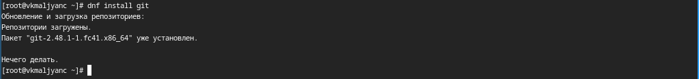{#fig:002 width=70%}

Устанавливаю gh (рис. [-@fig:003]).

{#fig:003 width=70%}

##  Базовая настройка git

Задаю имя и email владельца репозитория (рис. [-@fig:004]).

{#fig:004 width=70%}

Настраиваю utf-8 в выводе сообщений git (рис. [-@fig:005]).

{#fig:005 width=70%}

Задаю имя начальной ветки (назову ее master) (рис. [-@fig:006]).

{#fig:006 width=70%}

Параметр autocrlf (рис. [-@fig:007]).

{#fig:007 width=70%}

Параметр safecrlf (рис. [-@fig:008]).

{#fig:008 width=70%}

## Создание ключа ssh

Создание ключа ssh по алгоритму rsa с ключем размером 4096 бит (рис. [-@fig:009]).

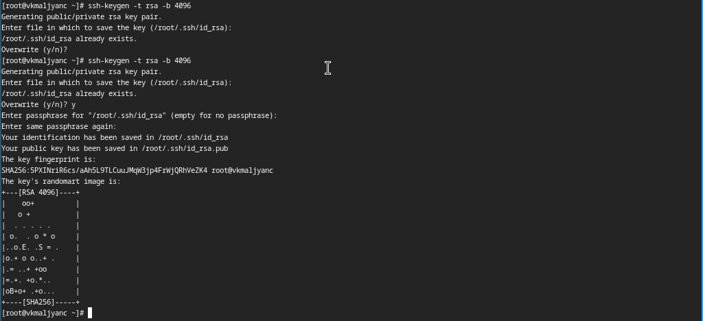{#fig:009 width=70%}

Создание ключа ssh по алгоритму	ed25519 (рис. [-@fig:010]).

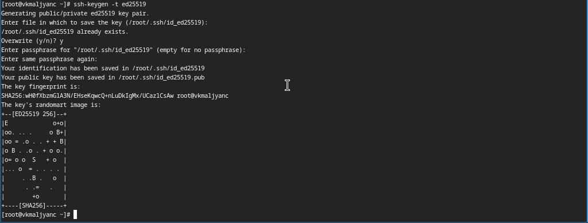{#fig:010 width=70%}

## Создание ключа pgp

Генерирую ключ gpg, поэтому ввожу фразу-пароль для его защиты (рис. [-@fig:011]).

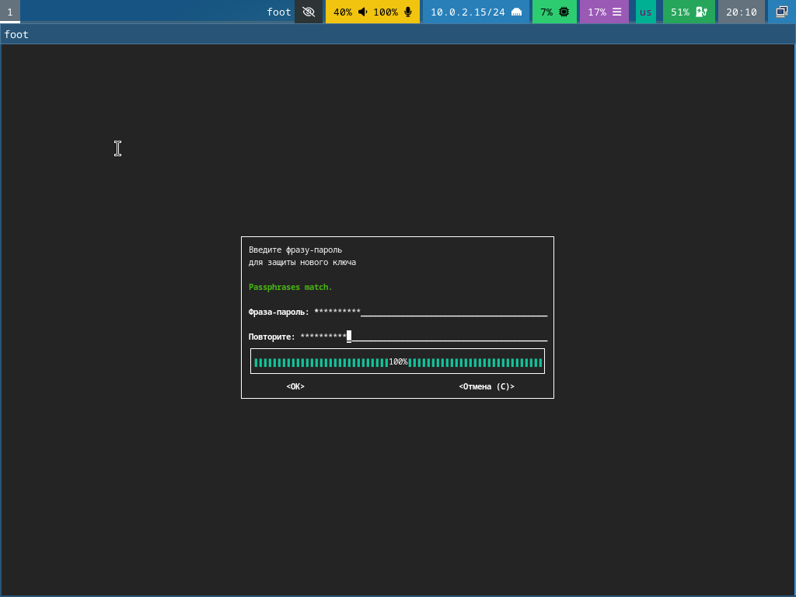{#fig:011 width=70%}

Генерирую ключ gpg, из предложенных опций выбираю: тип RSA and RSA, размер 4096, 0 (срок действия не истекает никогда) (рис. [-@fig:012]).

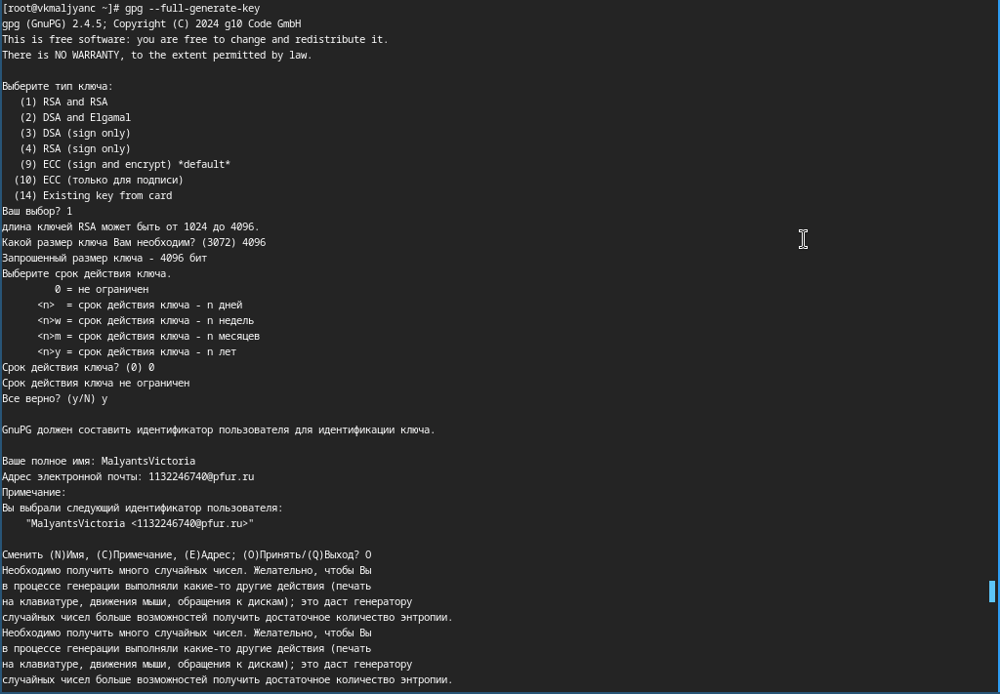{#fig:012 width=70%}

## Настройка github

Профиль на GitHub был создан и настроен раннее (рис. [-@fig:013]).

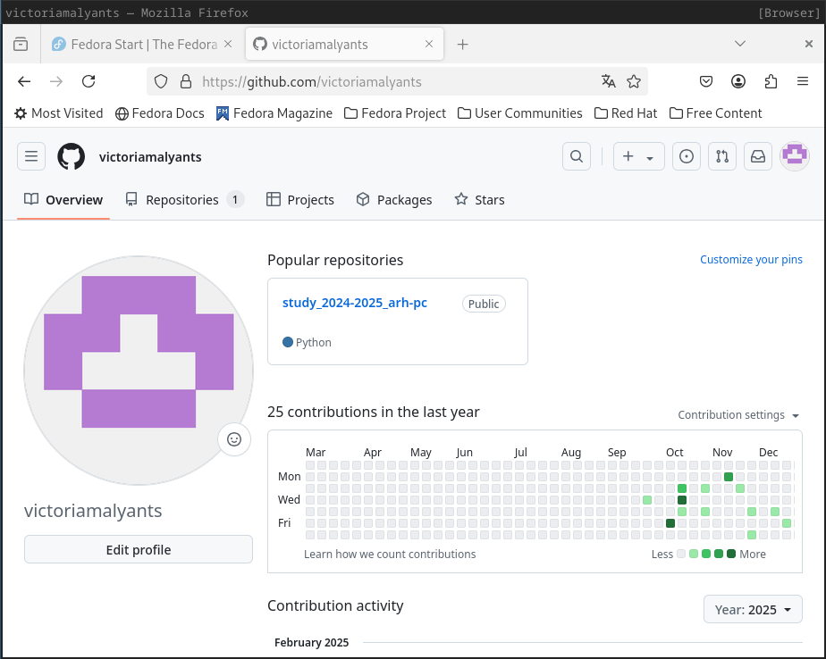{#fig:013 width=70%}

## Добавление pgp ключа в GitHub

Вывожу список ключей и копирую отпечаток приватного ключа (рис. [-@fig:014]).

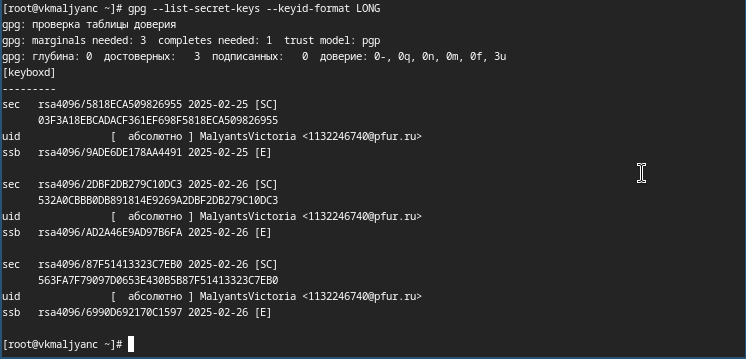{#fig:014 width=70%}

Копирую сгенерированный ключ gpg (рис. [-@fig:015]).

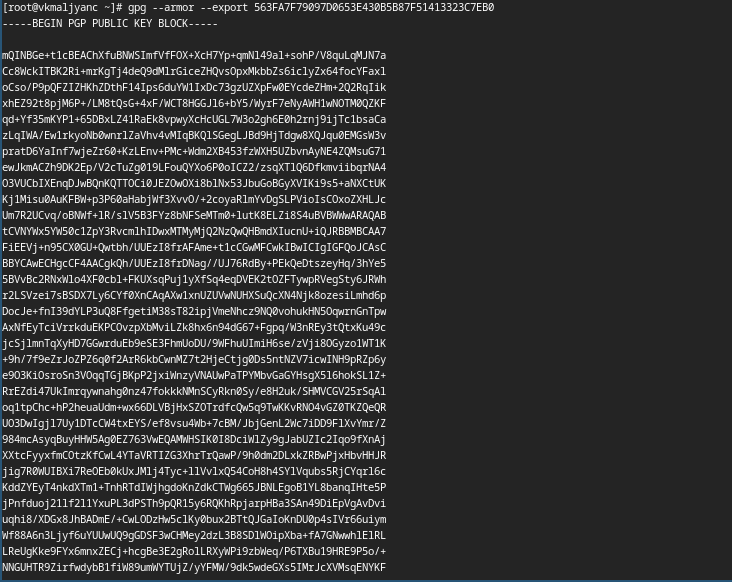{#fig:015 width=70%}

Перехожу в настройки GitHub, нажимаю кнопку New GPG key и вставляю полученный ключ в поле ввода (рис. [-@fig:016]).

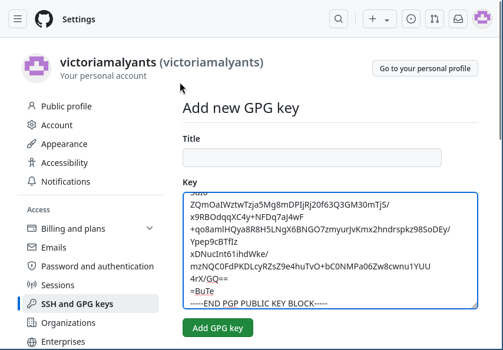{#fig:016 width=70%}

Ключ gpg создан (рис. [-@fig:017]).

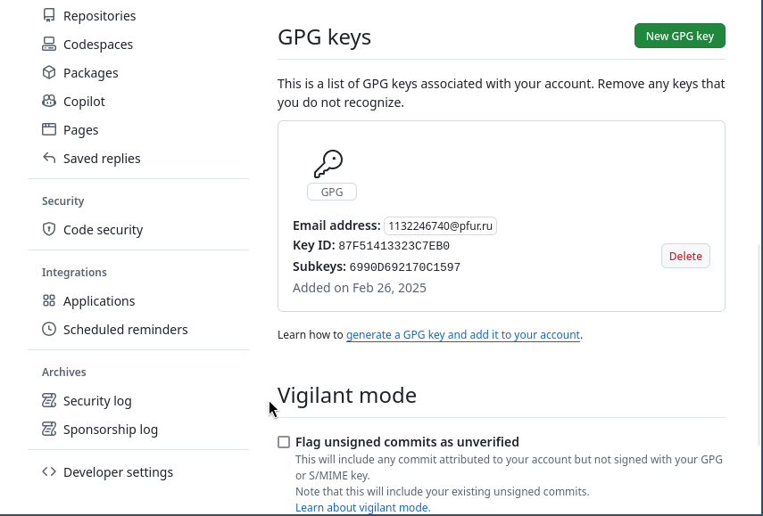{#fig:017 width=70%}

## Настройка автоматичеких подписей коммитов git

Используя введенный email, указываю Git применять его при подписи коммитов (рис. [-@fig:018]).

{#fig:018 width=70%}

## Настройка gh

Авторизуюсь в gh, отвечаю на наводящие вопросы утилиты (рис. [-@fig:019]).

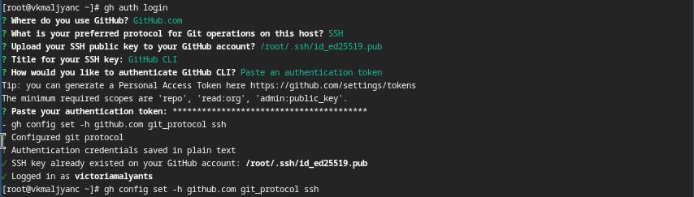{#fig:019 width=70%}

## Создание репозитория курса на основе шаблона

Создаю каталог ~/work/study/2024-2025/"Операционные системы" и перемещаюсь в него (рис. [-@fig:020]).

{#fig:020 width=70%}

Создаю репозиторий на основе шаблона (рис. [-@fig:021]).

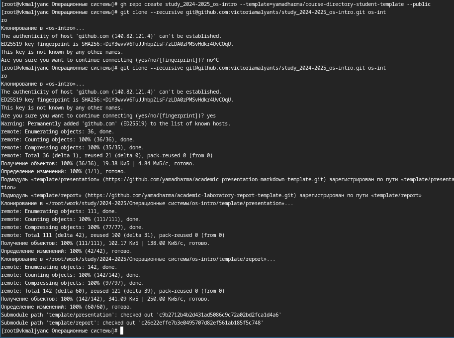{#fig:021 width=70%}

## Настройка каталога курса

Перехожу в каталог курса ~/work/study/2024-2025/"Операционные системы"/os-intro (рис. [-@fig:022]).

{#fig:022 width=70%}

Удаляю лишние файлы (рис. [-@fig:023]).

{#fig:023 width=70%}

Создаю необходимые каталоги (рис. [-@fig:024]).

{#fig:024 width=70%}

Ввожу фразу-пароль для разблокировки ключа gpg (рис. [-@fig:025]).

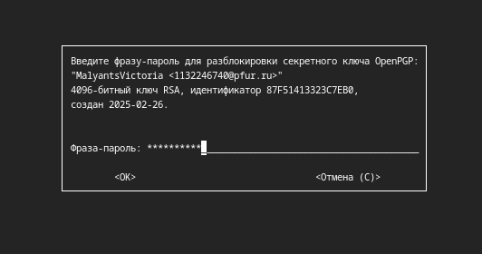{#fig:025 width=70%}

Создаю каталоги и отправляю файлы на сервер (рис. [-@fig:026]).

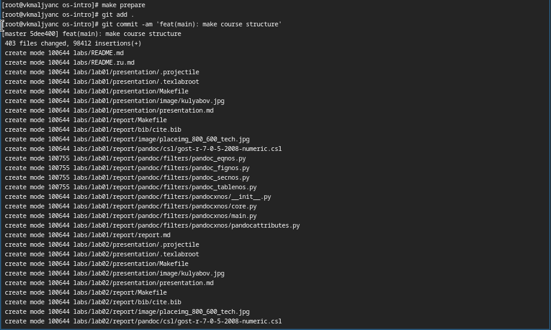{#fig:026 width=70%}

Отправляю файлы на сервер (рис. [-@fig:027]).

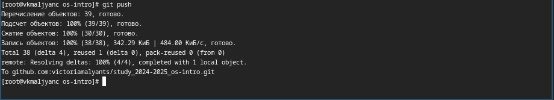{#fig:027 width=70%}

Каталоги и файлы создались успешно (рис. [-@fig:028]).

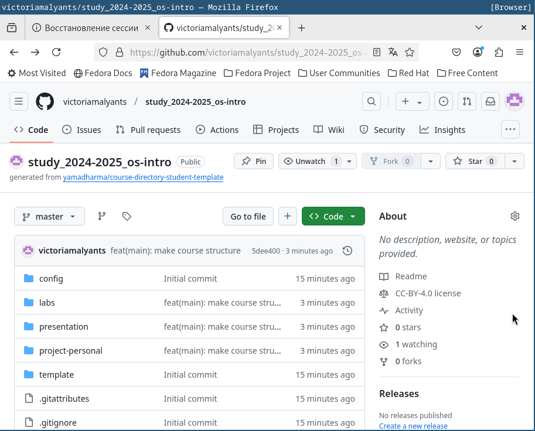{#fig:028 width=70%}

# Выводы

Я изучила идеологию и применение средств контроля версий и освоила умения по работе с git.

# Контрольные вопросы
1. Системы контроля версий (VCS) предназначаются для совместной работы над проектами, а также для отслеживания изменений в файлах.
2. Хранилище - место, где хранятся все версии файлов проекта. 
Commit - для сохранения изменений в хранилище.
История - поседовательность всех коммитов.
Рабочая копия - локальная версия файлов.
3. Централизованные VCS - все изменения хранятся на центральном сервере, например: CVS, Subversion.
Децентрализованные VCS - каждый разработчик проекта имеет полную копию хранилища, включая всю историю изменений, например: Git, Mercurial.
4. Создание локальнго хранилища, внесение изменений в файлы, использование commit, просмотр изменений и возможность восстановления предыдущих версий
5. Клонирования репозитория, создание новой ветки, внесение изменений в commit, обновление локальной версии, слияние с основной веткой, отправка в хранилище.
6. Отслеживание изменений в файлах, управление версиями и ветвлением, слияение изменений от разных разработчиков, восстановление предыдущих версий файлов и работа с удаленными репозиториями.
7. git init (создание основного дерева репозитория), git pull (получение обновлений текущего дерева из центрального репозитория), git push (отправка всех произведенных изменений локального дерева в центральный репозиторий), git status (просмотр списка измененных файлов в текущей директории), git diff (просмотр текущих изменений), git add (сохранение текущих изменений), git commit (сохранение добавленных изменений), git pust origin (отправка изменений конкретной ветки в центральный репозиторий), git merge --no-ff (слияние ветки с текущим деревом), git branch (управление ветками).
8. Локальный репозиторий: git add ., git commit 
Удаленный репозиторий: git clone, git pull
9. Ветви - нужны для работы с отдельными частями проекта, не мешая основной части.
10. С помощью файла .gitignore, чтобы игнорировать добавление файлов, которые не требуются в репозитории.

