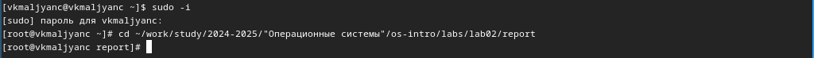
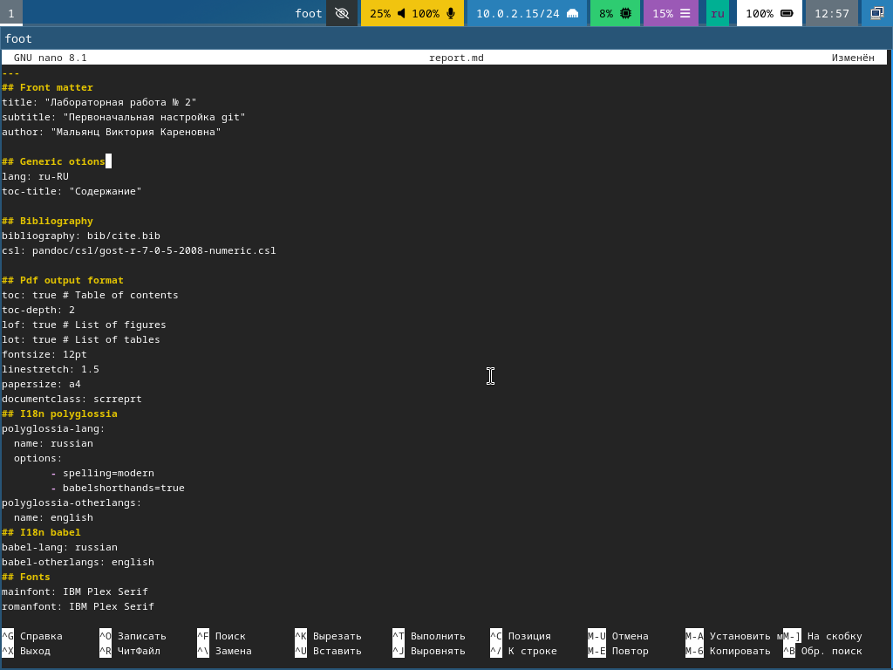
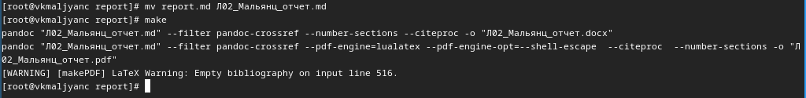
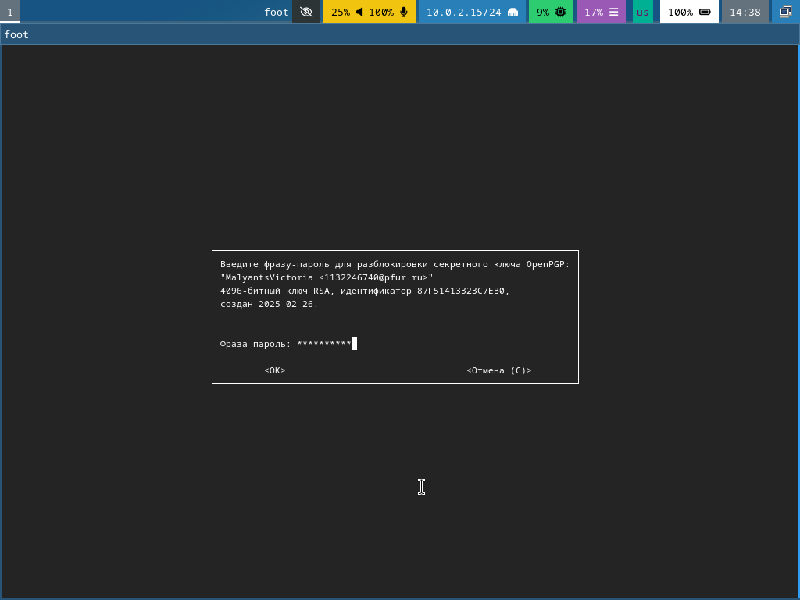
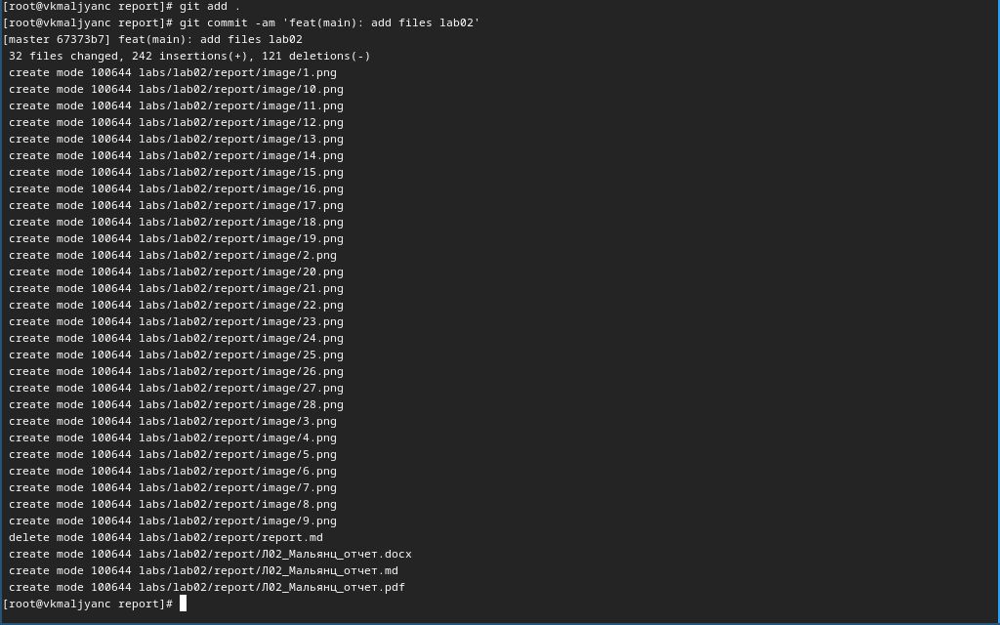
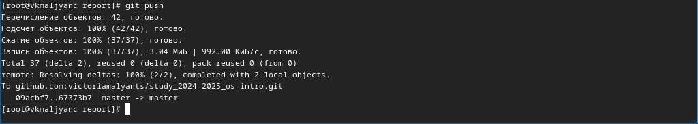
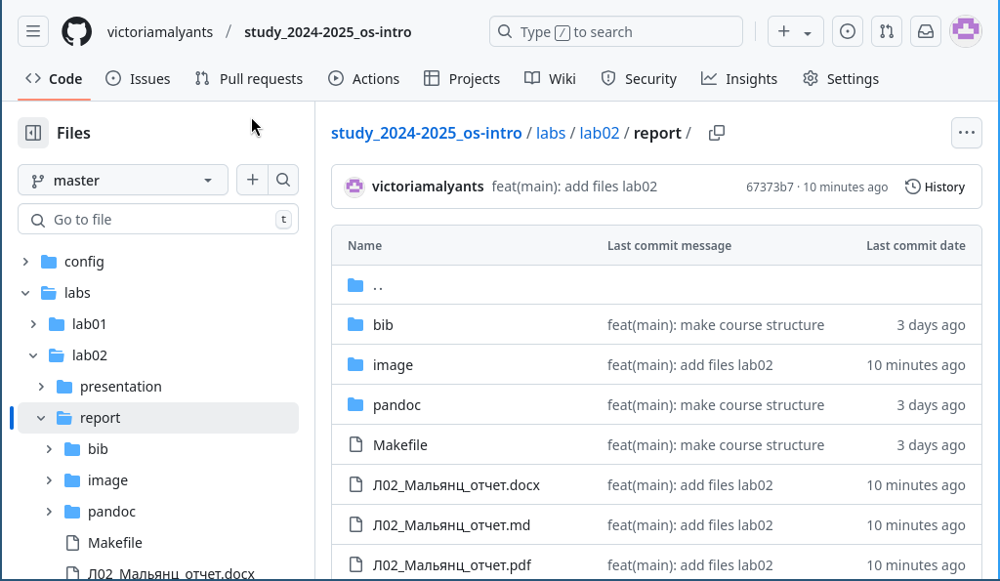

---
## Front matter
lang: ru-RU
title: Лабораторная работа № 3
subtitle: Markdown
author:
  - Мальянц В. К.
institute:
  - Российский университет дружбы народов, Москва, Россия
date: 03 марта 2025

## i18n babel
babel-lang: russian
babel-otherlangs: english

## Formatting pdf
toc: false
toc-title: Содержание
slide_level: 2
aspectratio: 169
section-titles: true
theme: metropolis
header-includes:
 - \metroset{progressbar=frametitle,sectionpage=progressbar,numbering=fraction}
---

# Цель работы

- Научиться оформлять отчеты с помощью легковесного языка разметки Markdown

# Задание

- Сделать отчет по предыдущей лабораторной работе в формате Markdown
- Предоставить отчеты в 3 форматах: pdf, docx и md

# Выполнение лабораторной работы
## Сделать отчет по предыдущей лабораторной работе в формате Markdown
- Переключаюсь на роль супер-пользователя с помощью sudo -i и перехожу в каталог ~work/study/2024-2025/"Операционные системы"/os-intro/labs/lab02/report (рис. 1).

{width=70%}

## Сделать отчет по предыдущей лабораторной работе в формате Markdown

- Открываю текстовый редактор nano, чтобы делать в нем отчет (рис. 2).

{width=70%}

## Сделать отчет по предыдущей лабораторной работе в формате Markdown

- Выполняю отчет (рис. 3).

{width=70%}

## Предоставить отчеты в 3 форматах: pdf, docx и md 

- Меняю имя отчета на Л02_Мальянц_отчет.md и компилирую его в трех форматах (рис. 4).

{width=70%}

## Предоставить отчеты в 3 форматах: pdf, docx и md 

- Ввожу фразу-пароль для разблокировки ключа gpg (рис. 5).

{width=70%}

## Предоставить отчеты в 3 форматах: pdf, docx и md 

- Отправляю файлы на сервер (рис. 6).

{width=70%}

## Предоставить отчеты в 3 форматах: pdf, docx и md 

- Отправляю файлы на сервер (рис. 7}.

{width=70%}

## Предоставить отчеты в 3 форматах: pdf, docx и md 

- Файлы создались успешно (рис. 8).

{width=70%}

# Выводы

- Я научилась оформлять отчеты с помощью лековесного языка разметки Markdown.

