---
## Front matter
lang: ru-RU
title: Лабораторная работа № 4
subtitle: Продвинутое использование git
author:
  - Мальянц В. К.
institute:
  - Российский университет дружбы народов, Москва, Россия
date: 08 марта 2025

## i18n babel
babel-lang: russian
babel-otherlangs: english

## Formatting pdf
toc: false
toc-title: Содержание
slide_level: 2
aspectratio: 169
section-titles: true
theme: metropolis
header-includes:
 - \metroset{progressbar=frametitle,sectionpage=progressbar,numbering=fraction}
---

# Цель работы

- Получить навыки правильной работы с репозиториями git.

# Задание

- Установка программного обеспечения
- Практический сценарий использования git

# Выполнение лабораторной работы
## Установка программного обеспечения

- Устанавливаю git-flow (рис. 1).

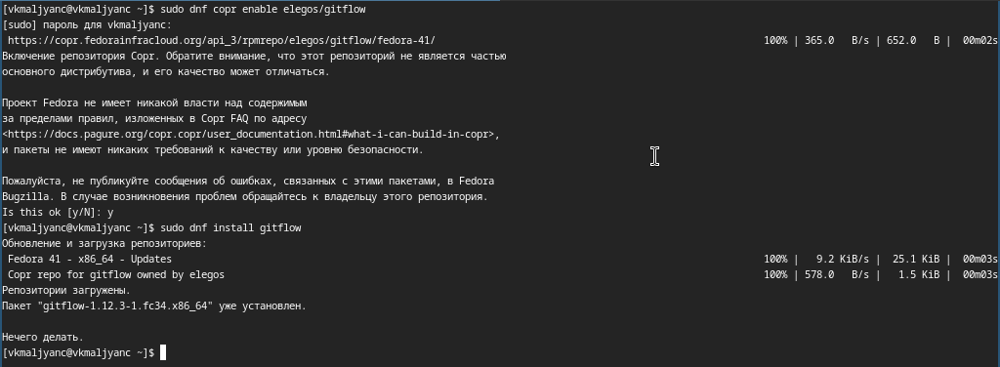{width=70%}

## Установка программного обеспечения

- Устанавливаю Node.js (рис. 2).

{width=70%}

## Установка программного обеспечения

- Устанавливаю Node.js (рис. 3).

{width=70%}

## Установка программного обеспечения

- Настаиваю Node.js (рис. 4).

{width=70%}

## Установка программного обеспечения

- Устанавливаю commitizen для помощи в форматировании коммитов (рис. 5).

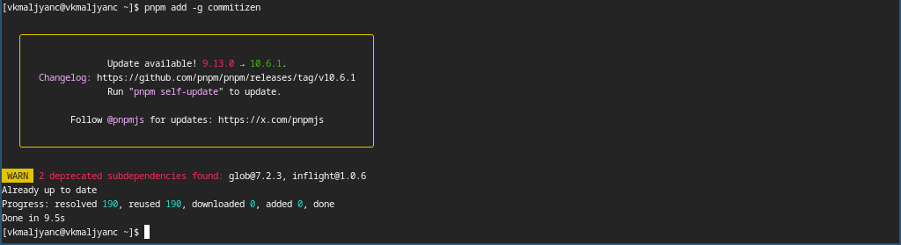{width=70%}

## Установка программного обеспечения

- Устанавливаю standard-changelog для помощи в создании логов (рис. 6).

{width=70%}

## Практический сценарий использования git

- Создаю новый репозиторий на GitHub, называю его git-extended (рис. 7).

{width=70%}

## Практический сценарий использования git

- Убеждаюсь в том, что репозиторий создан (рис. 8).

{width=70%}

## Практический сценарий использования git

- Клонирую репозиторий на свой локальный компьютер (рис. 9).

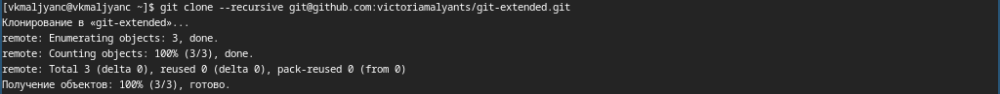{width=70%}

## Практический сценарий использования git

- Перехожу в git-extended и создаю файл README.md (рис. 10).

{width=70%}

## Практический сценарий использования git

- Добавляю в файл README.md слово text (рис. 11).

{width=70%}

## Практический сценарий использования git

- Выполняю первый коммит и выкладываю на github (рис. 12).

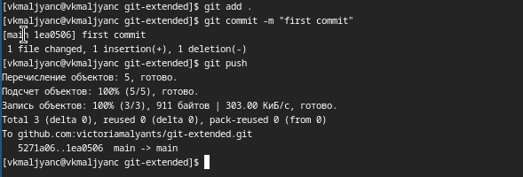{width=70%}

## Практический сценарий использования git

- Выполняю кофигурацию для пакетов Node.js (рис. 13).

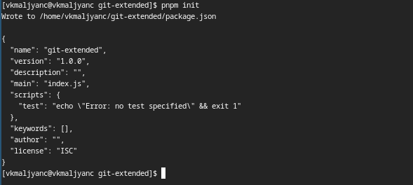{width=70%}

## Практический сценарий использования git

- Заполняю файл package.json (рис. 14).

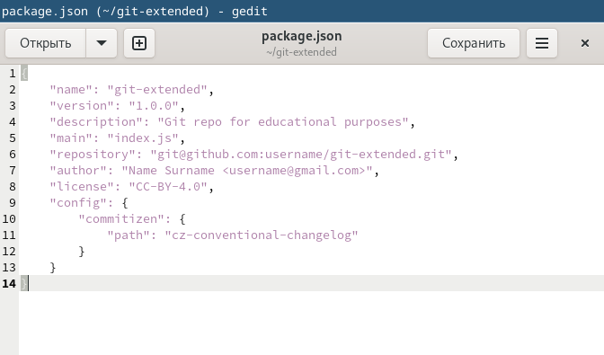{width=70%}

## Практический сценарий использования git

- Добавляю файл, выполняю коммит и отправляю на github (рис. 15).

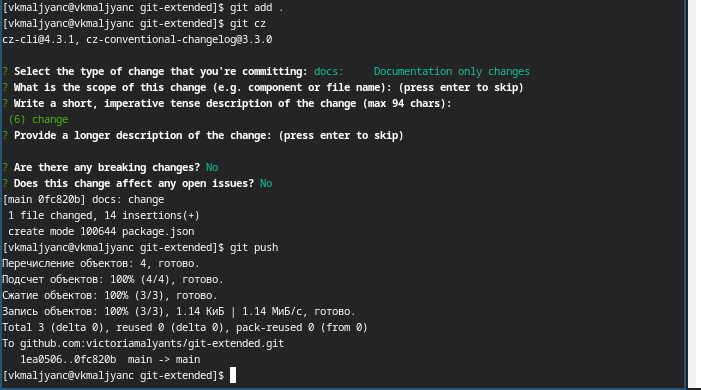{width=70%}

## Практический сценарий использования git

- Инициализую git-flow, устанавливаю префикс для ярлыков в v (рис. 16).

{width=70%}

## Практический сценарий использования git

- Убеждаюсь в том, что я на ветке develop (рис. 17).

{width=70%}

## Практический сценарий использования git

- Загружаю весь репозиторий в хранилище (рис. 18).

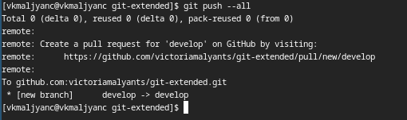{width=70%}

## Практический сценарий использования git

- Устанавливаю внешнюю ветку как вышестоящую для этой ветки (рис. 19).

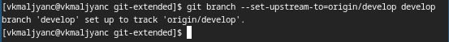{width=70%}

## Практический сценарий использования git

- Создаю релиз с версией 1.0.0 (рис. 20).

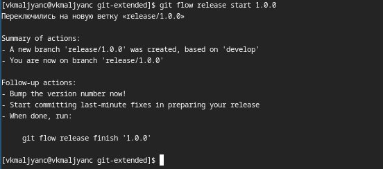{width=70%}

## Практический сценарий использования git

- Создаю журнал изменений (рис. 21).

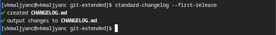{width=70%}

## Практический сценарий использования git

- Добавляю журнал изменений в индекс (рис. 22).

{width=70%}

## Практический сценарий использования git

- Редактирую файл (рис. 23).

{width=70%}

## Практический сценарий использования git

- Заливаю релизную ветку в основную ветку (рис. 24).

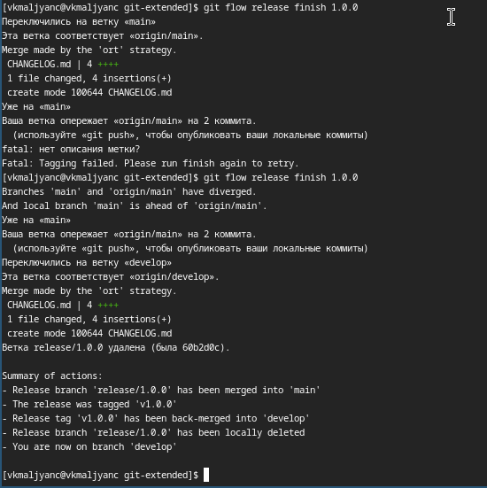{width=70%}

## Практический сценарий использования git

- Отправляю данные на github (рис. 25).

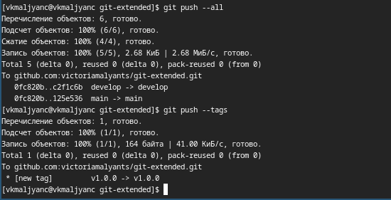{width=70%}

## Практический сценарий использования git

- Создаю релиз на github. (рис. 26).

{width=70%}

## Практический сценарий использования git

- Создаю ветку для новой функциональности (рис. 27).

{width=70%}

## Практический сценарий использования git

- Объединяю ветку feature_branch с develop (рис. 28).

{width=70%}

## Практический сценарий использования git

- Создаю релиз с версией 1.2.3 (рис. 29).

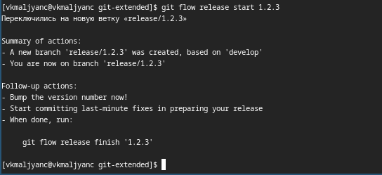{width=70%}

## Практический сценарий использования git

- Обновляю номер версии в файле package.json. Устанавливаю ее в 1.2.3 (рис. 30).

{width=70%}

## Практический сценарий использования git

- Создаю журнал изменений (рис. 31).

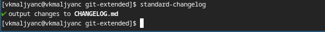{width=70%}

## Практический сценарий использования git

- Добавляю журнал изменений в индекс (рис. 32).

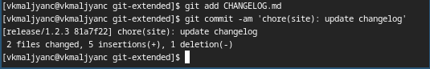{width=70%}

## Практический сценарий использования git

- Редактирую файл (рис. 33).

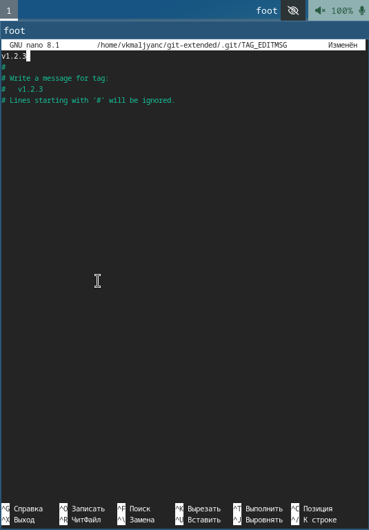{width=70%}

## Практический сценарий использования git

- Заливаю релизную ветку в основную ветку (рис. 34).

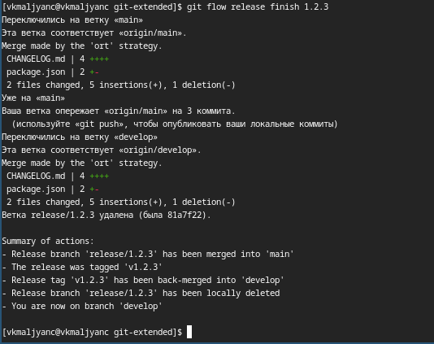{width=70%}

## Практический сценарий использования git

- Отправляю данные на github (рис. 35).

{width=70%}

## Практический сценарий использования git

- Создаю релиз на github с комментарием из журнала изменений (рис. 36).

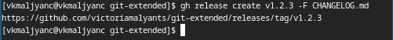{width=70%}

# Выводы

- Я получила навыки правильной работы с репозиториями git.

# Спасибо за внимание
