---
## Front matter
lang: ru-RU
title: Лабораторная работа № 5
subtitle: Настройка рабочей среды
author:
  - Мальянц В. К.
institute:
  - Российский университет дружбы народов, Москва, Россия
date: 13 марта 2025

## i18n babel
babel-lang: russian
babel-otherlangs: english

## Formatting pdf
toc: false
toc-title: Содержание
slide_level: 2
aspectratio: 169
section-titles: true
theme: metropolis
header-includes:
 - \metroset{progressbar=frametitle,sectionpage=progressbar,numbering=fraction}
---

# Цель работы

- Научиться настраивать рабочую среду.

# Задание

- Менеджер паролей pass
- Управление файлами конфигурации

# Выполнение лабораторной работы
## Менеджер паролей pass

- Устанавливаю pass (рис. 1).

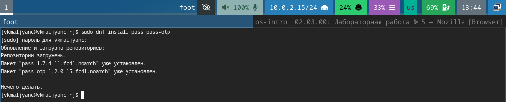{width=70%}

## Менеджер паролей pass

- Устанавливаю gopass (рис. 2).

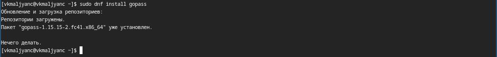{width=70%}

## Менеджер паролей pass

- Просматриваю список ключей (рис. 3).

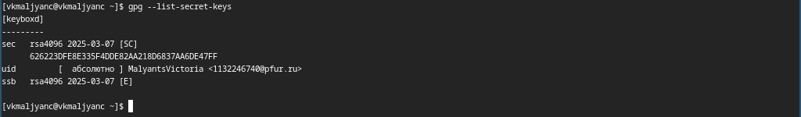{width=70%}

## Менеджер паролей pass

- Инициализирую хранилище (рис. 4).

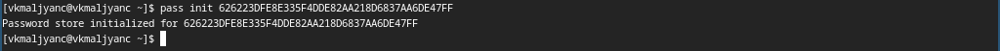{width=70%}

## Менеджер паролей pass

- Создаю структуру git (рис. 5).

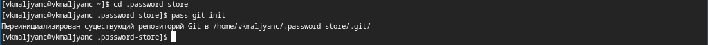{width=70%}

## Менеджер паролей pass

- Создаю новый репозиторий (рис. 6).

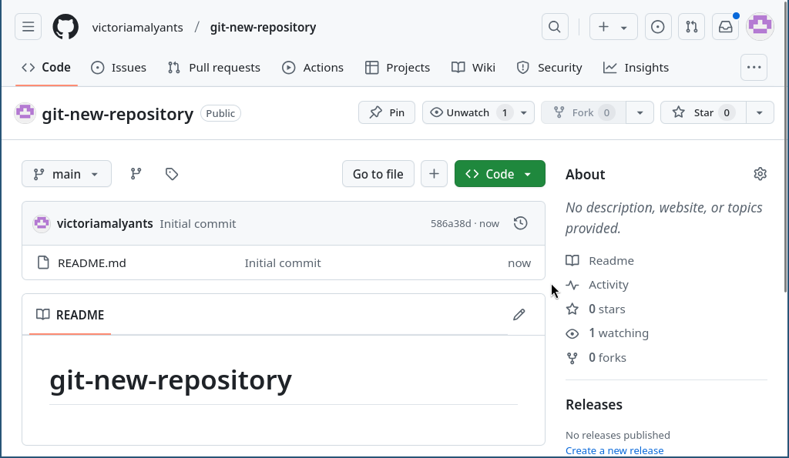{width=70%}

## Менеджер паролей pass

- Задаю адрес репозитория на хостинге (рис. 7).

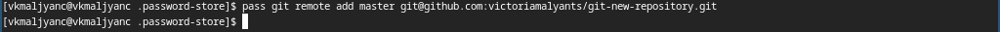{width=70%}

## Менеджер паролей pass

- Выполняю синхронизацию (рис. 8).

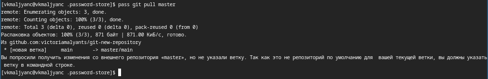{width=70%}

## Менеджер паролей pass

- Выполняю синхронизацию (рис. 9).

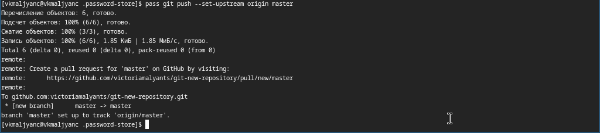{width=70%}

## Менеджер паролей pass

- Выполняю коммит и выкладываю изменения (рис. 10).

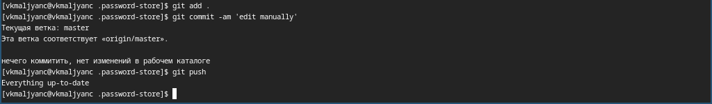{width=70%}

## Менеджер паролей pass

- Проверяю статус синхронизации (рис. 11).

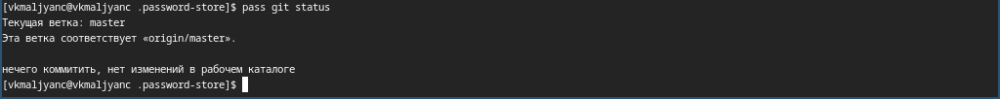{width=70%}

## Менеджер паролей pass

- Устанавливаю интерфейс для взаимодействия с браузером (рис. 12).

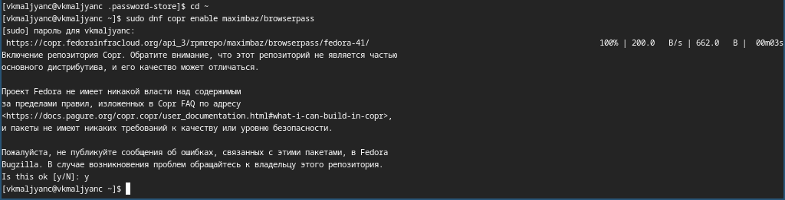{width=70%}

## Менеджер паролей pass

- Устанавливаю интерфейс для взаимодействия с браузером (рис. 13).

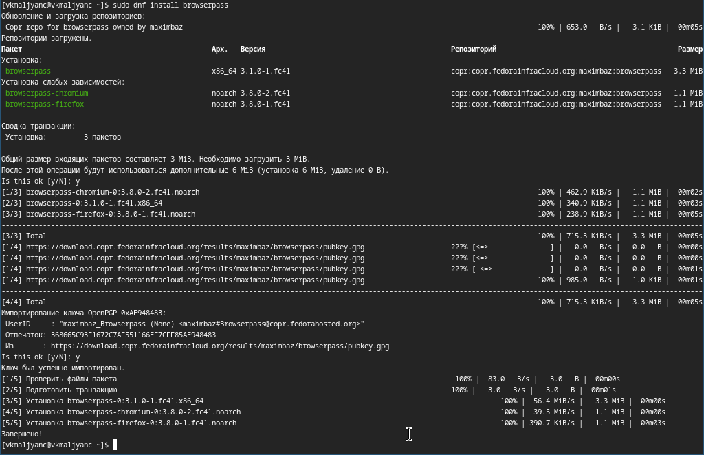{width=70%}

## Менеджер паролей pass

- Добавляю новый пароль (рис. 14).

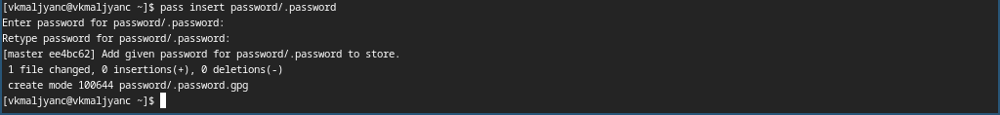{width=70%}

## Менеджер паролей pass

- Отображаю пароль для указанного имени файла (рис. 15).

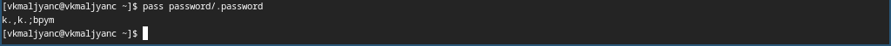{width=70%}

## Менеджер паролей pass

- Заменяю существующий пароль (рис. 16).

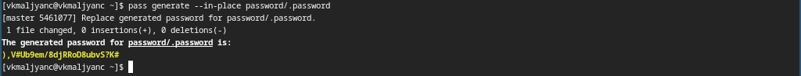{width=70%}

## Управление файлами конфигурации

- Устанавливаю дополнительное программное обеспечение (рис. 17).

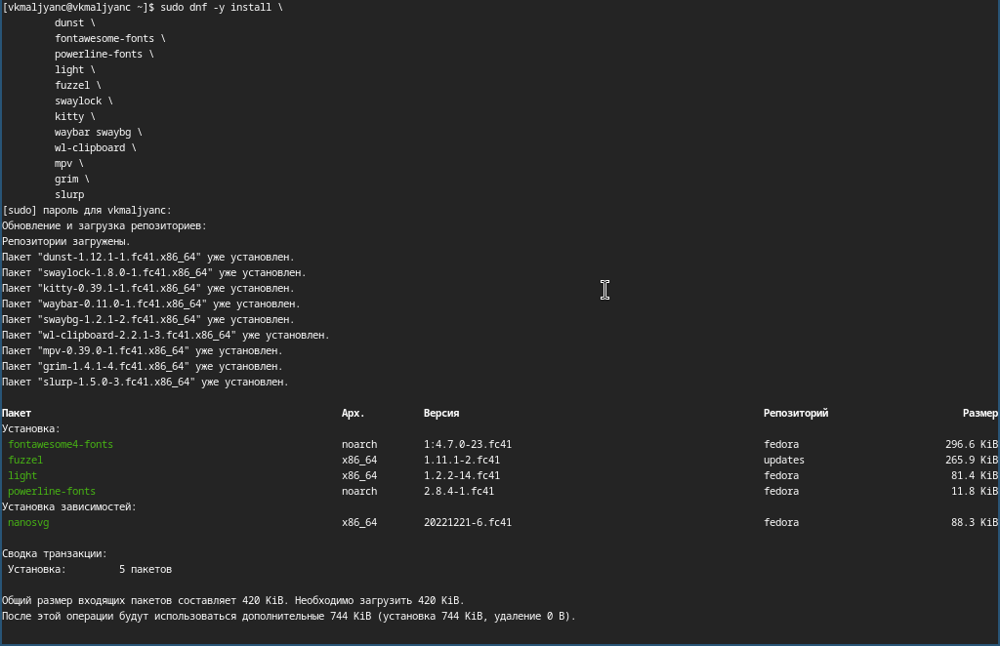{width=70%}

## Управление файлами конфигурации

- Устанавливаю шрифты (рис. 18).

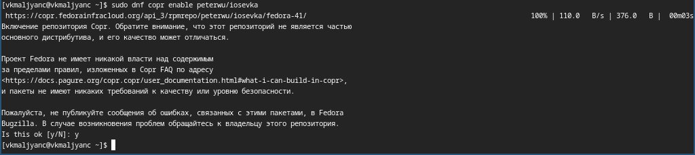{width=70%}

## Управление файлами конфигурации

- Устанавливаю шрифты (рис. 19).

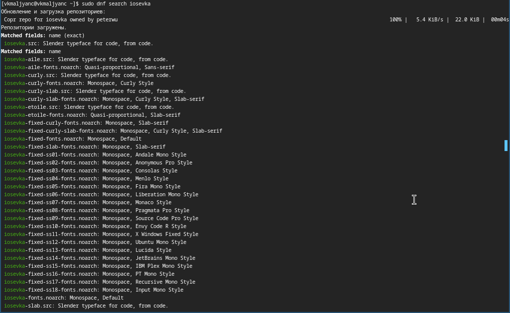{width=70%}

## Управление файлами конфигурации

- Устанавливаю шрифты (рис. 20).

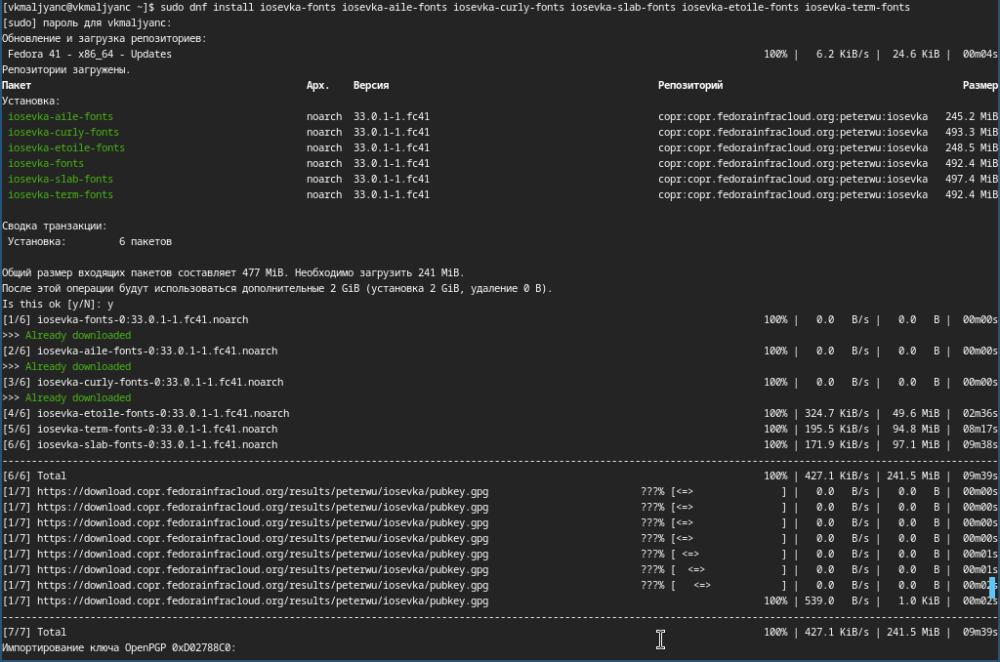{width=70%}

## Управление файлами конфигурации

- Устанавливаю бинарный файл (рис. 21).

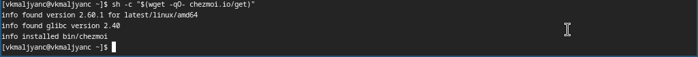{width=70%}

## Управление файлами конфигурации

- Создаю репозиторий для конфигурационных файлов на основе шаблона (рис. 22).

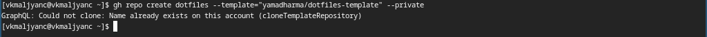{width=70%}

## Управление файлами конфигурации

- Инициализирую chezmoi с моим репозиторием dotfiles (рис. 23).

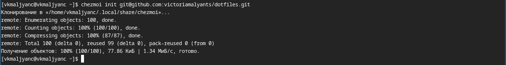{width=70%}

## Управление файлами конфигурации

- Проверяю изменения, которые внесет chezmoi в домашний каталог, запустив chezmoi diff (рис. 24).

{width=70%}

## Управление файлами конфигурации

- Запускаю chezmoi apply -v (рис. 25).

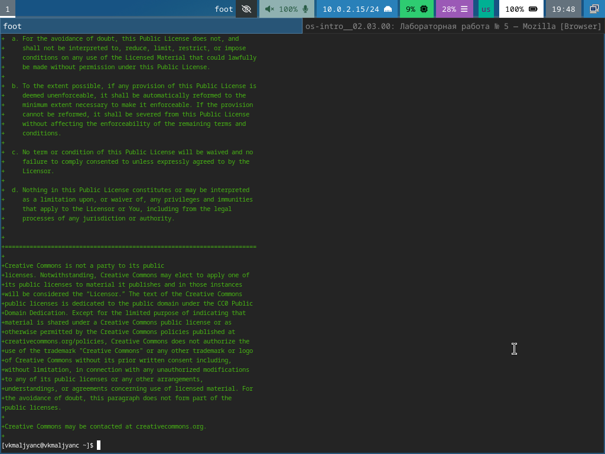{width=70%}

## Управление файлами конфигурации

- На второй машине инициализую chezmoi с моим репозиторием dotfiles (рис. 26).

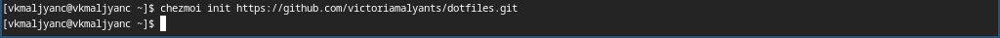{width=70%}

## Управление файлами конфигурации

- Проверяю изменения, которые внесет chezmoi в домашний каталог, запустив chezmoi diff (рис. 27).

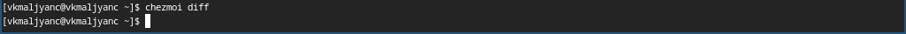{width=70%}

## Управление файлами конфигурации

- Запускаю chezmoi apply -v (рис. 28).

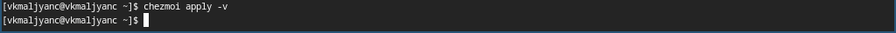{width=70%}

## Управление файлами конфигурации

- Получаю и применяю последние изменения из моего репозитория (рис. 29).

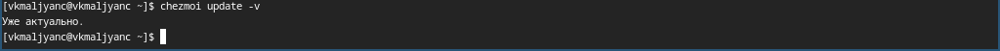{width=70%}

## Управление файлами конфигурации

- Устанавливаю мои dotfiles на новый компьютер (рис. 30).

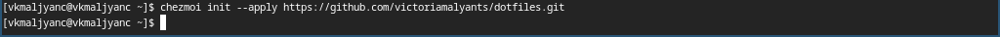{width=70%}

## Управление файлами конфигурации

- Извлекаю изменения из репозитория (рис. 31).

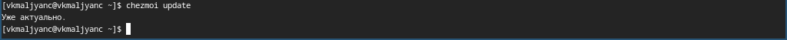{width=70%}

## Управление файлами конфигурации

- Извлекаю последние изменения из моего репозитория (рис. 32).

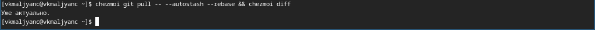{width=70%}

## Управление файлами конфигурации

- Применяю изменения (рис. 33).

{width=70%}

## Управление файлами конфигурации

- Открываю mc (рис. 34).

{width=70%}

## Управление файлами конфигурации

- Добавляю в файл конфигурации автоматическое фиксирование и отправление изменений в репозиторий (рис. 35).

{width=70%}

# Выводы

- Я научилась настраивать рабочую среду.

# Спасибо за внимание
