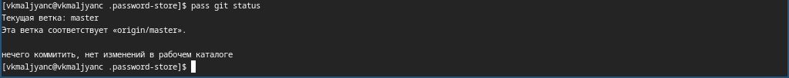

---
## Front matter
title: "Лабораторная работа № 5"
subtitle: "Настройка рабочей среды"
author: "Мальянц Виктория Кареновна"

## Generic otions
lang: ru-RU
toc-title: "Содержание"

## Bibliography
bibliography: bib/cite.bib
csl: pandoc/csl/gost-r-7-0-5-2008-numeric.csl

## Pdf output format
toc: true # Table of contents
toc-depth: 2
lof: true # List of figures
lot: true # List of tables
fontsize: 12pt
linestretch: 1.5
papersize: a4
documentclass: scrreprt
## I18n polyglossia
polyglossia-lang:
  name: russian
  options:
	- spelling=modern
	- babelshorthands=true
polyglossia-otherlangs:
  name: english
## I18n babel
babel-lang: russian
babel-otherlangs: english
## Fonts
mainfont: IBM Plex Serif
romanfont: IBM Plex Serif
sansfont: IBM Plex Sans
monofont: IBM Plex Mono
mathfont: STIX Two Math
mainfontoptions: Ligatures=Common,Ligatures=TeX,Scale=0.94
romanfontoptions: Ligatures=Common,Ligatures=TeX,Scale=0.94
sansfontoptions: Ligatures=Common,Ligatures=TeX,Scale=MatchLowercase,Scale=0.94
monofontoptions: Scale=MatchLowercase,Scale=0.94,FakeStretch=0.9
mathfontoptions:
## Biblatex
biblatex: true
biblio-style: "gost-numeric"
biblatexoptions:
  - parentracker=true
  - backend=biber
  - hyperref=auto
  - language=auto
  - autolang=other
  - citestyle=gost-numeric
## Pandoc-crossref LaTeX customization
figureTitle: "Рис."
tableTitle: "Таблица"
listingTitle: "Листинг"
lofTitle: "Список иллюстраций"
lotTitle: "Список таблиц"
lolTitle: "Листинги"
## Misc options
indent: true
header-includes:
  - \usepackage{indentfirst}
  - \usepackage{float} # keep figures where there are in the text
  - \floatplacement{figure}{H} # keep figures where there are in the text
---

# Цель работы

Научиться настраивать рабочую среду.

# Задание

1. Менеджер паролей pass
2. Управление файлами конфигурации

# Выполнение лабораторной работы
## Менеджер паролей pass

Устанавливаю pass (рис. [-@fig:001]).

{#fig:001 width=70%}

Устанавливаю gopass (рис. [-@fig:002]).

{#fig:002 width=70%}

Просматриваю список ключей (рис. [-@fig:003]).

{#fig:003 width=70%}

Инициализирую хранилище (рис. [-@fig:004]).

{#fig:004 width=70%}

Создаю структуру git (рис. [-@fig:005]).

{#fig:005 width=70%}

Создаю новый репозиторий (рис. [-@fig:006]).

{#fig:006 width=70%}

Задаю адрес репозитория на хостинге (рис. [-@fig:007]).

{#fig:007 width=70%}

Выполняю синхронизацию (рис. [-@fig:008]).

{#fig:008 width=70%}

Выполняю синхронизацию (рис. [-@fig:009]).

{#fig:009 width=70%}

Выполняю коммит и выкладываю изменения (рис. [-@fig:010]).

{#fig:010 width=70%}

Проверяю статус синхронизации (рис. [-@fig:011]).

{#fig:011 width=70%}

Устанавливаю интерфейс для взаимодействия с браузером (рис. [-@fig:012]).

{#fig:012 width=70%}

Устанавливаю интерфейс для взаимодействия с браузером (рис. [-@fig:013]).

{#fig:013 width=70%}

Добавляю новый пароль (рис. [-@fig:014]).

{#fig:014 width=70%}

Отображаю пароль для указанного имени файла (рис. [-@fig:015]).

{#fig:015 width=70%}

Заменяю существующий пароль (рис. [-@fig:016]).

{#fig:016 width=70%}

## Управление файлами конфигурации

Устанавливаю дополнительное программное обеспечение (рис. [-@fig:017]).

{#fig:017 width=70%}

Устанавливаю шрифты (рис. [-@fig:018]).

{#fig:018 width=70%}

Устанавливаю шрифты (рис. [-@fig:019]).

{#fig:019 width=70%}

Устанавливаю шрифты (рис. [-@fig:020]).

{#fig:020 width=70%}

Устанавливаю бинарный файл (рис. [-@fig:021]).

{#fig:021 width=70%}

Создаю репозиторий для конфигурационных файлов на основе шаблона (рис. [-@fig:022]).

{#fig:022 width=70%}

Инициализирую chezmoi с моим репозиторием dotfiles (рис. [-@fig:023]).

{#fig:023 width=70%}

Проверяю изменения, которые внесет chezmoi в домашний каталог, запустив chezmoi diff (рис. [-@fig:024]).

{#fig:024 width=70%}

Запускаю chezmoi apply -v (рис. [-@fig:025]).

{#fig:025 width=70%}

На второй машине инициализую chezmoi с моим репозиторием dotfiles (рис. [-@fig:026]).

{#fig:026 width=70%}

Проверяю изменения, которые внесет chezmoi в домашний каталог, запустив chezmoi diff (рис. [-@fig:027]).

{#fig:027 width=70%}

Запускаю chezmoi apply -v (рис. [-@fig:028]).

{#fig:028 width=70%}

Получаю и применяю последние изменения из моего репозитория (рис. [-@fig:029]).

{#fig:029 width=70%}

Устанавливаю мои dotfiles на новый компьютер (рис. [-@fig:030]).

{#fig:030 width=70%}

Извлекаю изменения из репозитория (рис. [-@fig:031]).

{#fig:031 width=70%}

Извлекаю последние изменения из моего репозитория (рис. [-@fig:032]).

{#fig:032 width=70%}

Применяю изменения (рис. [-@fig:033]).

{#fig:033 width=70%}

Открываю mc (рис. [-@fig:034]).

{#fig:034 width=70%}

Добавляю в файл конфигурации автоматическое фиксирование и отправление изменений в репозиторий (рис. [-@fig:035]) [@lab05].

{#fig:035 width=70%}

# Выводы

Я научилась настраивать рабочую среду.

# Список литературы{.unnumbered}

::: {#refs}
:::
