---
## Front matter
lang: ru-RU
title: Лабораторная работа № 6
subtitle: Основы интерфейса взаимодействия пользователя с системой посредством командной строки
author:
  - Мальянц В. К.
institute:
  - Российский университет дружбы народов, Москва, Россия
date: 16 марта 2025

## i18n babel
babel-lang: russian
babel-otherlangs: english

## Formatting pdf
toc: false
toc-title: Содержание
slide_level: 2
aspectratio: 169
section-titles: true
theme: metropolis
header-includes:
 - \metroset{progressbar=frametitle,sectionpage=progressbar,numbering=fraction}
---

# Цель работы

- Приобретение практических навыков взаимодействия пользователя с системой посредством командной строки.

# Задание

- Работа с командной строкой

# Выполнение лабораторной работы
##  Работа с командной строкой

- Определяю полное имя домашнего каталога (рис. 1).

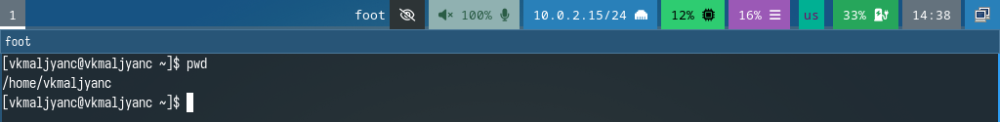{width=70%}

##  Работа с командной строкой

- Перехожу в каталог /tmp (рис. 2).

{width=70%}

##  Работа с командной строкой

- Вывожу на экран содержимое каталога /tmp (рис. 3).

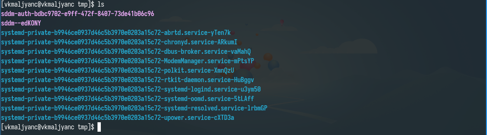{width=70%}

##  Работа с командной строкой

- Вывожу имена скрытых файлов (рис. 4).

{width=70%}

##  Работа с командной строкой

- Вывожу информацию о типах файлов (рис. 5).

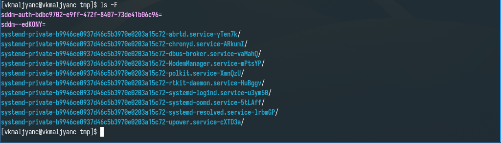{width=70%}

##  Работа с командной строкой

- Вывожу подробную информацию о файлах и каталогах (рис. 6).

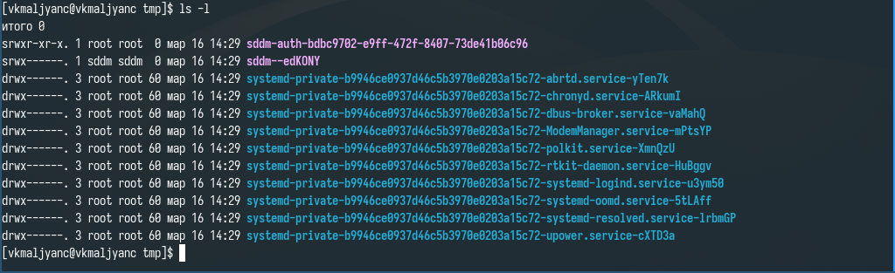{width=70%}

##  Работа с командной строкой

- Комбинирую опции (рис. 7).

{width=70%}

##  Работа с командной строкой

- Просматриваю содержимое каталога /var/spool, нахожу в нем подкаталог с именем cron (рис. 8).

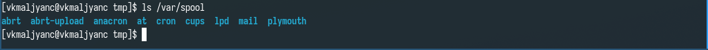{width=70%}

##  Работа с командной строкой

- Перехожу в домашний каталог, вывожу на экран его содержимое, владельцем файлов и подкаталогов является vkmaljyanc (рис. 9).

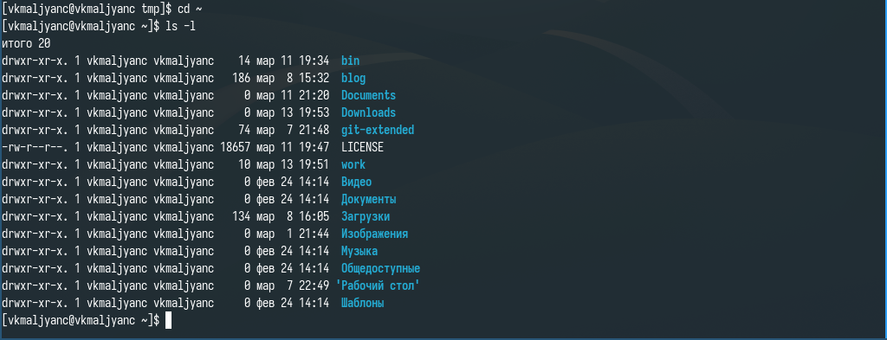{width=70%}

##  Работа с командной строкой

- В домашнем каталоге создаю новый каталог с именем newdir (рис. 10).

{width=70%}

##  Работа с командной строкой

- В каталоге ~/newdir создаю новый каталог с именем morefun (рис. 11).

{width=70%}

##  Работа с командной строкой

- В домашнем каталоге создаю одной командой три новых каталога с именами letters, memos, misk. Затем удаляю эти каталоги одной командой (рис. 12).

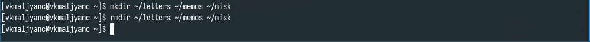{width=70%}

##  Работа с командной строкой

- Пробую удалить каталог ~/newdir командой rm. Каталог не был удален (рис. 13).

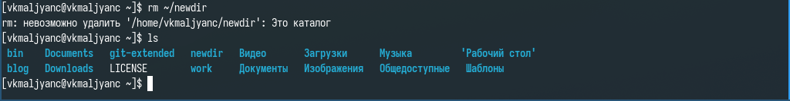{width=70%}

##  Работа с командной строкой

- Удаляю каталог ~/newdir/morefun из домашнего каталога. Каталог был удален (рис. 14).

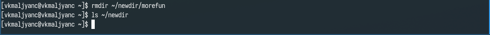{width=70%}

##  Работа с командной строкой

- Ввожу команду man ls (рис. 15).

{width=70%}

##  Работа с командной строкой

- Нужно использовать опцию -R для просмотра содержимого каталога и подкаталогов, входящих в него (рис. 16).

{width=70%}

##  Работа с командной строкой

- Ввожу команду man ls (рис. 17).

{width=70%}

##  Работа с командной строкой

- Нужно использовать опцию -l для просмотра содержимого каталога c развернутым описанием файлов (рис. 18).

{width=70%}

##  Работа с командной строкой

- Нужно использовать опцию -t для сортировки по времени последнего изменения (рис. 19).

{width=70%}

##  Работа с командной строкой

- Использую ls -lt для сортировки по времени последнего изменения выводимого списка содержимого каталога c развернутым описанием файлов 

##  Работа с командной строкой

- Ввожу команды man cd, man pwd, man mkdir, man rmdir, man rm (рис. 20).

{width=70%}

##  Работа с командной строкой

- Результат ввода команды man cd (рис. 21).

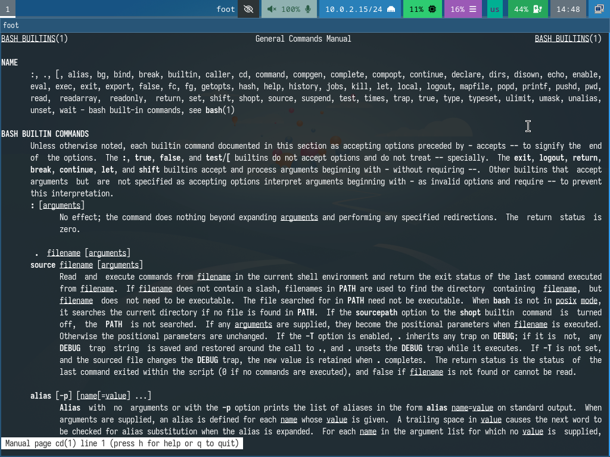{width=70%}

##  Работа с командной строкой

- Результат ввода команды man pwd (рис. 22).

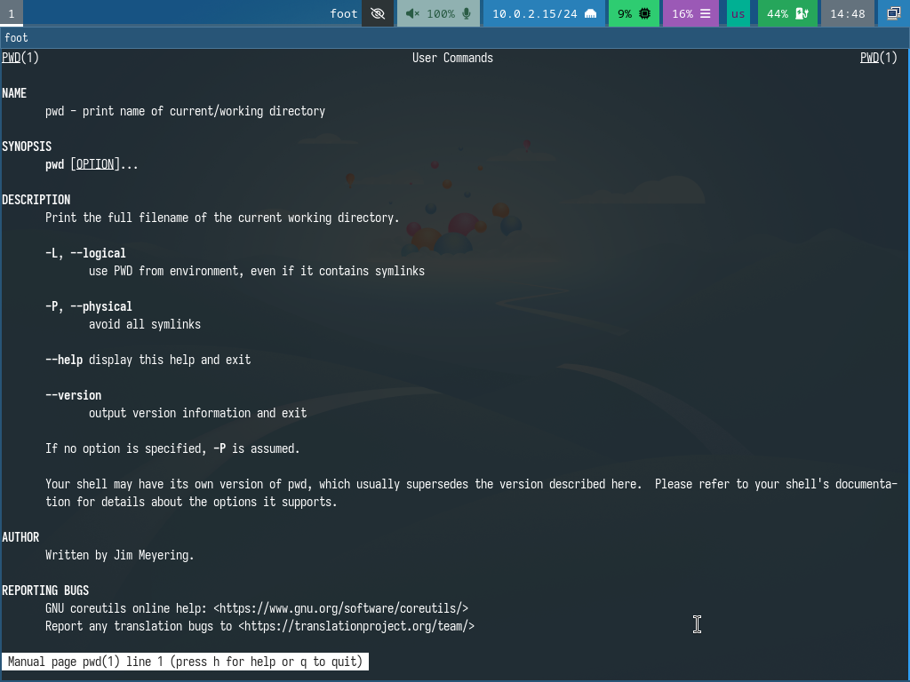{width=70%}

##  Работа с командной строкой

- Результат ввода команды man mkdir (рис. 23).

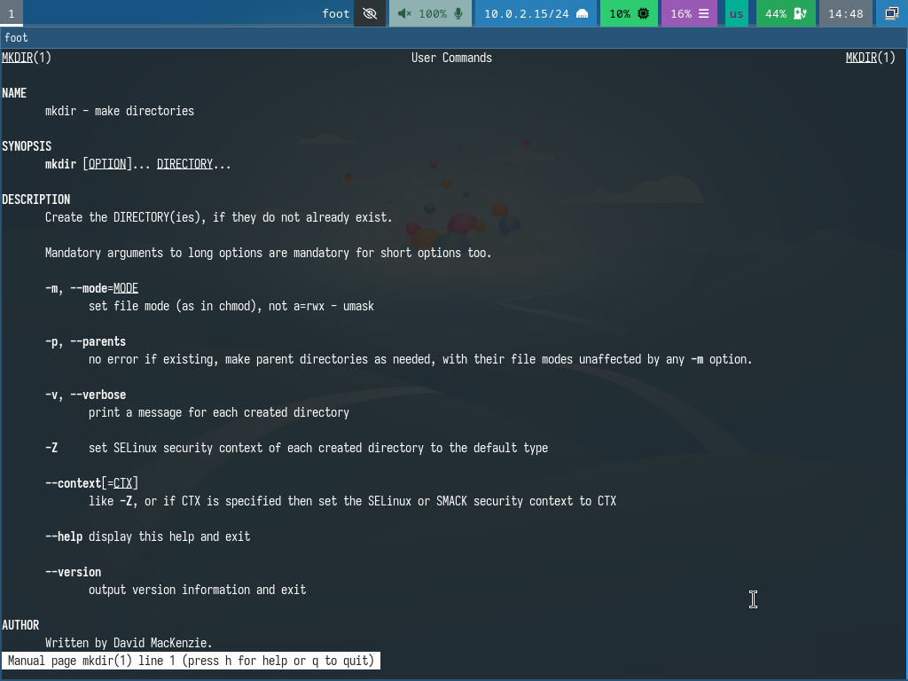{width=70%}

##  Работа с командной строкой

- Результат ввода команды man rmdir (рис. 24).

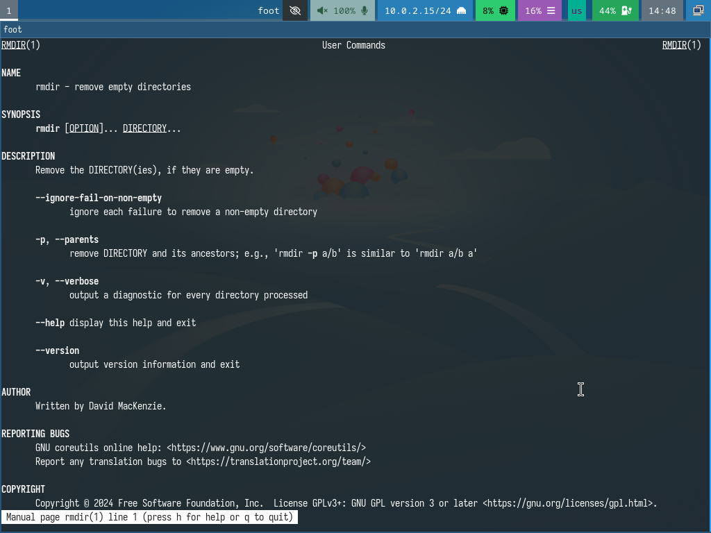{width=70%}

##  Работа с командной строкой

- Результат ввода команды man rm (рис. 25).

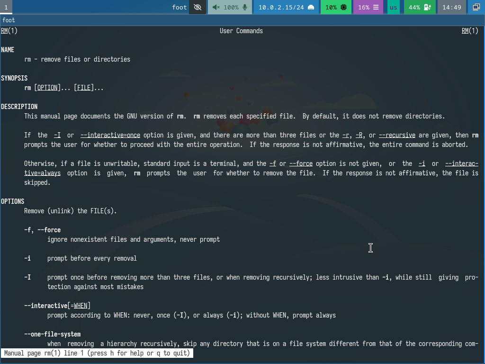{width=70%}

##  Работа с командной строкой

- Ввожу команду history (рис. 26).

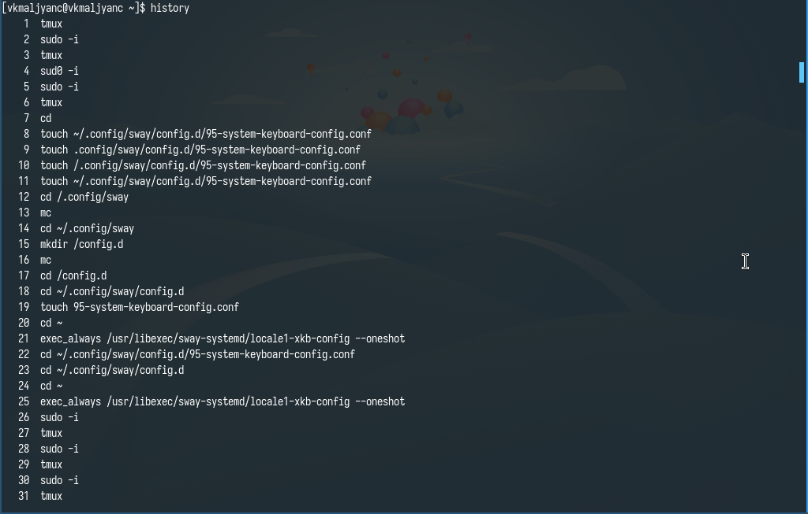{width=70%}

##  Работа с командной строкой

- Изменяю команду ls -F на ls -a (рис. 27).

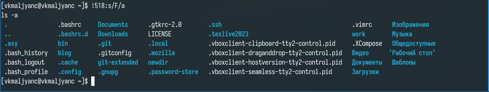{width=70%}

##  Работа с командной строкой

- Изменяю команду man ls на man cd (рис. 28).

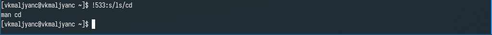{width=70%}

##  Работа с командной строкой

- Результат ввода команды man cd (рис. 29).

{width=70%}

# Выводы

- Я приобрела практические навыки взаимодействия пользователя с системой посредством командной строки.

# Спасибо за внимание
