---
## Front matter
title: "Лабораторная работа № 6"
subtitle: "Основы интерфейса взаимодействия пользователя с системой посредством командной строки"
author: "Мальянц Виктория Кареновна"

## Generic otions
lang: ru-RU
toc-title: "Содержание"

## Bibliography
bibliography: bib/cite.bib
csl: pandoc/csl/gost-r-7-0-5-2008-numeric.csl

## Pdf output format
toc: true # Table of contents
toc-depth: 2
lof: true # List of figures
lot: true # List of tables
fontsize: 12pt
linestretch: 1.5
papersize: a4
documentclass: scrreprt
## I18n polyglossia
polyglossia-lang:
  name: russian
  options:
	- spelling=modern
	- babelshorthands=true
polyglossia-otherlangs:
  name: english
## I18n babel
babel-lang: russian
babel-otherlangs: english
## Fonts
mainfont: IBM Plex Serif
romanfont: IBM Plex Serif
sansfont: IBM Plex Sans
monofont: IBM Plex Mono
mathfont: STIX Two Math
mainfontoptions: Ligatures=Common,Ligatures=TeX,Scale=0.94
romanfontoptions: Ligatures=Common,Ligatures=TeX,Scale=0.94
sansfontoptions: Ligatures=Common,Ligatures=TeX,Scale=MatchLowercase,Scale=0.94
monofontoptions: Scale=MatchLowercase,Scale=0.94,FakeStretch=0.9
mathfontoptions:
## Biblatex
biblatex: true
biblio-style: "gost-numeric"
biblatexoptions:
  - parentracker=true
  - backend=biber
  - hyperref=auto
  - language=auto
  - autolang=other
  - citestyle=gost-numeric
## Pandoc-crossref LaTeX customization
figureTitle: "Рис."
tableTitle: "Таблица"
listingTitle: "Листинг"
lofTitle: "Список иллюстраций"
lotTitle: "Список таблиц"
lolTitle: "Листинги"
## Misc options
indent: true
header-includes:
  - \usepackage{indentfirst}
  - \usepackage{float} # keep figures where there are in the text
  - \floatplacement{figure}{H} # keep figures where there are in the text
---

# Цель работы

Приобретение практических навыков взаимодействия пользователя с системой посредством командной строки.

# Задание

1. Работа с командной строкой
2. Контрольные вопросы

# Выполнение лабораторной работы
##  Работа с командной строкой

Определяю полное имя домашнего каталога (рис. [-@fig:001]).

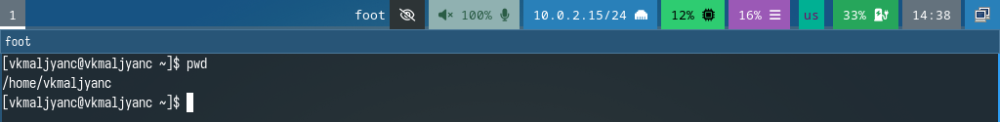{#fig:001 width=70%}

Перехожу в каталог /tmp (рис. [-@fig:002]).

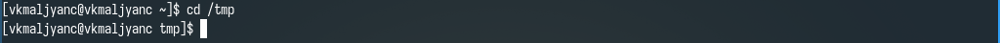{#fig:002 width=70%}

Вывожу на экран содержимое каталога /tmp (рис. [-@fig:003]).

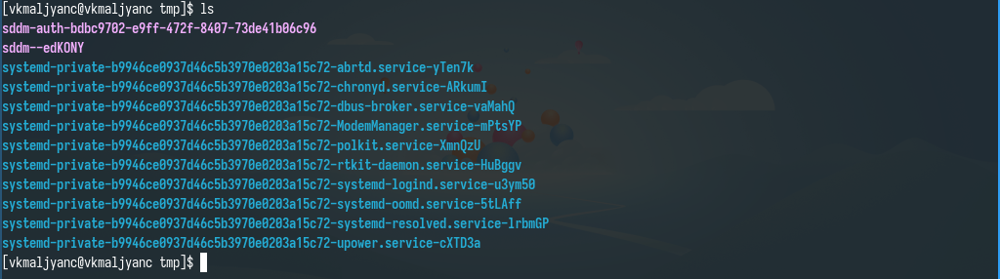{#fig:003 width=70%}

Вывожу имена скрытых файлов (рис. [-@fig:004]).

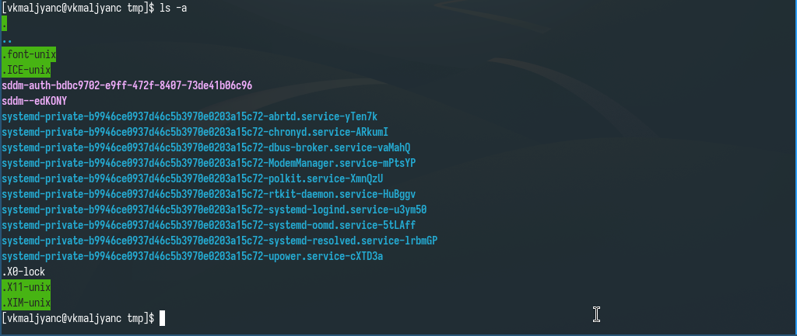{#fig:004 width=70%}

Вывожу информацию о типах файлов (рис. [-@fig:005]).

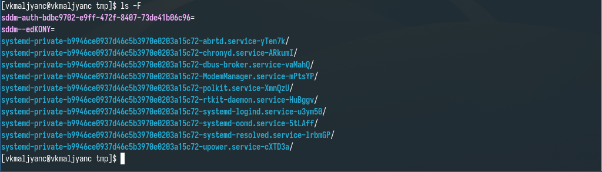{#fig:005 width=70%}

Вывожу подробную информацию о файлах и каталогах (рис. [-@fig:006]).

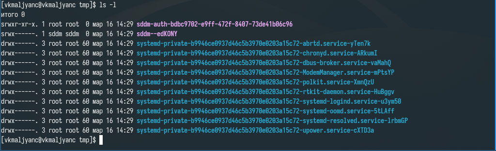{#fig:006 width=70%}

Комбинирую опций (рис. [-@fig:007]).

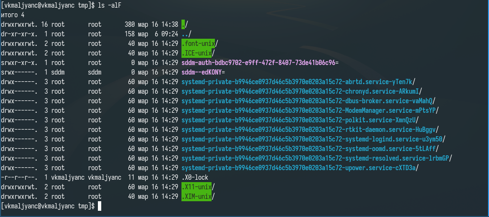{#fig:007 width=70%}

Просматриваю содержимое каталога /var/spool, нахожу в нем подкаталог с именем cron (рис. [-@fig:008]).

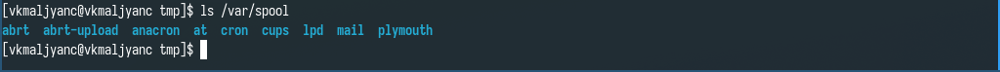{#fig:008 width=70%}

Перехожу в домашний каталог, вывожу на экран его содержимое, владельцем файлов и подкаталогов является vkmaljyanc (рис. [-@fig:009]).

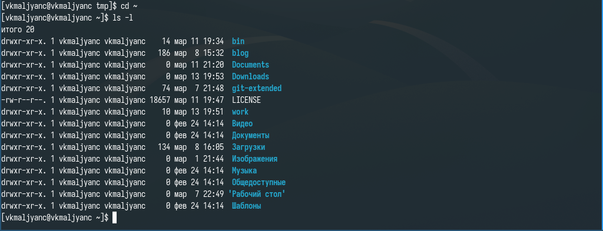{#fig:009 width=70%}

В домашнем каталоге создаю новый каталог с именем newdir (рис. [-@fig:010]).

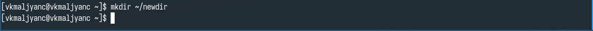{#fig:010 width=70%}

В каталоге ~/newdir создаю новый каталог с именем morefun (рис. [-@fig:011]).

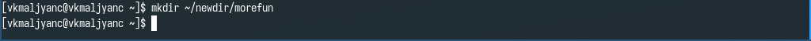{#fig:011 width=70%}

В домашнем каталоге создаю одной командой три новых каталога с именами letters, memos, misk. Затем удаляю эти каталоги одной командой (рис. [-@fig:012]).

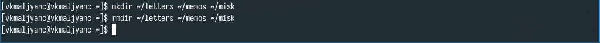{#fig:012 width=70%}

Пробую удалить каталог ~/newdir командой rm. Каталог не был удален (рис. [-@fig:013]).

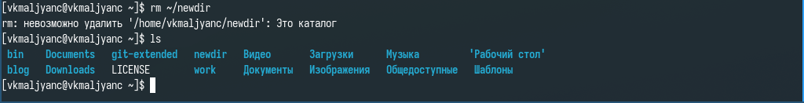{#fig:013 width=70%}

Удаляю каталог ~/newdir/morefun из домашнего каталога. Каталог был удален (рис. [-@fig:014]).

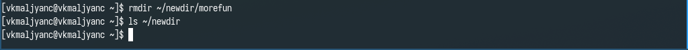{#fig:014 width=70%}

Ввожу команду man ls (рис. [-@fig:015]).

{#fig:015 width=70%}

Нужно использовать опцию -R для просмотра содержимого каталога и подкаталогов, входящих в него (рис. [-@fig:016]).

{#fig:016 width=70%}

Ввожу команду man ls (рис. [-@fig:017]).

{#fig:017 width=70%}

Нужно использовать опцию -l для просмотра содержимого каталога c развернутым описанием файлов (рис. [-@fig:018]).

{#fig:018 width=70%}

Нужно использовать опцию -t для сортировки по времени последнего изменения (рис. [-@fig:019]).

{#fig:019 width=70%}

Использую ls -lt для сортировки по времени последнего изменения выводимого списка содержимого каталога c развернутым описанием файлов 

Ввожу команды man cd, man pwd, man mkdir, man rmdir, man rm (рис. [-@fig:020]).

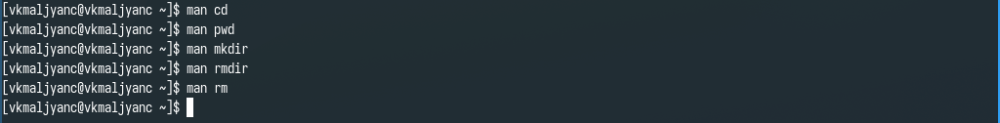{#fig:020 width=70%}

Результат ввода команды man cd (рис. [-@fig:021]).

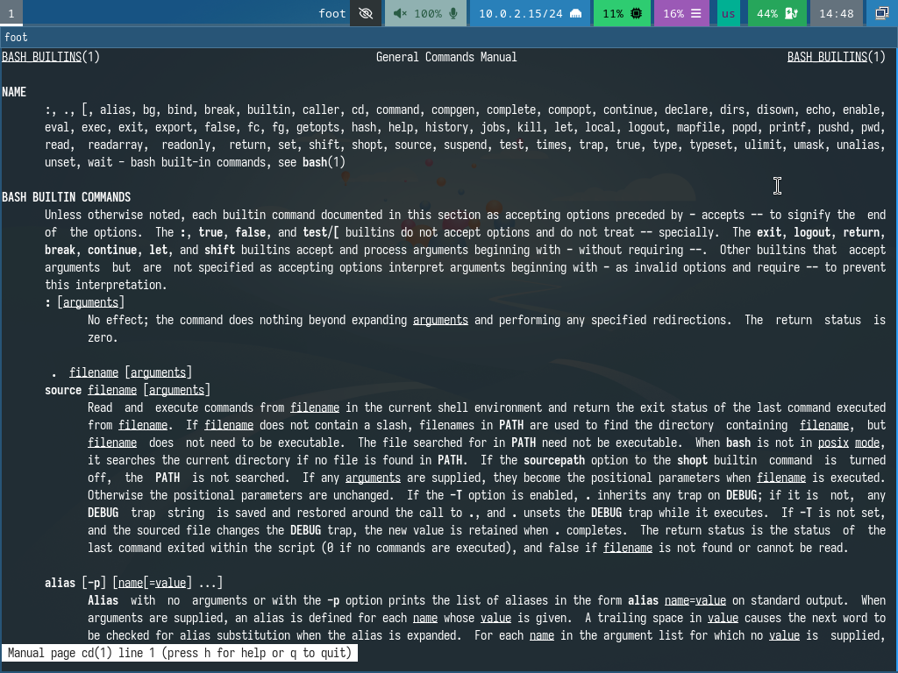{#fig:021 width=70%}

Результат ввода команды man pwd (рис. [-@fig:022]).

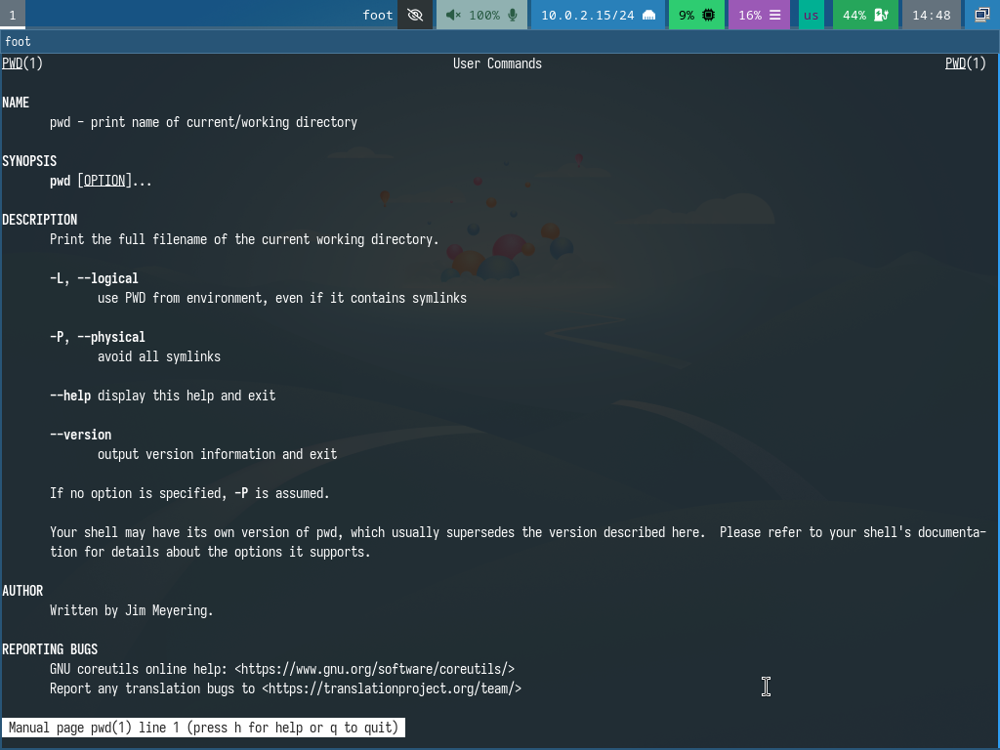{#fig:022 width=70%}

Результат ввода команды man mkdir (рис. [-@fig:023]).

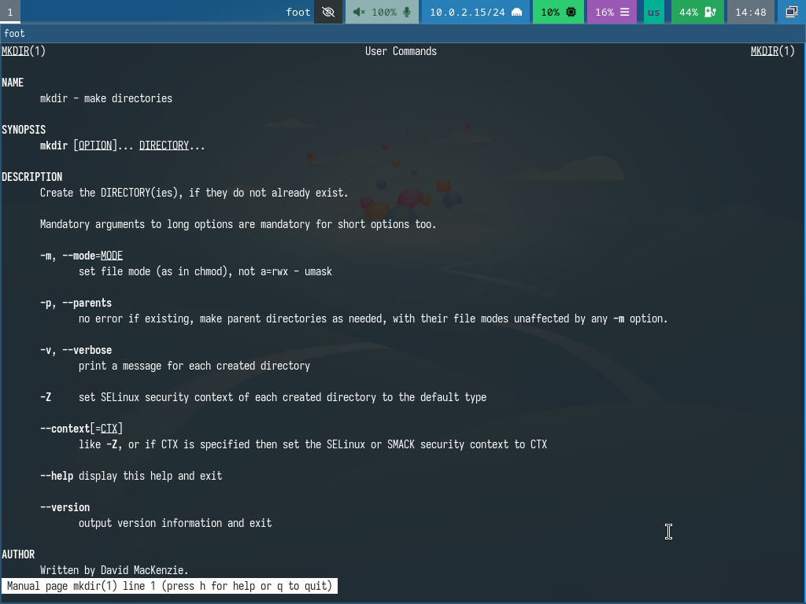{#fig:023 width=70%}

Результат ввода команды man rmdir (рис. [-@fig:024]).

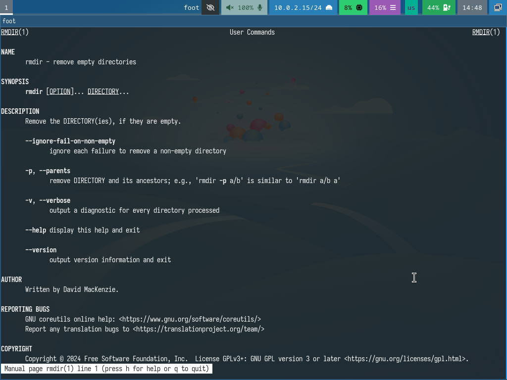{#fig:024 width=70%}

Результат ввода команды man rm (рис. [-@fig:025]).

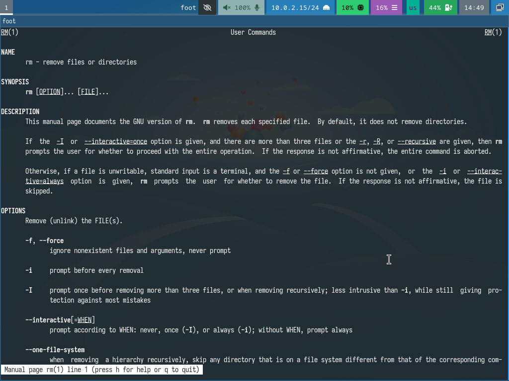{#fig:025 width=70%}

Ввожу команду history (рис. [-@fig:026]).

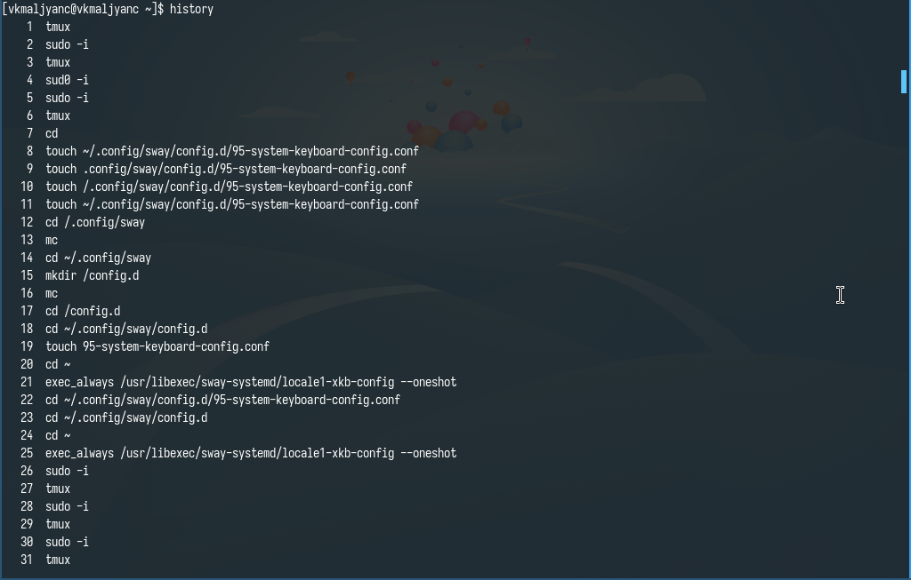{#fig:026 width=70%}

Изменяю команду ls -F на ls -a (рис. [-@fig:027]).

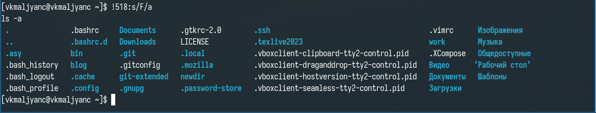{#fig:027 width=70%}

Изменяю команду man ls на man cd (рис. [-@fig:028]).

{#fig:028 width=70%}

Результат ввода команды man cd (рис. [-@fig:029]) [@lab06].

{#fig:029 width=70%}

# Выводы

Я приобрела практические навыки взаимодействия пользователя с системой посредством командной строки.

# Контрольные вопросы

1. Командная строка - записанный по специальным правилам текст, представляющий собой указание на выполнение какой-либо функции (или действий) в операционной системе.
2. С помощью команды pwd можно определить абсолютный путь текущего каталога.
3. С помощью команды ls -l можно определить только тип файлов и их имена в текущем каталоге.
4. С помощью команды ls -a можно отобразить информацию и о скрытых файлах.
5. С помощью команды rm можно удалить файл, с помощью команд rmdir или rm -r можно удалить каталог. Примеры: rm morefun.txt, rmdir newdir, rm -r newdir.
6. С помощью команды history можно вывести информацию о последних выполненных пользователем команд.
7. !номер_команды:s/что_меняем/на_что_меняем. Примеры: !3:s/a/F, !533:s/ls/cd.
8. cd ~; ls.
9. Если в заданном контексте встречаются специальный символы (типа ".", "/", "*" и т.д.), надо перед ними поставить символ экранирования \ (обратный слэш).
10. С помощью команды ls -l можно определить только тип файлов и их имена в текущем каталоге.
11. Относительный путь к файлу - путь от текущего каталога. Пример относительного пути: cd /work. Пример абсолютного пути: cd ~/work.
12. C помощью команды man можно получить информацию о команде.
13. С помощью клавиши Tab можно автоматически дополнить вводимые команды.

# Список литературы{.unnumbered}

::: {#refs}
:::
