---
## Front matter
lang: ru-RU
title: Лабораторная работа № 7
subtitle: Анализ файловой системы Linux. Команды для работы с файлами и каталогами
author:
  - Мальянц В. К.
institute:
  - Российский университет дружбы народов, Москва, Россия
date: 28 марта 2025

## i18n babel
babel-lang: russian
babel-otherlangs: english

## Formatting pdf
toc: false
toc-title: Содержание
slide_level: 2
aspectratio: 169
section-titles: true
theme: metropolis
header-includes:
 - \metroset{progressbar=frametitle,sectionpage=progressbar,numbering=fraction}
---

# Цель работы

- Ознакомление с файловой системой Linux, ее структурой, именами и содержанием каталогов. Приобретение практических навыков по применению команд для работы с файлами и каталогами, по управлению процессами (и работами), по проверке использования диска и обслуживанию файловой системы.

# Задание

- Выполнение примеров, приведенных в первой части описания лабораторной работы
- Создание, перемещение и переименовывание каталогов и файлов
- Работа с правами доступа
- Выполнение упражнений
- Работа с командами mount, fsck, mkfs, kill

# Выполнение лабораторной работы
## Выполнение примеров, приведенных в первой части описания лабораторной работы

- Выполняю примеры из первой части описания лабораторной работы (рис. 1) (рис. 2).

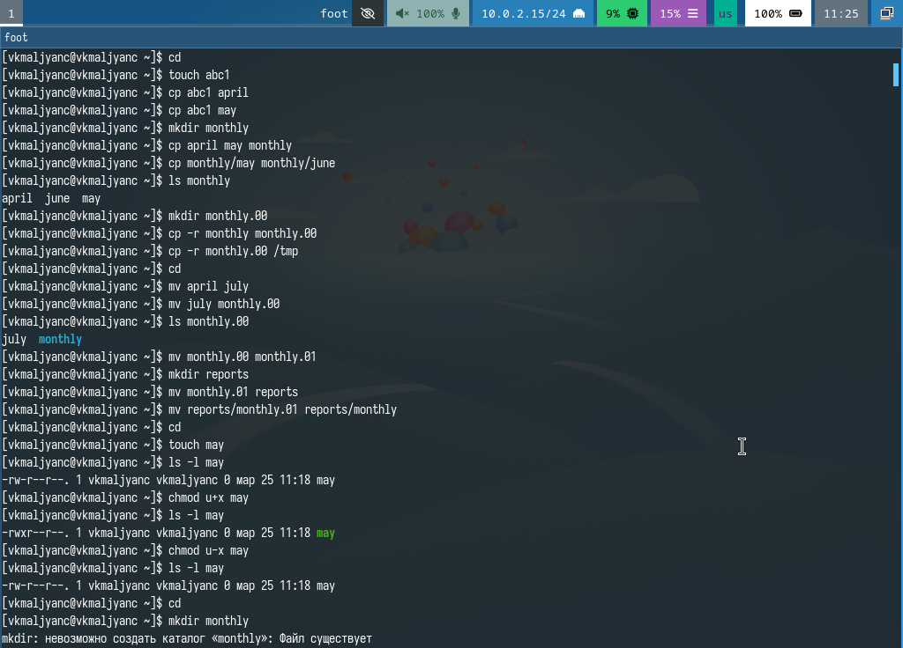{width=70%}

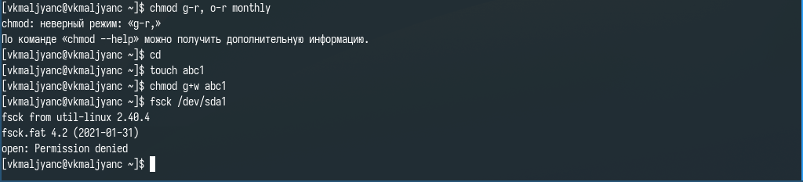{width=70%}

## Создание, перемещение и переименовывание каталогов и файлов

- Копирую файл /usr/include/sys/io.h в домашний каталог и называю его equipment. В домашнем каталоге создаю директорию ~/ski.plases. Перемещаю файл equipment в каталог ~/ski.plases. Переименовываю файл ~/ski.plases/equipment в ~/ski.plases/equiplist. Создаю в домашнем каталоге файл abc1 и копирую его в каталог ~/ski.plases, заываю его equiplist2. Создаю каталог с именем equipment в каталоге ~/ski.plases. Перемещаю файлы ~/ski.plases/equiplist и equiplist2 в каталог ~/ski.plases/equipment. Создаю и перемещаю каталог ~/newdir в каталог ~/ski.plases и называю его plans (рис. 3).

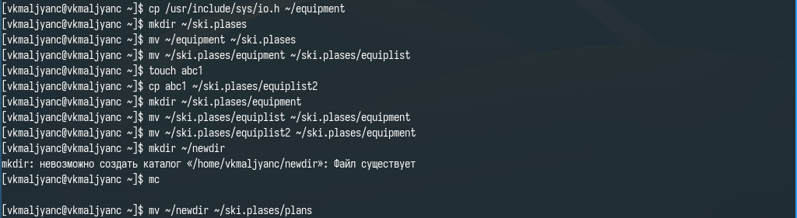{width=70%}

## Работа с правами доступа

- Создаю каталоги australia и play и файлы my_os и feathers. Присваиваю этим каталогам и файлам выделенные права доступа (рис. 4) (рис. 5) (рис. 6).

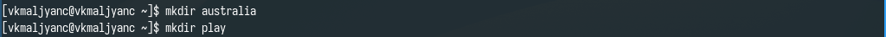{width=70%}

{width=70%}

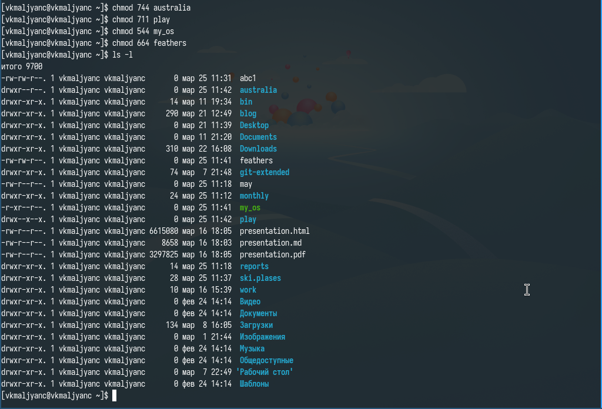{width=70%}

## Выполнение упражнений

- Просматриваю содержимое файла /etc/password. Копирую файл ~/feathers в файл ~/file.old. Перемещаю файл ~/file.old в каталог ~/play. Копирую каталог ~/play в каталог ~/fun. Перемещаю каталог ~/fun в каталог ~/play и называю его games. Лишаю владельца файла ~/feathers права на чтение. Пытаюсь просмтореть файл ~/feathers командой cat, отказано в доступе. Даю владельцу файла ~/feathers право на чтение. Лишаю владельца каталога ~/play права на выполнение. Перехожу в каталог ~/play, отказано в доступе. Даю владельцу каталога ~/play право на выполнение (рис. 7) (рис. 8) (рис. 9) (рис. [10).

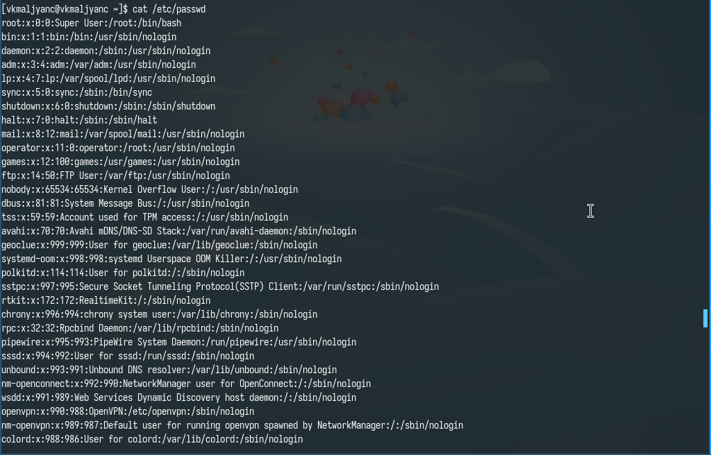{width=70%}

{width=70%}

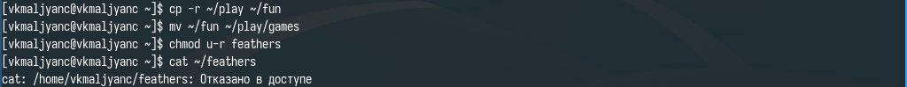{width=70%}

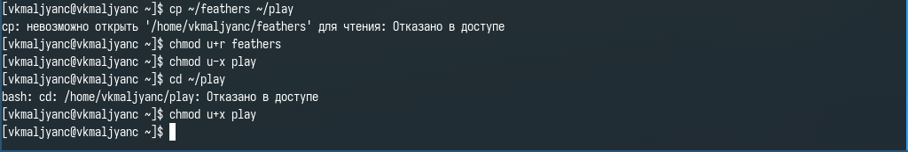{width=70%}

## Работа с командами mount, fsck, mkfs, kill

- Просматриваю man по команде mount (рис. 11).

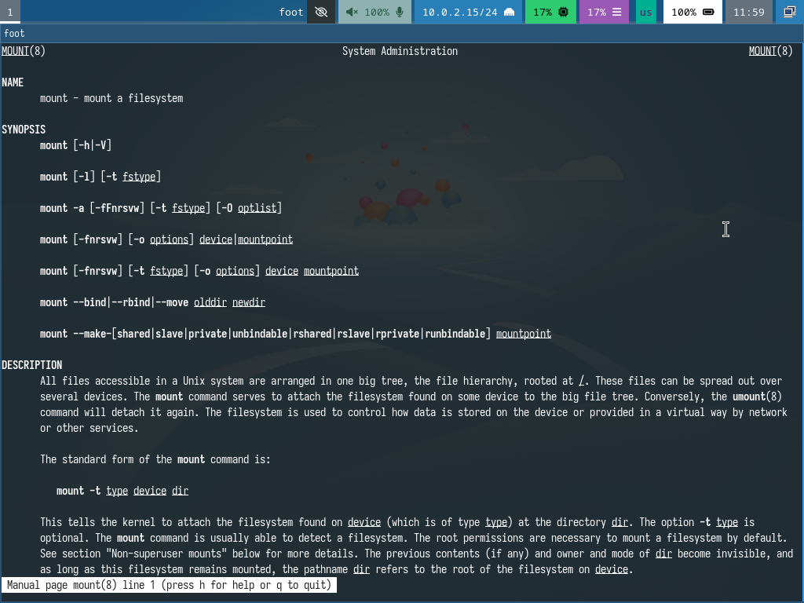{width=70%}

- Просматриваю man по команде fsck (рис. 12).

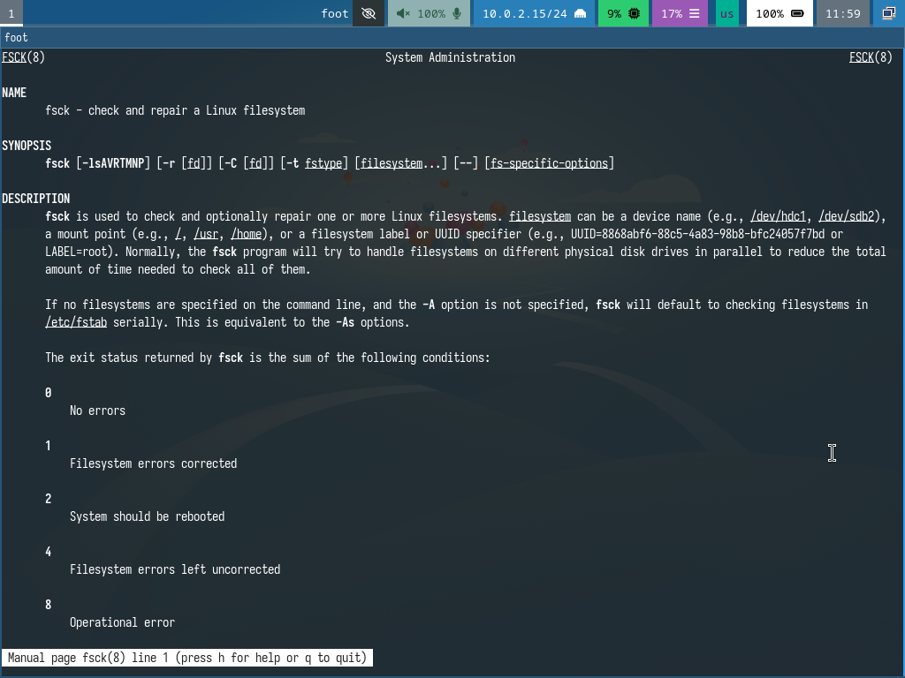{width=70%}

- Просматриваю man по команде mkfs (рис. 13).

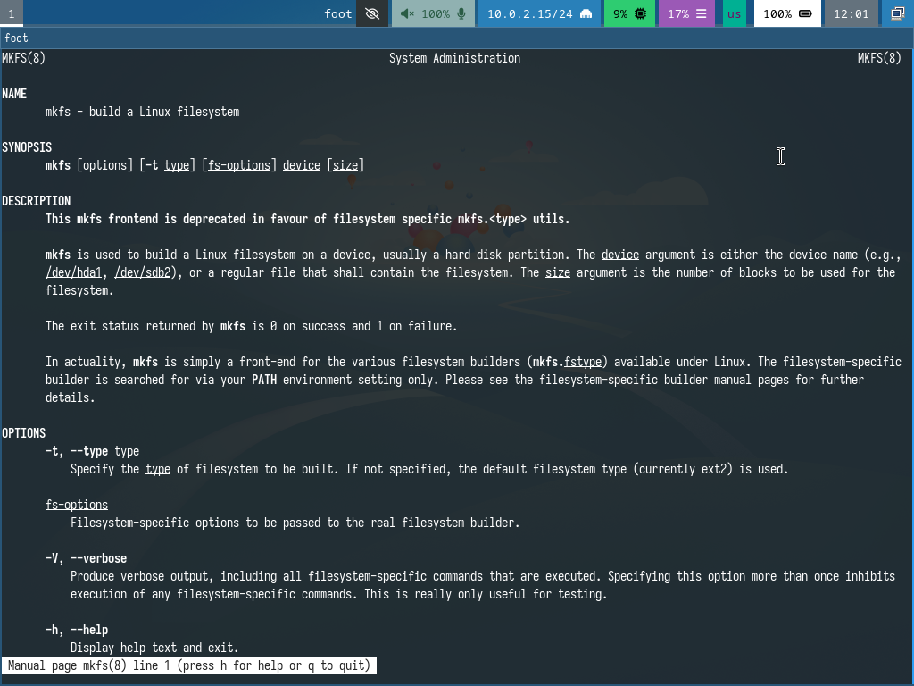{width=70%}

- Просматриваю man по команде kill (рис. 14).

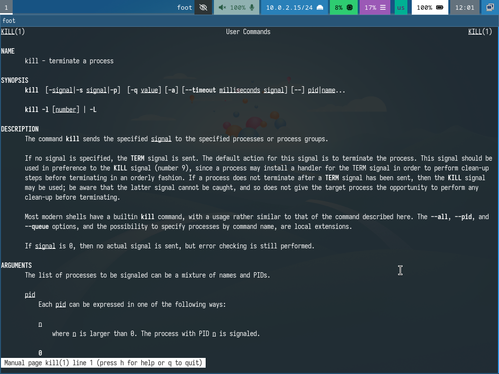{width=70%}

# Выводы

- Я ознакомилась с файловой системой Linux, ее структурой, именами и содержанием каталогов. Приобрела практические навыки по применению команд для работы с файлами и каталогами, по управлению процессами (и работами), по проверке использования диска и обслуживанию файловой системы.

# Спасибо за внимание
