---
## Front matter
title: "Лабораторная работа № 7"
subtitle: "Анализ файловой системы Linux. Команды для работы с файлами и каталогами"
author: "Мальянц Виктория Кареновна"

## Generic otions
lang: ru-RU
toc-title: "Содержание"

## Bibliography
bibliography: bib/cite.bib
csl: pandoc/csl/gost-r-7-0-5-2008-numeric.csl

## Pdf output format
toc: true # Table of contents
toc-depth: 2
lof: true # List of figures
lot: true # List of tables
fontsize: 12pt
linestretch: 1.5
papersize: a4
documentclass: scrreprt
## I18n polyglossia
polyglossia-lang:
  name: russian
  options:
	- spelling=modern
	- babelshorthands=true
polyglossia-otherlangs:
  name: english
## I18n babel
babel-lang: russian
babel-otherlangs: english
## Fonts
mainfont: IBM Plex Serif
romanfont: IBM Plex Serif
sansfont: IBM Plex Sans
monofont: IBM Plex Mono
mathfont: STIX Two Math
mainfontoptions: Ligatures=Common,Ligatures=TeX,Scale=0.94
romanfontoptions: Ligatures=Common,Ligatures=TeX,Scale=0.94
sansfontoptions: Ligatures=Common,Ligatures=TeX,Scale=MatchLowercase,Scale=0.94
monofontoptions: Scale=MatchLowercase,Scale=0.94,FakeStretch=0.9
mathfontoptions:
## Biblatex
biblatex: true
biblio-style: "gost-numeric"
biblatexoptions:
  - parentracker=true
  - backend=biber
  - hyperref=auto
  - language=auto
  - autolang=other
  - citestyle=gost-numeric
## Pandoc-crossref LaTeX customization
figureTitle: "Рис."
tableTitle: "Таблица"
listingTitle: "Листинг"
lofTitle: "Список иллюстраций"
lotTitle: "Список таблиц"
lolTitle: "Листинги"
## Misc options
indent: true
header-includes:
  - \usepackage{indentfirst}
  - \usepackage{float} # keep figures where there are in the text
  - \floatplacement{figure}{H} # keep figures where there are in the text
---

# Цель работы

Ознакомление с файловой системой Linux, ее структурой, именами и содержанием каталогов. Приобретение практических навыков по применению команд для работы с файлами и каталогами, по управлению процессами (и работами), по проверке использования диска и обслуживанию файловой системы.

# Задание

1. Выполнение примеров, приведенных в первой части описания лабораторной работы
2. Создание, перемещение и переименовывание каталогов и файлов
3. Работа с правами доступа
4. Выполнение упражнений
5. Работа с командами mount, fsck, mkfs, kill
6. Контрольные вопросы

# Выполнение лабораторной работы
## Выполнение примеров, приведенных в первой части описания лабораторной работы

Выполняю примеры из первой части описания лабораторной работы (рис. [-@fig:001]) (рис. [-@fig:002]).

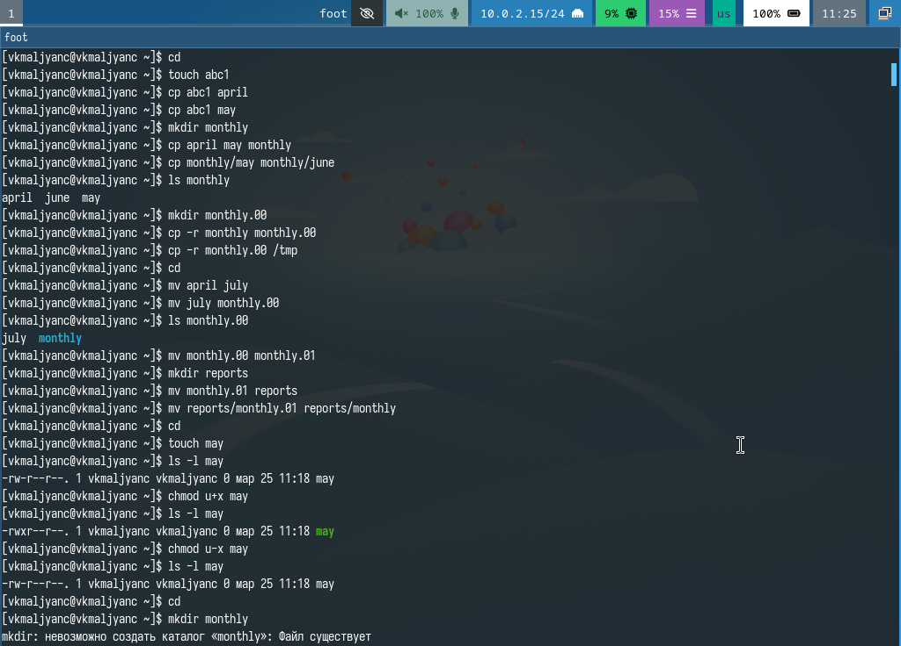{#fig:001 width=70%}

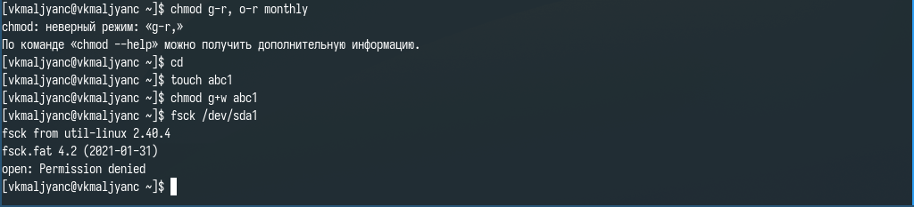{#fig:002 width=70%}

## Создание, перемещение и переименовывание каталогов и файлов

Копирую файл /usr/include/sys/io.h в домашний каталог и называю его equipment. В домашнем каталоге создаю директорию ~/ski.plases. Перемещаю файл equipment в каталог ~/ski.plases. Переименовываю файл ~/ski.plases/equipment в ~/ski.plases/equiplist. Создаю в домашнем каталоге файл abc1 и копирую его в каталог ~/ski.plases, заываю его equiplist2. Создаю каталог с именем equipment в каталоге ~/ski.plases. Перемещаю файлы ~/ski.plases/equiplist и equiplist2 в каталог ~/ski.plases/equipment. Создаю и перемещаю каталог ~/newdir в каталог ~/ski.plases и называю его plans (рис. [-@fig:003]).

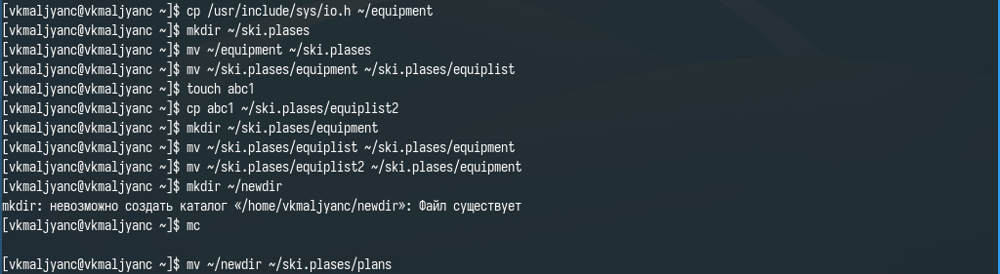{#fig:003 width=70%}

## Работа с правами доступа

Создаю каталоги australia и play и файлы my_os и feathers. Присваиваю этим каталогам и файлам выделенные права доступа (рис. [-@fig:004]) (рис. [-@fig:005]) (рис. [-@fig:006]).

{#fig:004 width=70%}

{#fig:005 width=70%}

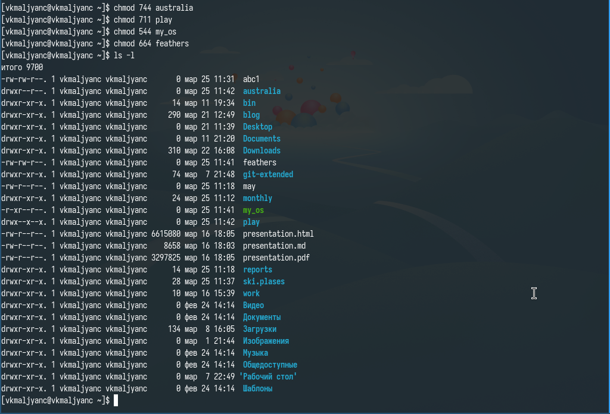{#fig:006 width=70%}

## Выполнение упражнений

Просматриваю содержимое файла /etc/password. Копирую файл ~/feathers в файл ~/file.old. Перемещаю файл ~/file.old в каталог ~/play. Копирую каталог ~/play в каталог ~/fun. Перемещаю каталог ~/fun в каталог ~/play и называю его games. Лишаю владельца файла ~/feathers права на чтение. Пытаюсь просмтореть файл ~/feathers командой cat, отказано в доступе. Даю владельцу файла ~/feathers право на чтение. Лишаю владельца каталога ~/play права на выполнение. Перехожу в каталог ~/play, отказано в доступе. Даю владельцу каталога ~/play право на выполнение (рис. [-@fig:007]) (рис. [-@fig:008]) (рис. [-@fig:009]) (рис. [-@fig:010]).

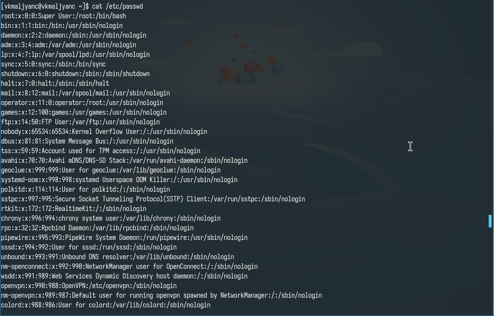{#fig:007 width=70%}

{#fig:008 width=70%}

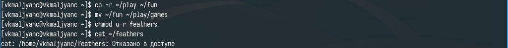{#fig:009 width=70%}

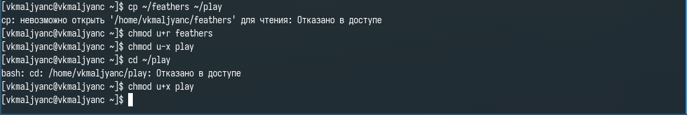{#fig:010 width=70%}

## Работа с командами mount, fsck, mkfs, kill

Просматриваю man по команде mount (рис. [-@fig:011]).

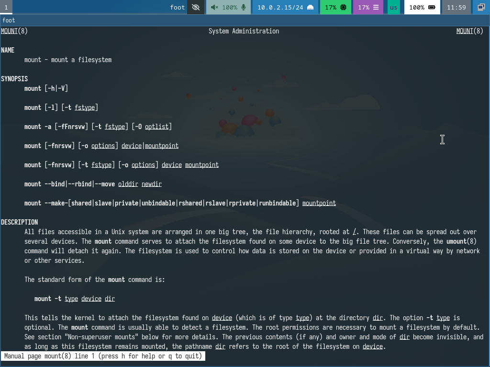{#fig:011 width=70%}

Просматриваю man по команде fsck (рис. [-@fig:012]).

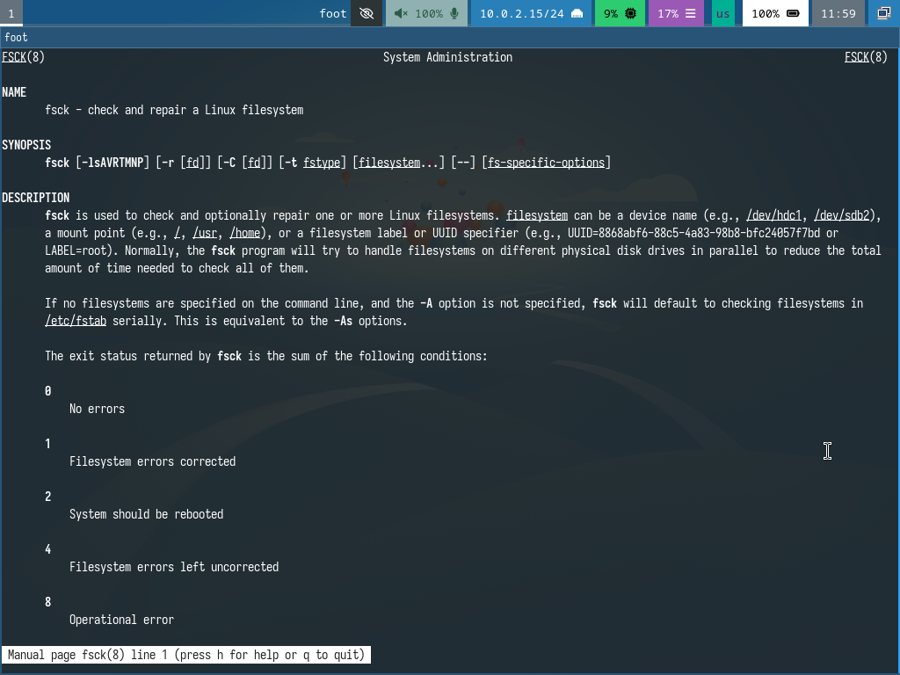{#fig:012 width=70%}

Просматриваю man по команде mkfs (рис. [-@fig:013]).

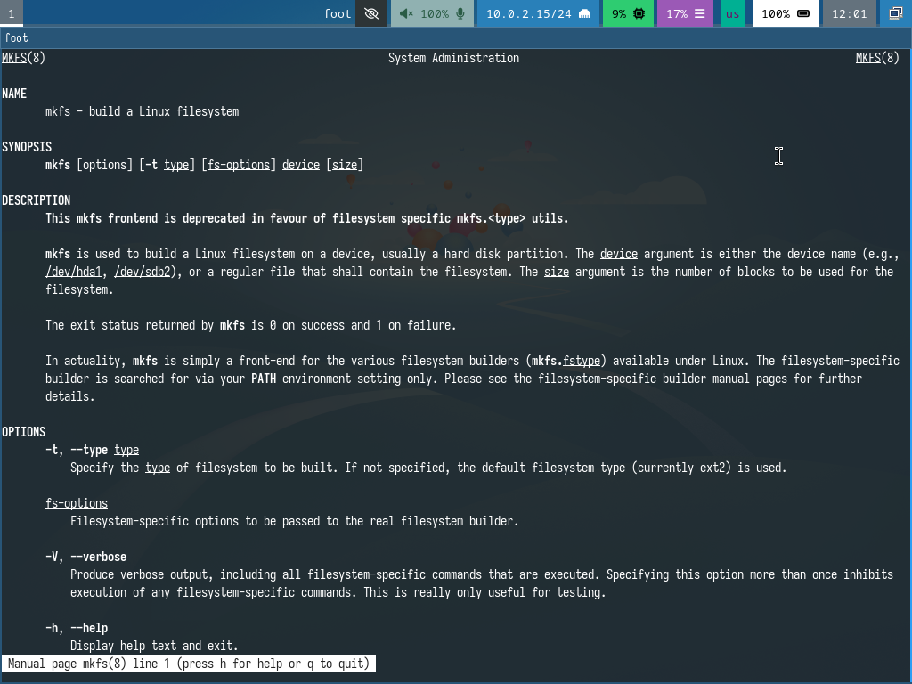{#fig:013 width=70%}

Просматриваю man по команде kill (рис. [-@fig:014] [@lab07]).

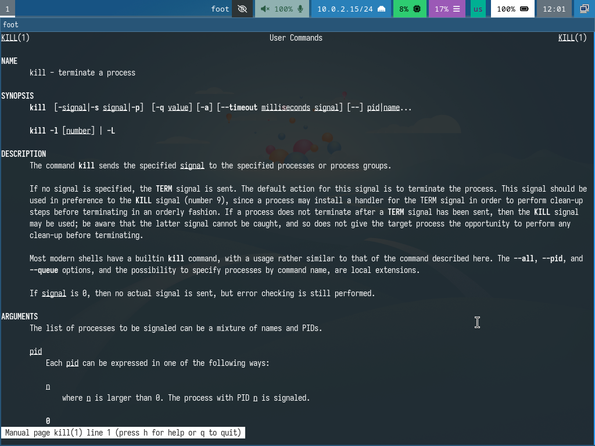{#fig:014 width=70%}

# Выводы

Я ознакомилась с файловой системой Linux, ее структурой, именами и содержанием каталогов. Приобрела практические навыки по применению команд для работы с файлами и каталогами, по управлению процессами (и работами), по проверке использования диска и обслуживанию файловой системы.

# Контрольные вопросы

1. ext4 - файловая система, используемая по умолчанию в большинстве дистрибутивов Linux, включая Fedora. Высокая производительность, надежность, поддержка больших файлов и разделов.
2. /root - корневой каталог
/bin - содержит основные исполняемые файлы
/boot - содержит файлы, необходиммые для загрузки операционной системы
/dev - содержит файлы устройств, представляющие аппаратные устройства
/etc - содержит конфигурационные файлы системы и приложений
/home - содержит домашние каталоги пользователей
/lib - содержит общие библиотеки, необходимые для работы исполняенмых файлов
/media - исполизуется для автоматического монтирования съемных носителей
/mnt - используется как временная точка монторивания для файловыъ систем
/opt - предназначен для установки дополнительных программных пакетов
/proc - специальная виртуальная файловая система, которая содержит информацию о процессах, запущенных в системе
/run - временная файловая система, используемая для хранения данных, необходимых для работы системы после загрузки
/sbin - содержит системные исполняемые файлы, предназначенные для администрирования системы
/srv - соержит данные, предоставляемые системой как сервисы
/sys - специальная виртуальная файловая система, которая предоставляет информацию и ядре и устойствах
/tmp - каталог для хранения временных файлов
/usr - содержит основные ресурсы системы, такие как исполняемые файлы, библиотеки, документацию и исходный код
/var - содержит файлы, содержимое которых часто меняется, такие как логи, базы данных, временные файлы, очереди печати
3. С помощью команды mount
4. Основные причины наружения целостности файловой системы: программные ошибки, аппаратные сбои, неправильное выключение системы, сбои питания, вирусы и вредоносные ПО. Методы устанения повреждений файловой системы: применение команды fsck, восстановление из резервной копии, профессиональное восстановление данных
5. С помощью команды mkfs
6. cat - выводит содержимое файла в стандартный поток вывода, less - позволяет проссматривать большие файлы постранично, more - подобен less, но имеет меньше возможностей навигации, head - выводит первые n строк файла (по умолчанию 10), tail - выводит последние n строк файла (по умолчанию 10)
7. cp - копирование файлов, каталогов, сохранение атрибутов файлов, копирование с подтверждением, создание символических ссылок, копирование с сохранением структуры каталогов
8. mv - перемещение и переименование файлов и каталогов, перемещение с подтверждением, перемещение, если нет прав перезаписи
9. Права доступа - определяют, какие операции могут выполнять пользователи и группы над файлами и каталогами. Существуют три топа прав доступа: чтение, запись, выполнение. Изменить права доступа можно с помощью разных форм записи: двоичной, восьмеричной и символьной.

# Список литературы{.unnumbered}

::: {#refs}
:::
