---
## Front matter
lang: ru-RU
title: Лабораторная работа № 8
subtitle: Поиск файлов. Перенаправление ввода-вывода. Просмотр запущенных процессов
author:
  - Мальянц В. К.
institute:
  - Российский университет дружбы народов, Москва, Россия
date: 30 марта 2025

## i18n babel
babel-lang: russian
babel-otherlangs: english

## Formatting pdf
toc: false
toc-title: Содержание
slide_level: 2
aspectratio: 169
section-titles: true
theme: metropolis
header-includes:
 - \metroset{progressbar=frametitle,sectionpage=progressbar,numbering=fraction}
---

# Цель работы

- Ознакомление с инструментами поиска файлов и фильтрации текстовых данных. Приобретение практических навыков: по управлению процессами (и заданиями), по проверке использования диска и обсуживанию файловых систем.

# Задание

- Осуществите вход в систему, используя соответствующее имя пользователя. Запишите в файл file.txt названия файлов, содержащихся в каталоге /etc. Допишите в этот же файл названия файлов, содержащихся в вашем домашнем каталоге.
- Выведите имена всех файлов из file.txt, имеющих расширение .conf, после чего запишите их в новый текстовой файл conf.txt.
- Определите, какие файлы в вашем домашнем каталоге имеют имена, начинавшиеся с символа c? Предложите несколько вариантов, как это сделать.
- Выведите на экран (по странично) имена файлов из каталога /etc, начинающиеся с символа h.
- Запустите в фоновом режиме процесс, который будет записывать в файл ~/logfile файлы, имена которых начинаются с log.
- Удалите файл ~/logfile.
- Запустите из консоли в фоновом режиме редактор gedit.
- Определите идентификатор процесса gedit, используя команду ps, конвейер и фильтр grep. Как ещё можно определить идентификатор процесса?
- Прочтите справку (man) команды kill, после чего используйте её для завершения процесса gedit.
- Выполните команды df и du, предварительно получив более подробную информацию об этих командах, с помощью команды man.
- Воспользовавшись справкой команды find, выведите имена всех директорий, имеющихся в вашем домашнем каталоге.
 
# Выполнение лабораторной работы
## Осуществите вход в систему, используя соответствующее имя пользователя. Запишите в файл file.txt названия файлов, содержащихся в каталоге /etc. Допишите в этот же файл названия файлов, содержащихся в вашем домашнем каталоге.

- Осуществила вход в систему, используя соответствующее имя пользователя. Записываю в файл file.txt названия файлов, содержащихся в каталоге /etc. Дописываю в этот же файл названия файлов, содержащихся в моем домашнем каталоге (рис. 1).

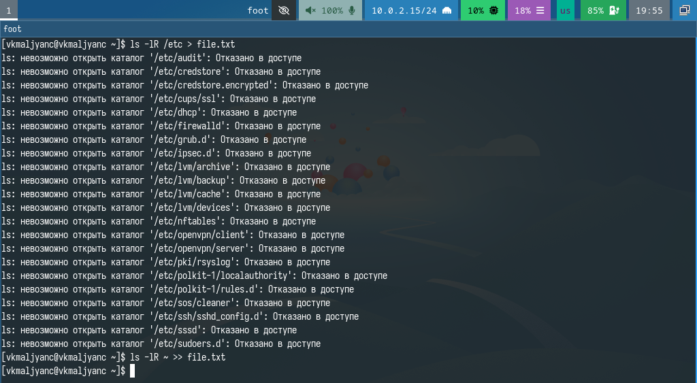{width=70%}

## Выведите имена всех файлов из file.txt, имеющих расширение .conf, после чего запишите их в новый текстовой файл conf.txt.

- Вывожу имена всех файлов из file.txt, имеющих расширение .conf, после чего записываю их в новый текстовый файл conf.txt (рис. 2) (рис. 3).

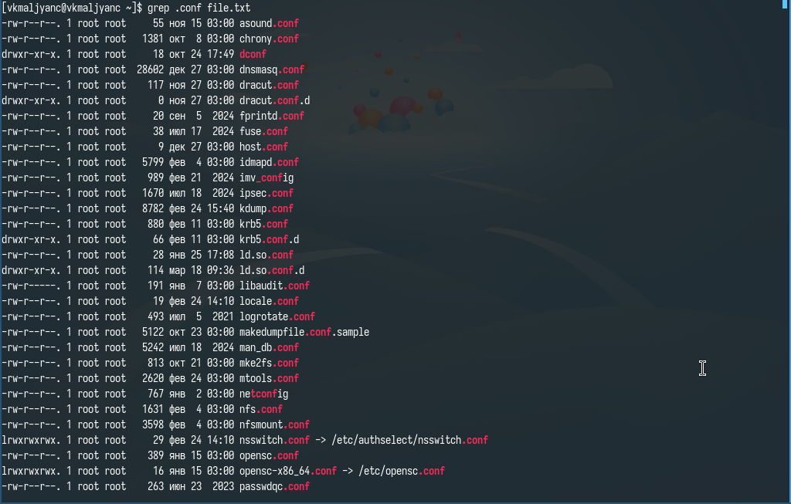{width=70%}

{width=70%}

## Определите, какие файлы в вашем домашнем каталоге имеют имена, начинавшиеся с символа c? Предложите несколько вариантов, как это сделать.

- Определяю файлы в моем домашнем каталоге, которые имеют имена, начинавшиеся с символа c. Ищу с помощью find ~ -name "c*" -print и ls -l | grep c* (рис. 4) (рис. 5).

{width=70%}

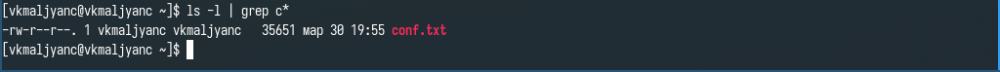{width=70%}

## Выведите на экран (по странично) имена файлов из каталога /etc, начинающиеся с символа h.

- Вывожу на экран (по странично) имена файлов из каталога /etc, начинающиеся с символа h (рис. 6).

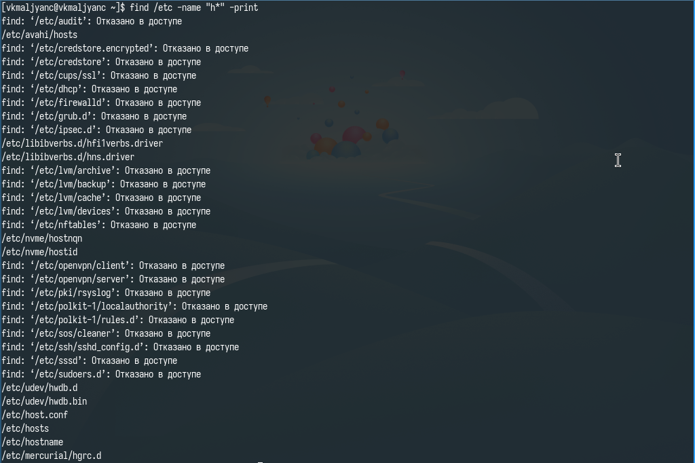{width=70%}

## Запустите в фоновом режиме процесс, который будет записывать в файл ~/logfile файлы, имена которых начинаются с log.

- Запускаю в фоновом режиме процесс, который будет записывать в файл ~/logfile файлы, имена которых начинаются с log (рис. 7).

{width=70%}

## Удалите файл ~/logfile.

- Удаляю файл ~/logfile. (рис. 8).

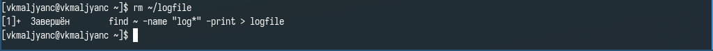{width=70%}

## Запустите из консоли в фоновом режиме редактор gedit.

- Запускаю из консоли в фоновом режиме редактор gedit (рис. 9).

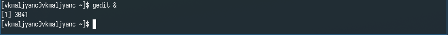{width=70%}

## Определите идентификатор процесса gedit, используя команду ps, конвейер и фильтр grep. Как ещё можно определить идентификатор процесса?

- Определяю идентификатор процесса gedit, используя команду ps, конвейер и фильтр grep. Еще определяю идентификатор процесса с помощью pgrep gedit (рис. 10).

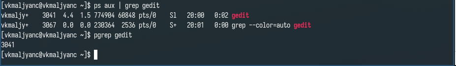{width=70%}

## Прочтите справку (man) команды kill, после чего используйте её для завершения процесса gedit.

- Читаю справку по команде kill с помощью man, затем использую ее для завершения процесса gedit (рис. 11) (рис. 12).

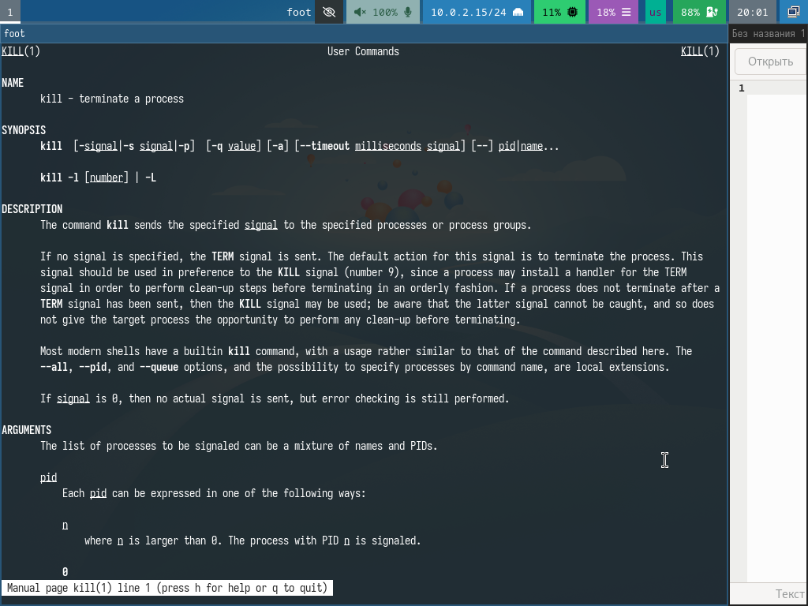{width=70%}

{width=70%}

## Выполните команды df и du, предварительно получив более подробную информацию об этих командах, с помощью команды man.

- Читаю справку по команде df с помощью man (рис. 13).

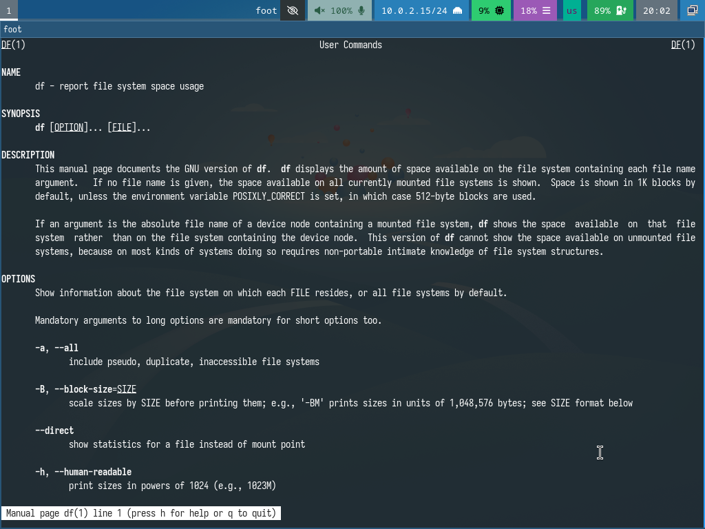{width=70%}

## Выполните команды df и du, предварительно получив более подробную информацию об этих командах, с помощью команды man.

- Читаю справку по команде du с помощью man (рис. 14).

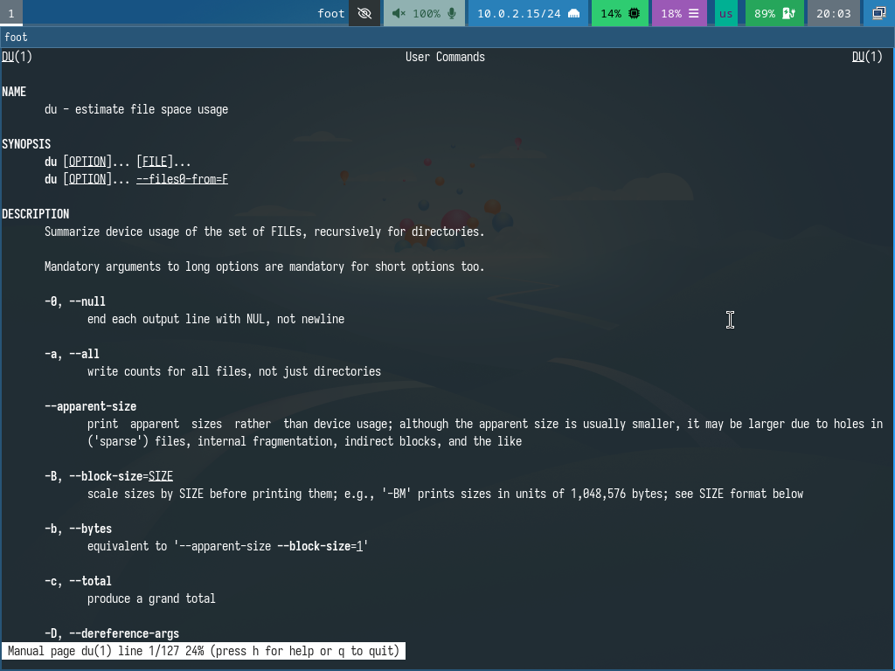{width=70%}

## Выполните команды df и du, предварительно получив более подробную информацию об этих командах, с помощью команды man.

- Выполняю команды df -vi и du -a ~/ (рис. 15).

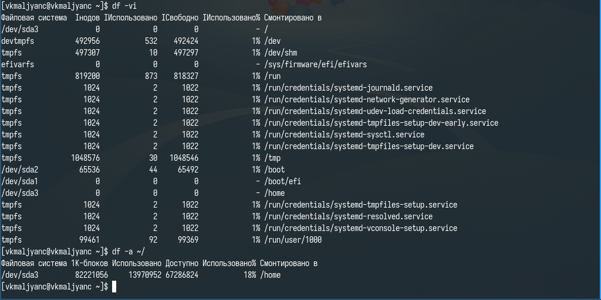{width=70%}

## Воспользовавшись справкой команды find, выведите имена всех директорий, имеющихся в вашем домашнем каталоге.

- Читаю справку по команде find с помощью man (рис. 16).

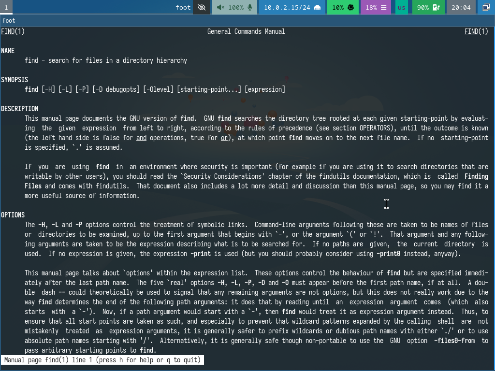{width=70%}

## Воспользовавшись справкой команды find, выведите имена всех директорий, имеющихся в вашем домашнем каталоге.

- Вывожу имена всех директорий, имеющихся в моем домашнем каталоге (рис. 17).

{width=70%}

# Выводы

- Я ознакомилась с инструментами поиска файлов и фильтрации текстовых данных. Приобрела практические навыки: по управлению процессами (и заданиями), по проверке использования диска и обсуживанию файловых систем.

# Спасибо за внимание
