---
## Front matter
title: "Лабораторная работа № 8"
subtitle: "Поиск файлов. Перенаправление ввода-вывода. Просмотр запущенных процессов"
author: "Мальянц Виктория Кареновна"

## Generic otions
lang: ru-RU
toc-title: "Содержание"

## Bibliography
bibliography: bib/cite.bib
csl: pandoc/csl/gost-r-7-0-5-2008-numeric.csl

## Pdf output format
toc: true # Table of contents
toc-depth: 2
lof: true # List of figures
lot: true # List of tables
fontsize: 12pt
linestretch: 1.5
papersize: a4
documentclass: scrreprt
## I18n polyglossia
polyglossia-lang:
  name: russian
  options:
	- spelling=modern
	- babelshorthands=true
polyglossia-otherlangs:
  name: english
## I18n babel
babel-lang: russian
babel-otherlangs: english
## Fonts
mainfont: IBM Plex Serif
romanfont: IBM Plex Serif
sansfont: IBM Plex Sans
monofont: IBM Plex Mono
mathfont: STIX Two Math
mainfontoptions: Ligatures=Common,Ligatures=TeX,Scale=0.94
romanfontoptions: Ligatures=Common,Ligatures=TeX,Scale=0.94
sansfontoptions: Ligatures=Common,Ligatures=TeX,Scale=MatchLowercase,Scale=0.94
monofontoptions: Scale=MatchLowercase,Scale=0.94,FakeStretch=0.9
mathfontoptions:
## Biblatex
biblatex: true
biblio-style: "gost-numeric"
biblatexoptions:
  - parentracker=true
  - backend=biber
  - hyperref=auto
  - language=auto
  - autolang=other
  - citestyle=gost-numeric
## Pandoc-crossref LaTeX customization
figureTitle: "Рис."
tableTitle: "Таблица"
listingTitle: "Листинг"
lofTitle: "Список иллюстраций"
lotTitle: "Список таблиц"
lolTitle: "Листинги"
## Misc options
indent: true
header-includes:
  - \usepackage{indentfirst}
  - \usepackage{float} # keep figures where there are in the text
  - \floatplacement{figure}{H} # keep figures where there are in the text
---

# Цель работы

Ознакомление с инструментами поиска файлов и фильтрации текстовых данных. Приобретение практических навыков: по управлению процессами (и заданиями), по проверке использования диска и обсуживанию файловых систем.

# Задание

1. Осуществите вход в систему, используя соответствующее имя пользователя. Запишите в файл file.txt названия файлов, содержащихся в каталоге /etc. Допишите в этот же файл названия файлов, содержащихся в вашем домашнем каталоге.
2. Выведите имена всех файлов из file.txt, имеющих расширение .conf, после чего запишите их в новый текстовой файл conf.txt.
3. Определите, какие файлы в вашем домашнем каталоге имеют имена, начинавшиеся с символа c? Предложите несколько вариантов, как это сделать.
4. Выведите на экран (по странично) имена файлов из каталога /etc, начинающиеся с символа h.
5. Запустите в фоновом режиме процесс, который будет записывать в файл ~/logfile файлы, имена которых начинаются с log.
6. Удалите файл ~/logfile.
7. Запустите из консоли в фоновом режиме редактор gedit.
8. Определите идентификатор процесса gedit, используя команду ps, конвейер и фильтр grep. Как ещё можно определить идентификатор процесса?
9. Прочтите справку (man) команды kill, после чего используйте её для завершения процесса gedit.
10. Выполните команды df и du, предварительно получив более подробную информацию об этих командах, с помощью команды man.
11. Воспользовавшись справкой команды find, выведите имена всех директорий, имеющихся в вашем домашнем каталоге.
12. Контрольные вопросы
 
# Выполнение лабораторной работы
## Осуществите вход в систему, используя соответствующее имя пользователя. Запишите в файл file.txt названия файлов, содержащихся в каталоге /etc. Допишите в этот же файл названия файлов, содержащихся в вашем домашнем каталоге.

Осуществила вход в систему, используя соответствующее имя пользователя. Записываю в файл file.txt названия файлов, содержащихся в каталоге /etc. Дописываю в этот же файл названия файлов, содержащихся в моем домашнем каталоге (рис. [-@fig:001]).

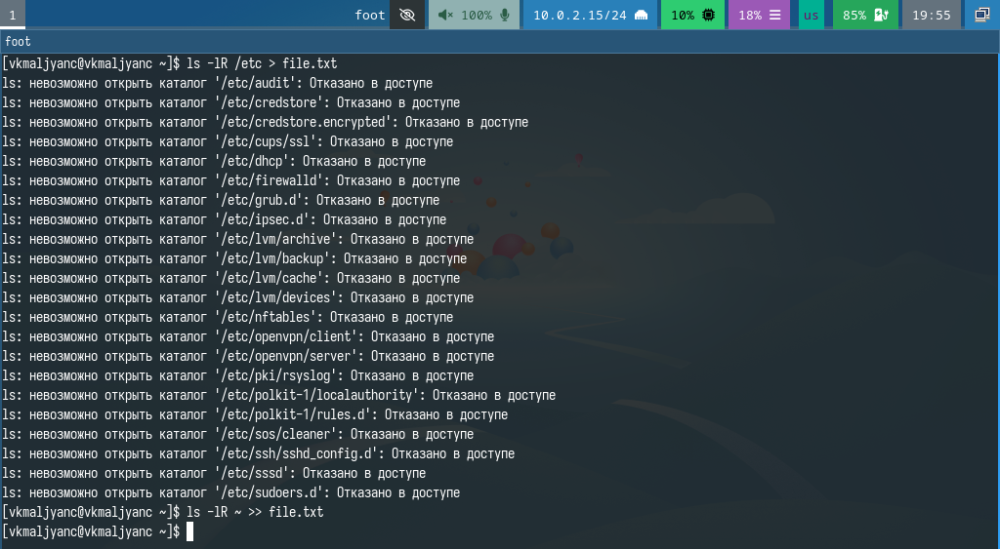{#fig:001 width=70%}

## Выведите имена всех файлов из file.txt, имеющих расширение .conf, после чего запишите их в новый текстовой файл conf.txt.

Вывожу имена всех файлов из file.txt, имеющих расширение .conf, после чего записываю их в новый текстовый файл conf.txt (рис. [-@fig:002]) (рис. [-@fig:003]).

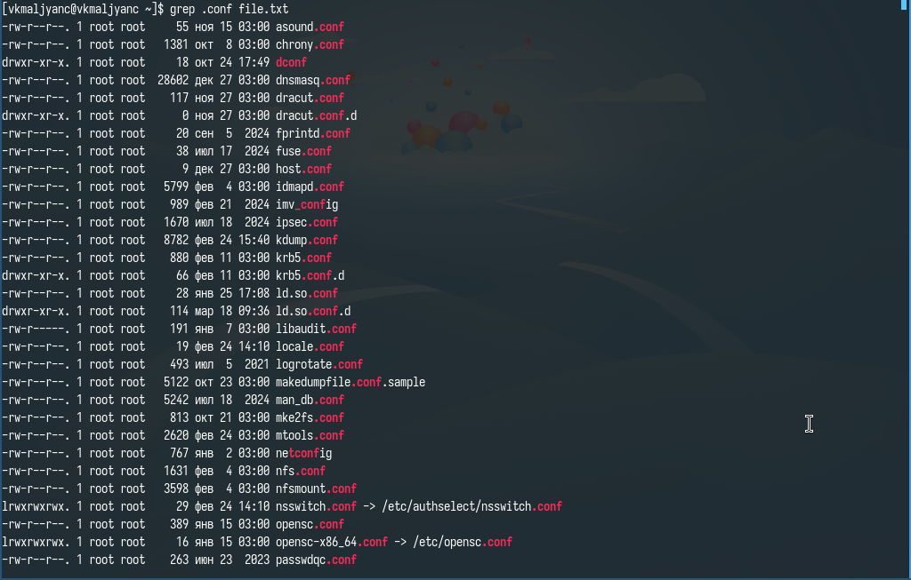{#fig:002 width=70%}

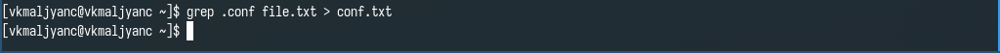{#fig:003 width=70%}

## Определите, какие файлы в вашем домашнем каталоге имеют имена, начинавшиеся с символа c? Предложите несколько вариантов, как это сделать.

Определяю файлы в моем домашнем каталоге, которые имеют имена, начинавшиеся с символа c. Ищу с помощью find ~ -name "c*" -print и ls -l | grep c* (рис. [-@fig:004]) (рис. [-@fig:005]).

{#fig:004 width=70%}

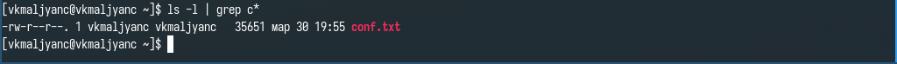{#fig:005 width=70%}

## Выведите на экран (по странично) имена файлов из каталога /etc, начинающиеся с символа h.

Вывожу на экран (по странично) имена файлов из каталога /etc, начинающиеся с символа h (рис. [-@fig:006]).

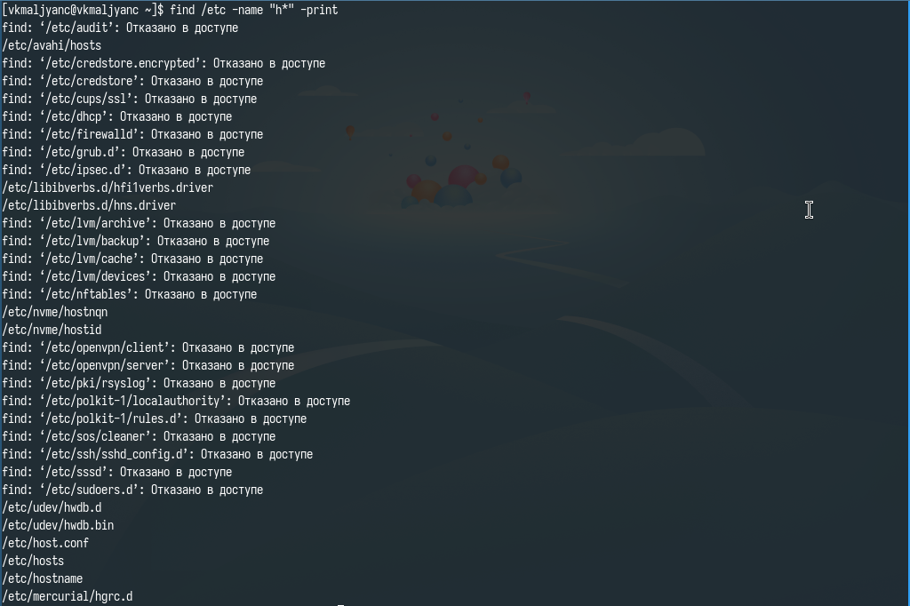{#fig:006 width=70%}

## Запустите в фоновом режиме процесс, который будет записывать в файл ~/logfile файлы, имена которых начинаются с log.

Запускаю в фоновом режиме процесс, который будет записывать в файл ~/logfile файлы, имена которых начинаются с log (рис. [-@fig:007]).

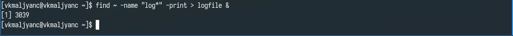{#fig:007 width=70%}

## Удалите файл ~/logfile.

Удаляю файл ~/logfile. (рис. [-@fig:008]).

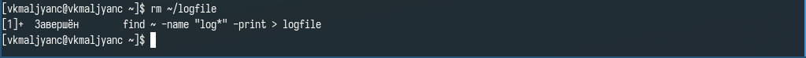{#fig:008 width=70%}

## Запустите из консоли в фоновом режиме редактор gedit.

Запускаю из консоли в фоновом режиме редактор gedit (рис. [-@fig:009]).

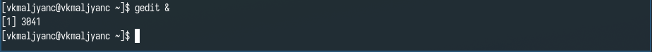{#fig:009 width=70%}

## Определите идентификатор процесса gedit, используя команду ps, конвейер и фильтр grep. Как ещё можно определить идентификатор процесса?

Определяю идентификатор процесса gedit, используя команду ps, конвейер и фильтр grep. Еще определяю идентификатор процесса с помощью pgrep gedit (рис. [-@fig:010]).

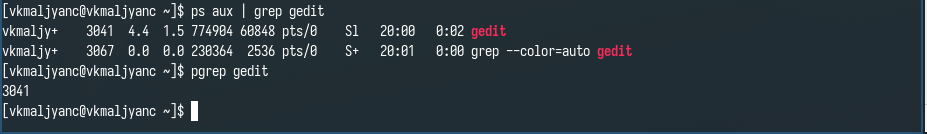{#fig:010 width=70%}

## Прочтите справку (man) команды kill, после чего используйте её для завершения процесса gedit.

Читаю справку по команде kill с помощью man, затем использую ее для завершения процесса gedit (рис. [-@fig:011]) (рис. [-@fig:012]).

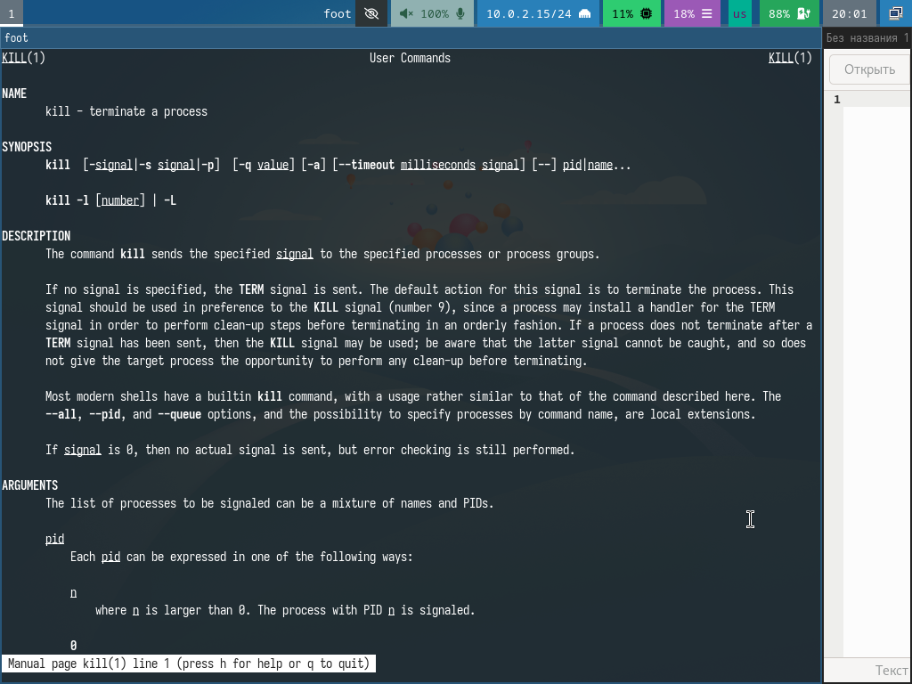{#fig:011 width=70%}

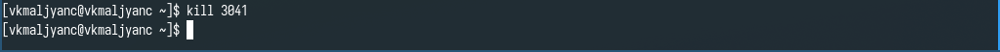{#fig:012 width=70%}

## Выполните команды df и du, предварительно получив более подробную информацию об этих командах, с помощью команды man.

Читаю справку по команде df с помощью man (рис. [-@fig:013]).

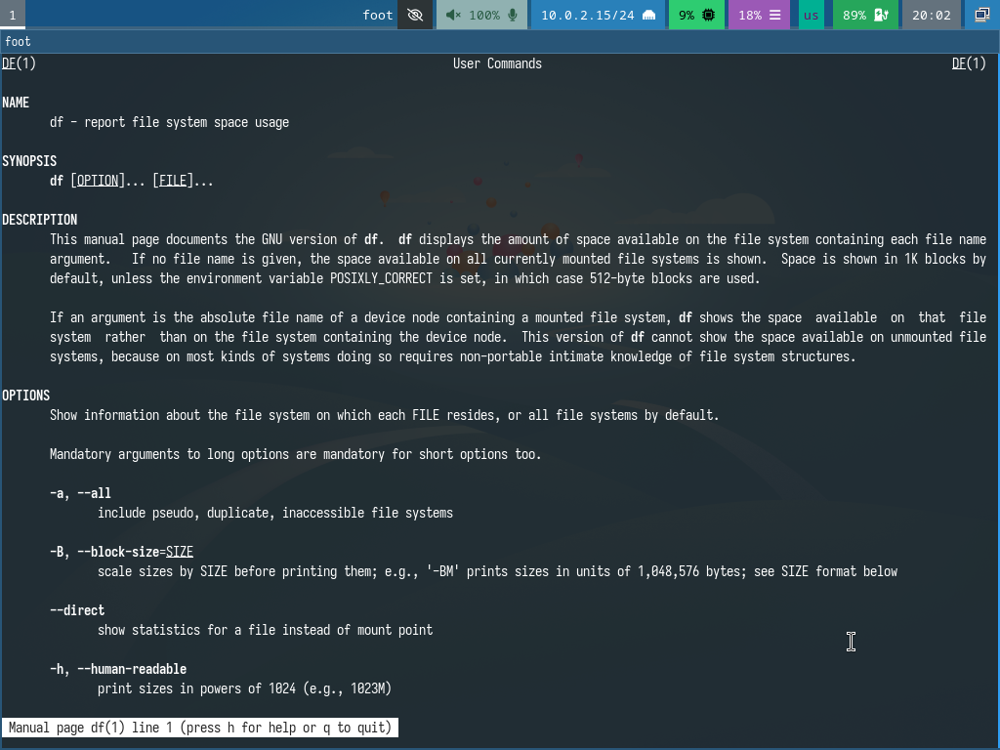{#fig:013 width=70%}

Читаю справку по команде du с помощью man (рис. [-@fig:014]).

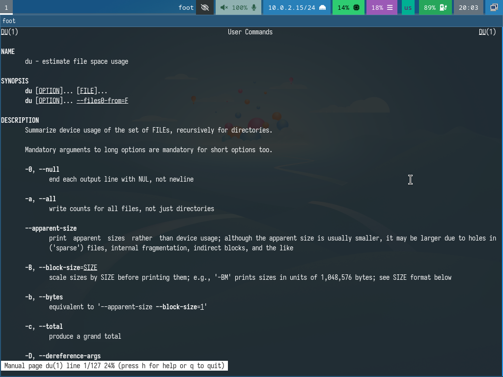{#fig:014 width=70%}

Выполняю команды df -vi и du -a ~/ (рис. [-@fig:015]).

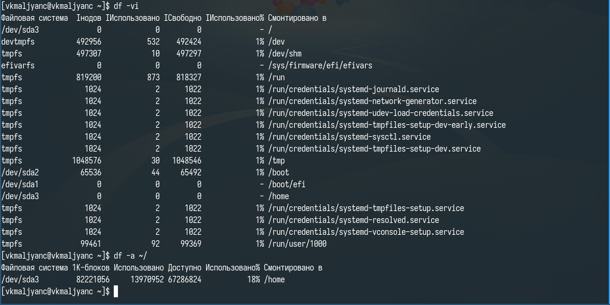{#fig:015 width=70%}

## Воспользовавшись справкой команды find, выведите имена всех директорий, имеющихся в вашем домашнем каталоге.

Читаю справку по команде find с помощью man (рис. [-@fig:016]).

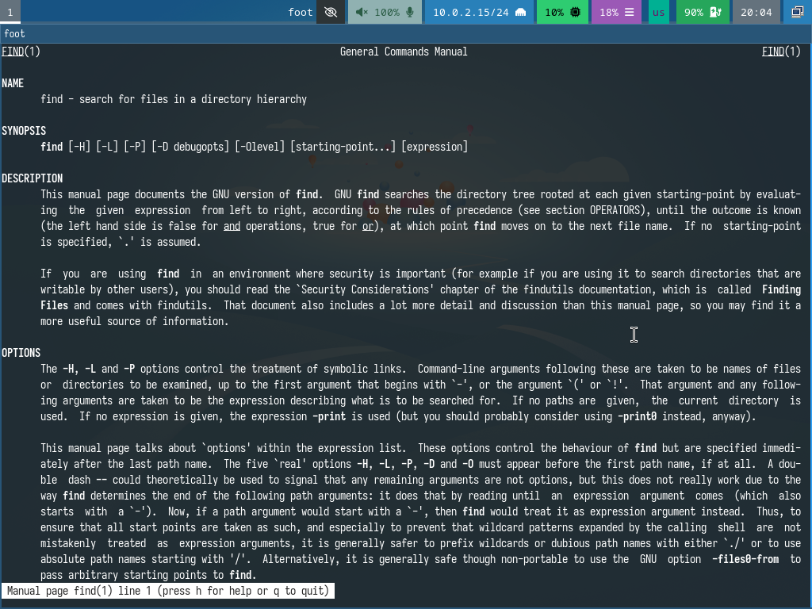{#fig:016 width=70%}

Вывожу имена всех директорий, имеющихся в моем домашнем каталоге (рис. [-@fig:017]) [@lab08].

{#fig:017 width=70%}

# Выводы

Я ознакомилась с инструментами поиска файлов и фильтрации текстовых данных. Приобрела практические навыки: по управлению процессами (и заданиями), по проверке использования диска и обсуживанию файловых систем.

# Контрольные вопросы

1. stdin - стандартный поток ввода (по умолчанию: клавиатура), файловый дескриптор 0. stdout - стандартный поток вывода (по умолчанию: консоль), файловый дескриптор 1. stderr - стандартный поток вывод сообщений об ошибках (по умолчанию: консоль), файловый дескриптор 2.
2. > - запись в файл инфрормации, перезапись его >> - запись в файл инфрормации, добавление в конец.
3. Конвейер служит для объединения простых команд или утилит в цепочки, в которых результат работы предыдущей команды передается последующей.
4. Процесс - это экземпляр выполняемой программы. В отличие от программы, процесс имеет состояние и может изменяться во времени.
5. PID - уникальный идентификатор процесса в системе. GID - идентификатор группы, к которой принадлежит процесс, используется для управления правами доступа.
6. Задачи - это единицы работы, выполняемые процессом. Можно управлять задачами с помощью команды: kill.
7. top - утилита для мониторинга процессов в реальном времени. Показывает активные процессы, использование ресурсов и другую информацию о системе. htop - улучшенная версия top, с более удобным интерфейсом и возможностью интерактивного управления процессами.
8. find - команда для поиска файлов, пример использования: find ~ -name "c*" -print.
9. С помощью команды grep можно по контексту найти файл. Пример: grep c*
10. С помощью команды df -h.
11. С помощью команды df -sh ~.
12. С помощью команды kill. Сначала определить идентификатор процесса с помощью ps aux | grep %то, что ищем, затем kill %номер процесса.

# Список литературы{.unnumbered}

::: {#refs}
:::
