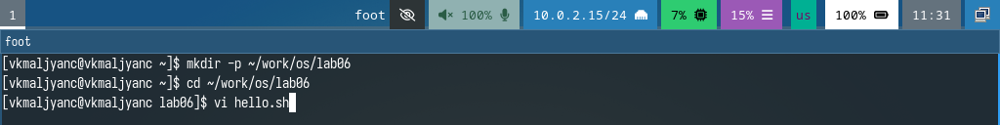
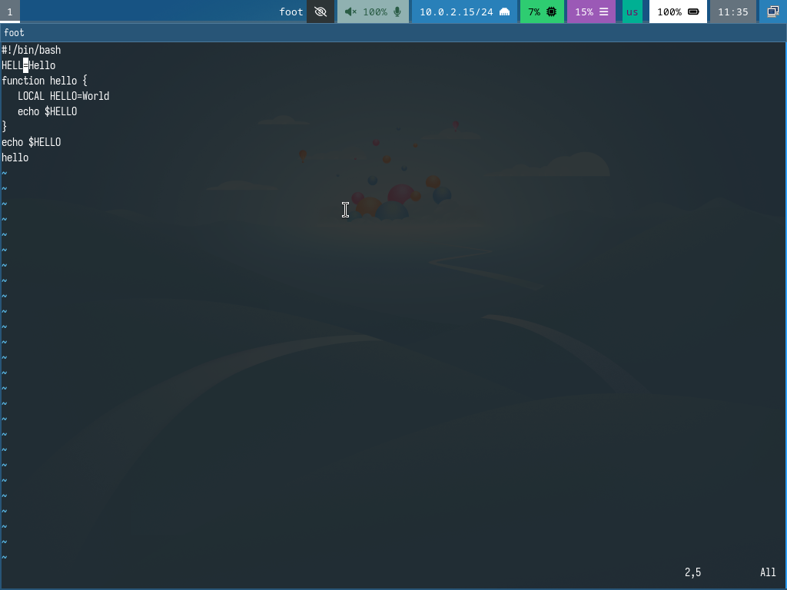
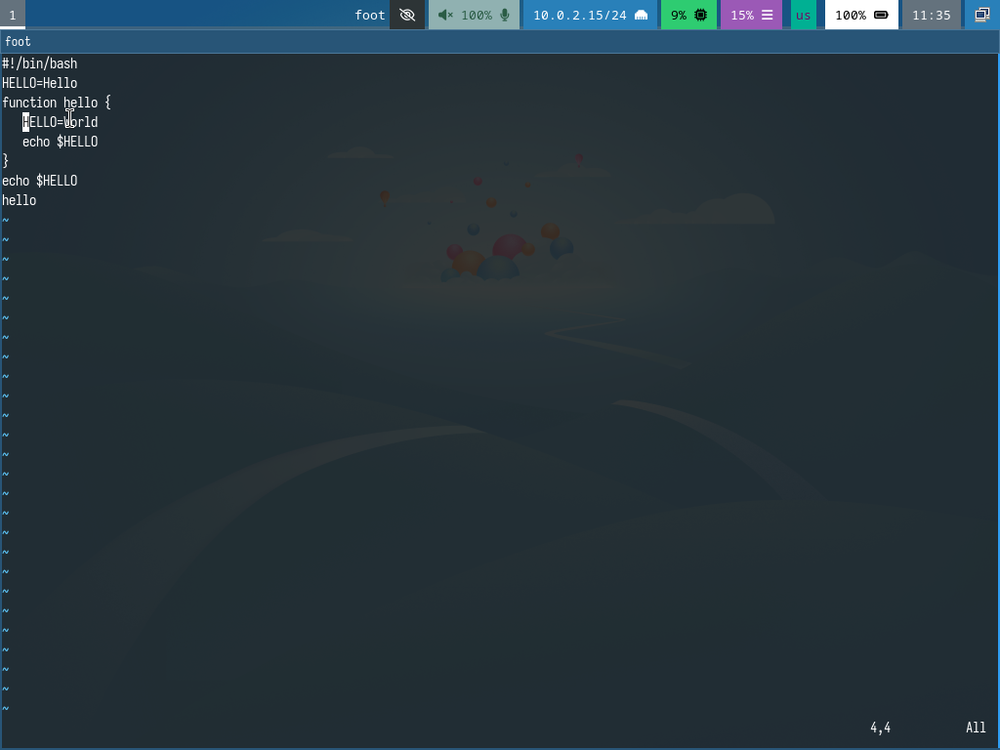
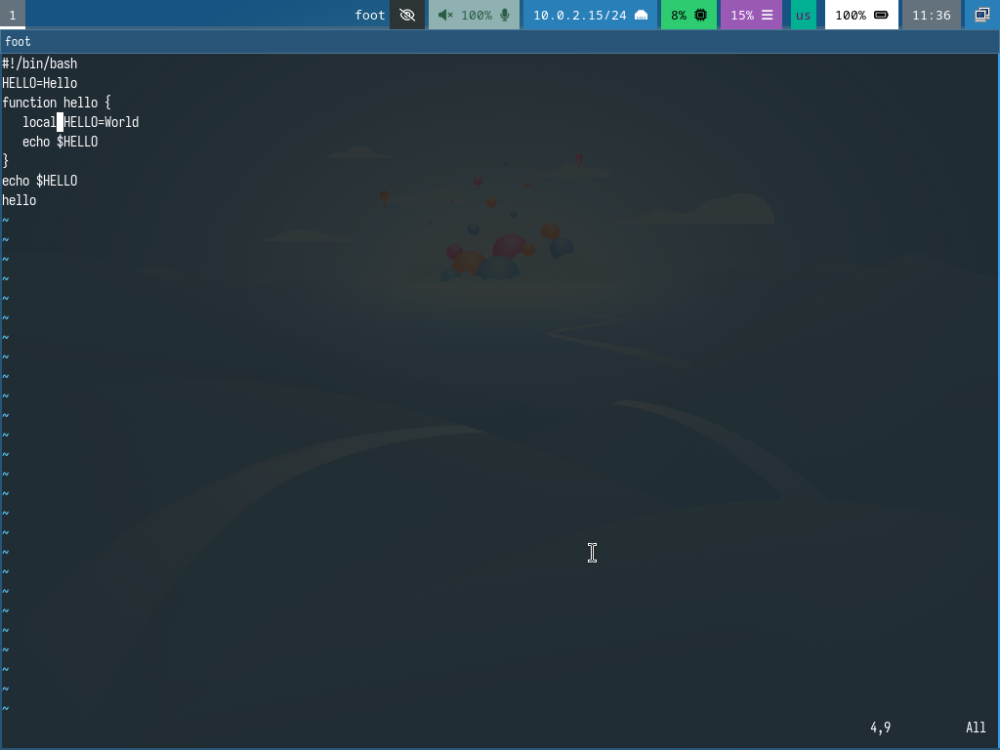
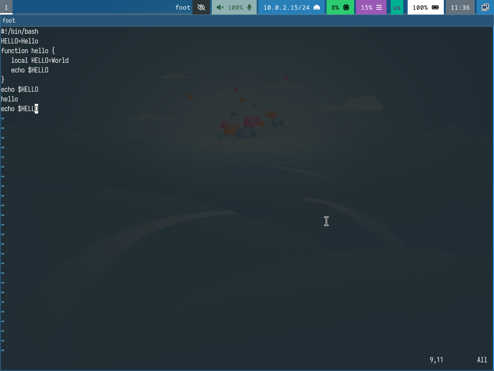
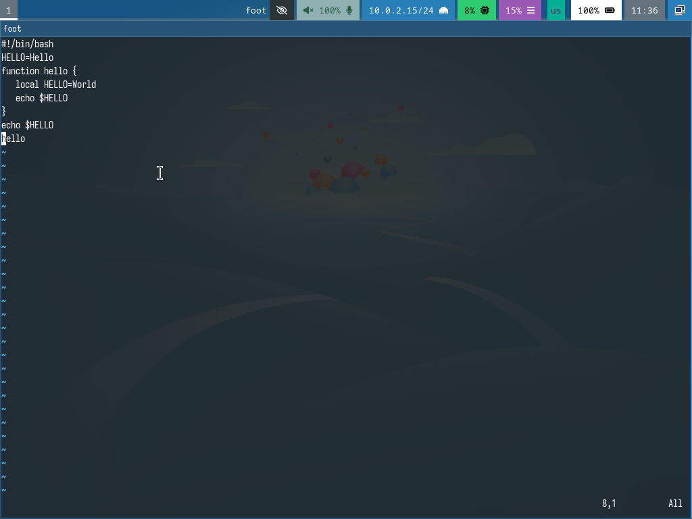
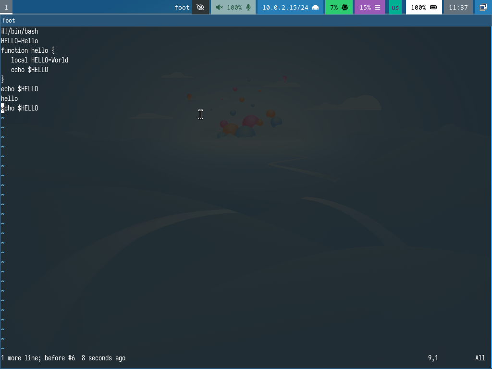
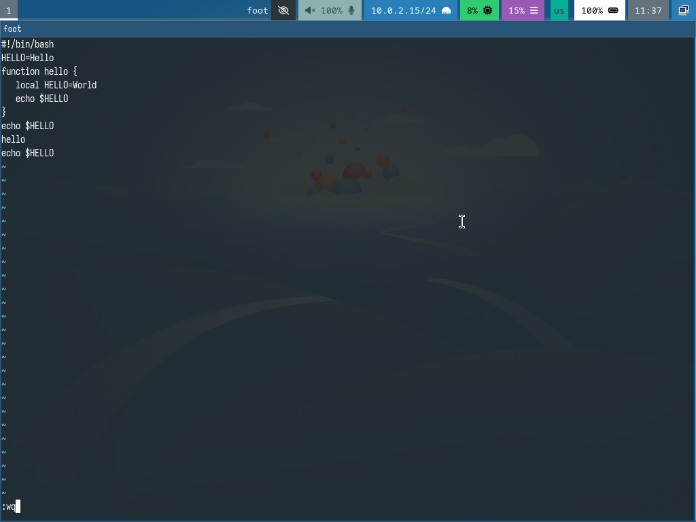

---
## Front matter
lang: ru-RU
title: Лабораторная работа № 10
subtitle: Текстовый редактор vi
author:
  - Мальянц В. К.
institute:
  - Российский университет дружбы народов, Москва, Россия
date: 14 апреля 2025

## i18n babel
babel-lang: russian
babel-otherlangs: english

## Formatting pdf
toc: false
toc-title: Содержание
slide_level: 2
aspectratio: 169
section-titles: true
theme: metropolis
header-includes:
 - \metroset{progressbar=frametitle,sectionpage=progressbar,numbering=fraction}
---

# Цель работы

- Познакомиться с операционной системой Linux. Получить практические навыки работы с редактором vi, установленным по умолчанию практически во всех дистрибутивах.

# Задание

- Создание нового файла с использованием vi
- Редактирование существующего файла

# Выполнение лабораторной работы
## Создание нового файла с использованием vi

- Создаю каталог с именем ~/work/os/lab06. Перехожу во вновь созданный каталог. Вызываю vi и создаю файл hello.sh (рис. 1).

{width=70%}

## Создание нового файла с использованием vi

- Нажимаю клавишу i и ввожу данный текст. Нажимаю клавишу Esc для перехода в командный режим после завершения ввода текста. Нажимаю : для перехода в режим последней строки и внизу моего экрана появится приглашение в виде двоеточия. Нажимаю w (записать) и q (выйти), а затем нажимаю клавишу Enter для сохранения моего текста и завершения работы (рис. 2).

{width=70%}

## Создание нового файла с использованием vi

- Делаю файл исполняемым (рис. 3).

{width=70%}

## Редактирование существующего файла

- Вызываю vi на редактирование файла (рис. 4).

{width=70%}

## Редактирование существующего файла

- Устанавливаю курсор в конец слова HELL второй строки (рис. 5).

{width=70%}

## Редактирование существующего файла

- Перехожу в режим вставки и заменяю на HELLO. Нажимаю Esc для возврата в командный режим (рис. 6).

{width=70%}

## Редактирование существующего файла

- Устанавливаю курсор на четвертую строку и стираю слово LOCAL (рис. 7).

{width=70%}

## Редактирование существующего файла

- Перехожу в режим вставки и набираю следующий текст: local, нажимаю Esc для возврата в командный режим (рис. 8).

{width=70%}

## Редактирование существующего файла

- Устанавливаю курсор на последней строке файла. Вставляю после неё строку, содержащую следующий текст: echo $HELLO. Нажмите Esc для перехода в командный режим (рис. 9).

{width=70%}

## Редактирование существующего файла

- Удаляю последнюю строку (рис. 10).

{width=70%}

## Редактирование существующего файла

- Ввожу команду отмены изменений u для отмены последней команды (рис. 11).

{width=70%}

## Редактирование существующего файла

- Ввожу символ : для перехода в режим последней строки. Записываю произведённые изменения и выхожу из vi (рис. 12).

{width=70%}

# Выводы

- Я познакомилась с операционной системой Linux. Получила практические навыки работы с редактором vi, установленным по умолчанию практически во всех дистрибутивах.

# Спасибо за внимание
