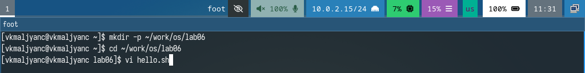
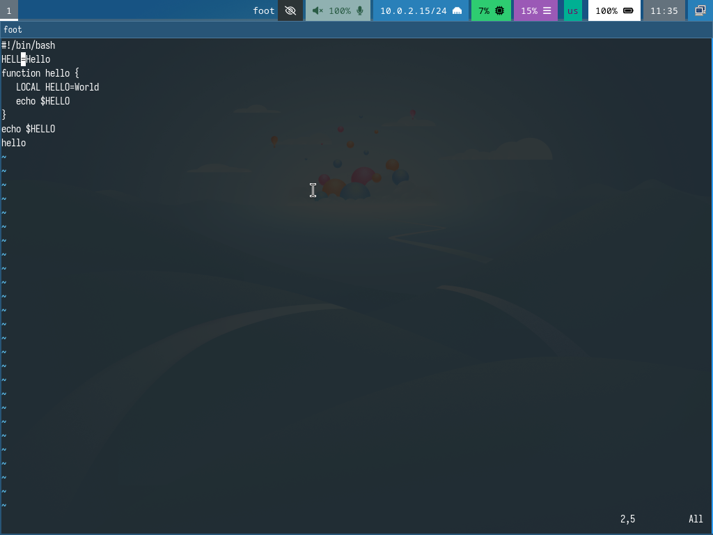
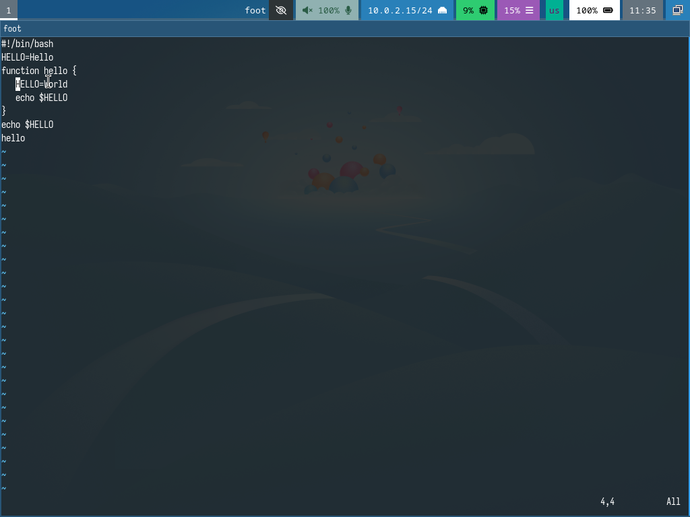
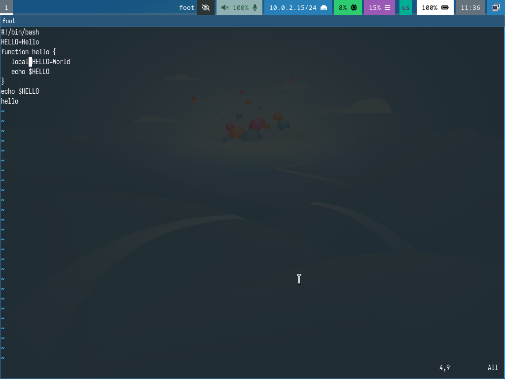
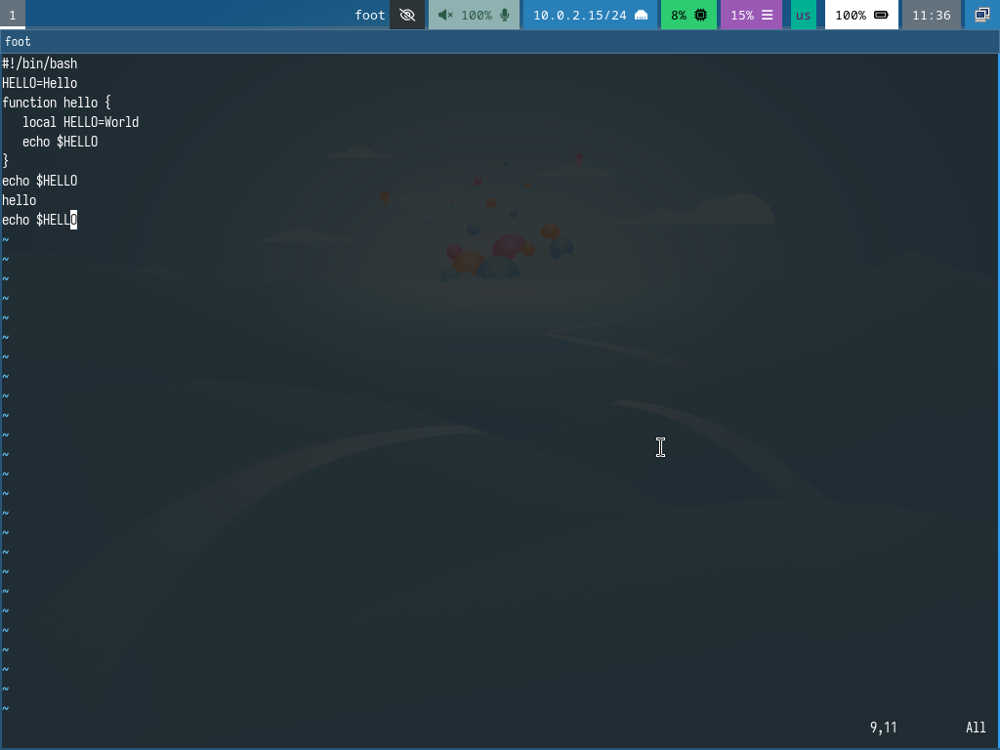
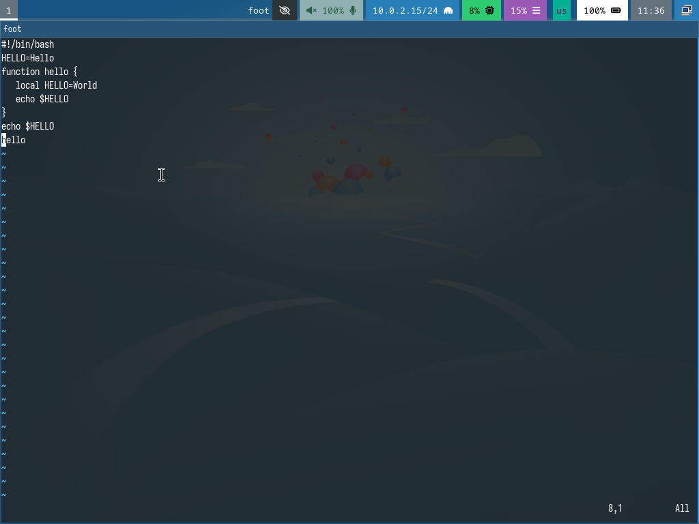
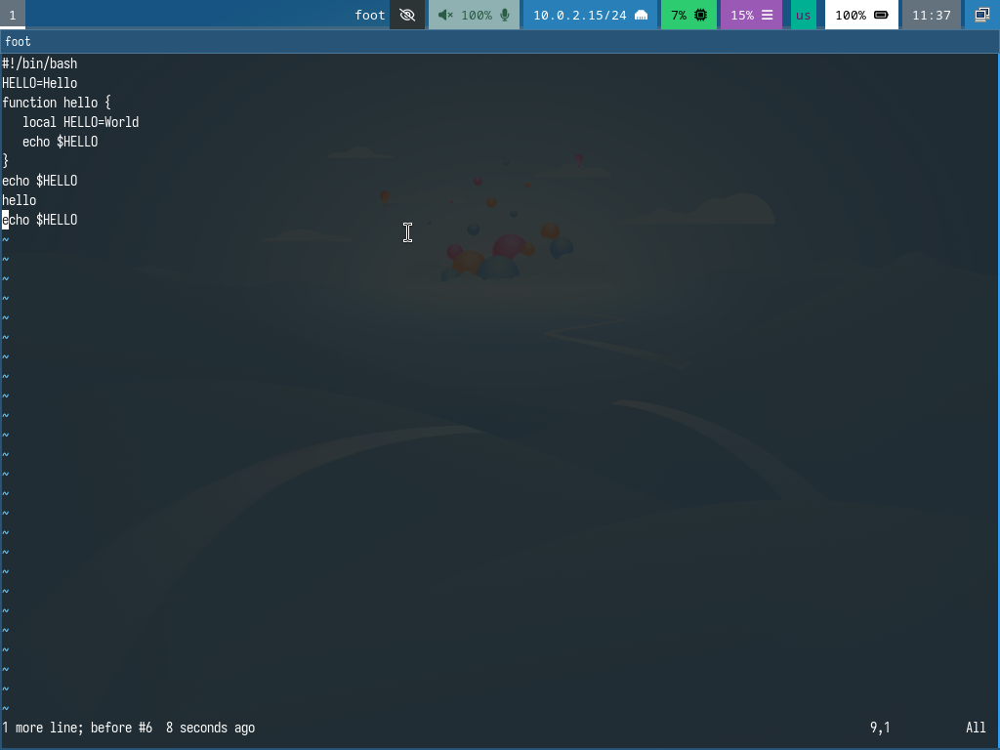
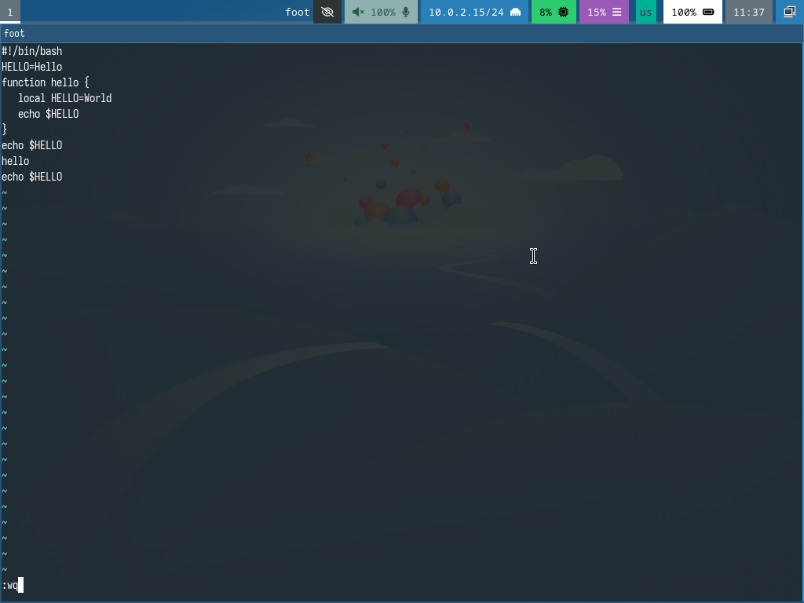

---
## Front matter
title: "Лабораторная работа № 10"
subtitle: "Текстовый редактор vi"
author: "Мальянц Виктория Кареновна"

## Generic otions
lang: ru-RU
toc-title: "Содержание"

## Bibliography
bibliography: bib/cite.bib
csl: pandoc/csl/gost-r-7-0-5-2008-numeric.csl

## Pdf output format
toc: true # Table of contents
toc-depth: 2
lof: true # List of figures
lot: true # List of tables
fontsize: 12pt
linestretch: 1.5
papersize: a4
documentclass: scrreprt
## I18n polyglossia
polyglossia-lang:
  name: russian
  options:
	- spelling=modern
	- babelshorthands=true
polyglossia-otherlangs:
  name: english
## I18n babel
babel-lang: russian
babel-otherlangs: english
## Fonts
mainfont: IBM Plex Serif
romanfont: IBM Plex Serif
sansfont: IBM Plex Sans
monofont: IBM Plex Mono
mathfont: STIX Two Math
mainfontoptions: Ligatures=Common,Ligatures=TeX,Scale=0.94
romanfontoptions: Ligatures=Common,Ligatures=TeX,Scale=0.94
sansfontoptions: Ligatures=Common,Ligatures=TeX,Scale=MatchLowercase,Scale=0.94
monofontoptions: Scale=MatchLowercase,Scale=0.94,FakeStretch=0.9
mathfontoptions:
## Biblatex
biblatex: true
biblio-style: "gost-numeric"
biblatexoptions:
  - parentracker=true
  - backend=biber
  - hyperref=auto
  - language=auto
  - autolang=other
  - citestyle=gost-numeric
## Pandoc-crossref LaTeX customization
figureTitle: "Рис."
tableTitle: "Таблица"
listingTitle: "Листинг"
lofTitle: "Список иллюстраций"
lotTitle: "Список таблиц"
lolTitle: "Листинги"
## Misc options
indent: true
header-includes:
  - \usepackage{indentfirst}
  - \usepackage{float} # keep figures where there are in the text
  - \floatplacement{figure}{H} # keep figures where there are in the text
---

# Цель работы

Познакомиться с операционной системой Linux. Получить практические навыки работы с редактором vi, установленным по умолчанию практически во всех дистрибутивах.

# Задание

1. Создание нового файла с использованием vi
1.1 Создайте каталог с именем ~/work/os/lab06
1.2 Перейдите во вновь созданный каталог
1.3 Вызовите vi и создайте файл hello.sh
1.4 Нажмите клавишу i и вводите данный текст
1.5 Нажмите клавишу Esc для перехода в командный режим после завершения ввода текста
1.6 Нажмите : для перехода в режим последней строки и внизу вашего экрана появится приглашение в виде двоеточия
1.7 Нажмите w (записать) и q (выйти), а затем нажмите клавишу Enter для сохранения вашего текста и завершения работы
1.8 Сделайте файл исполняемым
2. Редактирование существующего файла
2.1 Вызовите vi на редактирование файла
2.2 Установите курсор в конец слова HELL второй строки
2.3 Перейдите в режим вставки и замените на HELLO. Нажмите Esc для возврата в командный режим
2.4 Установите курсор на четвертую строку и сотрите слово LOCAL
2.5 Перейдите в режим вставки и наберите следующий текст: local, нажмите Esc для возврата в командный режим
2.6 Установите курсор на последней строке файла. Вставьте после неё строку, содержащую следующий текст: echo $HELLO
2.7 Нажмите Esc для перехода в командный режим
2.8 Удалите последнюю строку
2.9 Введите команду отмены изменений u для отмены последней команды
2.10 Введите символ : для перехода в режим последней строки. Запишите произведённые изменения и выйдите из vi
3. Контрольные вопросы

# Выполнение лабораторной работы
## Создание нового файла с использованием vi

Создаю каталог с именем ~/work/os/lab06. Перехожу во вновь созданный каталог. Вызываю vi и создаю файл hello.sh (рис. [-@fig:001]).

{#fig:001 width=70%}

Нажимаю клавишу i и ввожу данный текст. Нажимаю клавишу Esc для перехода в командный режим после завершения ввода текста. Нажимаю : для перехода в режим последней строки и внизу моего экрана появится приглашение в виде двоеточия. Нажимаю w (записать) и q (выйти), а затем нажимаю клавишу Enter для сохранения моего текста и завершения работы (рис. [-@fig:002]).

{#fig:002 width=70%}

Делаю файл исполняемым (рис. [-@fig:003]).

{#fig:003 width=70%}

## Редактирование существующего файла

Вызываю vi на редактирование файла (рис. [-@fig:004]).

{#fig:004 width=70%}

Устанавливаю курсор в конец слова HELL второй строки (рис. [-@fig:005]).

{#fig:005 width=70%}

Перехожу в режим вставки и заменяю на HELLO. Нажимаю Esc для возврата в командный режим (рис. [-@fig:006]).

{#fig:006 width=70%}

Устанавливаю курсор на четвертую строку и стираю слово LOCAL (рис. [-@fig:007]).

{#fig:007 width=70%}

Перехожу в режим вставки и набираю следующий текст: local, нажимаю Esc для возврата в командный режим (рис. [-@fig:008]).

{#fig:008 width=70%}

Устанавливаю курсор на последней строке файла. Вставляю после неё строку, содержащую следующий текст: echo $HELLO. Нажмите Esc для перехода в командный режим (рис. [-@fig:009]).

{#fig:009 width=70%}

Удалите последнюю строку (рис. [-@fig:010]).

{#fig:010 width=70%}

Ввожу команду отмены изменений u для отмены последней команды (рис. [-@fig:011]).

{#fig:011 width=70%}

Ввожу символ : для перехода в режим последней строки. Записываю произведённые изменения и выхожу из vi (рис. [-@fig:012]) [@lab10].

{#fig:012 width=70%}

# Выводы

Я познакомилась с операционной системой Linux. Получила практические навыки работы с редактором vi, установленным по умолчанию практически во всех дистрибутивах.

# Контрольные вопросы

1. Редактор vi имеет три режима работы:
– командный режим — предназначен для ввода команд редактирования и навигации по редактируемому файлу;
– режим вставки — предназначен для ввода содержания редактируемого файла;
– режим последней (или командной) строки — используется для записи изменений в файл и выхода из редактора.
2. Для выхода из редактора vi необходимо перейти в режим последней строки: находясь в командном режиме, нажать Shift-; (по сути символ : — двоеточие), затем: набрать символ q (или q!), если требуется выйти из редактора без сохранения.
3.Команды позиционирования
– 0 (ноль) — переход в начало строки;
– $ — переход в конец строки;
– G — переход в конец файла;
– n G — переход на строку с номером n.
4. В редакторе vi словом считается последовательность символов, разделенная пробелами или символами новой строки. Включает буквы, цифры и специальные символы.
5. Чтобы перейти в начало файла, введите gg в нормальном режиме, чтобы перейти в конец файла, введите G в нормальном режиме.
6. Команды редактирования
Вставка текста
– а — вставить текст после курсора;
– А — вставить текст в конец строки;
– i — вставить текст перед курсором;
– n i — вставить текст n раз;
– I — вставить текст в начало строки.
Вставка строки
– о — вставить строку под курсором;
– О — вставить строку над курсором.
Удаление текста
– x — удалить один символ в буфер;
– d w — удалить одно слово в буфер;
– d $ — удалить в буфер текст от курсора до конца строки;
– d 0 — удалить в буфер текст от начала строки до позиции курсора;
– d d — удалить в буфер одну строку;
– n d d — удалить в буфер n строк.
Отмена и повтор произведённых изменений
– u — отменить последнее изменение;
– . — повторить последнее изменение.
Копирование текста в буфер
– Y — скопировать строку в буфер;
– n Y — скопировать n строк в буфер;
– y w — скопировать слово в буфер.
Вставка текста из буфера
– p — вставить текст из буфера после курсора;
– P — вставить текст из буфера перед курсором.
Замена текста
– c w — заменить слово;
– n c w — заменить n слов;
– c $ — заменить текст от курсора до конца строки;
– r — заменить слово;
– R — заменить текст.
Поиск текста
– / текст — произвести поиск вперёд по тексту указанной строки символов текст;
– ? текст — произвести поиск назад по тексту указанной строки символов текст.
7. Перехожу в режим вставки.
8. С помощью u - отменить последнее изменение.
9. Режим последней (или командной) строки — используется для записи изменений в файл и выхода из редактора.
10. Написать g$.
11. Опции редактора vi позволяют настроить рабочую среду. Для задания опций используется команда set (в режиме последней строки):
– : set all — вывести полный список опций;
– : set nu — вывести номера строк;
– : set list — вывести невидимые символы;
– : set ic — не учитывать при поиске, является ли символ прописным или строчным
12. Режим работы можно определить по тому, как реагирует редактор на нажатия клавиш:
- в нормальном режиме нажатия клавиш выполняются команды
- в режиме вставки текст добавляется в файл
- в режиме командной строки команды начинаются с двоеточия :
13. Нормальный режим:
-> режим вставки
или
-> режим командной строки
- переход их нормального режима в режим вставки осуществляется с помощью команды i
- переход в режим командной строки осуществляется через нажатие : в нормальном режиме

# Список литературы{.unnumbered}

::: {#refs}
:::
