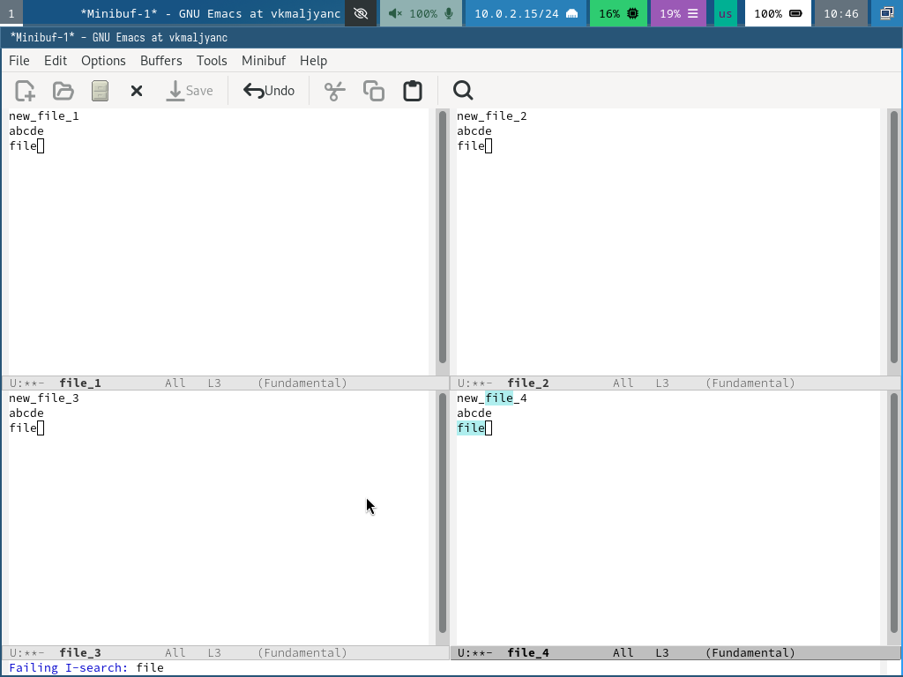

---
## Front matter
lang: ru-RU
title: Лабораторная работа № 11
subtitle: Текстовый редактор emacs
author:
  - Мальянц В. К.
institute:
  - Российский университет дружбы народов, Москва, Россия
date: 22 апреля 2025

## i18n babel
babel-lang: russian
babel-otherlangs: english

## Formatting pdf
toc: false
toc-title: Содержание
slide_level: 2
aspectratio: 169
section-titles: true
theme: metropolis
header-includes:
 - \metroset{progressbar=frametitle,sectionpage=progressbar,numbering=fraction}
---

# Цель работы

- Познакомиться с операционной системой Linux. Получить практические навыки работы с редактором Emacs.

# Задание

- Основные команды emacs

# Выполнение лабораторной работы
## Основные команды emacs

- Открываю emacs. (рис. 1).

{width=70%}

## Основные команды emacs

- Создаю файл lab07.sh с помощью комбинации Ctrl-x Ctrl-f (C-x C-f) (рис. 2).

{width=70%}

## Основные команды emacs

- Набираю текст и сохраняю файл с помощью комбинации Ctrl-x Ctrl-s (рис. 3).

{width=70%}

## Основные команды emacs

- Проделываю с текстом стандартные процедуры редактирования, каждое действие должно осуществляться комбинацией клавиш. Вырезаю одной командой целую строку (С-k) (рис. 4).

{width=70%}

## Основные команды emacs

- Вставляю эту строку в конец файла (C-y) (рис. 5).

{width=70%}

## Основные команды emacs

- Выделяю область текста (C-space) и копирую область в буфер обмена (M-w) (рис. 6).

{width=70%}

## Основные команды emacs

- Вставляю область в конец файла (рис. 7).

{width=70%}

## Основные команды emacs

- Вновь выделяю эту область и на этот раз вырезаю её (C-w) (рис. 8).

{width=70%}

## Основные команды emacs

- Отменяю последнее действие (C-/) (рис. 9).

{width=70%}

## Основные команды emacs

- Учусь использовать команды по перемещению курсора. Перемещаю курсор в начало строки (C-a) (рис. 10).

{width=70%}

## Основные команды emacs

- Перемещаю курсор в конец строки (C-e) (рис. 11).

{width=70%}

## Основные команды emacs

- Перемещаю курсор в начало буфера (M-<) (рис. 12).

{width=70%}

## Основные команды emacs

- Перемещаю курсор в конец буфера (M->) (рис. 13).

{width=70%}

## Основные команды emacs

- Вывожу список активных буферов на экран (C-x C-b) (рис.14).

{width=70%}

## Основные команды emacs

- Перемещаюсь во вновь открытое окно (C-x) o со списком открытых буферов и переключаюсь на другой буфер (рис. 15).

{width=70%}

## Основные команды emacs

- Закрываю это окно (C-x 0) (рис. 16).

{width=70%}

## Основные команды emacs

- Теперь вновь переключаюсь между буферами, но уже без вывода их списка на экран (C-x b) (рис. 17).

{width=70%}

## Основные команды emacs

- Делю фрейм на 4 части: разделяю фрейм на два окна по вертикали (C-x 3), а затем каждое из этих окон на две части по горизонтали (C-x 2) (рис. 18).

{width=70%}

## Основные команды emacs

- В каждом из четырёх созданных окон открываю новый буфер (файл) и ввожу несколько строк текста (рис. 19) (рис. 20).

{width=70%}

{width=70%}

## Основные команды emacs

- Переключаюсь в режим поиска (C-s) и нахожу несколько слов, присутствующих в тексте (рис. 21) (рис. 22).

{width=70%}

{width=70%}

## Основные команды emacs

- Переключаюсь между результатами поиска, нажимая C-s (рис. 23).

{width=70%}

## Основные команды emacs

- Выхожу из режима поиска, нажав C-g (рис. 24).

{width=70%}

## Основные команды emacs

- Перехожу в режим поиска и замены (M-%), ввожу текст, который следует найти и заменить (file), нажимаю Enter, затем ввожу текст для замены (text). После того как будут подсвечены результаты поиска, нажимаю ! для подтверждения замены. (рис. 25).

{width=70%}

## Основные команды emacs

- Пробую другой режим поиска, нажав M-s o. Теперь изменения отображаются в отдельном окне. (рис. 26).

{width=70%}

# Выводы

- Я познакомилась с операционной системой Linux. Получила практические навыки работы с редактором Emacs.

# Спасибо за внимание
