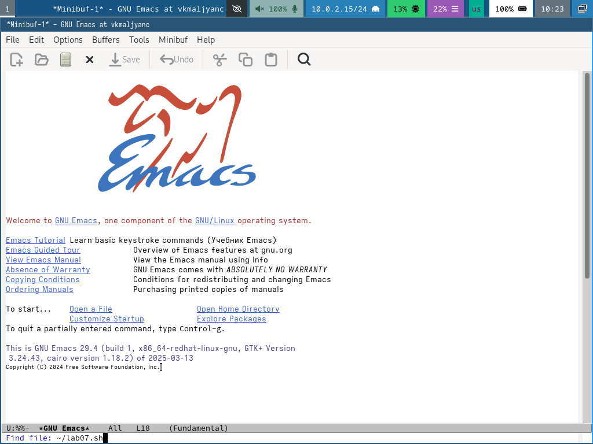

---
## Front matter
title: "Лабораторная работа № 11"
subtitle: "Текстовый редактор emacs"
author: "Мальянц Виктория Кареновна"

## Generic otions
lang: ru-RU
toc-title: "Содержание"

## Bibliography
bibliography: bib/cite.bib
csl: pandoc/csl/gost-r-7-0-5-2008-numeric.csl

## Pdf output format
toc: true # Table of contents
toc-depth: 2
lof: true # List of figures
lot: true # List of tables
fontsize: 12pt
linestretch: 1.5
papersize: a4
documentclass: scrreprt
## I18n polyglossia
polyglossia-lang:
  name: russian
  options:
	- spelling=modern
	- babelshorthands=true
polyglossia-otherlangs:
  name: english
## I18n babel
babel-lang: russian
babel-otherlangs: english
## Fonts
mainfont: IBM Plex Serif
romanfont: IBM Plex Serif
sansfont: IBM Plex Sans
monofont: IBM Plex Mono
mathfont: STIX Two Math
mainfontoptions: Ligatures=Common,Ligatures=TeX,Scale=0.94
romanfontoptions: Ligatures=Common,Ligatures=TeX,Scale=0.94
sansfontoptions: Ligatures=Common,Ligatures=TeX,Scale=MatchLowercase,Scale=0.94
monofontoptions: Scale=MatchLowercase,Scale=0.94,FakeStretch=0.9
mathfontoptions:
## Biblatex
biblatex: true
biblio-style: "gost-numeric"
biblatexoptions:
  - parentracker=true
  - backend=biber
  - hyperref=auto
  - language=auto
  - autolang=other
  - citestyle=gost-numeric
## Pandoc-crossref LaTeX customization
figureTitle: "Рис."
tableTitle: "Таблица"
listingTitle: "Листинг"
lofTitle: "Список иллюстраций"
lotTitle: "Список таблиц"
lolTitle: "Листинги"
## Misc options
indent: true
header-includes:
  - \usepackage{indentfirst}
  - \usepackage{float} # keep figures where there are in the text
  - \floatplacement{figure}{H} # keep figures where there are in the text
---

# Цель работы

Познакомиться с операционной системой Linux. Получить практические навыки работы с редактором Emacs.

# Задание

1. Основные команды emacs
1.1 Открыть emacs.
1.2 Создать файл lab07.sh с помощью комбинации Ctrl-x Ctrl-f (C-x C-f).
1.3 Наберите текст
1.4 Сохранить файл с помощью комбинации Ctrl-x Ctrl-s (C-x C-s).
1.5 Проделать с текстом стандартные процедуры редактирования, каждое действие должно осуществляться комбинацией клавиш.
1.5.1 Вырезать одной командой целую строку (С-k).
1.5.2 Вставить эту строку в конец файла (C-y).
1.5.3 Выделить область текста (C-space).
1.5.4 Скопировать область в буфер обмена (M-w).
1.5.5 Вставить область в конец файла.
1.5.6 Вновь выделить эту область и на этот раз вырезать её (C-w).
1.5.7 Отмените последнее действие (C-/).
1.6 Научитесь использовать команды по перемещению курсора.
1.6.1 Переместите курсор в начало строки (C-a).
1.6.2 Переместите курсор в конец строки (C-e).
1.6.3 Переместите курсор в начало буфера (M-<).
1.6.4 Переместите курсор в конец буфера (M->).
1.7 Управление буферами.
1.7.1 Вывести список активных буферов на экран (C-x C-b).
1.7.2 Переместитесь во вновь открытое окно (C-x) o со списком открытых буферов
и переключитесь на другой буфер.
1.7.3 Закройте это окно (C-x 0).
1.7.4 Теперь вновь переключайтесь между буферами, но уже без вывода их списка на
экран (C-x b).
1.8 Управление окнами.
1.8.1 Поделите фрейм на 4 части: разделите фрейм на два окна по вертикали (C-x 3),
а затем каждое из этих окон на две части по горизонтали (C-x 2).
1.8.2 В каждом из четырёх созданных окон откройте новый буфер (файл) и введите
несколько строк текста.
1.9 Режим поиска
1.9.1 Переключитесь в режим поиска (C-s) и найдите несколько слов, присутствующих
в тексте.
1.9.2 Переключайтесь между результатами поиска, нажимая C-s.
1.9.3 Выйдите из режима поиска, нажав C-g.
1.9.4 Перейдите в режим поиска и замены (M-%), введите текст, который следует найти
и заменить, нажмите Enter , затем введите текст для замены. После того как будут
подсвечены результаты поиска, нажмите ! для подтверждения замены.
1.9.5 Испробуйте другой режим поиска, нажав M-s o. Объяснить, чем он отличается от
обычного режима.
2. Контрольные вопросы

# Выполнение лабораторной работы
## Основные команды emacs

Открываю emacs. (рис. [-@fig:001]).

{#fig:001 width=70%}

Создать файл lab07.sh с помощью комбинации Ctrl-x Ctrl-f (C-x C-f) (рис. [-@fig:002]).

{#fig:002 width=70%}

Набираю текст и сохраняю файл с помощью комбинации Ctrl-x Ctrl-s (рис. [-@fig:003]).

{#fig:003 width=70%}

Проделываю с текстом стандартные процедуры редактирования, каждое действие должно осуществляться комбинацией клавиш. Вырезаю одной командой целую строку (С-k) (рис. [-@fig:004]).

{#fig:004 width=70%}

Вставляю эту строку в конец файла (C-y) (рис. [-@fig:005]).

{#fig:005 width=70%}

Выделяю область текста (C-space) и копирую область в буфер обмена (M-w) (рис. [-@fig:006]).

{#fig:006 width=70%}

Вставляю область в конец файла (рис. [-@fig:007]).

{#fig:007 width=70%}

Вновь выделяю эту область и на этот раз вырезаю её (C-w) (рис. [-@fig:008]).

{#fig:008 width=70%}

Отменяю последнее действие (C-/) (рис. [-@fig:009]).

{#fig:009 width=70%}

Учусь использовать команды по перемещению курсора. Перемещаю курсор в начало строки (C-a) (рис. [-@fig:010]).

{#fig:010 width=70%}

Перемещаю курсор в конец строки (C-e) (рис. [-@fig:011]).

{#fig:011 width=70%}

Перемещаю курсор в начало буфера (M-<) (рис. [-@fig:012]).

{#fig:012 width=70%}

Переместите курсор в конец буфера (M->) (рис. [-@fig:013]).

{#fig:013 width=70%}

Вывожу список активных буферов на экран (C-x C-b) (рис. [-@fig:014]).

{#fig:014 width=70%}

Перемещаюсь во вновь открытое окно (C-x) o со списком открытых буферов и переключаюсь на другой буфер (рис. [-@fig:015]).

{#fig:015 width=70%}

Закрываю это окно (C-x 0) (рис. [-@fig:016]).

{#fig:016 width=70%}

Теперь вновь переключаюсь между буферами, но уже без вывода их списка на экран (C-x b) (рис. [-@fig:017]).

{#fig:017 width=70%}

Делю фрейм на 4 части: разделяю фрейм на два окна по вертикали (C-x 3), а затем каждое из этих окон на две части по горизонтали (C-x 2) (рис. [-@fig:018]).

{#fig:018 width=70%}

В каждом из четырёх созданных окон открываю новый буфер (файл) и ввожу несколько строк текста (рис. [-@fig:019]) (рис. [-@fig:020]).

{#fig:019 width=70%}

{#fig:020 width=70%}

Переключаюсь в режим поиска (C-s) и нахожу несколько слов, присутствующих в тексте (рис. [-@fig:021]) (рис. [-@fig:022]).

{#fig:021 width=70%}

{#fig:022 width=70%}

Переключаюсь между результатами поиска, нажимая C-s (рис. [-@fig:023]).

{#fig:023 width=70%}

Выхожу из режима поиска, нажав C-g (рис. [-@fig:024]).

{#fig:024 width=70%}

Перехожу в режим поиска и замены (M-%), ввожу текст, который следует найти и заменить (file), нажимаю Enter, затем ввожу текст для замены (text). После того как будут подсвечены результаты поиска, нажимаю ! для подтверждения замены. (рис. [-@fig:025]).

{#fig:025 width=70%}

Пробую другой режим поиска, нажав M-s o. Теперь изменения отображаются в отдельном окне. (рис. [-@fig:026]) [@lab11].

{#fig:026 width=70%}

# Выводы

Я познакомилась с операционной системой Linux. Получила практические навыки работы с редактором Emacs.

# Контрольные вопросы
1. Emacs - мощный текстовый редактор, который поддерживает расширяемость и настраиваемость.
2. Клавиатурные комбинации, конфигурация, модель работы, обилие функций.
3. Буфер - место хранения текста. Окно - область, в которой отображается содержимое одного буфера.
4. Да, можно.
5. scratch, Messages и init.
6. Ctrl + c | Ctrl + c Ctrl + |.
7. Чтобы разделить текущее окно на две части по вертикали - C-x 3, по горизонтали C-x 2.
8. В файле .emacs.
9. Данная клавиша выполняет функцию стирания, ее можно переназначить.
10. Считаю более удобным редактор emacs за его настраиваемость и мощные функции.

# Список литературы{.unnumbered}

::: {#refs}
:::
