---
## Front matter
title: "Лабораторная работа № 12"
subtitle: "Программирование в командном процессоре ОС UNIX. Командные файлы"
author: "Мальянц Виктория Кареновна"

## Generic otions
lang: ru-RU
toc-title: "Содержание"

## Bibliography
bibliography: bib/cite.bib
csl: pandoc/csl/gost-r-7-0-5-2008-numeric.csl

## Pdf output format
toc: true # Table of contents
toc-depth: 2
lof: true # List of figures
lot: true # List of tables
fontsize: 12pt
linestretch: 1.5
papersize: a4
documentclass: scrreprt
## I18n polyglossia
polyglossia-lang:
  name: russian
  options:
	- spelling=modern
	- babelshorthands=true
polyglossia-otherlangs:
  name: english
## I18n babel
babel-lang: russian
babel-otherlangs: english
## Fonts
mainfont: IBM Plex Serif
romanfont: IBM Plex Serif
sansfont: IBM Plex Sans
monofont: IBM Plex Mono
mathfont: STIX Two Math
mainfontoptions: Ligatures=Common,Ligatures=TeX,Scale=0.94
romanfontoptions: Ligatures=Common,Ligatures=TeX,Scale=0.94
sansfontoptions: Ligatures=Common,Ligatures=TeX,Scale=MatchLowercase,Scale=0.94
monofontoptions: Scale=MatchLowercase,Scale=0.94,FakeStretch=0.9
mathfontoptions:
## Biblatex
biblatex: true
biblio-style: "gost-numeric"
biblatexoptions:
  - parentracker=true
  - backend=biber
  - hyperref=auto
  - language=auto
  - autolang=other
  - citestyle=gost-numeric
## Pandoc-crossref LaTeX customization
figureTitle: "Рис."
tableTitle: "Таблица"
listingTitle: "Листинг"
lofTitle: "Список иллюстраций"
lotTitle: "Список таблиц"
lolTitle: "Листинги"
## Misc options
indent: true
header-includes:
  - \usepackage{indentfirst}
  - \usepackage{float} # keep figures where there are in the text
  - \floatplacement{figure}{H} # keep figures where there are in the text
---

# Цель работы

Изучить основы программирования в оболочке ОС UNIX/Linux. Научиться писать небольшие командные файлы.

# Задание

1. Написать скрипт, который при запуске будет делать резервную копию самого себя (то есть файла, в котором содержится его исходный код) в другую директорию backup в вашем домашнем каталоге. При этом файл должен архивироваться одним из архиваторов на выбор zip, bzip2 или tar. Способ использования команд архивации необходимо узнать, изучив справку.
2. Написать пример командного файла, обрабатывающего любое произвольное число аргументов командной строки, в том числе превышающее десять. Например, скрипт может последовательно распечатывать значения всех переданных аргументов.
3. Написать командный файл — аналог команды ls (без использования самой этой команды и команды dir). Требуется, чтобы он выдавал информацию о нужном каталоге и выводил информацию о возможностях доступа к файлам этого каталога.
4. Написать командный файл, который получает в качестве аргумента командной строки формат файла (.txt, .doc, .jpg, .pdf и т.д.) и вычисляет количество таких файлов в указанной директории. Путь к директории также передаётся в виде аргумента командной строки.
5. Контрольные вопросы.

# Выполнение лабораторной работы

Пишу скрипт, который при запуске будет делать резервную копию самого себя (то есть файла, в котором содержится его исходный код) в другую директорию backup в моем домашнем каталоге. При этом файл должен архивироваться архиватором tar. Способ использования команд архивации узнаю, изучив справку (рис. [-@fig:001]) (рис. [-@fig:002]) (рис. [-@fig:003]) (рис. [-@fig:004]).

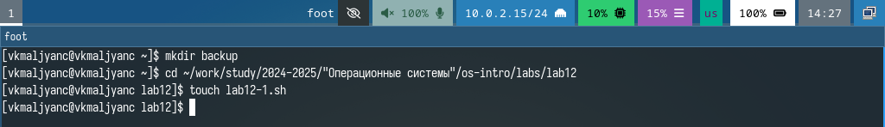{#fig:001 width=70%}

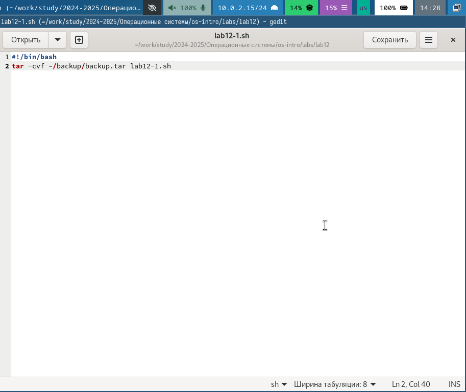{#fig:002 width=70%}

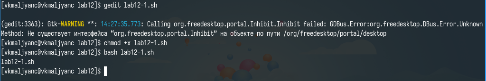{#fig:003 width=70%}

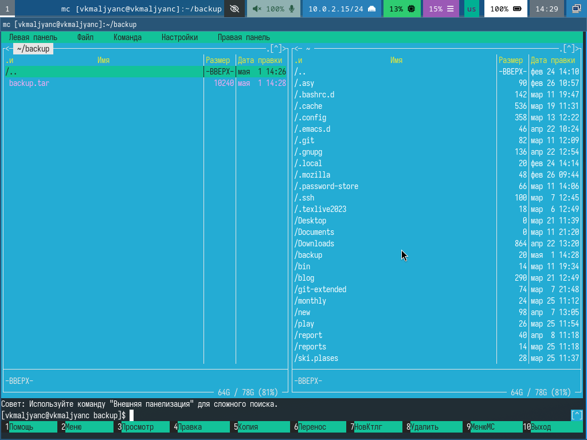{#fig:004 width=70%}

Пишу пример командного файла, обрабатывающего любое произвольное число аргументов командной строки, в том числе превышающее десять. Например, скрипт может последовательно распечатывать значения всех переданных аргументов (рис. [-@fig:005]) (рис. [-@fig:006]) (рис. [-@fig:007]).

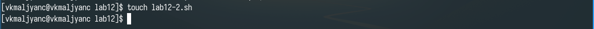{#fig:005 width=70%}

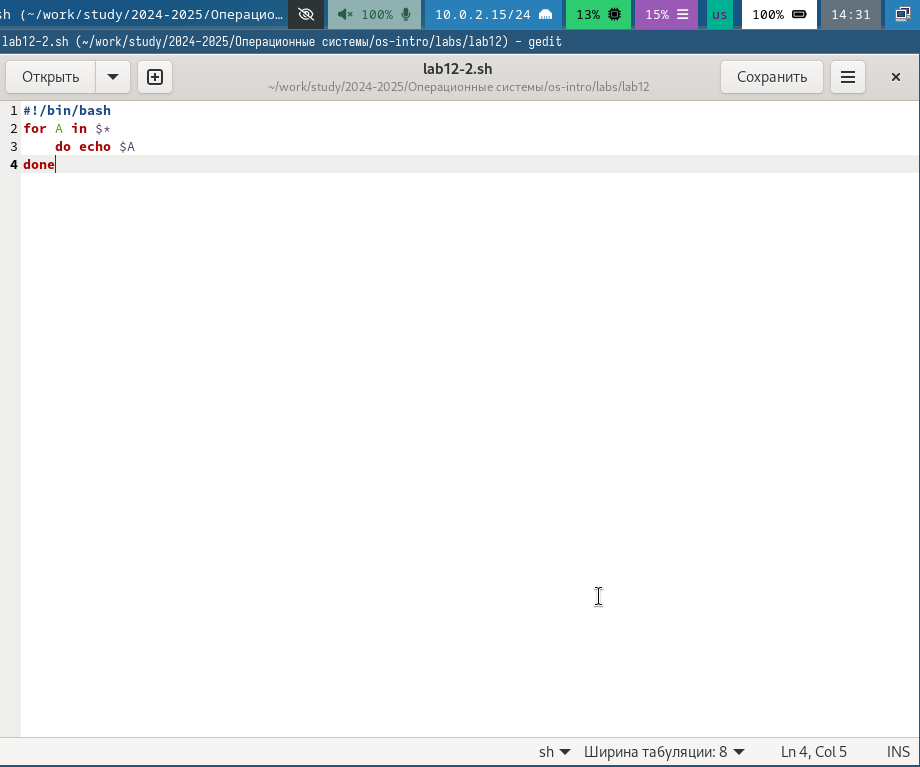{#fig:006 width=70%}

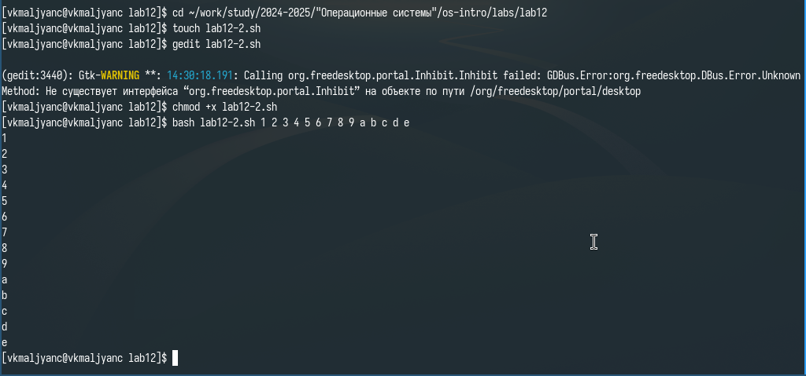{#fig:007 width=70%}

Пишу командный файл — аналог команды ls (без использования самой этой команды и команды dir). Требуется, чтобы он выдавал информацию о нужном каталоге и выводил информацию о возможностях доступа к файлам этого каталога (рис. [-@fig:008]) (рис. [-@fig:009]) (рис. [-@fig:010]).

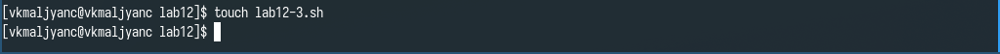{#fig:008 width=70%}

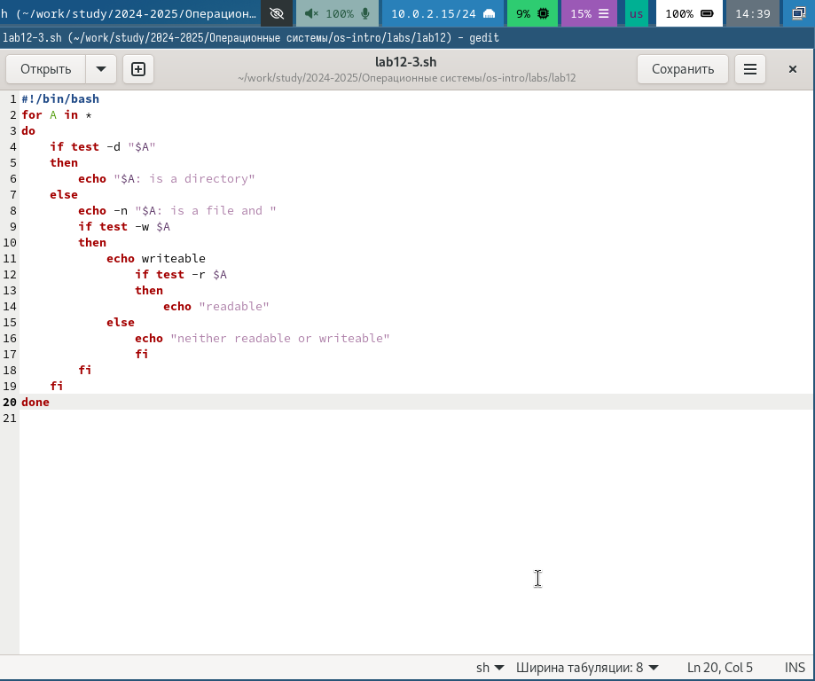{#fig:009 width=70%}

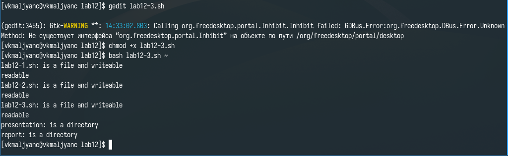{#fig:010 width=70%}

Пишу командный файл, который получает в качестве аргумента командной строки формат файла (.txt, .doc, .jpg, .pdf и т.д.) и вычисляет количество таких файлов в указанной директории. Путь к директории также передаётся в виде аргумента командной строки (рис. [-@fig:011]) (рис. [-@fig:012]) (рис. [-@fig:013]) [@lab12].

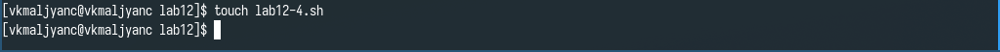{#fig:011 width=70%}

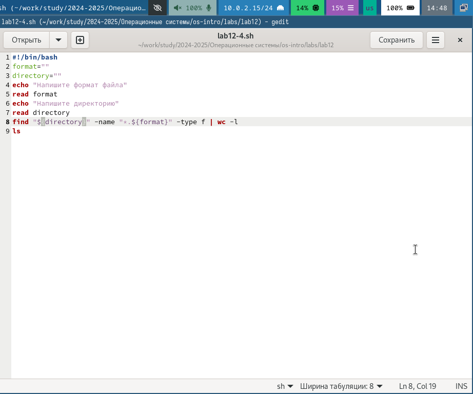{#fig:012 width=70%}

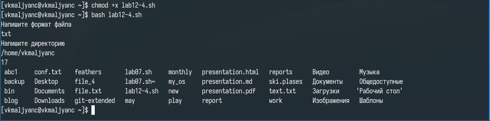{#fig:013 width=70%}

# Выводы

Я изучила основы программирования в оболочке ОС UNIX/Linux. Научилась писать небольшие командные файлы.

# Контрольные вопросы

1. Командная оболочка - это программа, которая предоставляет интерфейс для взаимодействия пользователя с операционной системой. Пример командных оболочек: Bash, Zsh, Fish, Tcsh. Отличия: синтаксис и функциональность команд, некоторые оболочки имеют встроенные функции автозаполнения и подсказок, поддержка скриптов и расширяемость.
2. POSIX - это стандарт, разработанный для обеспечения совместимости операционных систем с UNIX.
3. Переменные определяются с помощью синтаксиса имя=значение. Массивы определяются с помощью синтаксиса имя=(значение1, значение2, ...).
4. let используется для выполнения арифметических операций, read используется для чтения ввода от пользователя.
5. Сложение +, вычитание -, умножение *, деление /, остаток от деления %.
6. Операция (( )) используется для выполнения арифметических операций и условий.
7. $HOME (домашний каталог пользователя), $USER (имя текущего пользователя), $PATH (переменная, содержащая пути к исполняемым файлам), $PWD (текущий рабочий каталог).
8. Метасимволы - это специальные символы, которые имеют особое значение в командной оболочке, например: * - соответствует любому количеству символов, ? - соответствует любому одному символу, [] - соответствует любому символу из заданного набора.
9. Метасимволы можно экранизировать с помощью обратной косой черты \.
10. Чтобы создать командный файл, нужно: открыть его в текстовом редакторе, начало файла должно начинаться с шебанга, затем для запуска скрипта сделать файл исполняемым.
11. f() {}.
12. Чтобы понять, является файл каталогом или обычным файлом, можно использовать команду test или [].
13. set - используется для установки параметров оболочки и переменных. typeset - используется для объявления переменных и их атрибутов. unset - используется для удаления переменной или функции.
14. Параметры передаются в командный файл через позиционные параметры. Внутри скрипта можно получить доступ к параметрам через $1, $2 и так далее.
15. Специальные переменные языка bash: %? - код завершения последней выполненной команды, $$ - PID (идентификатор процесса) текущего скрипта, $# - количество переданных параметров, $@ - все переданные параметры, $* - все переданные параметры как одна строка.

# Список литературы{.unnumbered}

::: {#refs}
:::
