---
## Front matter
lang: ru-RU
title: Лабораторная работа № 13
subtitle: Программирование в командном процессоре ОС UNIX. Ветвления и циклы
author:
  - Мальянц В. К.
institute:
  - Российский университет дружбы народов, Москва, Россия
date: 08 мая 2025

## i18n babel
babel-lang: russian
babel-otherlangs: english

## Formatting pdf
toc: false
toc-title: Содержание
slide_level: 2
aspectratio: 169
section-titles: true
theme: metropolis
header-includes:
 - \metroset{progressbar=frametitle,sectionpage=progressbar,numbering=fraction}
---

# Цель работы

- Изучить основы программирования в оболочке ОС UNIX. Научится писать более сложные командные файлы с использованием логических управляющих конструкций и циклов.

# Задание

- Задание № 1. Используя команды getopts grep, написать командный файл, который анализирует командную строку с ключами, а затем ищет в указанном файле нужные строки, определяемые ключом -p.
- Задание № 2. Написать на языке Си программу, которая вводит число и определяет, является ли оно больше нуля, меньше нуля или равно нулю. Затем программа завершается с помощью функции exit(n), передавая информацию о коде завершения в оболочку. Командный файл должен вызывать эту программу и, проанализировав с помощью команды $?, выдать сообщение о том, какое число было введено.
- Задание № 3. Написать командный файл, создающий указанное число файлов, пронумерованных последовательно от 1 до N.
- Задание № 4. Написать командный файл, который с помощью команды tar запаковывает в архив все файлы в указанной директории. Модифицировать его так, чтобы запаковывались только те файлы, которые были изменены менее недели тому назад (использовать команду find).

# Выполнение лабораторной работы
## Задание № 1

- Создаю файлы input.txt и output.txt, открываю файл input.txt (рис. 1).

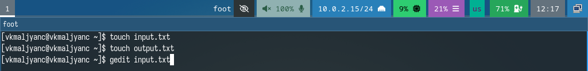{width=70%}

## Задание № 1

- Ввожу текст в файл input.txt (рис. 2).

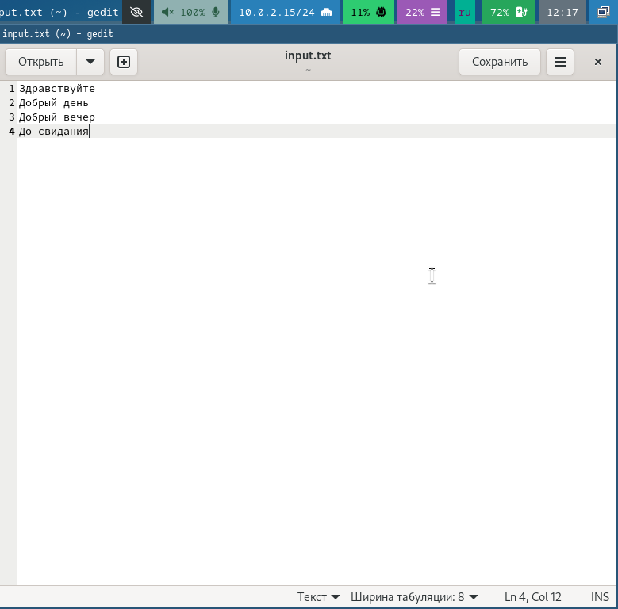{width=70%}

## Задание № 1

- Создаю файл lab13-1.sh и открываю его (рис. 3).

{width=70%}

## Задание № 1

- Ввожу код в файл lab13-1.sh (рис. 4).

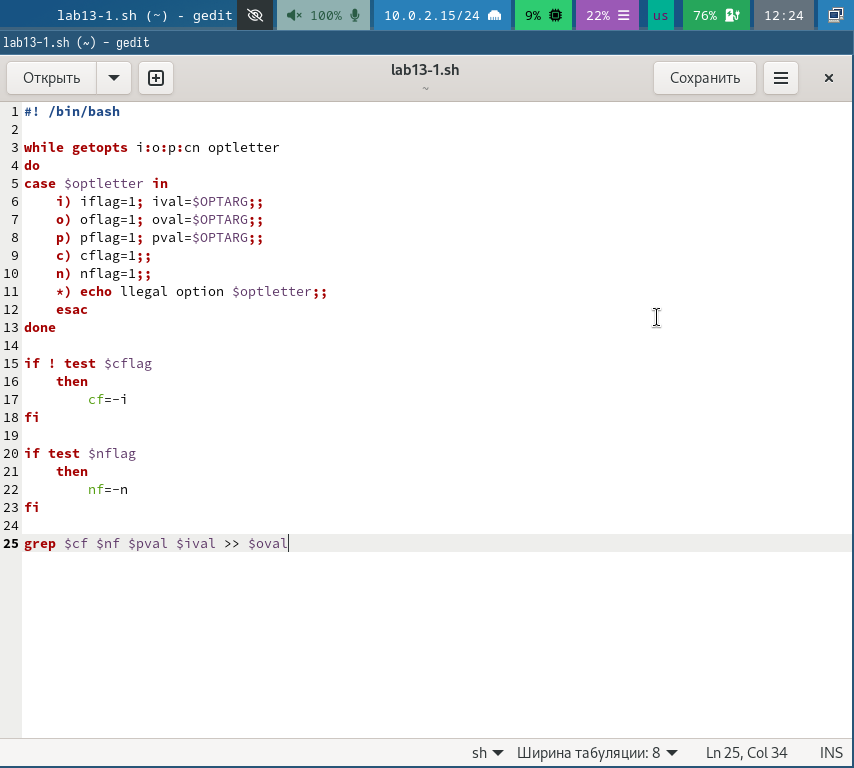{width=70%}

## Задание № 1

- Даю право на исполнение файла lab13-1.sh и запускаю его (рис. 5).

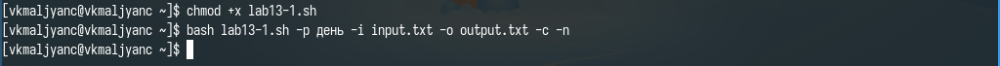{width=70%}

## Задание № 1

- Открываю файл output.txt (рис. 6).

{width=70%}

## Задание № 1

- Убеждаюсь в том, что программа работает корректно (рис. 7).

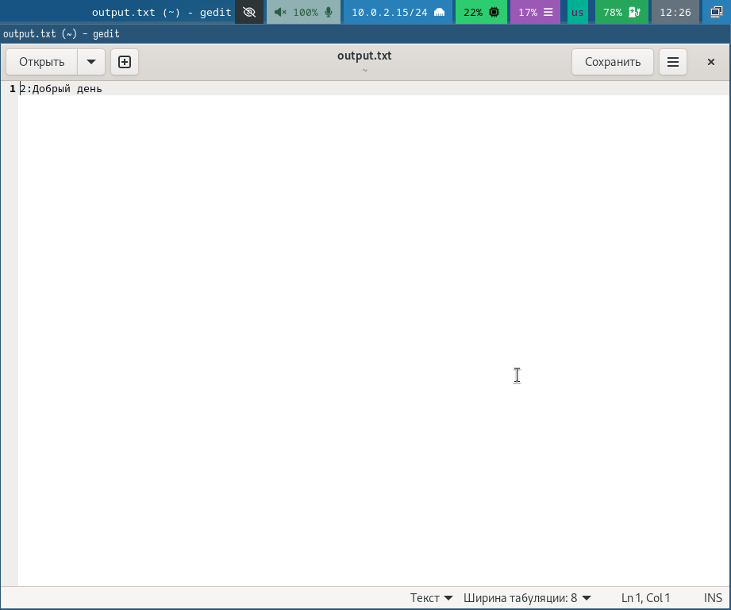{width=70%}

## Задание № 2

- Создаю файл lab13_2.c и открываю его (рис. 8).

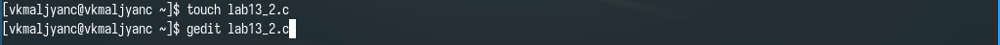{width=70%}

## Задание № 2

- Ввожу код в файл lab13_2.c (рис. 9).

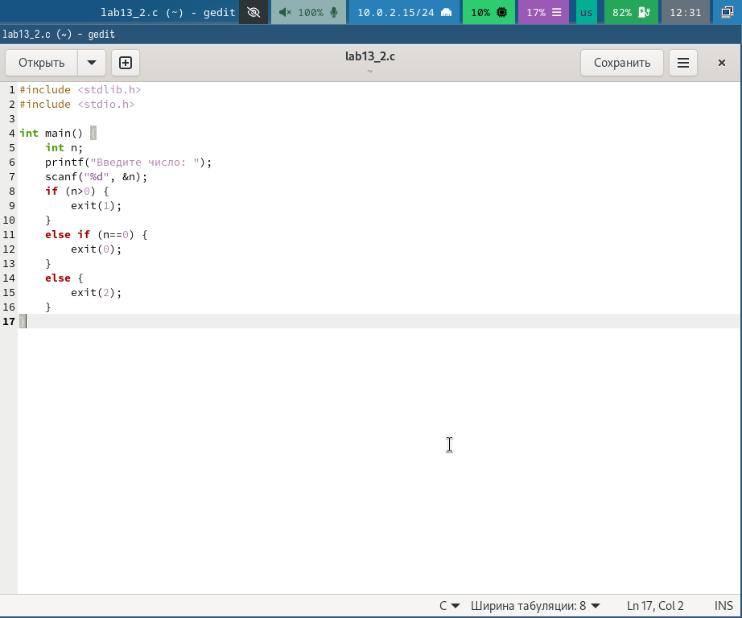{width=70%}

## Задание № 2

- Создаю файл lab13-2.sh и открываю его (рис. 10).

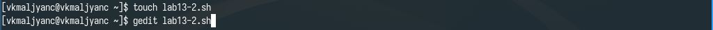{width=70%}

## Задание № 2

- Ввожу код в файл lab13-2.sh (рис. 11).

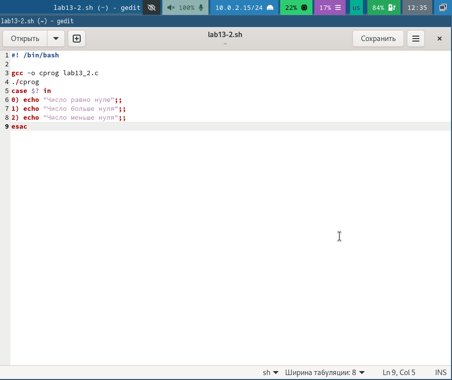{width=70%}

## Задание № 2

- Даю право на исполнение файла lab13-2.sh и запускаю его. Ввожу число 10. Убеждаюсь в том, что программа работает корректно (рис. 12).

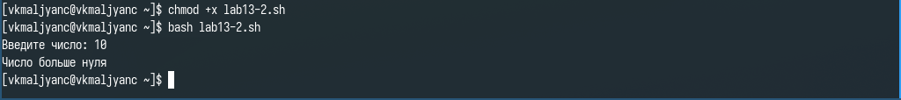{width=70%}

## Задание № 3

- Создаю файл lab13-3.sh и открываю его (рис. 13).

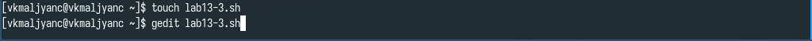{width=70%}

## Задание № 3

- Ввожу код в файл lab13-3.sh (рис. 14).

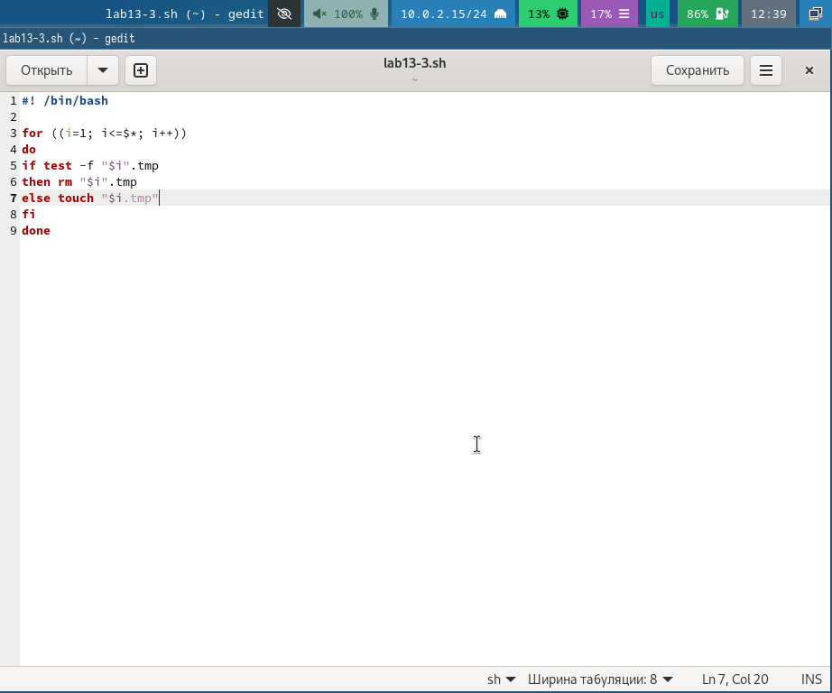{width=70%}

## Задание № 3

- Даю право на исполнение файла lab13-3.sh и запускаю его. Программа создала пять файлов: 1.tmp, 2.tmp, 3.tmp, 4.tmp, 5.tmp. После повторного ввода команды программа удалила созданные файлы. Убеждаюсь в том, что программа работает корректно (рис. 15).

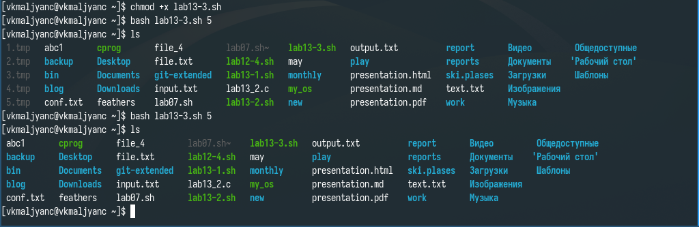{width=70%}

## Задание № 4

- Создаю файл lab13-4.sh и открываю его (рис. 16).

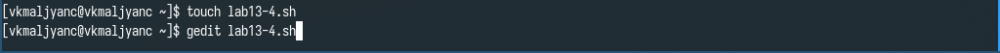{width=70%}

## Задание № 4

- Ввожу код в файл lab13-4.sh (рис. 17).

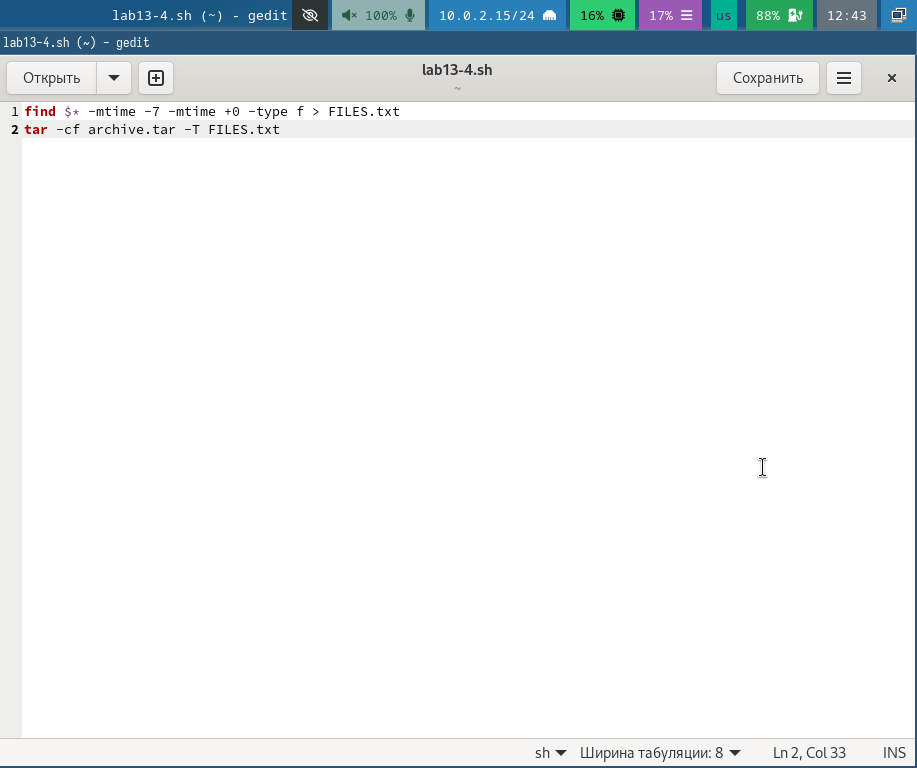{width=70%}

## Задание № 4

- Даю право на исполнение файла lab13-4.sh и запускаю его. Программа создает архив с файлами из каталога ski.plases (рис. 18).

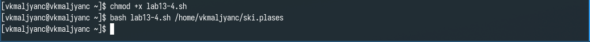{width=70%}

## Задание № 4

- Убеждаюсь в том, что программа работает корректно (рис. 19).

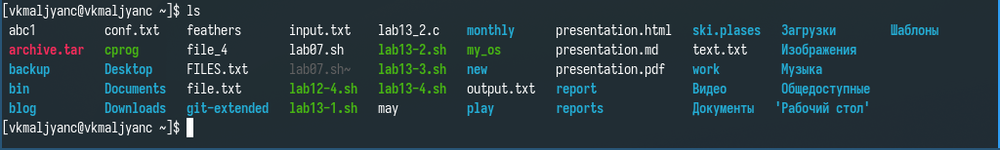{width=70%}

# Выводы

- Я изучила основы программирования в оболочке ОС UNIX. Научилась писать более сложные командные файлы с использованием логических управляющих конструкций и циклов.

# Спасибо за внимание
