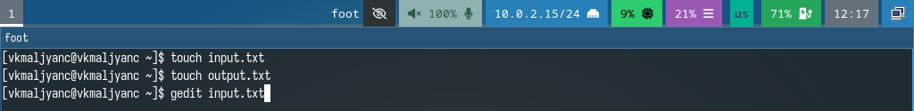

---
## Front matter
title: "Лабораторная работа № 13"
subtitle: "Программирование в командном процессоре ОС UNIX. Ветвления и циклы"
author: "Мальянц Виктория Кареновна"

## Generic otions
lang: ru-RU
toc-title: "Содержание"

## Bibliography
bibliography: bib/cite.bib
csl: pandoc/csl/gost-r-7-0-5-2008-numeric.csl

## Pdf output format
toc: true # Table of contents
toc-depth: 2
lof: true # List of figures
lot: true # List of tables
fontsize: 12pt
linestretch: 1.5
papersize: a4
documentclass: scrreprt
## I18n polyglossia
polyglossia-lang:
  name: russian
  options:
	- spelling=modern
	- babelshorthands=true
polyglossia-otherlangs:
  name: english
## I18n babel
babel-lang: russian
babel-otherlangs: english
## Fonts
mainfont: IBM Plex Serif
romanfont: IBM Plex Serif
sansfont: IBM Plex Sans
monofont: IBM Plex Mono
mathfont: STIX Two Math
mainfontoptions: Ligatures=Common,Ligatures=TeX,Scale=0.94
romanfontoptions: Ligatures=Common,Ligatures=TeX,Scale=0.94
sansfontoptions: Ligatures=Common,Ligatures=TeX,Scale=MatchLowercase,Scale=0.94
monofontoptions: Scale=MatchLowercase,Scale=0.94,FakeStretch=0.9
mathfontoptions:
## Biblatex
biblatex: true
biblio-style: "gost-numeric"
biblatexoptions:
  - parentracker=true
  - backend=biber
  - hyperref=auto
  - language=auto
  - autolang=other*
  - citestyle=gost-numeric
## Pandoc-crossref LaTeX customization
figureTitle: "Рис."
tableTitle: "Таблица"
listingTitle: "Листинг"
lofTitle: "Список иллюстраций"
lotTitle: "Список таблиц"
lolTitle: "Листинги"
## Misc options
indent: true
header-includes:
  - \usepackage{indentfirst}
  - \usepackage{float} # keep figures where there are in the text
  - \floatplacement{figure}{H} # keep figures where there are in the text
---

# Цель работы

Изучить основы программирования в оболочке ОС UNIX. Научится писать более сложные командные файлы с использованием логических управляющих конструкций и циклов.

# Задание

1. Задание № 1. Используя команды getopts grep, написать командный файл, который анализирует командную строку с ключами:
– -iinputfile — прочитать данные из указанного файла;
– -ooutputfile — вывести данные в указанный файл;
– -pшаблон — указать шаблон для поиска;
– -C — различать большие и малые буквы;
– -n — выдавать номера строк.
а затем ищет в указанном файле нужные строки, определяемые ключом -p.
2. Задание № 2. Написать на языке Си программу, которая вводит число и определяет, является ли оно больше нуля, меньше нуля или равно нулю. Затем программа завершается с помощью функции exit(n), передавая информацию в о коде завершения в оболочку. Командный файл должен вызывать эту программу и, проанализировав с помощью команды $?, выдать сообщение о том, какое число было введено.
3. Задание № 3. Написать командный файл, создающий указанное число файлов, пронумерованных последовательно от 1 до N (например 1.tmp, 2.tmp, 3.tmp,4.tmp и т.д.). Число файлов, которые необходимо создать, передаётся в аргументы командной строки. Этот же командный файл должен уметь удалять все созданные им файлы (если они существуют).
4. Задание № 4. Написать командный файл, который с помощью команды tar запаковывает в архив все файлы в указанной директории. Модифицировать его так, чтобы запаковывались только те файлы, которые были изменены менее недели тому назад (использовать команду find).
5. Контрольные вопросы

# Выполнение лабораторной работы
## Задание № 1

Создаю файлы input.txt и output.txt, открываю файл input.txt (рис. [-@fig:001]).

{#fig:001 width=70%}

Ввожу текст в файл input.txt (рис. [-@fig:002]).

{#fig:002 width=70%}

Создаю файл lab13-1.sh и открываю его (рис. [-@fig:003]).

{#fig:003 width=70%}

Ввожу код в файл lab13-1.sh (рис. [-@fig:004]).

{#fig:004 width=70%}

Листинг программы lab13-1.sh:

```
#! /bin/bash

while getopts i:o:p:cn optletter
do
case $optletter in
    i) iflag=1; ival=$OPTARG;;
    o) oflag=1; oval=$OPTARG;;
    p) pflag=1; pval=$OPTARG;;
    c) cflag=1;;
    n) nflag=1;;
    *) echo llegal option $optletter;;
    esac
done

if ! test $cflag
    then
        cf=-i
fi

if test $nflag
    then
        nf=-n
fi

grep $cf $nf $pval $ival >> $oval
```

Даю право на исполнение файла lab13-1.sh и запускаю его (рис. [-@fig:005]).

{#fig:005 width=70%}

Открываю файл output.txt (рис. [-@fig:006]).

{#fig:006 width=70%}

Убеждаюсь в том, что программа работает корректно (рис. [-@fig:007]).

{#fig:007 width=70%}

## Задание № 2

Создаю файл lab13_2.c и открываю его (рис. [-@fig:008]).

{#fig:008 width=70%}

Ввожу код в файл lab13_2.c (рис. [-@fig:009]).

{#fig:009 width=70%}

Создаю файл lab13-2.sh и открываю его (рис. [-@fig:010]).

{#fig:010 width=70%}

Ввожу код в файл lab13-2.sh (рис. [-@fig:011]).

{#fig:011 width=70%}

Листинг программы lab13-2.sh:

```
#! /bin/bash

gcc -o cprog lab13_2.c
./cprog
case $? in
0) echo "Число равно нулю";;
1) echo "Число больше нуля";;
2) echo "Число меньше нуля";;
esac
```

Даю право на исполнение файла lab13-2.sh и запускаю его. Ввожу число 10. Убеждаюсь в том, что программа работает корректно (рис. [-@fig:012]).

{#fig:012 width=70%}

## Задание № 3

Создаю файл lab13-3.sh и открываю его (рис. [-@fig:013]).

{#fig:013 width=70%}

Ввожу код в файл lab13-3.sh (рис. [-@fig:014]).

{#fig:014 width=70%}

Листинг программы lab13-3.sh:

```
#! /bin/bash

for ((i=1; i<=$*; i++))
do
if test -f "$i".tmp
then rm "$i".tmp
else touch "$i.tmp"
fi 
done
```

Даю право на исполнение файла lab13-3.sh и запускаю его. Программа создала пять файлов: 1.tmp, 2.tmp, 3.tmp, 4.tmp, 5.tmp. После повторного ввода команды программа удалила созданные файлы. Убеждаюсь в том, что программа работает корректно (рис. [-@fig:015]).

{#fig:015 width=70%}

## Задание № 4

Создаю файл lab13-4.sh и открываю его (рис. [-@fig:016]).

{#fig:016 width=70%}

Ввожу код в файл lab13-4.sh (рис. [-@fig:017]).

{#fig:017 width=70%}

Листинг программы lab13-4.sh:

```
find $* -mtime -7 -mtime +0 -type f > FILES.txt
tar -cf archive.tar -T FILES.txt
```

Даю право на исполнение файла lab13-3.sh и запускаю его. Программа создает архив с файлами из каталога ski.plases (рис. [-@fig:018]).

{#fig:018 width=70%}

Убеждаюсь в том, что программа работает корректно (рис. [-@fig:019]) [@lab13].

{#fig:019 width=70%}

# Выводы

Я изучила основы программирования в оболочке ОС UNIX. Научилась писать более сложные командные файлы с использованием логических управляющих конструкций и циклов.

# Контрольные вопросы

1. Команда getops используется в скриптах оболочки для разбора опций командрной строки.
2. Метасимволы используются оболочкой для сопоставления шаблонов имен файлов.
3. Условные операторы (if, then, else, fi, case, esac), циклы (for, while, until), операторы объединения команд (;, &&, ||).
4. Для прерывания цикла используются break и continue.
5. false - используется для команды, которая завершается всегда неудачно. true - используется для команды, которая всегда выполняется успешно.
6. Строка if test -f man$s/$i.$s проверяет, существует ли файл. 
7. while - выполняется блок кода, пока условие истинно. until - выполняет блок кода, пока условие ложно. Различие while и until состоит в том, что они логически противоположны друг другу.

# Список литературы{.unnumbered}

::: {#refs}
:::
