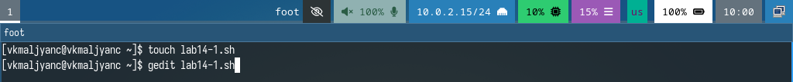
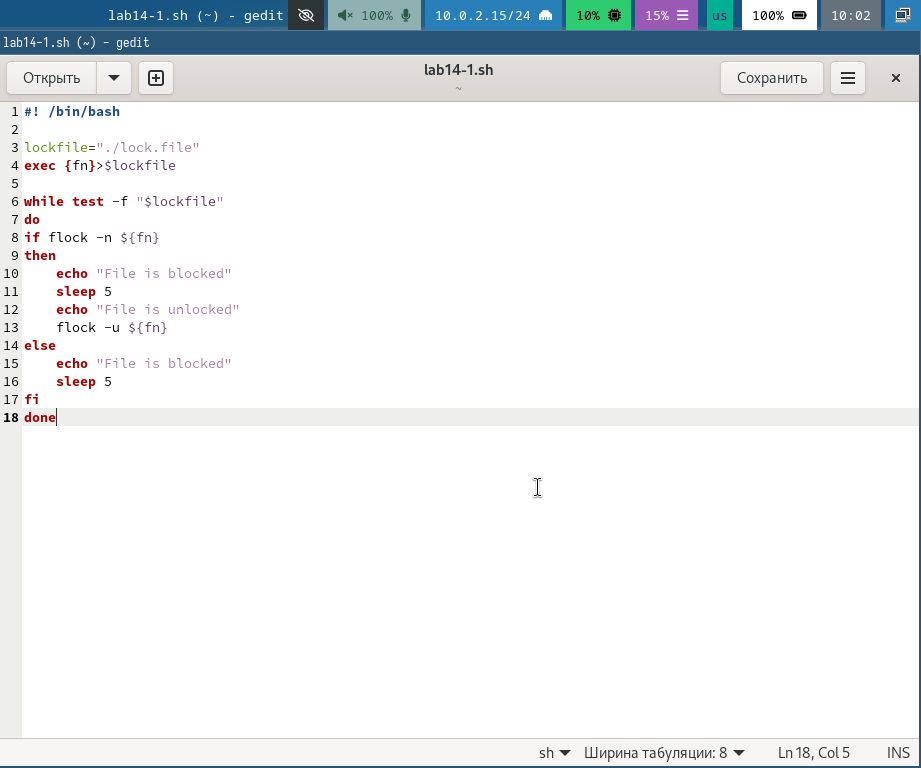
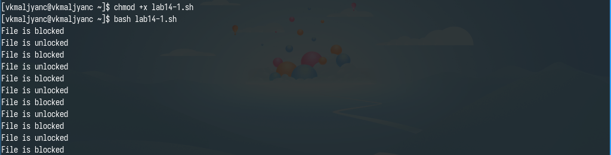
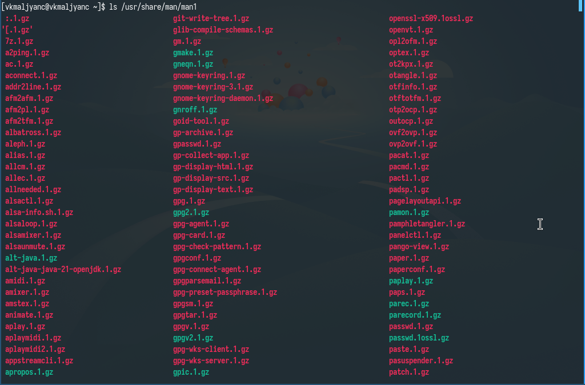
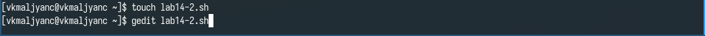
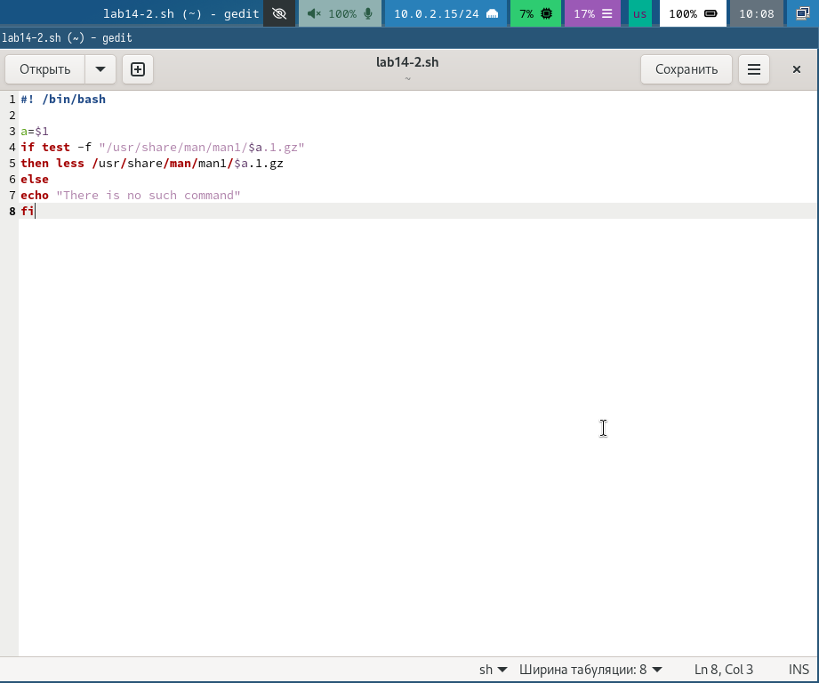
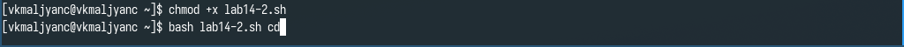
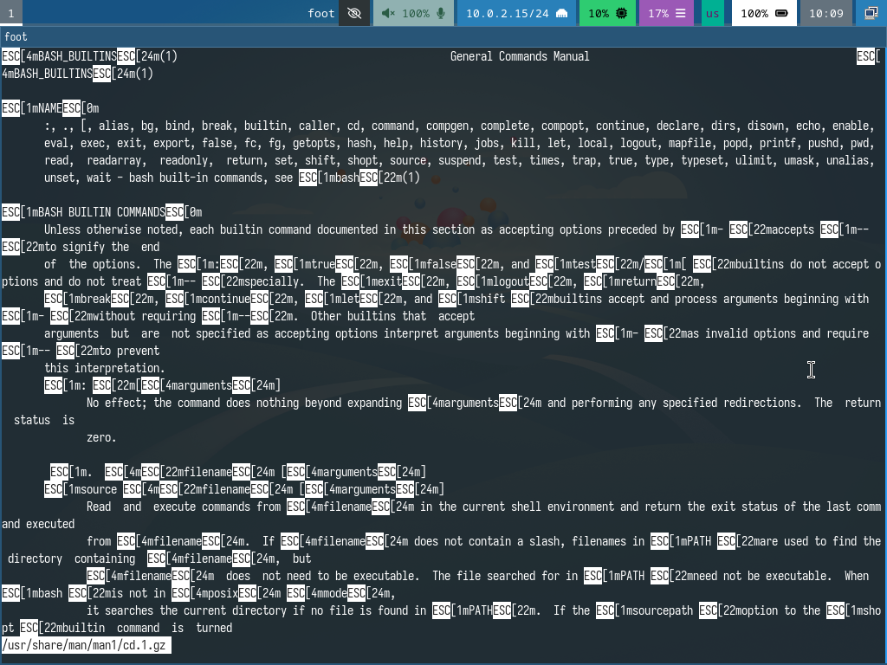
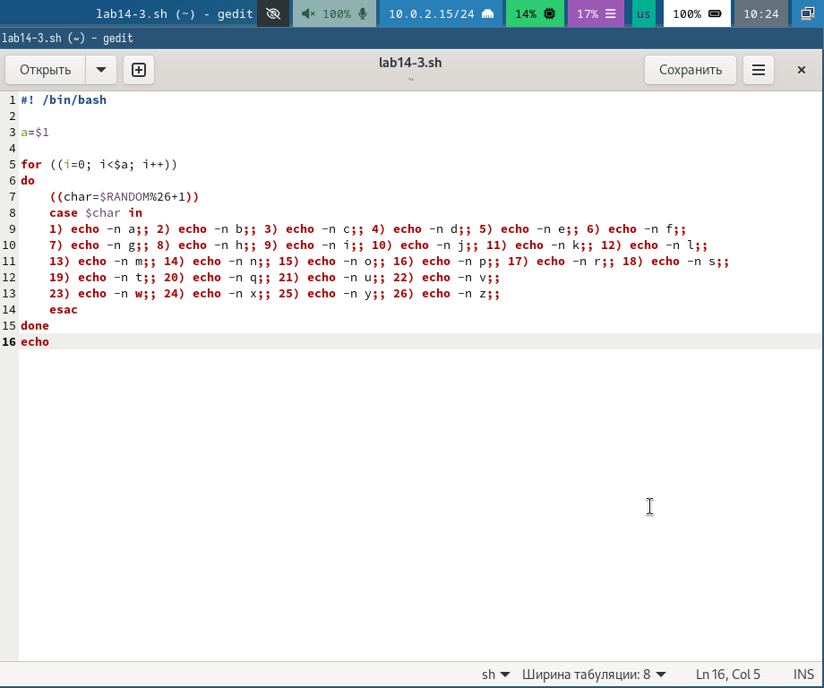
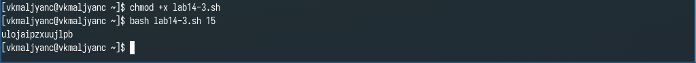

---
## Front matter
lang: ru-RU
title: Лабораторная работа № 14
subtitle: Программирование в командном процессоре ОС UNIX. Расширенное программирование
author:
  - Мальянц В. К.
institute:
  - Российский университет дружбы народов, Москва, Россия
date: 10 мая 2025

## i18n babel
babel-lang: russian
babel-otherlangs: english

## Formatting pdf
toc: false
toc-title: Содержание
slide_level: 2
aspectratio: 169
section-titles: true
theme: metropolis
header-includes:
 - \metroset{progressbar=frametitle,sectionpage=progressbar,numbering=fraction}
---

# Цель работы

- Изучить основы программирования в оболочке ОС UNIX. Научиться писать более сложные командные файлы с использованием логических управляющих конструкций и циклов.

# Задание

- Задание № 1. Написать командный файл, реализующий упрощённый механизм семафоров.
- Задание № 2. Реализовать команду man с помощью командного файла. Изучите содержимое ката-
лога /usr/share/man/man1. В нем находятся архивы текстовых файлов, содержащих
справку по большинству установленных в системе программ и команд. Каждый архив
можно открыть командой less сразу же просмотрев содержимое справки. Командный
файл должен получать в виде аргумента командной строки название команды и в виде
результата выдавать справку об этой команде или сообщение об отсутствии справки,
если соответствующего файла нет в каталоге man1.
- Задание № 3. Используя встроенную переменную $RANDOM, напишите командный файл, генерирую-
щий случайную последовательность букв латинского алфавита. Учтите, что $RANDOM
выдаёт псевдослучайные числа в диапазоне от 0 до 32767.

# Выполнение лабораторной работы
## Задание № 1

- Создаю файл lab14-1.sh и открываю его (рис. 1).

{width=70%}

## Задание № 1

- Ввожу код в файл lab14-1.sh (рис. 2).

{width=70%}

## Задание № 1

- Даю право на исполнение файла lab14-1.sh и запускаю его. Убеждаюсь в том, что программа работает корректно (рис. 3).

{width=70%}

## Задание № 2

- Просматриваю содержимое /usr/share/man/man1 (рис. 4).

{width=70%}

## Задание № 2

- Создаю файл lab14-2.sh и открываю его (рис. 5).

{width=70%}

## Задание № 2

- Ввожу код в файл lab14-2.sh (рис. 6).

{width=70%}

## Задание № 2

- Даю право на исполнение файла lab14-2.sh и запускаю его (рис. 7).

{width=70%}

## Задание № 2

- Убеждаюсь в том, что программа работает корректно (рис. 8).

{width=70%}

## Задание № 3

- Создаю файл lab14-3.sh и открываю его (рис. 9).

{width=70%}

## Задание № 3

- Ввожу код в файл lab14-3.sh (рис. 10).

{width=70%}

## Задание № 3

- Даю право на исполнение файла lab14-3.sh и запускаю его. Убеждаюсь в том, что программа работает корректно (рис. 11).

{width=70%}

# Выводы

- Я изучила основы программирования в оболочке ОС UNIX. Научилась писать более сложные командные файлы с использованием логических управляющих конструкций и циклов.

# Спасибо за внимание
