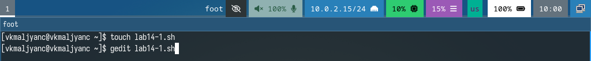
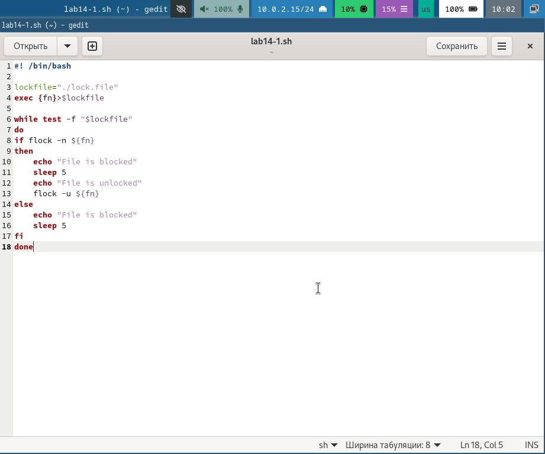
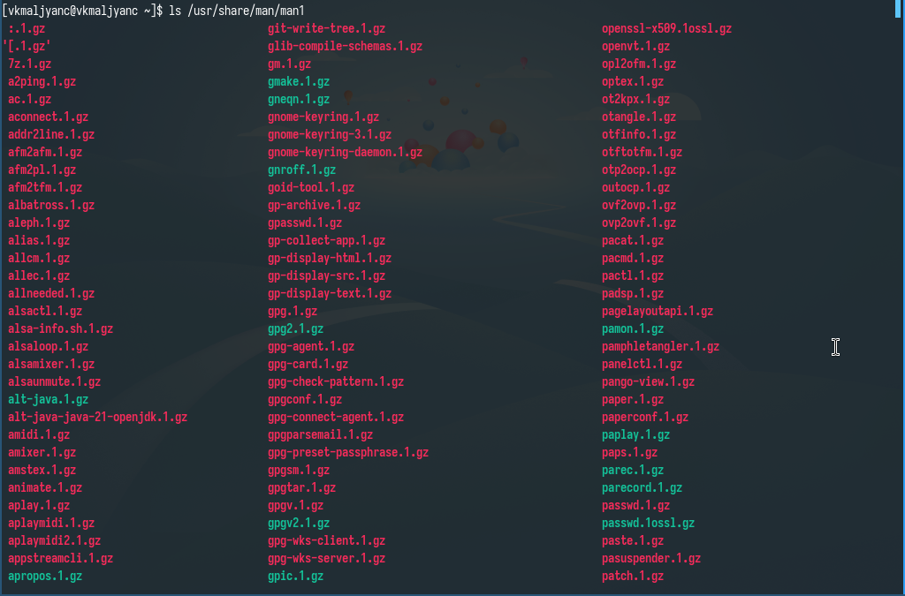
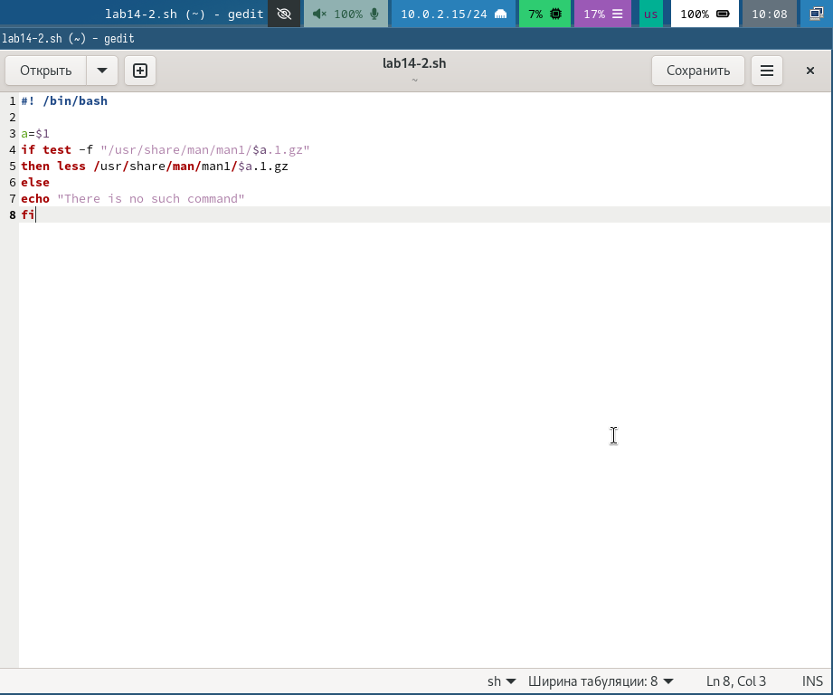
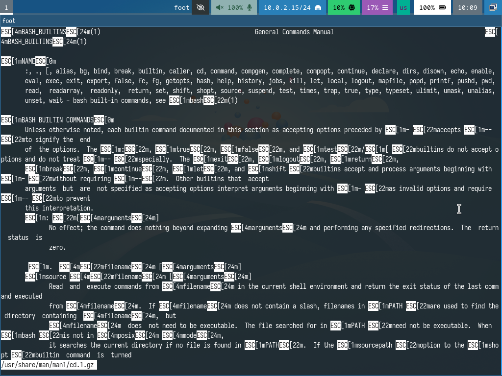
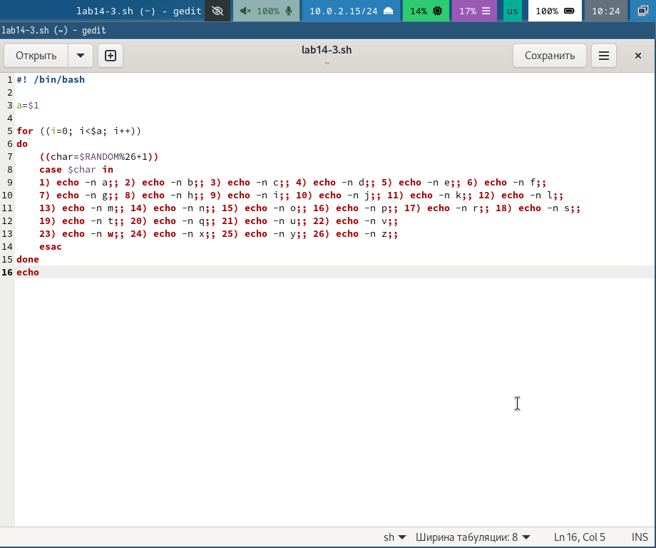
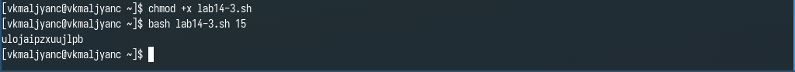

---
## Front matter
title: "Лабораторная работа № 14"
subtitle: "Программирование в командном процессоре ОС UNIX. Расширенное программирование"
author: "Мальянц Виктория Кареновна"

## Generic otions
lang: ru-RU
toc-title: "Содержание"

## Bibliography
bibliography: bib/cite.bib
csl: pandoc/csl/gost-r-7-0-5-2008-numeric.csl

## Pdf output format
toc: true # Table of contents
toc-depth: 2
lof: true # List of figures
lot: true # List of tables
fontsize: 12pt
linestretch: 1.5
papersize: a4
documentclass: scrreprt
## I18n polyglossia
polyglossia-lang:
  name: russian
  options:
	- spelling=modern
	- babelshorthands=true
polyglossia-otherlangs:
  name: english
## I18n babel
babel-lang: russian
babel-otherlangs: english
## Fonts
mainfont: IBM Plex Serif
romanfont: IBM Plex Serif
sansfont: IBM Plex Sans
monofont: IBM Plex Mono
mathfont: STIX Two Math
mainfontoptions: Ligatures=Common,Ligatures=TeX,Scale=0.94
romanfontoptions: Ligatures=Common,Ligatures=TeX,Scale=0.94
sansfontoptions: Ligatures=Common,Ligatures=TeX,Scale=MatchLowercase,Scale=0.94
monofontoptions: Scale=MatchLowercase,Scale=0.94,FakeStretch=0.9
mathfontoptions:
## Biblatex
biblatex: true
biblio-style: "gost-numeric"
biblatexoptions:
  - parentracker=true
  - backend=biber
  - hyperref=auto
  - language=auto
  - autolang=other
  - citestyle=gost-numeric
## Pandoc-crossref LaTeX customization
figureTitle: "Рис."
tableTitle: "Таблица"
listingTitle: "Листинг"
lofTitle: "Список иллюстраций"
lotTitle: "Список таблиц"
lolTitle: "Листинги"
## Misc options
indent: true
header-includes:
  - \usepackage{indentfirst}
  - \usepackage{float} # keep figures where there are in the text
  - \floatplacement{figure}{H} # keep figures where there are in the text
---

# Цель работы

Изучить основы программирования в оболочке ОС UNIX. Научиться писать более сложные командные файлы с использованием логических управляющих конструкций и циклов.

# Задание

1. Задание № 1. Написать командный файл, реализующий упрощённый механизм семафоров. Ко-
мандный файл должен в течение некоторого времени t1 дожидаться освобождения
ресурса, выдавая об этом сообщение, а дождавшись его освобождения, использовать
его в течение некоторого времени t2<>t1, также выдавая информацию о том, что
ресурс используется соответствующим командным файлом (процессом). Запустить
командный файл в одном виртуальном терминале в фоновом режиме, перенаправив
его вывод в другой (> /dev/tty#, где # — номер терминала куда перенаправляется
вывод), в котором также запущен этот файл, но не фоновом, а в привилегированном
режиме. Доработать программу так, чтобы имелась возможность взаимодействия трёх
и более процессов.
2. Задание № 2. Реализовать команду man с помощью командного файла. Изучите содержимое ката-
лога /usr/share/man/man1. В нем находятся архивы текстовых файлов, содержащих
справку по большинству установленных в системе программ и команд. Каждый архив
можно открыть командой less сразу же просмотрев содержимое справки. Командный
файл должен получать в виде аргумента командной строки название команды и в виде
результата выдавать справку об этой команде или сообщение об отсутствии справки,
если соответствующего файла нет в каталоге man1.
3. Задание № 3. Используя встроенную переменную $RANDOM, напишите командный файл, генерирую-
щий случайную последовательность букв латинского алфавита. Учтите, что $RANDOM
выдаёт псевдослучайные числа в диапазоне от 0 до 32767.
4. Контрольные вопросы

# Выполнение лабораторной работы
## Задание № 1

Создаю файл lab14-1.sh и открываю его (рис. [-@fig:001]).

{#fig:001 width=70%}

Ввожу код в файл lab14-1.sh (рис. [-@fig:002]).

{#fig:002 width=70%}

Листинг программы:

```
#! /bin/bash

lockfile="./lock.file"
exec {fn}>$lockfile

while test -f "$lockfile"
do
if flock -n ${fn}
then
    echo "File is blocked"
    sleep 5
    echo "File is unlocked"
    flock -u ${fn}
else
    echo "File is blocked"
    sleep 5
fi
done
```

Даю право на исполнение файла lab14-1.sh и запускаю его. Убеждаюсь в том, что программа работает корректно (рис. [-@fig:003]).

{#fig:003 width=70%}

## Задание № 2

Просматриваю содержимое /usr/share/man/man1 (рис. [-@fig:004]).

{#fig:004 width=70%}

Создаю файл lab14-2.sh и открываю его (рис. [-@fig:005]).

{#fig:005 width=70%}

Ввожу код в файл lab14-2.sh (рис. [-@fig:006]).

{#fig:006 width=70%}

Листинг программы:

```
#! /bin/bash

a=$1
if test -f "/usr/share/man/man1/$a.1.gz"
then less /usr/share/man/man1/$a.1.gz
else
echo "There is no such command"
fi
```

Даю право на исполнение файла lab14-2.sh и запускаю его (рис. [-@fig:007]).

{#fig:007 width=70%}

Убеждаюсь в том, что программа работает корректно (рис. [-@fig:008]).

{#fig:008 width=70%}

## Задание № 3

Создаю файл lab14-3.sh и открываю его (рис. [-@fig:009]).

{#fig:009 width=70%}

Ввожу код в файл lab14-3.sh (рис. [-@fig:010]).

{#fig:010 width=70%}

Листинг программы:

```
#! /bin/bash

a=$1

for ((i=0; i<$a; i++))
do
    ((char=$RANDOM%26+1))
    case $char in
    1) echo -n a;; 2) echo -n b;; 3) echo -n c;; 4) echo -n d;; 5) echo -n e;; 6) echo -n f;;
    7) echo -n g;; 8) echo -n h;; 9) echo -n i;; 10) echo -n j;; 11) echo -n k;; 12) echo -n l;;
    13) echo -n m;; 14) echo -n n;; 15) echo -n o;; 16) echo -n p;; 17) echo -n r;; 18) echo -n s;;
    19) echo -n t;; 20) echo -n q;; 21) echo -n u;; 22) echo -n v;; 
    23) echo -n w;; 24) echo -n x;; 25) echo -n y;; 26) echo -n z;; 
    esac
done 
echo
```

Даю право на исполнение файла lab14-3.sh и запускаю его. Убеждаюсь в том, что программа работает корректно (рис. [-@fig:011]) [@lab14].

{#fig:011 width=70%}

# Выводы

Я изучила основы программирования в оболочке ОС UNIX. Научилась писать более сложные командные файлы с использованием логических управляющих конструкций и циклов.

# Контрольные вопросы

1. Пробел должен быть между [ и условием.
2. В bash можно объединить строки, используя оператор + или просто ставя строки рядом.
3. Утилита seq используется для генерации последовательностей чисел. Иные способы: использование цикла for, использование printf.
4. Результат будет 3, так как в bash происходит целочисленное деление.
5. Отличия командной оболочки zsh от bash: расширенные возможности автозаполнения, темы и плагины, маски, глобальные алиасы.
6. Верен.
7. Примущества: простота использования, интеграция с системными утилитами, низкий уровень. Недостатки: ограниченная функциональность, отсутствие строгой типизации, медлительность (по сравнению с компилируемыми языками, такими как C или Go).

# Список литературы{.unnumbered}

::: {#refs}
:::
