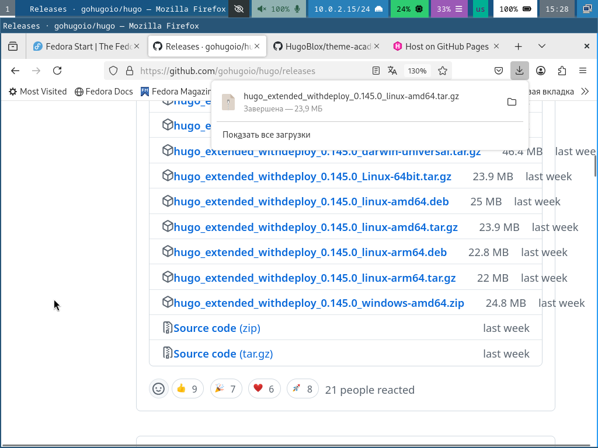
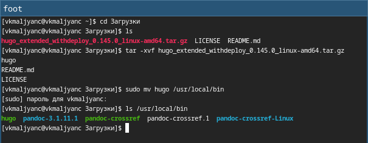
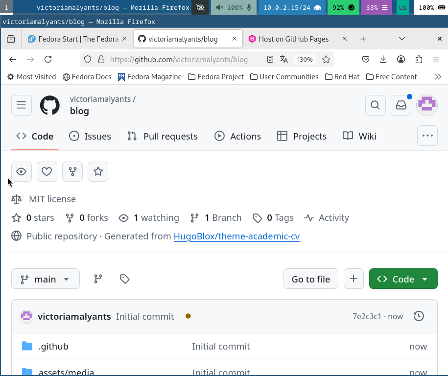
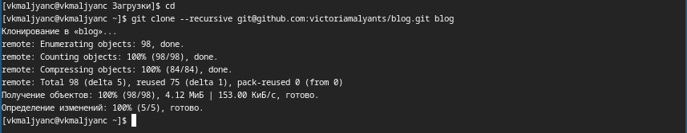
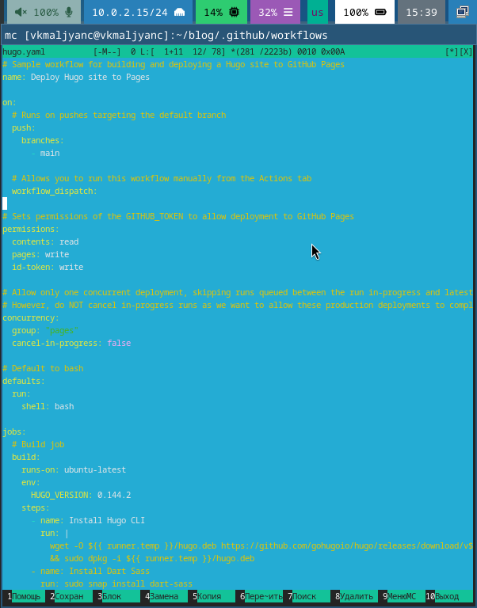
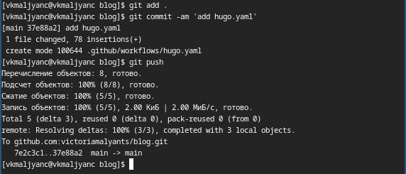
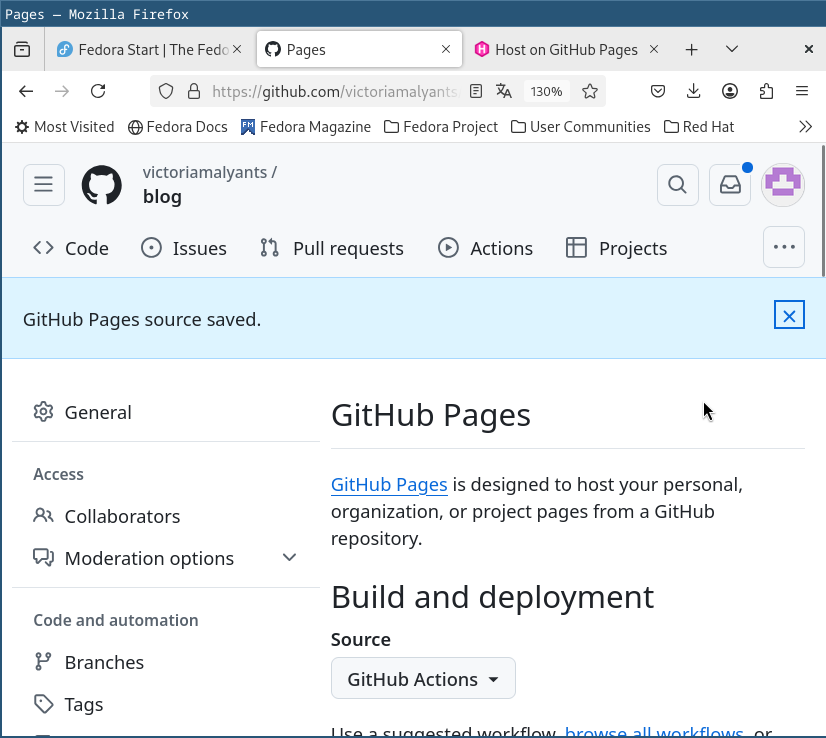
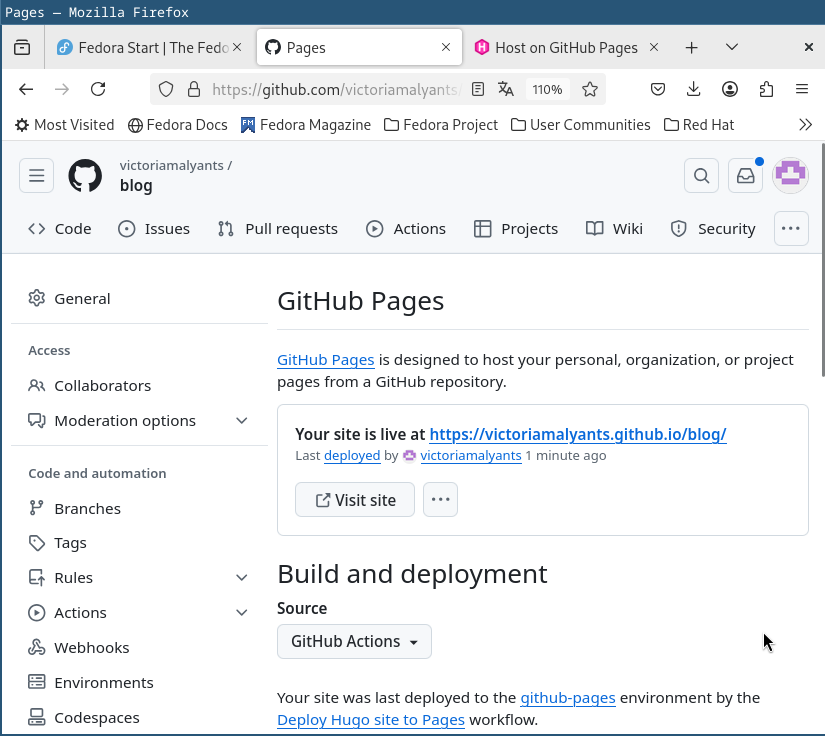

---
## Front matter
lang: ru-RU
title: Индивидуальный проект этап 1
subtitle: Размещение на Github pages заготовки для персонального сайта
author:
  - Мальянц В. К.
institute:
  - Российский университет дружбы народов, Москва, Россия
date: 08 марта 2025

## i18n babel
babel-lang: russian
babel-otherlangs: english

## Formatting pdf
toc: false
toc-title: Содержание
slide_level: 2
aspectratio: 169
section-titles: true
theme: metropolis
header-includes:
 - \metroset{progressbar=frametitle,sectionpage=progressbar,numbering=fraction}
---

# Цель работы

- Научиться размещать на Github pages заготовки для персонального сайта.

# Задание

- Установка необходимого программного обеспечения
- Создание репозитория
- Размещение заготовки на Github pages

# Выполнение лабораторной работы
## Установить необходимое программное обеспечение

- Захожу на сайт https://github.com/gohugoio/hugo/releases и скачиваю нужную версию hugo (рис. 1).

{width=70%}

## Установить необходимое программное обеспечение

- Распаковываю архив и перемещаю hugo в /usr/local/bin (рис. 2).

{width=70%}

## Создание репозитория

- Создаю репозиторий blog (рис. 3).

{width=70%}

## Создание репозитория

- Клонирую репозиторий на свой локальный компьютер (рис. 4).

{width=70%}

## Размещение заготовки на Github pages

- Создаю каталог .github/workflows и файл hugo.yaml в нем (рис. 5).

{width=70%}

## Размещение заготовки на Github pages

- Открываю mc (рис. 6).

{width=70%}

## Размещение заготовки на Github pages

- Редактирую файл hugo.yaml (рис. 7).

{width=70%}

## Размещение заготовки на Github pages

- Отправляю данные на github (рис. 8).

{width=70%}

## Размещение заготовки на Github pages

- Меняю настройки GitHub Pages в разделе Build and deployment на GitHub Actions (рис. 9).

{width=70%}

## Размещение заготовки на Github pages

- Появилась ссылка на сайт (рис. 10).

{width=70%}

## Размещение заготовки на Github pages

- Перехожу по ссылке на сайт, открываю его (рис. 11).

{width=70%}

# Выводы

- Я научилась размещать на Github pages заготовки для персонального сайта.

# Спасибо за внимание
