---
## Front matter
lang: ru-RU
title: Индивидуальный проект этап № 2
subtitle: Добавление к сайту данных о себе
author:
  - Мальянц В. К.
institute:
  - Российский университет дружбы народов, Москва, Россия
date: 22 марта 2025

## i18n babel
babel-lang: russian
babel-otherlangs: english

## Formatting pdf
toc: false
toc-title: Содержание
slide_level: 2
aspectratio: 169
section-titles: true
theme: metropolis
header-includes:
 - \metroset{progressbar=frametitle,sectionpage=progressbar,numbering=fraction}
---

# Цель работы

- Научиться добавлять на сайте данные о себе.

# Задание

- Добавить фотографию, описание, информацию об интересах и об образовании
- Сделать пост о прошедшей неделе
- Добавить пост на тему "Управление версиями. Git"

# Выполнение лабораторной работы
## Добавить фотографию, описание, информацию об интересах и об образовании

- Перехожу в каталог admin и добавляю фотографию владельца сайта (рис. 1).

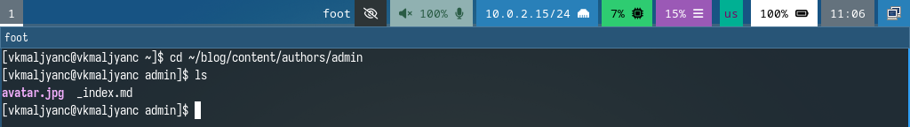{width=70%}

## Добавить фотографию, описание, информацию об интересах и об образовании

- Редактирую файл, добавляю описание, информацию об интересах и об образовании (рис. 2).

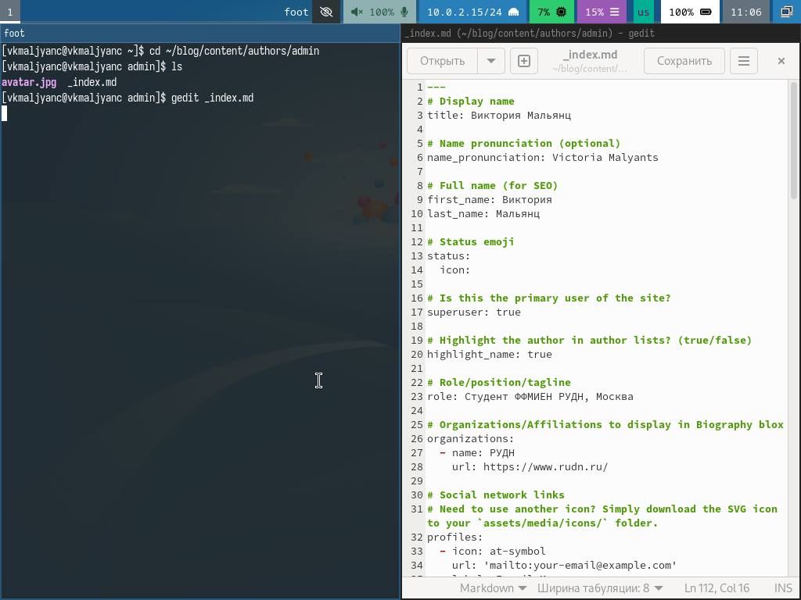{width=70%}

## Добавить фотографию, описание, информацию об интересах и об образовании

- Добавляю изменения на githib (рис. 3).

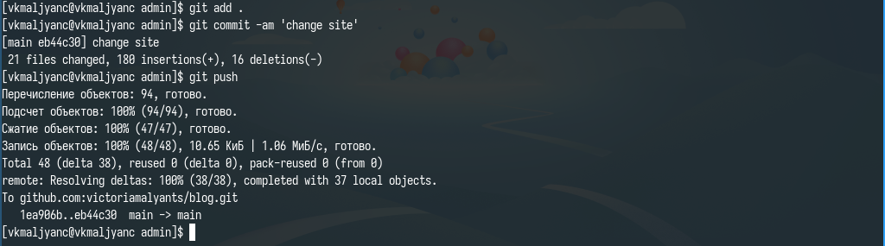{width=70%}

## Добавить фотографию, описание, информацию об интересах и об образовании

- Перехожу в каталог blog и компилирую сайт (рис. 4).

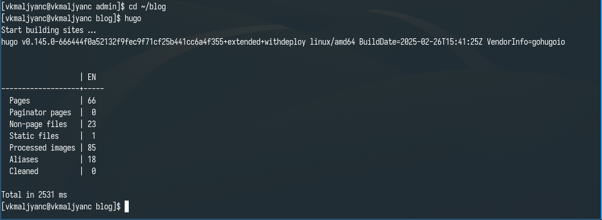{width=70%}

## Добавить фотографию, описание, информацию об интересах и об образовании

- Получаю ссылку на сайт (рис. 5).

{width=70%}

## Добавить фотографию, описание, информацию об интересах и об образовании

- Убеждаюсь в том, что изменения добавлены (рис. 6).

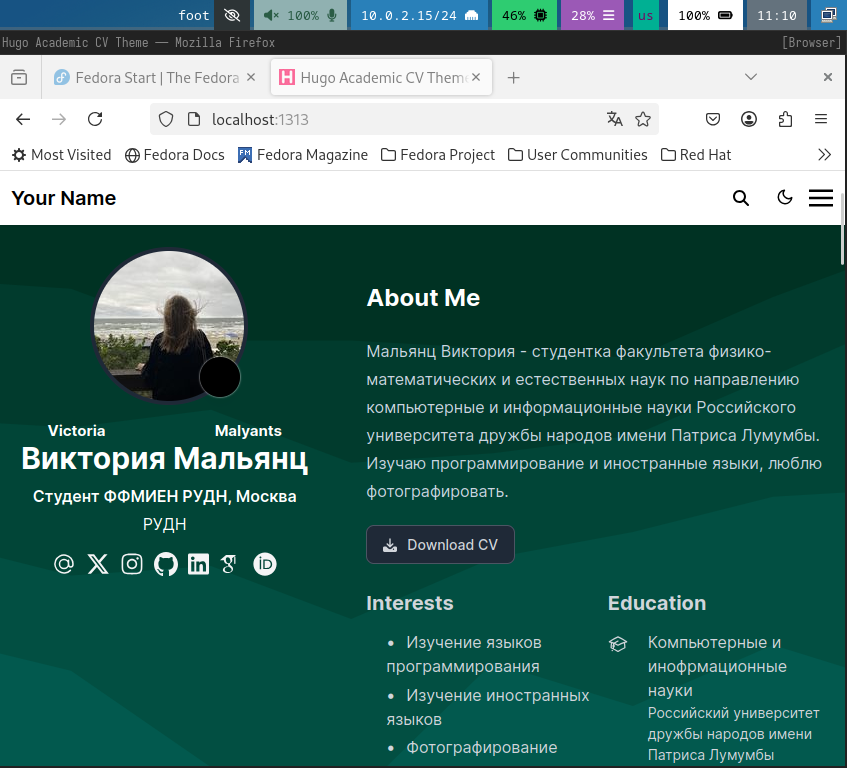{width=70%}

## Сделать пост о прошедшей неделе

- Редактирую файл, пишу пост о прошедшей неделе (рис. 7).

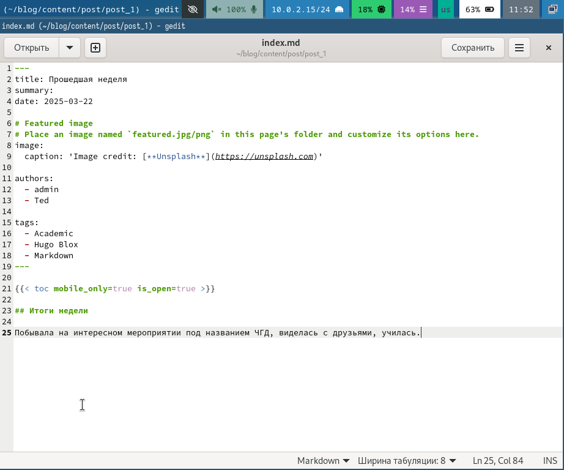{width=70%}

## Сделать пост о прошедшей неделе

- Добавляю изменения на githib (рис. 8).

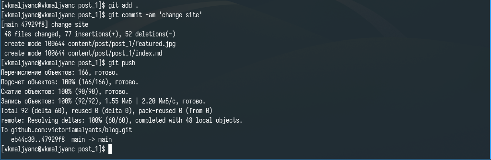{width=70%}

## Сделать пост о прошедшей неделе

- Перехожу в каталог blog и компилирую сайт (рис. 9).

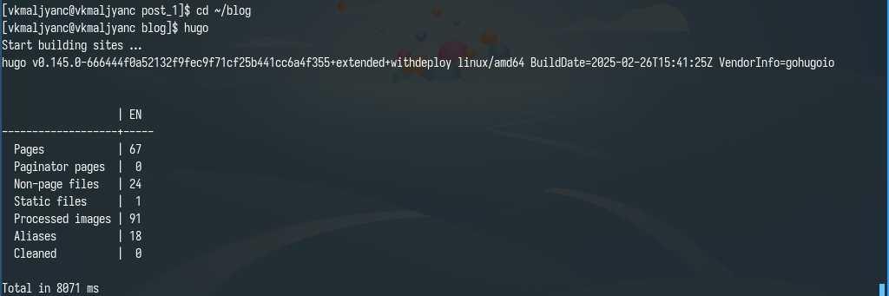{width=70%}

## Сделать пост о прошедшей неделе

- Получаю ссылку на сайт (рис. 10).

{width=70%}

## Сделать пост о прошедшей неделе

- Убеждаюсь в том, что изменения добавлены (рис. 11).

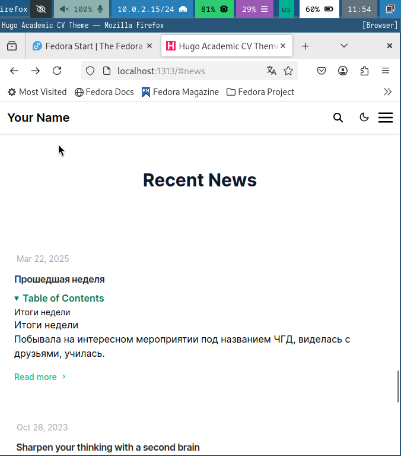{width=70%}

## Добавить пост на тему "Управление версиями. Git"

- Редактирую файл, пишу пост на тему "Управление версиями. Git" (рис. 12).

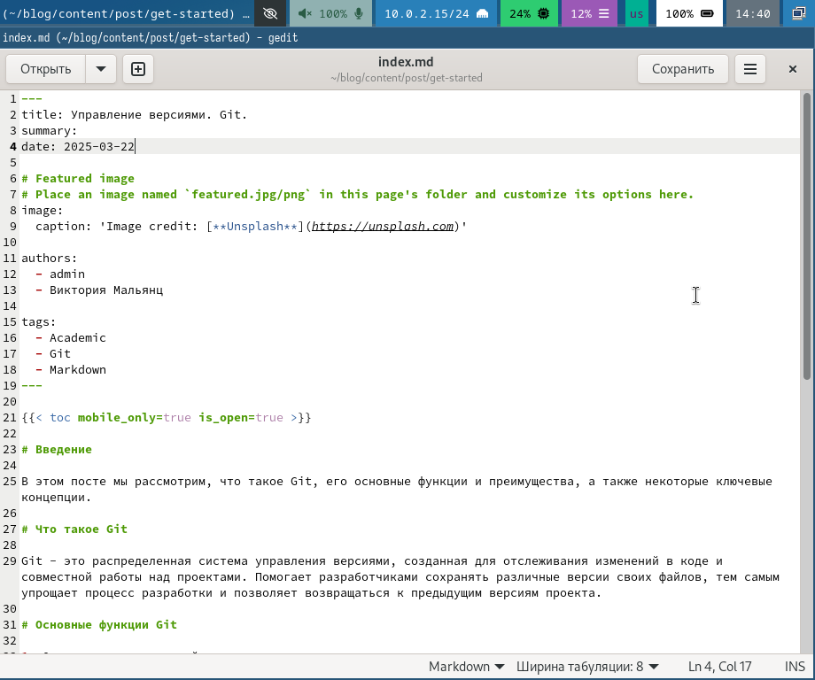{width=70%}

## Добавить пост на тему "Управление версиями. Git"

- Добавляю изменения на githib (рис. 13).

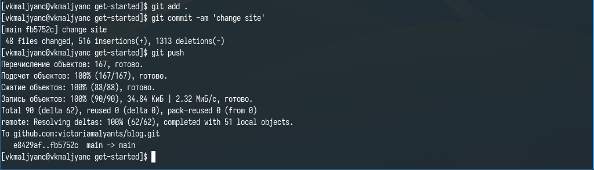{width=70%}

## Добавить пост на тему "Управление версиями. Git"

- Перехожу в каталог blog и компилирую сайт (рис. 14).

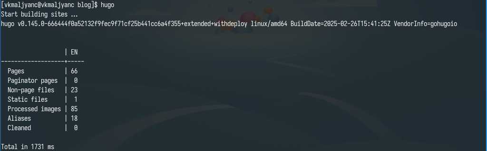{width=70%}

## Добавить пост на тему "Управление версиями. Git"

- Получаю ссылку на сайт (рис. 15).

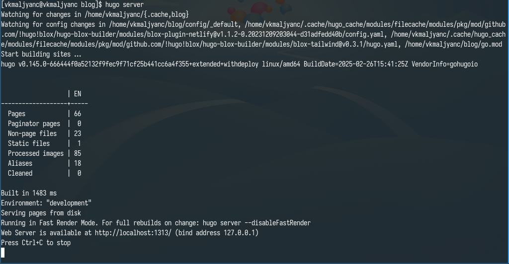{width=70%}

## Добавить пост на тему "Управление версиями. Git"

- Убеждаюсь в том, что изменения добавлены (рис. 16).

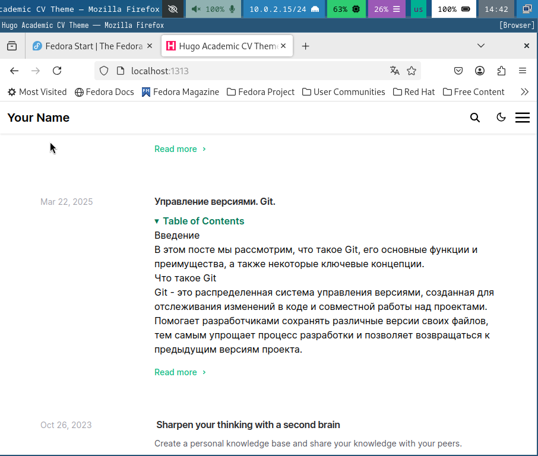{width=70%}

# Выводы

- Я научилась добавлять на сайте данные о себе.

# Спасибо за внимание
