---
## Front matter
lang: ru-RU
title: Индивидуальный проект этап № 3
subtitle: Добавление к сайту достижений
author:
  - Мальянц В. К.
institute:
  - Российский университет дружбы народов, Москва, Россия
date: 31 марта 2025

## i18n babel
babel-lang: russian
babel-otherlangs: english

## Formatting pdf
toc: false
toc-title: Содержание
slide_level: 2
aspectratio: 169
section-titles: true
theme: metropolis
header-includes:
 - \metroset{progressbar=frametitle,sectionpage=progressbar,numbering=fraction}
---

# Цель работы

- Научиться добавлять к сайту достижения.

# Задание

- Добавить список достижений: информацию о навыках, опыте, достижениях
- Сделать пост по прошедшей неделе
- Добавить пост на тему: "Язык разметки Markdown"

# Выполнение лабораторной работы
## Добавить список достижений: информацию о навыках, опыте, достижениях

- Перехожу в каталог admin и редактирую файл _index.md. Добавляю информацию о навыках, опыте, достижениях (рис. 1).

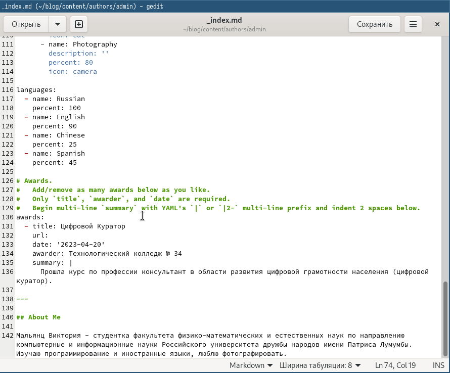{width=70%}

## Добавить список достижений: информацию о навыках, опыте, достижениях

- Перехожу в каталог blog и компилирую сайт (рис. 2).

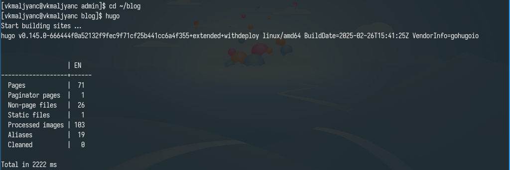{width=70%}

## Добавить список достижений: информацию о навыках, опыте, достижениях

- Получаю ссылку на сайт (рис. 3).

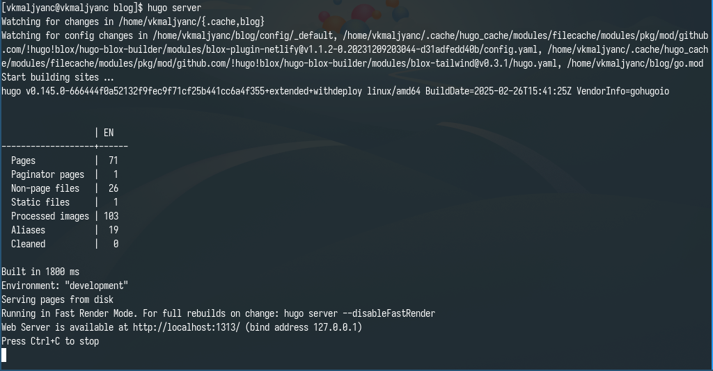{width=70%}

## Добавить список достижений: информацию о навыках, опыте, достижениях

- Убеждаюсь в том, что изменения были добавлены (рис. 4).

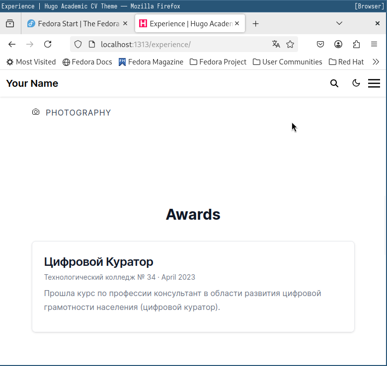{width=70%}

## Сделать пост по прошедшей неделе

- Перехожу в каталог post_2 и редактирую файл index.md. Добавляю пост о прошедшей неделе (рис. 5).

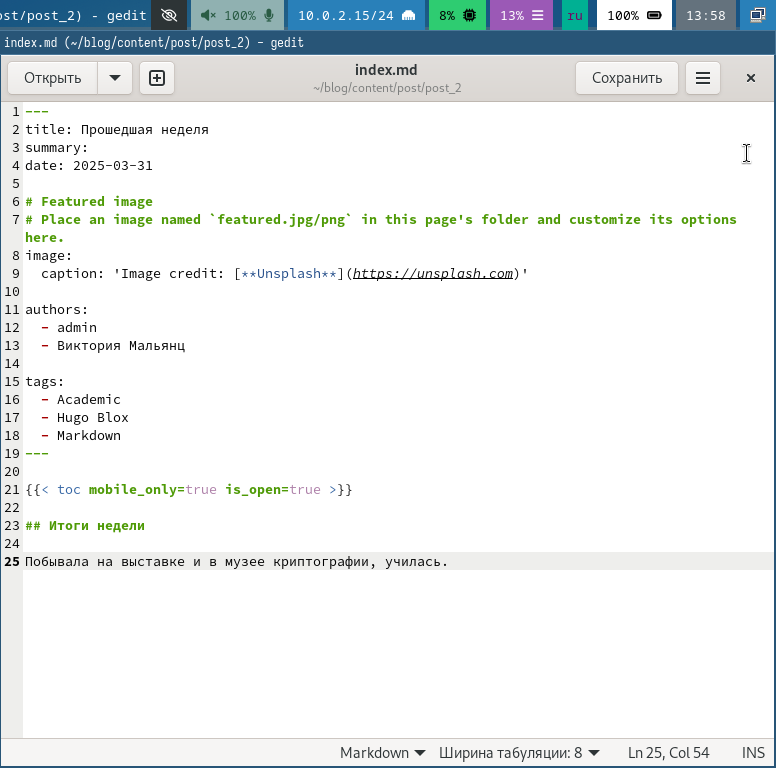{width=70%}

## Сделать пост по прошедшей неделе

- Перехожу в каталог blog и компилирую сайт (рис. 6).

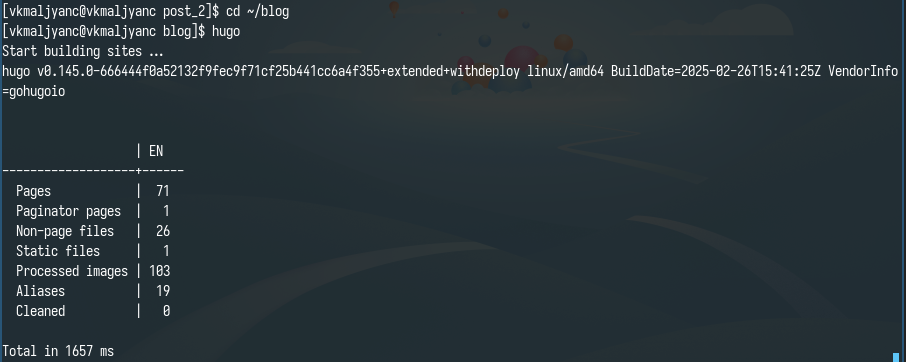{width=70%}

## Сделать пост по прошедшей неделе

- Получаю ссылку на сайт (рис. 7).

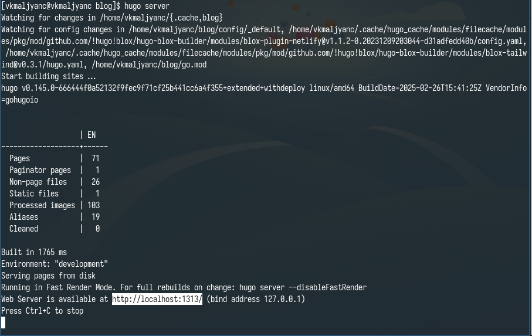{width=70%}

## Сделать пост по прошедшей неделе

- Убеждаюсь в том, что изменения были добавлены (рис. 8).

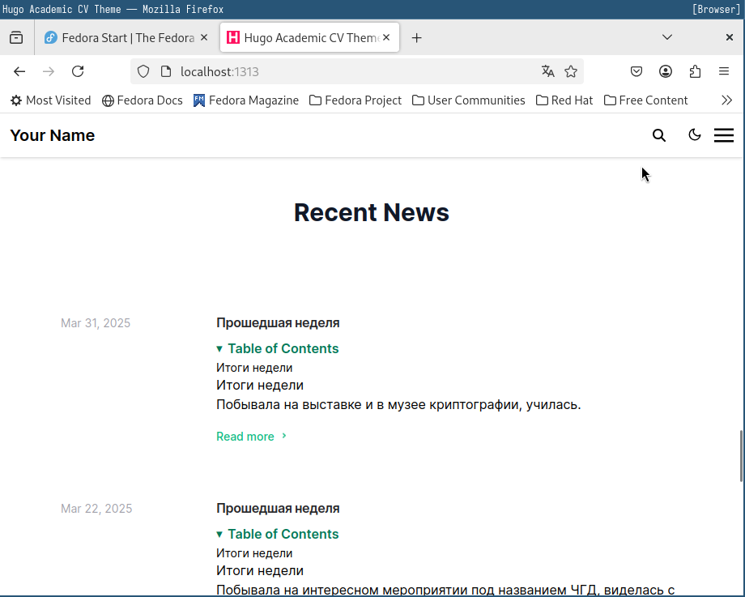{width=70%}

## Добавить пост на тему: "Язык разметки Markdown"

- Перехожу в каталог post_3 и редактирую файл index.md. Добавляю пост на тему "Язык разметки Markdown" (рис. 9).

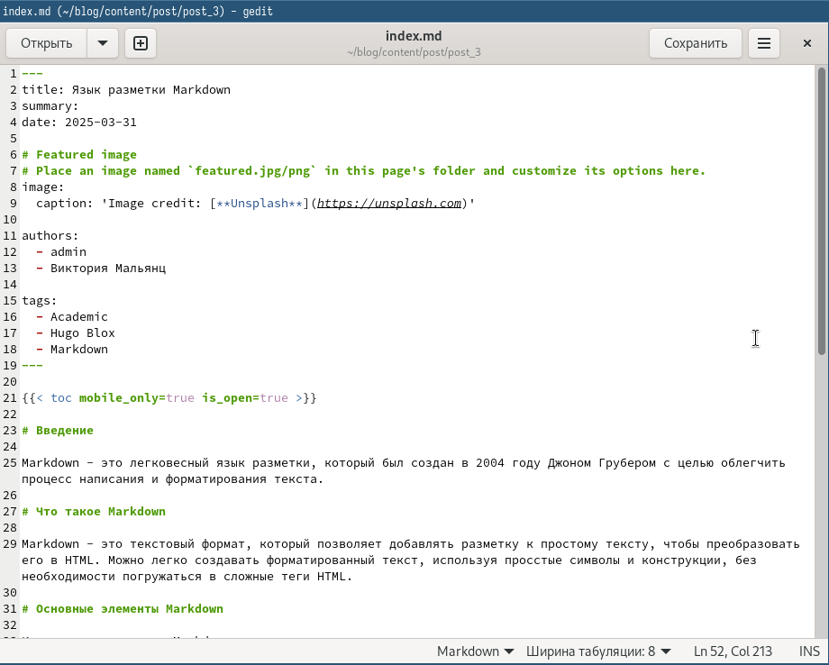{width=70%}

## Добавить пост на тему: "Язык разметки Markdown"

- Перехожу в каталог blog и компилирую сайт (рис. 10).

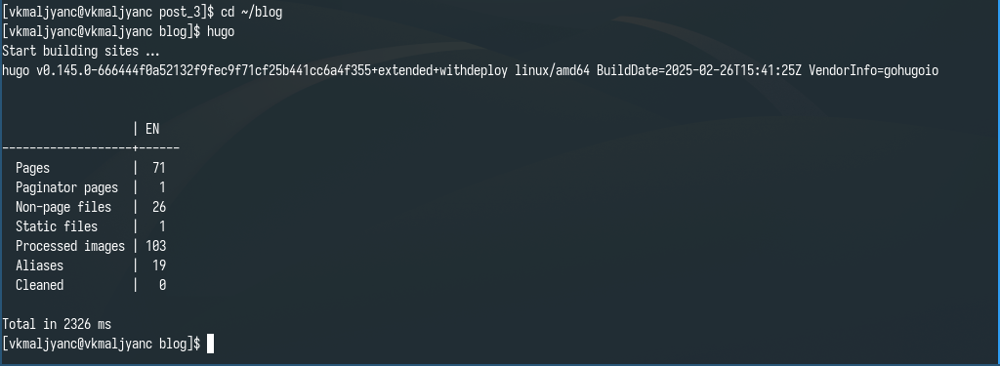{width=70%}

## Добавить пост на тему: "Язык разметки Markdown"

- Получаю ссылку на сайт (рис. 11).

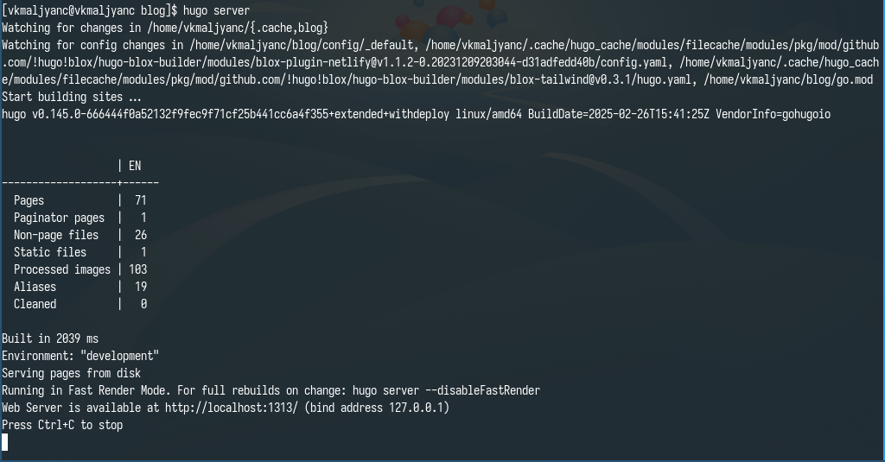{width=70%}

## Добавить пост на тему: "Язык разметки Markdown"

- Убеждаюсь в том, что изменения были добавлены (рис. 12).

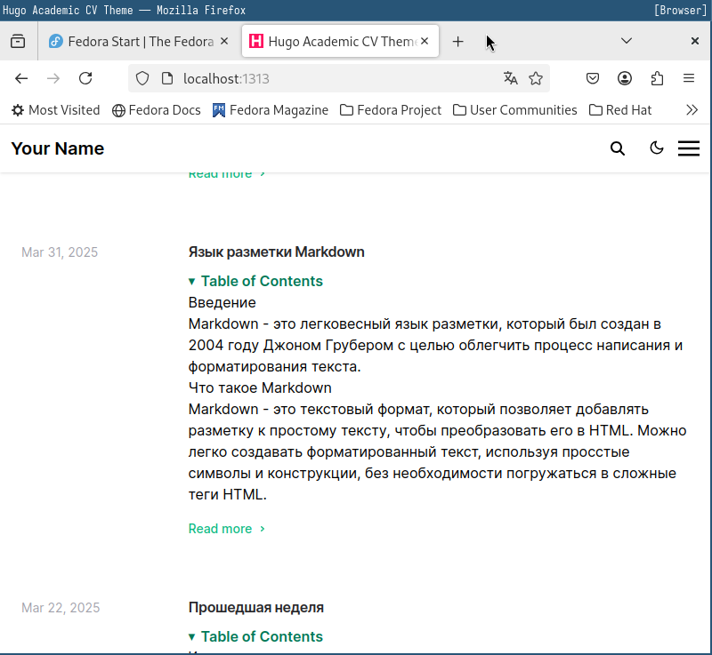{width=70%}

## Добавить пост на тему: "Язык разметки Markdown"

- Добавляю изменения на github (рис. 13).

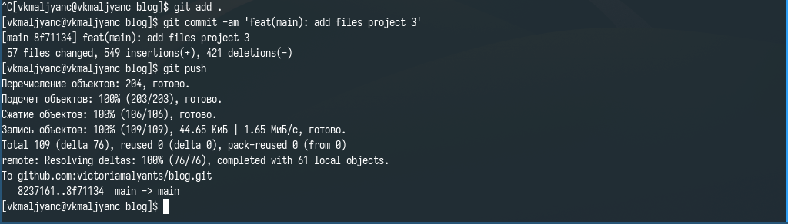{width=70%}

# Выводы

- Я научилась добавлять к сайту достижения.

# Спасибо за внимание
