---
## Front matter
lang: ru-RU
title: Индивидуальный проект этап 5
subtitle: Создание записей для персонального проекта
author:
  - Мальянц В. К.
institute:
  - Российский университет дружбы народов, Москва, Россия
date: 10 мая 2025

## i18n babel
babel-lang: russian
babel-otherlangs: english

## Formatting pdf
toc: false
toc-title: Содержание
slide_level: 2
aspectratio: 169
section-titles: true
theme: metropolis
header-includes:
 - \metroset{progressbar=frametitle,sectionpage=progressbar,numbering=fraction}
---

# Цель работы

- Сделать записи для персонального проекта.

# Задание

- Сделать записи для персонального проекта
- Добавить пост по прошедшей неделе
- Добавить пост на тему "Языки научного программирования"

# Выполнение лабораторной работы
## Сделать записи для персонального проекта

- Перехожу в каталог github и открываю файл index.md (рис. 1).

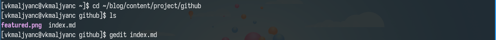{width=70%}

## Сделать записи для персонального проекта

- Редактирую файл index.md. Пишу о своем аккаунте в GitHub (рис. 2).

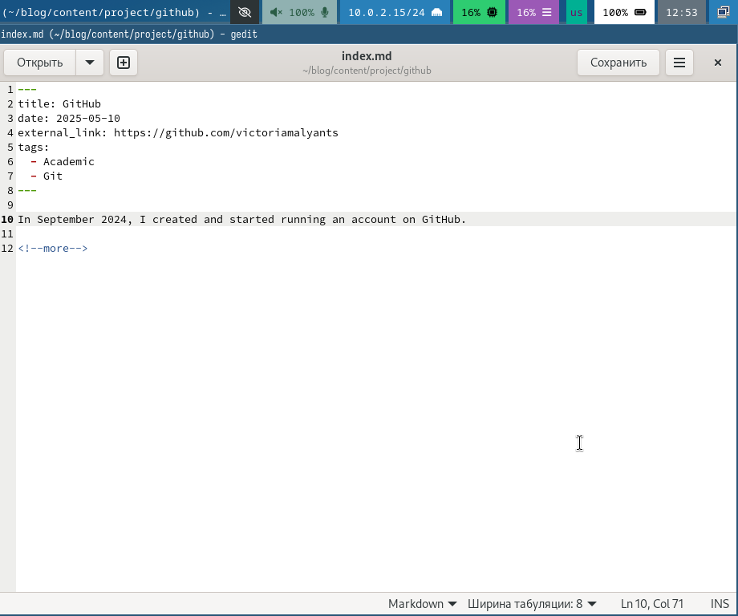{width=70%}

## Сделать записи для персонального проекта

- Перехожу в каталог blog и компилирую сайт (рис. 3).

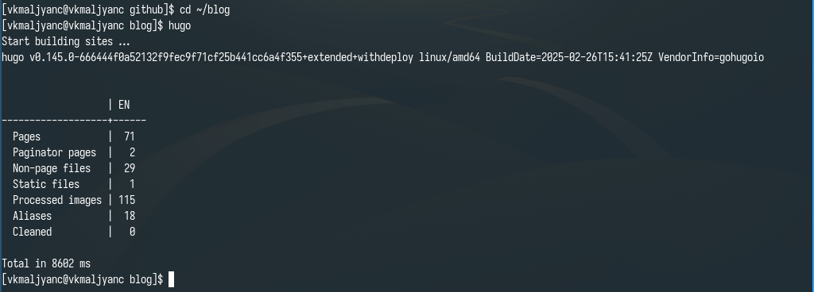{width=70%}

## Сделать записи для персонального проекта

- Получаю ссылку на сайт (рис. 4).

{width=70%}

## Сделать записи для персонального проекта

- Убеждаюсь в том, что изменения были добавлены (рис. 5).

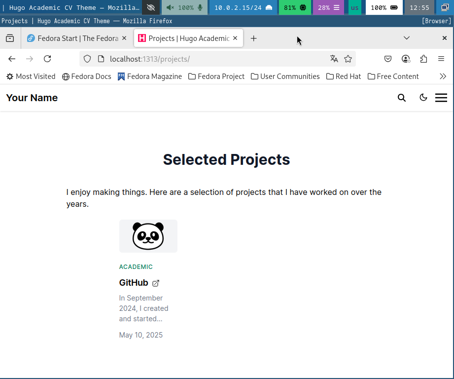{width=70%}

## Добавить пост по прошедшей неделе

- Перехожу в каталог post_6 и открываю файл index.md (рис. 6).

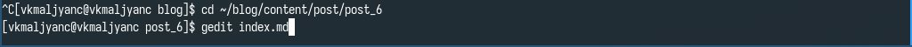{width=70%}

## Добавить пост по прошедшей неделе

- Редактирую файл index.md. Добавляю пост о прошедшей неделе (рис. 7).

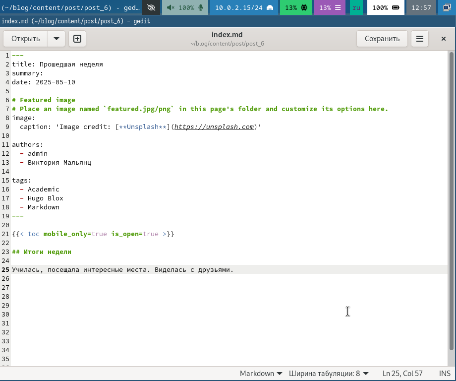{width=70%}

## Добавить пост по прошедшей неделе

- Перехожу в каталог blog и компилирую сайт (рис. 8).

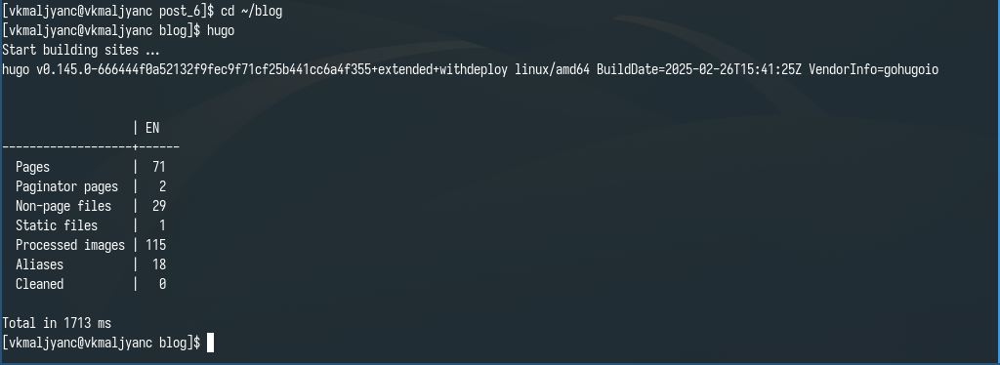{width=70%}

## Добавить пост по прошедшей неделе

- Получаю ссылку на сайт (рис. 9).

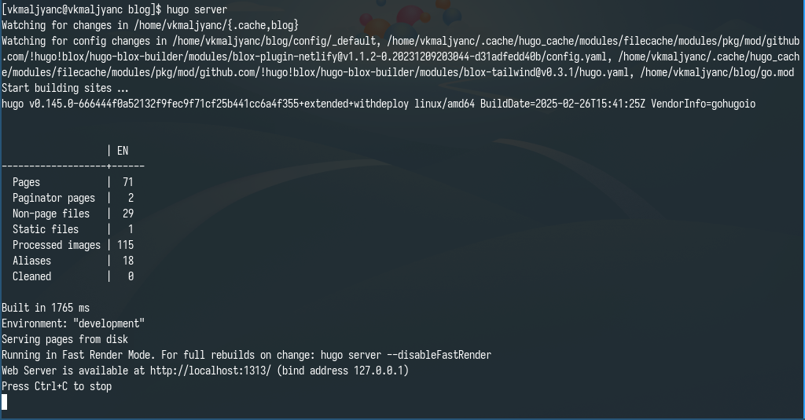{width=70%}

## Добавить пост по прошедшей неделе

- Убеждаюсь в том, что изменения были добавлены (рис. 10).

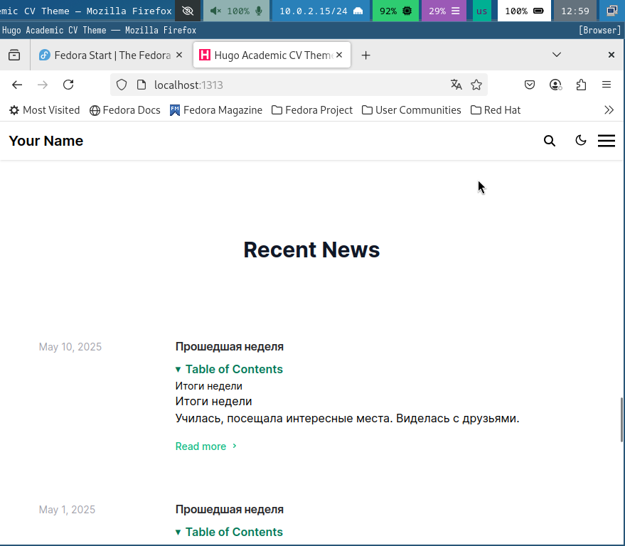{width=70%}

## Добавить пост на тему "Языки научного программирования"

- Перехожу в каталог post_7 и открываю файл index.md (рис. 11).

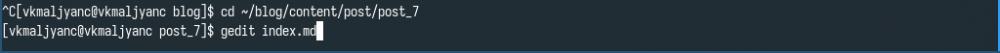{width=70%}

## Добавить пост на тему "Языки научного программирования"

- Редактирую файл index.md. Добавляю пост на тему "Языки научного программирования" (рис. 12).

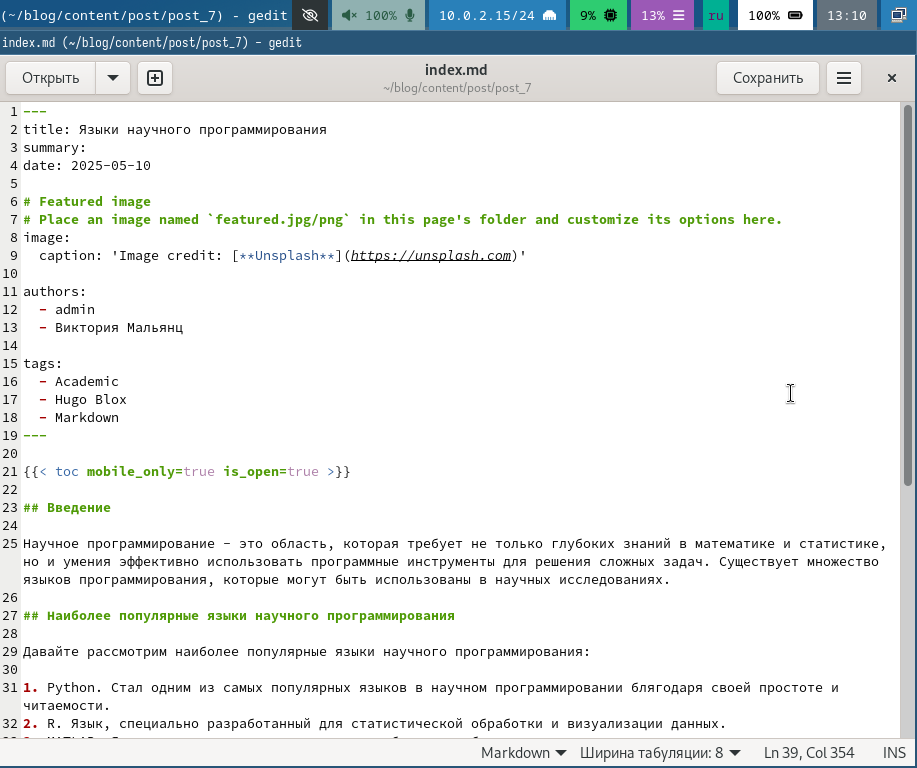{width=70%}

## Добавить пост на тему "Языки научного программирования"

- Перехожу в каталог blog и компилирую сайт (рис. 13).

{width=70%}

## Добавить пост на тему "Языки научного программирования"

- Получаю ссылку на сайт (рис. 14).

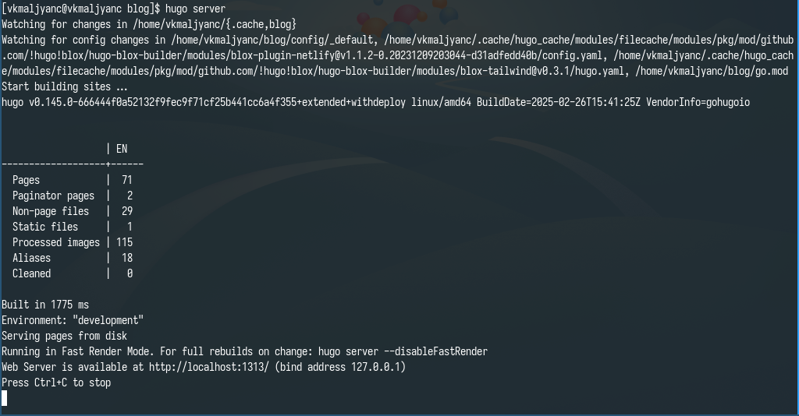{width=70%}

## Добавить пост на тему "Языки научного программирования"

- Убеждаюсь в том, что изменения были добавлены (рис. 15).

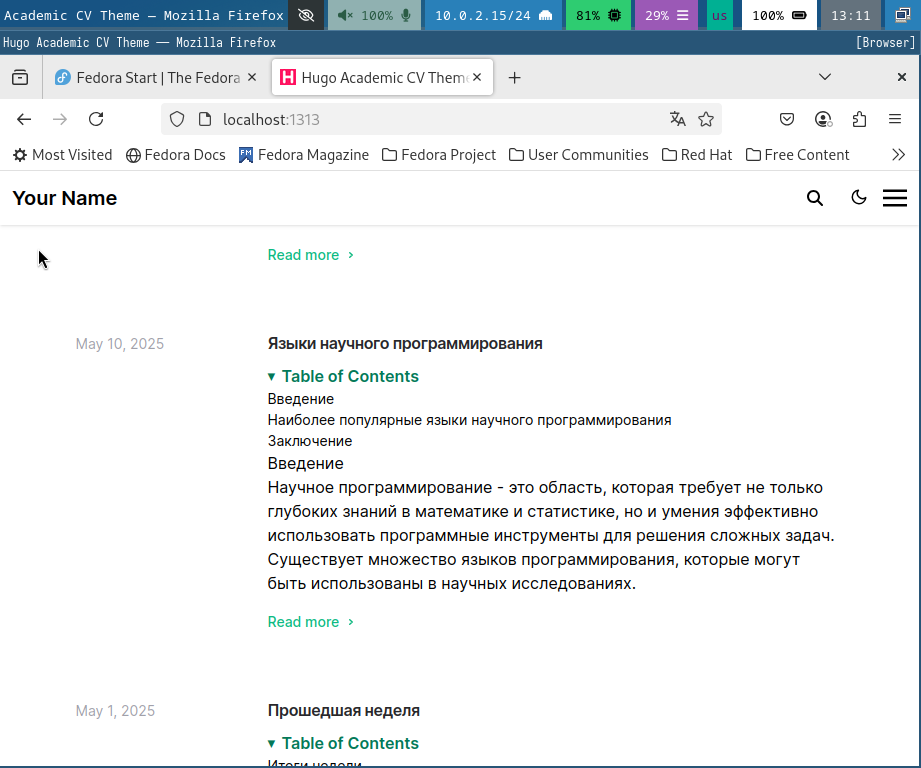{width=70%}

## Добавить пост на тему "Языки научного программирования"

- Добавляю изменения на github (рис. 16) (рис. 17).

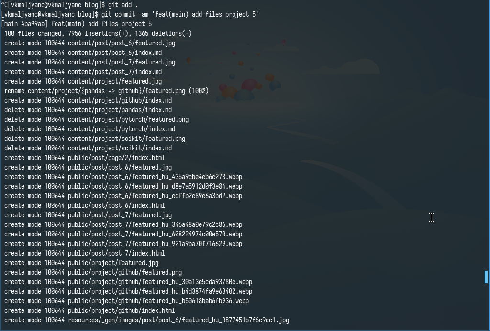{width=70%}

{width=70%}

# Выводы

- Я сделала записи для персонального проекта.

# Спасибо за внимание
