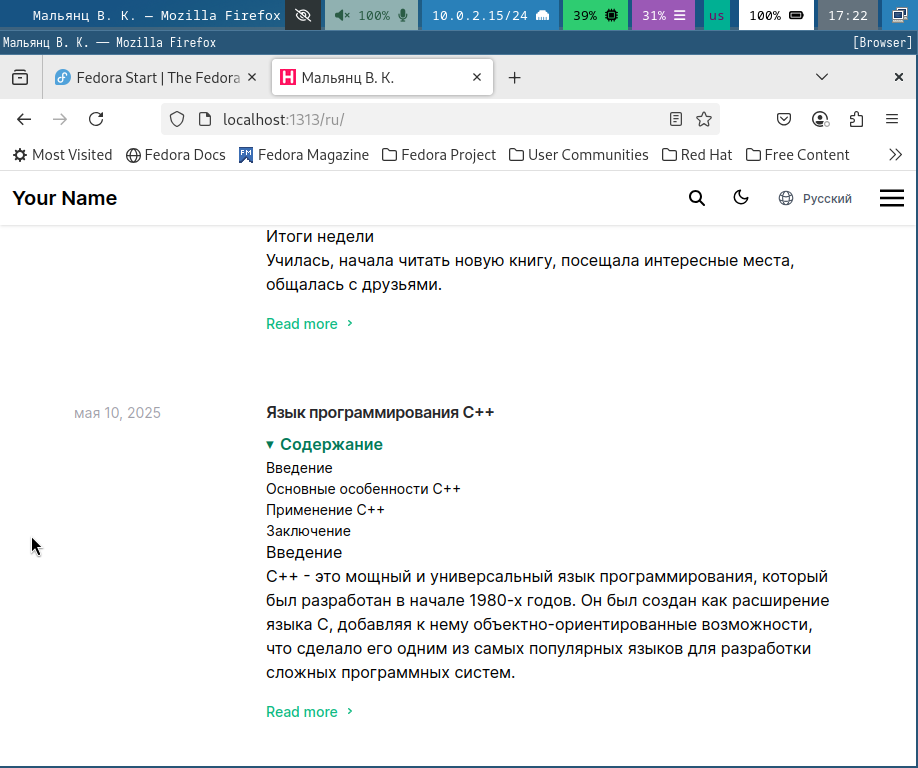

---
## Front matter
lang: ru-RU
title: Индивидуальный проект этап 6
subtitle: Размещение двуязычного сайта на Github
author:
  - Мальянц В. К.
institute:
  - Российский университет дружбы народов, Москва, Россия
date: 10 мая 2025

## i18n babel
babel-lang: russian
babel-otherlangs: english

## Formatting pdf
toc: false
toc-title: Содержание
slide_level: 2
aspectratio: 169
section-titles: true
theme: metropolis
header-includes:
 - \metroset{progressbar=frametitle,sectionpage=progressbar,numbering=fraction}
---

# Цель работы

- Разместить двуязычный сайт на Github.

# Задание

- Разместить двуязычный сайт на Github
- Добавить пост по прошедшей неделе
- Добавить пост на тему по выбору

# Выполнение лабораторной работы
## Разместить двуязычный сайт на Github

- Перехожу в каталог _default и затем открываю файл languages.yaml (рис. 1).

{width=70%}

## Разместить двуязычный сайт на Github

- Добавляю русский язык в настройки сайта (рис. 2).

{width=70%}

## Разместить двуязычный сайт на Github

- Открываю файл hugo.yaml (рис. 3).

{width=70%}

## Разместить двуязычный сайт на Github

- Настраиваю сайт (рис. 4).

{width=70%}

## Разместить двуязычный сайт на Github

- Добавляю два каталога: en и ru (рис. 5).

{width=70%}

## Разместить двуязычный сайт на Github

- Перехожу в каталог blog и компилирую сайт (рис. 6).

{width=70%}

## Разместить двуязычный сайт на Github

- Получаю ссылку на сайт (рис. 7).

{width=70%}

## Разместить двуязычный сайт на Github

- Убеждаюсь в том, что изменения добавлены корректно (рис. 8) (рис. 9).

{width=70%}

{width=70%}

## Добавить пост по прошедшей неделе

- Перехожу в каталог post_8 и открываю файл index.md (рис. 10).

{width=70%}

## Добавить пост по прошедшей неделе

- Пишу пост по прошедшей неделе на русском языке (рис. 11).

{width=70%}

## Добавить пост по прошедшей неделе

- Пишу пост по прошедшей неделе на английском языке (рис. 12).

{width=70%}

## Добавить пост по прошедшей неделе

- Перехожу в каталог blog и компилирую сайт (рис. 13).

{width=70%}

## Добавить пост по прошедшей неделе

- Получаю ссылку на сайт (рис. 14).

{width=70%}

## Добавить пост по прошедшей неделе

- Убеждаюсь в том, что изменения добавлены корректно (рис. 15) (рис. 16).

{width=70%}

{width=70%}

## Добавить пост на тему по выбору

- Перехожу в каталог post_9 и открываю файл index.md (рис. 17).

{width=70%}

## Добавить пост на тему по выбору

- Пишу пост на тему "Язык программирования C++" на русском языке (рис. 18).

{width=70%}

## Добавить пост на тему по выбору

- Пишу пост на тему "Язык программирования C++" на английском языке (рис. 19).

{width=70%}

## Добавить пост на тему по выбору

- Убеждаюсь в том, что изменения добавлены корректно (рис.20) (рис. 21).

{width=70%}

{width=70%}

# Выводы

- Я разместила двуязычный сайт на Github.

# Спасибо за внимание
