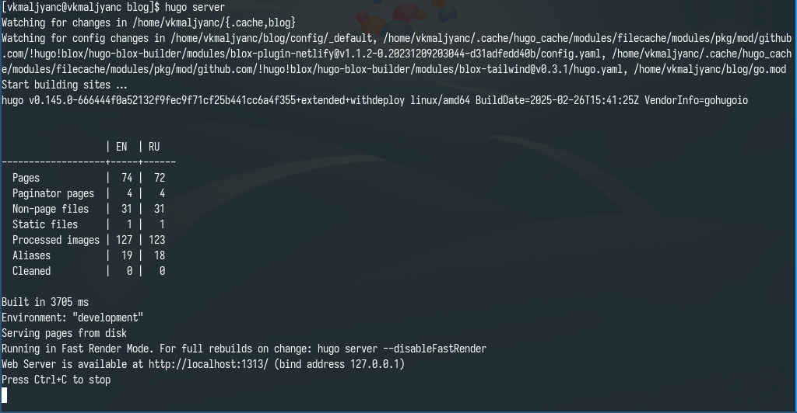
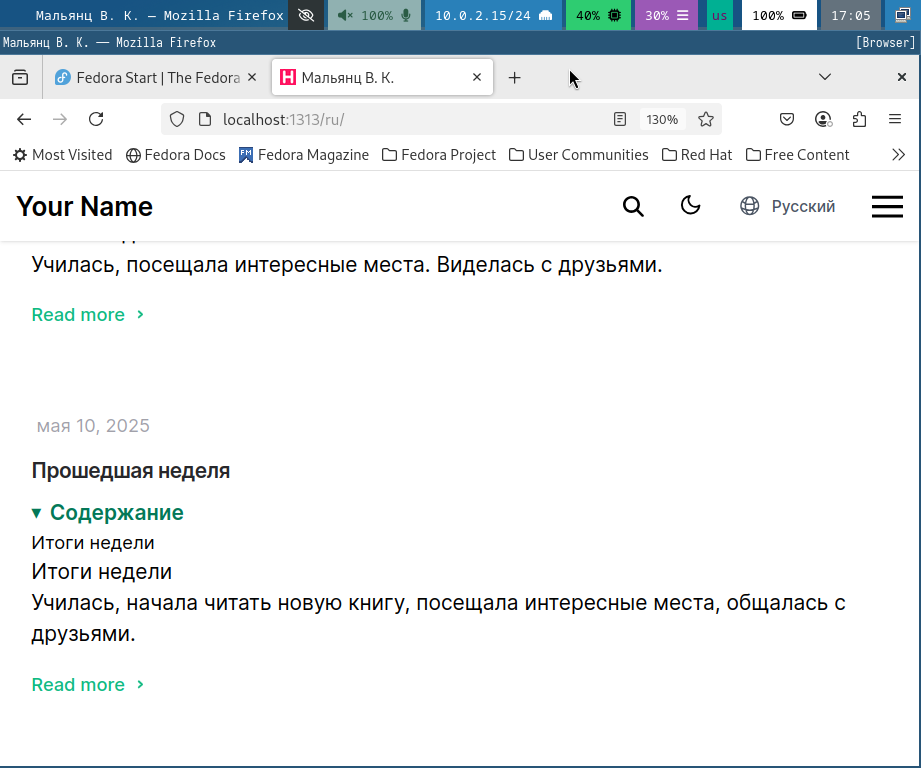
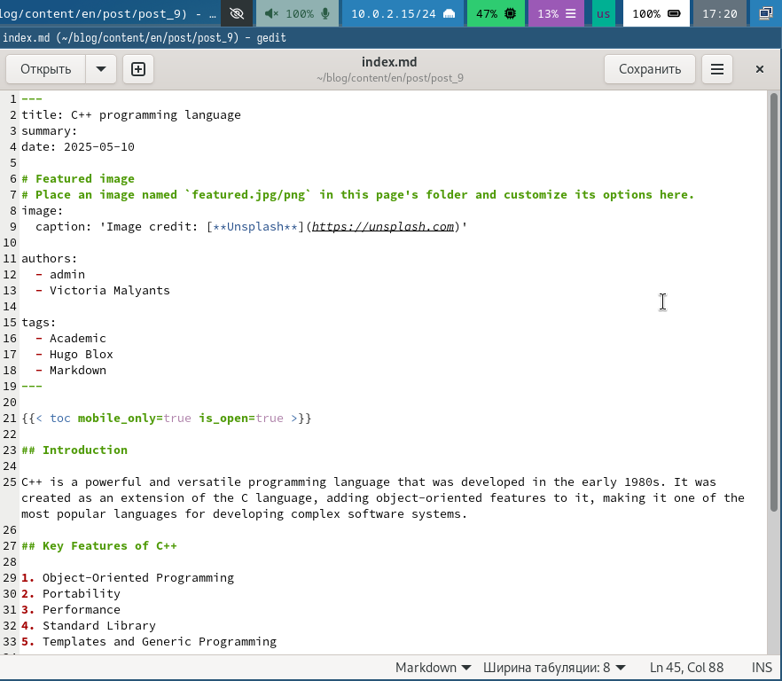

---
## Front matter
title: "Индивидуальный проект этап 6"
subtitle: "Размещение двуязычного сайта на Github"
author: "Мальянц Виктория Кареновна"

## Generic otions
lang: ru-RU
toc-title: "Содержание"

## Bibliography
bibliography: bib/cite.bib
csl: pandoc/csl/gost-r-7-0-5-2008-numeric.csl

## Pdf output format
toc: true # Table of contents
toc-depth: 2
lof: true # List of figures
lot: true # List of tables
fontsize: 12pt
linestretch: 1.5
papersize: a4
documentclass: scrreprt
## I18n polyglossia
polyglossia-lang:
  name: russian
  options:
	- spelling=modern
	- babelshorthands=true
polyglossia-otherlangs:
  name: english
## I18n babel
babel-lang: russian
babel-otherlangs: english
## Fonts
mainfont: IBM Plex Serif
romanfont: IBM Plex Serif
sansfont: IBM Plex Sans
monofont: IBM Plex Mono
mathfont: STIX Two Math
mainfontoptions: Ligatures=Common,Ligatures=TeX,Scale=0.94
romanfontoptions: Ligatures=Common,Ligatures=TeX,Scale=0.94
sansfontoptions: Ligatures=Common,Ligatures=TeX,Scale=MatchLowercase,Scale=0.94
monofontoptions: Scale=MatchLowercase,Scale=0.94,FakeStretch=0.9
mathfontoptions:
## Biblatex
biblatex: true
biblio-style: "gost-numeric"
biblatexoptions:
  - parentracker=true
  - backend=biber
  - hyperref=auto
  - language=auto
  - autolang=other*
  - citestyle=gost-numeric
## Pandoc-crossref LaTeX customization
figureTitle: "Рис."
tableTitle: "Таблица"
listingTitle: "Листинг"
lofTitle: "Список иллюстраций"
lotTitle: "Список таблиц"
lolTitle: "Листинги"
## Misc options
indent: true
header-includes:
  - \usepackage{indentfirst}
  - \usepackage{float} # keep figures where there are in the text
  - \floatplacement{figure}{H} # keep figures where there are in the text
---

# Цель работы

Разместить двуязычный сайт на Github.

# Задание

1. Разместить двуязычный сайт на Github
2. Добавить пост по прошедшей неделе
3. Добавить пост на тему по выбору

# Выполнение лабораторной работы
## Разместить двуязычный сайт на Github

Перехожу в каталог _default и затем открываю файл languages.yaml (рис. [-@fig:001]).

{#fig:001 width=70%}

Добавляю русский язык в настройки сайта (рис. [-@fig:002]).

{#fig:002 width=70%}

Открываю файл hugo.yaml (рис. [-@fig:003]).

{#fig:003 width=70%}

Настраиваю сайт (рис. [-@fig:004]).

{#fig:004 width=70%}

Добавляю два каталога: en и ru (рис. [-@fig:007]).

{#fig:007 width=70%}

Перехожу в каталог blog и компилирую сайт (рис. [-@fig:008]).

{#fig:008 width=70%}

Получаю ссылку на сайт (рис. [-@fig:009]).

{#fig:009 width=70%}

Убеждаюсь в том, что изменения добавлены корректно (рис. [-@fig:010]) (рис. [-@fig:011]).

{#fig:010 width=70%}

{#fig:011 width=70%}

## Добавить пост по прошедшей неделе

Перехожу в каталог post_8 и открываю файл index.md (рис. [-@fig:012]).

{#fig:012 width=70%}

Пишу пост по прошедшей неделе на русском языке (рис. [-@fig:013]).

{#fig:013 width=70%}

Пишу пост по прошедшей неделе на английском языке (рис. [-@fig:014]).

{#fig:014 width=70%}

Перехожу в каталог blog и компилирую сайт (рис. [-@fig:015]).

{#fig:015 width=70%}

Получаю ссылку на сайт (рис. [-@fig:016]).

{#fig:016 width=70%}

Убеждаюсь в том, что изменения добавлены корректно (рис. [-@fig:017]) (рис. [-@fig:018]).

{#fig:017 width=70%}

{#fig:018 width=70%}

## Добавить пост на тему по выбору

Перехожу в каталог post_9 и открываю файл index.md (рис. [-@fig:019]).

{#fig:019 width=70%}

Пишу пост на тему "Язык программирования C++" на русском языке (рис. [-@fig:020]).

{#fig:020 width=70%}

Пишу пост на тему "Язык программирования C++" на английском языке (рис. [-@fig:021]).

{#fig:021 width=70%}

Убеждаюсь в том, что изменения добавлены корректно (рис. [-@fig:022]) (рис. [-@fig:023]) [@Индивидуальный_проект_этап_6].

{#fig:022 width=70%}

{#fig:023 width=70%}

# Выводы

Я разместила двуязычный сайт на Github.

# Список литературы{.unnumbered}

::: {#refs}
:::
